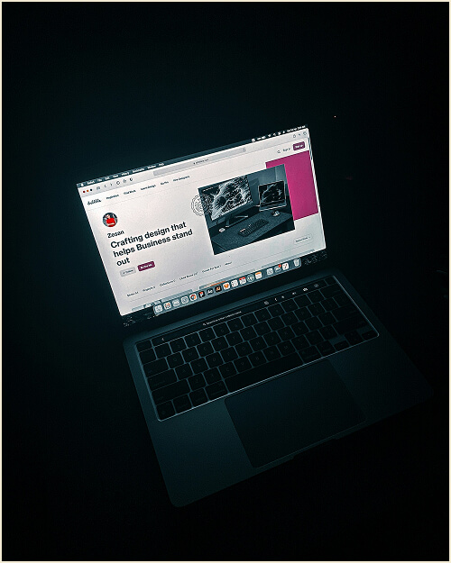
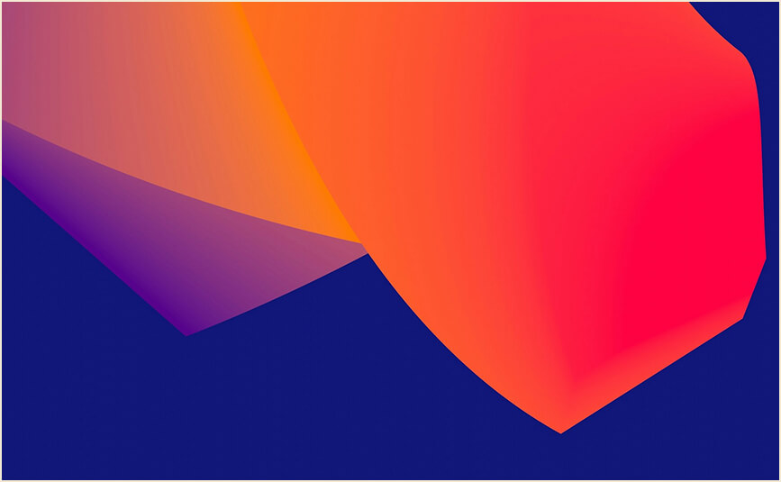

# welcome

こんにちは。現在ダミーのサンプルサイトを作っています。
提示するHTML/CSS/jsを解析していただき、以下のタスクを行なって下さい。
・CSSのチェックと修正

```html
<!DOCTYPE html>
<html lang="ja"> <!-- FIX: lang="JP" → lang="ja" -->

<head>
  <meta charset="utf-8" />
  <meta name="viewport" content="width=device-width, initial-scale=1" />
  <meta name="description" content="KINUは、映像・音楽・グラフィック・インタラクティブを横断するクリエイティブチームです。京都・寺町を拠点に、ブランディングから制作まで一貫して伴走します。"> <!-- FIX: 追加 -->
  <title>KINU</title>

  <!-- Performance: preconnect for fonts -->
  <link rel="preconnect" href="https://fonts.gstatic.com" crossorigin>
  <link rel="preconnect" href="https://fonts.googleapis.com">

  <!-- Bootstrap CSS -->
  <link href="https://cdn.jsdelivr.net/npm/bootstrap@5.3.0/dist/css/bootstrap.min.css" rel="stylesheet" />

  <!-- Google Fonts (Latin + Japanese) -->
  <!-- FIX: 和文フォントを追加 / display=swap -->
  <link href="https://fonts.googleapis.com/css2?family=Syne:wght@800&family=Inter:wght@400;600;700;800&family=Noto+Sans+JP:wght@400;600;700;900&family=Zen+Kaku+Gothic+New:wght@700;900&display=swap" rel="stylesheet" />

  <!-- Font Awesome for icons -->
  <link rel="stylesheet" href="https://cdnjs.cloudflare.com/ajax/libs/font-awesome/6.4.0/css/all.min.css" />

  <!-- AOS Animation CSS -->
  <link href="https://unpkg.com/aos@2.3.1/dist/aos.css" rel="stylesheet" />

  <!-- Swiper JS CSS -->
  <link rel="stylesheet" href="https://cdn.jsdelivr.net/npm/swiper@11/swiper-bundle.min.css" />

  <!-- custom style CSS -->
  <link rel="stylesheet" href="style.css">
</head>

<body>
  <!-- SVG Sprites -->
  <svg xmlns="http://www.w3.org/2000/svg" style="display: none;">
    <symbol xmlns="http://www.w3.org/2000/svg" id="instagram" viewBox="0 0 15 15">
      <path fill="none" stroke="currentColor" d="M11 3.5h1M4.5.5h6a4 4 0 0 1 4 4v6a4 4 0 0 1-4 4h-6a4 4 0 0 1-4-4v-6a4 4 0 0 1 4-4Zm3 10a3 3 0 1 1 0-6a3 3 0 0 1 0 6Z" />
    </symbol>
    <symbol xmlns="http://www.w3.org/2000/svg" id="facebook" viewBox="0 0 15 15">
      <path fill="none" stroke="currentColor" d="M7.5 14.5a7 7 0 1 1 0-14a7 7 0 0 1 0 14Zm0 0v-8a2 2 0 0 1 2-2h.5m-5 4h5" />
    </symbol>
    <symbol xmlns="http://www.w3.org/2000/svg" id="twitter" viewBox="0 0 15 15">
      <path fill="currentColor" d="m14.478 1.5l.5-.033a.5.5 0 0 0-.871-.301l.371.334Zm-.498 2.959a.5.5 0 1 0-1 0h1Zm-6.49.082h-.5h.5Zm0 .959h.5h-.5Zm-6.99 7V12a.5.5 0 0 0-.278.916L.5 12.5Zm.998-11l.469-.175a.5.5 0 0 0-.916-.048l.447.223Zm3.994 9l.354.353a.5.5 0 0 0-.195-.827l-.159.474Zm7.224-8.027l-.37.336l.18.199l.265-.04l-.075-.495Zm1.264-.94c.051.778.003 1.25-.123 1.606c-.122.345-.336.629-.723 1l.692.722c.438-.42.776-.832.974-1.388c.193-.546.232-1.178.177-2.006l-.998.066Zm0 3.654V4.46h-1v.728h1Zm-6.99-.646V5.5h1v-.959h-1Zm0 .959V6h1v-.5h-1ZM10.525 1a3.539 3.539 0 0 0-3.537 3.541h1A2.539 2.539 0 0 1 10.526 2V1Zm2.454 4.187C12.98 9.503 9.487 13 5.18 13v1c4.86 0 8.8-3.946 8.8-8.813h-1ZM1.03 1.675C1.574 3.127 3.614 6 7.49 6V5C4.174 5 2.421 2.54 1.966 1.325l-.937.35Zm.021-.398C.004 3.373-.157 5.407.604 7.139c.759 1.727 2.392 3.055 4.73 3.835l.317-.948c-2.155-.72-3.518-1.892-4.132-3.29c-.612-1.393-.523-3.11.427-5.013l-.895-.446Zm4.087 8.87C4.536 10.75 2.726 12 .5 12v1c2.566 0 4.617-1.416 5.346-2.147l-.708-.706Zm7.949-8.009A3.445 3.445 0 0 0 10.526 1v1c.721 0 1.37.311 1.82.809l.74-.671Zm-.296.83a3.513 3.513 0 0 0 2.06-1.134l-.744-.668a2.514 2.514 0 0 1-1.466.813l.15.989ZM.222 12.916C1.863 14.01 3.583 14 5.18 14v-1c-1.63 0-3.048-.011-4.402-.916l-.556.832Z" />
    </symbol>
    <symbol xmlns="http://www.w3.org/2000/svg" id="pinterest" viewBox="0 0 15 15">
      <path fill="none" stroke="currentColor" d="m4.5 13.5l3-7m-3.236 3a2.989 2.989 0 0 1-.764-2V7A3.5 3.5 0 0 1 7 3.5h1A3.5 3.5 0 0 1 11.5 7v.5a3 3 0 0 1-3 3a2.081 2.081 0 0 1-1.974-1.423L6.5 9m1 5.5a7 7 0 1 1 0-14a7 7 0 0 0 0 14Z" />
    </symbol>
    <symbol xmlns="http://www.w3.org/2000/svg" id="youtube" viewBox="0 0 15 15">
      <path fill="currentColor" d="m1.61 12.738l-.104.489l.105-.489Zm11.78 0l.104.489l-.105-.489Zm0-10.476l.104-.489l-.105.489Zm-11.78 0l.106.489l-.105-.489ZM6.5 5.5l.277-.416A.5.5 0 0 0 6 5.5h.5Zm0 4H6a.5.5 0 0 0 .777.416L6.5 9.5Zm3-2l.277.416a.5.5 0 0 0 0-.832L9.5 7.5ZM0 3.636v7.728h1V3.636H0Zm15 7.728V3.636h-1v7.728h1ZM1.506 13.227c3.951.847 8.037.847 11.988 0l-.21-.978a27.605 27.605 0 0 1-11.568 0l-.21.978ZM13.494 1.773a28.606 28.606 0 0 0-11.988 0l.21.978a27.607 27.607 0 0 1 11.568 0l.21-.978ZM15 3.636c0-.898-.628-1.675-1.506-1.863l-.21.978c.418.09.716.458.716.885h1Zm-1 7.728a.905.905 0 0 1-.716.885l.21.978A1.905 1.905 0 0 0 15 11.364h-1Zm-14 0c0 .898.628 1.675 1.506 1.863l.21-.978A.905.905 0 0 1 1 11.364H0Zm1-7.728c0-.427.298-.796.716-.885l-.21-.978A1.905 1.905 0 0 0 0 3.636h1ZM6 5.5v4h1v-4H6Zm.777 4.416l3-2l-.554-.832l-3 2l.554.832Zm3-2.832l-3-2l-.554.832l3 2l.554-.832Z" />
    </symbol>
    <!-- NOTE: 重複calendarは削除済み -->
    <symbol xmlns="http://www.w3.org/2000/svg" id="gift" viewBox="0 0 24 24">
      <g fill="none" stroke="currentColor" stroke-linecap="round" stroke-linejoin="round" stroke-width="2">
        <rect width="18" height="14" x="3" y="8" rx="2" />
        <path d="M12 5a3 3 0 1 0-3 3m6 0a3 3 0 1 0-3-3m0 0v17m9-7H3" />
      </g>
    </symbol>
    <!-- 以降のsymbolはそのまま -->
  </svg>

  <!-- Fullscreen Menu Overlay -->
  <div id="fullscreenMenu" class="fullscreen-menu-overlay" aria-hidden="true">
    <div class="container h-100">
      <div class="row h-100 align-items-center">
        <div class="col-lg-7 position-relative">
          <button id="closeMenuBtn" class="close-menu-btn position-absolute top-0 end-0 m-4" aria-label="メニューを閉じる">
            <i class="fas fa-times fs-1"></i>
          </button>

          <nav class="fullscreen-menu-nav" aria-label="メインメニュー">
            <ul class="list-unstyled">
              <!-- FIX: liをクローズ -->
              <li><a href="index.html" class="menu-link">Home</a></li>
              <li><a href="portfolio.html" class="menu-link">Portfolio</a></li>
              <li><a href="blog.html" class="menu-link">Blog</a></li>
              <li><a href="single-portfolio.html" class="menu-link">Single Portfolio</a></li>
              <li><a href="single-post.html" class="menu-link">Single Post</a></li>
              <li><a href="styles.html" class="menu-link">Styles</a></li>
              <li><a href="contact.html" class="menu-link">Contact</a></li>
            </ul>
          </nav>

          <div class="menu-social-links mt-5">
            <a href="#" class="social-link" aria-label="Twitter"><i class="fab fa-twitter"></i></a>
            <a href="#" class="social-link" aria-label="Instagram"><i class="fab fa-instagram"></i></a>
            <a href="#" class="social-link" aria-label="LinkedIn"><i class="fab fa-linkedin"></i></a>
            <a href="#" class="social-link" aria-label="Dribbble"><i class="fab fa-dribbble"></i></a>
          </div>
        </div>

        <div class="col-lg-5 text-white py-3">
          <p class="fs-3">
            我々が提供できる技術： After Effects / Premiere Pro / Photoshop / Illustrator / InDesign / Ableton / Blender / Python
          </p>
          <p class="mt-4">
            【KINU】<br>
            oike / teramachi / YD
          </p>
        </div>
      </div>
    </div>
  </div>

  <!-- Header/Hero Section -->
  <header class="position-relative">
    <div class="bg-dark-custom p-2 p-lg-5 m-3 m-lg-4 rounded-4">
      <nav class="d-flex justify-content-between align-items-center">
        <div class="text-light-custom content-title fw-bold" data-aos="fade-right" data-aos-duration="1000">KINU</div>

        <button id="openMenuBtn" class="menu-toggle-btn btn d-flex align-items-center gap-2"
          data-aos="fade-left" data-aos-duration="1000"
          aria-controls="fullscreenMenu" aria-expanded="false" aria-label="メニューを開く">
          <span class="text-light-custom fw-bold">MENU</span>
          <i class="fas fa-bars text-light-custom"></i>
        </button>
      </nav>

      <div class="w-100 text-center overflow-hidden">
        <div class="syne-font hero-title text-yellow" data-aos="fade-up">KINU</div>
        <div class="syne-font hero-title hero-bg-text" data-aos="fade-up" data-aos-delay="200">oike</div>
        <div class="syne-font hero-title hero-bg-text" data-aos="fade-up" data-aos-delay="400">teramachi</div> <!-- FIX: 綴り -->
        <div class="syne-font hero-title hero-bg-text" data-aos="fade-up" data-aos-delay="600">YD</div>
      </div>

      <div class="banner-content">
        <div class="container">
          <div class="row g-lg-5">
            <div class="col-md-6"></div>
            <div class="col-md-6">
              <div data-aos="text-reveal-up" data-aos-delay="1000"
                class="text-animation m-0 bg-primary-subtle p-4 p-lg-5 rounded-3">
                <div class="swiper servicesSwiper" aria-label="サービススライダー">
                  <div class="swiper-wrapper">
                    <div class="swiper-slide">
                      <div class="text-light-custom content-title fw-bold">グラフィック/2D</div>
                      <p class="text-light-custom mb-4">
                        イラスト、タイポグラフィ、画像合成、3Dプリビズ、DTP。
                        ブランドの核を視覚に翻訳します。
                      </p>
                    </div>
                    <div class="swiper-slide">
                      <div class="text-light-custom content-title fw-bold">映像</div>
                      <p class="text-light-custom mb-4">
                        AEによるモーション、Premiereの編集/整音。短尺からMV、展示映像まで。
                      </p>
                    </div>
                    <div class="swiper-slide">
                      <div class="text-light-custom content-title fw-bold">音楽</div>
                      <p class="text-light-custom mb-4">
                        Abletonベースの作曲/アレンジ、録音、サウンドデザイン。映像と同期した一体設計。</p> <!-- FIX: </p> 追加 -->
                    </div>
                  </div>
                  <div class="swiper-pagination text-start"></div>
                </div>
              </div>
            </div>
          </div><!-- row -->
        </div>
      </div>
    </div>
  </header>

  <main>
    <!-- About Section -->
    <section class="py-5 my-5 position-relative">
      <div class="container">
        <div class="row g-lg-5">
          <div class="banner-image col-md-6" data-aos="clip-bottom" data-aos-duration="1000">
            
          </div>
          <div class="col-md-6" data-aos="clip-top" data-aos-delay="1000">
            <div class="content-title mb-4 fw-bold">About KINU</div>
            <blockquote class="fst-italic fs-4 mb-4">
              「素材感のある、長く触れていたくなる表現を。」— KINU
            </blockquote>
            <p class="mb-4">
              KINUは、映像・音楽・グラフィック・インタラクティブを横断するクリエイティブチームです。
              コンセプト設計から実装までを一気通貫で担い、残響のように長く記憶に残る体験をデザインします。
            </p>
            <p class="mb-5">
              ブランディング、UI/UX、プロダクトの各領域で実績。国内外の展示/媒体に掲載。
              企画段階からスプリント型で伴走し、少数精鋭でスピーディに仕上げます。
            </p>
            <a class="btn btn-custom d-inline-flex align-items-center gap-2" href="about.html">
              <span>More About KINU</span>
              <i class="fas fa-arrow-right"></i>
            </a>
          </div>
        </div>
      </div>
    </section>

    <!-- Experiences Section -->
    <section class="py-5 my-5 position-relative overflow-hidden">
      <div class="container position-relative h-100">
        <div class="position-absolute top-0 start-100 translate-middle-x">
          <div class="syne-font section-title" data-aos="fade-up">Experiences</div>
          <div class="syne-font section-title section-title-bg" data-aos="fade-up" data-aos-delay="200">Experiences</div>
          <div class="syne-font section-title section-title-bg" data-aos="fade-up" data-aos-delay="400">Experiences</div>
        </div>

        <div class="container">
          <div class="row">
            <div class="col-md-6 py-5">
              <div class="bg-light-alt p-5 mt-5 rounded-4 overflow-hidden" data-aos="clip-top" data-aos-delay="1000">
                <div class="content-title mb-4 fw-bold">主なプロジェクト</div>

                <div class="mb-5">
                  <div class="date-text mb-2">2021 - 2023</div>
                  <h3 class="subtitle mb-2">KINU Lab：展示映像/音楽の一体制作</h3>
                  <p>
                    インスタレーション向けの映像と立体音響を同時開発。空間の湿度・質感を設計し、体験密度を底上げ。
                  </p>
                </div>

                <div>
                  <div class="date-text mb-2">2023 - 現在</div>
                  <h3 class="subtitle mb-2">KINU Studio：ブランド/製品の総合設計</h3>
                  <p>
                    トーン&マナー定義、VI、パッケージ、LP、プロモーション映像までを一気通貫で提供。
                  </p>
                </div>
              </div>
            </div>
            <div class="col-md-6"></div>
          </div>
        </div>
      </div>
    </section>

    <!-- Education Section (内容はプロフィール的に調整) -->
    <section class="py-5 my-5 position-relative overflow-hidden">
      <div class="container">
        <div class="position-absolute top-0 start-50 translate-middle-x">
          <div class="syne-font section-title" data-aos="fade-up">Profile</div>
          <div class="syne-font section-title section-title-bg" data-aos="fade-up" data-aos-delay="200">Profile</div>
          <div class="syne-font section-title section-title-bg" data-aos="fade-up" data-aos-delay="400">Profile</div>
        </div>

        <div class="row">
          <div class="col-md-6"></div>
          <div class="col-md-6 py-5">
            <div class="bg-light-alt p-5 rounded-4" data-aos="clip-bottom" data-aos-duration="1000">
              <div class="content-title mb-4 fw-bold">制作領域/環境</div>

              <div class="mb-5">
                <div class="date-text mb-2">ツールセット</div>
                <h3 class="subtitle mb-2">Adobe / Ableton / Blender / Python</h3>
                <p>
                  Adobe CC一式、Ableton Live Suite、Blender、Python（自動化/合成/解析）を常用。
                </p>
              </div>

              <div>
                <div class="date-text mb-2">アプローチ</div>
                <h3 class="subtitle mb-2">プロトタイピング & スプリント</h3>
                <p>
                  まず触れる。短い検証サイクルで意思決定し、質を担保したまま速度を上げる進行を徹底。
                </p>
              </div>
            </div>
          </div>
        </div>
      </div>
    </section>

    <!-- Interests Section -->
    <section class="py-5 my-5 position-relative">
      <div class="container overflow-hidden">
        <div class="position-absolute top-0 start-50 translate-middle-x">
          <div class="syne-font section-title" data-aos="fade-up">Interests</div>
          <div class="syne-font section-title section-title-bg" data-aos="fade-up" data-aos-delay="200">Interests</div>
          <div class="syne-font section-title section-title-bg" data-aos="fade-up" data-aos-delay="400">Interests</div>
        </div>

        <div class="row">
          <div class="col-md-6 py-5">
            <div class="bg-light-alt p-5 rounded-4" data-aos="clip-bottom" data-aos-duration="1000">
              <div class="content-title mb-4 fw-bold">関心</div>

              <div class="mb-5">
                <div class="date-text mb-2">視覚</div>
                <h3 class="subtitle mb-2">素材/質感/空間の記憶</h3>
                <p>
                  紙、布、金属、粒子。質感の手触りをデジタルに移植する試み。
                </p>
              </div>

              <div>
                <div class="date-text mb-2">音</div>
                <h3 class="subtitle mb-2">揺らぎと間合い</h3>
                <p>
                  シンコペーション、残響、沈黙。映像/体験と相互補完するサウンドの設計。
                </p>
              </div>
            </div>
          </div>
          <div class="col-md-6"></div>
        </div>
      </div>
    </section>

    <!-- Testimonials Section with Swiper -->
    <section class="py-5 my-5 bg-yellow rounded-4 m-4">
      <div class="container">
        <h2 class="content-title text-center mb-5" data-aos="fade-up">Testimonials</h2>

        <div class="swiper testimonialsSwiper" data-aos="fade-up" data-aos-delay="200" aria-label="お客様の声">
          <div class="swiper-wrapper mb-5">
            <div class="swiper-slide">
              <div class="testimonial-card position-relative">
                <div class="testimonial-quote position-absolute top-0 start-0">"</div>
                <div class="position-absolute top-50 start-50 translate-middle w-100 ps-5">
                  <blockquote class="fst-italic fs-4 mb-4">
                    「KINUは抽象的な要望を言語化し、触感のあるデザインへ翻訳してくれました。」
                  </blockquote>
                  <div>
                    <div class="fw-bold">Creative Lead, SOU & Co.</div>
                    <div>ブランディング案件</div>
                  </div>
                </div>
              </div>
            </div>

            <div class="swiper-slide">
              <div class="testimonial-card position-relative">
                <div class="testimonial-quote position-absolute top-0 start-0">"</div>
                <div class="position-absolute top-50 start-50 translate-middle w-100 ps-5">
                  <blockquote class="fst-italic fs-4 mb-4">
                    「映像と音の一体設計が素晴らしい。展示会場で滞在時間が明らかに伸びました。」
                  </blockquote>
                  <div>
                    <div class="fw-bold">Producer, Atelier NAMI</div>
                    <div>展示映像/音響</div>
                  </div>
                </div>
              </div>
            </div>

            <div class="swiper-slide">
              <div class="testimonial-card position-relative">
                <div class="testimonial-quote position-absolute top-0 start-0">"</div>
                <div class="position-absolute top-50 start-50 translate-middle w-100 ps-5">
                  <blockquote class="fst-italic fs-4 mb-4">
                    「スプリント進行で意思決定が速い。質も落ちない。頼れるチームです。」
                  </blockquote>
                  <div>
                    <div class="fw-bold">PM, Node Eight</div>
                    <div>プロダクト/LP</div>
                  </div>
                </div>
              </div>
            </div>
          </div><!-- wrapper -->

          <div class="swiper-pagination"></div>
          <div class="swiper-button-next" aria-label="次へ"></div>
          <div class="swiper-button-prev" aria-label="前へ"></div>
        </div>
      </div>
    </section>

    <!-- Latest Works Section with Swiper -->
    <section class="py-5 my-5 position-relative">
      <div class="bg-light-alt position-absolute bottom-0 start-0 w-100" style="height: 50%; border-radius: 20px;"></div>

      <div class="container position-relative">
        <h2 class="content-title text-center mb-5" data-aos="fade-up">Latest Works</h2>

        <div class="swiper worksSwiper mb-5" data-aos="fade-up" data-aos-delay="200" aria-label="制作実績">
          <div class="swiper-wrapper">
            <div class="swiper-slide">
              <div class="card card-custom">
                
                <div class="card-body text-center">
                  <div class="date-text mb-2">UI/UX</div>
                  <h3 class="subtitle">SOLARIS — Interface Study</h3>
                </div>
              </div>
            </div>
            <div class="swiper-slide">
              <div class="card card-custom">
                
                <div class="card-body text-center">
                  <div class="date-text mb-2">Brand</div>
                  <h3 class="subtitle">URBAN CAFE Identity</h3>
                </div>
              </div>
            </div>
            <div class="swiper-slide">
              <div class="card card-custom">
                
                <div class="card-body text-center">
                  <div class="date-text mb-2">Event</div>
                  <h3 class="subtitle">Tech Conference KV</h3>
                </div>
              </div>
            </div>
            <!-- 他のスライドは原稿に準拠 -->
          </div>

          <div class="swiper-pagination"></div>
          <div class="swiper-button-next" aria-label="次へ"></div>
          <div class="swiper-button-prev" aria-label="前へ"></div>
        </div>
      </div>
    </section>

    <!-- News Articles Section with Swiper -->
    <section class="py-5 my-5" data-aos="fade-up">
      <div class="container">
        <h2 class="content-title text-center mb-5">News</h2>

        <div class="swiper articlesSwiper" data-aos="fade-up" data-aos-delay="200" aria-label="ニュース記事">
          <div class="swiper-wrapper">
            <div class="swiper-slide">
              <div class="position-relative h-100">
                <div class="bg-light-alt position-absolute bottom-0 start-0 w-100" style="height: 50%; border-radius: 20px;"></div>
                <div class="position-relative">
                  
                  <div class="p-4">
                    <div class="d-flex gap-3 date-text mb-3">
                      <span>Aug 20, 2025</span><span>-</span><span>Branding</span>
                    </div>
                    <h3 class="subtitle">素材感を中心に据えたブランド設計という選択</h3>
                  </div>
                </div>
              </div>
            </div>
            <!-- 以降、見出しと日付をKINU向けに差し替え -->
          </div>

          <div class="swiper-pagination"></div>
          <div class="swiper-button-next" aria-label="次へ"></div>
          <div class="swiper-button-prev" aria-label="前へ"></div>
        </div>
      </div>
    </section>

    <!-- CTA Section -->
    <section class="py-5 my-5 bg-light-alt rounded-5 m-4" data-aos="clip-bottom">
      <div class="container">
        <div class="row align-items-center g-4">
          <div class="col-md-6" data-aos="fade-right">
            <h2 class="content-title mb-4 fw-bold">お問い合わせ</h2>
            <p class="mb-4">
              小さな相談からご一緒できます。要件が固まっていなくても問題ありません。
              企画/検証/制作のどこからでも参加します。
            </p>
          </div>

          <div class="col-md-6" data-aos="fade-left">
            <form class="d-flex flex-column gap-4" action="mailto:contact@kinu.studio" method="post">
              <label class="visually-hidden" for="name">お名前</label>
              <input id="name" type="text" class="form-control-custom form-control" placeholder="お名前" required>
              <label class="visually-hidden" for="email">メール</label>
              <input id="email" type="email" class="form-control-custom form-control" placeholder="メールアドレス" required>
              <label class="visually-hidden" for="message">メッセージ</label>
              <textarea id="message" class="form-control-custom form-control" placeholder="ご相談内容・質問など" rows="4" required></textarea>
              <button class="btn btn-custom d-flex align-items-center justify-content-center gap-2" type="submit">
                <span>送信する</span>
                <i class="fas fa-arrow-right"></i>
              </button>
            </form>
          </div>
        </div>
      </div>
    </section>

    <!-- Logos Section with Swiper -->
    <section class="py-5 my-5" data-aos="fade-up">
      <div class="container">
        <div class="swiper logosSwiper" aria-label="ロゴスライダー">
          <div class="swiper-wrapper align-items-center">
            <div class="swiper-slide d-flex justify-content-center">
              
            </div>
            <!-- 以降はそのまま -->
            <div class="swiper-slide d-flex justify-content-center">
              
            </div>
            <div class="swiper-slide d-flex justify-content-center">
              
            </div>
            <div class="swiper-slide d-flex justify-content-center">
              
            </div>
            <div class="swiper-slide d-flex justify-content-center">
              
            </div>
          </div>
        </div>
      </div>
    </section>
  </main>

  <!-- Footer Section -->
  <footer class="py-5 bg-dark-custom rounded-4 m-3 m-lg-4" data-aos="clip-bottom">
    <div class="container">
      <div class="row mb-5">
        <div class="col-md-3">
          <div class="text-light-custom content-title fw-bold" data-aos="fade-right" data-aos-duration="1000">KINU</div>
          <p class="text-light-custom mb-4">
            ブランディング、デザイン、映像・音楽制作の更新情報をお届けします。
          </p>
          <div class="d-flex flex-wrap gap-3" aria-label="SNSリンク">
            <a href="#" aria-label="Skype"><i class="fab fa-skype social-icon text-light-custom"></i></a>
            <a href="#" aria-label="Snapchat"><i class="fab fa-snapchat social-icon text-light-custom"></i></a>
            <a href="#" aria-label="Telegram"><i class="fab fa-telegram social-icon text-light-custom"></i></a>
            <a href="#" aria-label="Tumblr"><i class="fab fa-tumblr social-icon text-light-custom"></i></a>
            <a href="#" aria-label="Twitter"><i class="fab fa-twitter social-icon text-light-custom"></i></a>
            <a href="#" aria-label="WhatsApp"><i class="fab fa-whatsapp social-icon text-light-custom"></i></a>
            <a href="#" aria-label="GitHub"><i class="fab fa-github social-icon text-light-custom"></i></a>
            <a href="#" aria-label="Facebook"><i class="fab fa-facebook-f social-icon text-light-custom"></i></a>
            <a href="#" aria-label="Messenger"><i class="fab fa-facebook-messenger social-icon text-light-custom"></i></a>
            <a href="#" aria-label="Behance"><i class="fab fa-behance social-icon text-light-custom"></i></a>
          </div>
        </div>

        <div class="col-md-2">
          <ul class="list-unstyled">
            <li class="mb-2"><a href="#" class="footer-link text-yellow">Home</a></li>
            <li class="mb-2"><a href="#" class="footer-link">About</a></li>
            <li class="mb-2"><a href="#" class="footer-link">Services</a></li>
            <li class="mb-2"><a href="#" class="footer-link">Portfolio</a></li>
          </ul>
        </div>

        <div class="col-md-2">
          <ul class="list-unstyled">
            <li class="mb-2"><a href="#" class="footer-link">Blogs</a></li>
            <li class="mb-2"><a href="#" class="footer-link">Contact</a></li>
          </ul>
        </div>

        <div class="col-md-5">
          <p class="text-light-custom mb-4">
            コラボレーションやご相談はお気軽にご連絡ください。
          </p>
          <p class="text-light-custom fst-italic fs-5">
            <a href="mailto:contact@kinu.studio" class="text-light-custom text-decoration-none">contact@kinu.studio</a>
          </p>
        </div>
      </div>

      <div class="border-top border-light pt-4">
        <p class="text-light-custom text-center">
          ©2025 KINU. Designed by <a href="https://templatesjungle.com/" target="_blank" class="text-light-custom text-decoration-underline">TemplatesJungle</a>.
        </p>
      </div>
    </div>
  </footer>

  <!-- JS -->
  <script src="https://cdn.jsdelivr.net/npm/bootstrap@5.3.0/dist/js/bootstrap.bundle.min.js" defer></script>

  <!-- Optional: jQueryは不要なら削除推奨 -->
  <script src="js/jquery-1.11.0.min.js" defer></script>

  <!-- Plugins (AOS / Swiper) -->
  <script src="https://unpkg.com/aos@2.3.1/dist/aos.js" defer></script>
  <script src="https://cdn.jsdelivr.net/npm/swiper@11/swiper-bundle.min.js" defer></script>

  <!-- 最小限の初期化（必要ならscript.jsへ移動） -->
  <script defer>
    window.addEventListener('DOMContentLoaded', () => {
      // AOS
      AOS.init({ duration: 800, once: true });

      // Swipers
      const common = {
        loop: true,
        speed: 600,
        pagination: { el: '.swiper-pagination', clickable: true },
        navigation: { nextEl: '.swiper-button-next', prevEl: '.swiper-button-prev' }
      };
      new Swiper('.servicesSwiper', { ...common, slidesPerView: 1 });
      new Swiper('.testimonialsSwiper', { ...common, slidesPerView: 1 });
      new Swiper('.worksSwiper', {
        ...common,
        breakpoints: { 0: { slidesPerView: 1 }, 576: { slidesPerView: 2 }, 992: { slidesPerView: 3 } }
      });
      new Swiper('.articlesSwiper', {
        ...common,
        breakpoints: { 0: { slidesPerView: 1 }, 768: { slidesPerView: 2 }, 1200: { slidesPerView: 3 } }
      });
      new Swiper('.logosSwiper', {
        loop: true,
        slidesPerView: 3,
        autoplay: { delay: 2000 },
        breakpoints: { 0: { slidesPerView: 2 }, 576: { slidesPerView: 3 }, 992: { slidesPerView: 5 } }
      });

      // Fullscreen Menu
      const overlay = document.getElementById('fullscreenMenu');
      const openBtn = document.getElementById('openMenuBtn');
      const closeBtn = document.getElementById('closeMenuBtn');

      const openMenu = () => {
        overlay.classList.add('active');
        overlay.setAttribute('aria-hidden', 'false');
        openBtn.setAttribute('aria-expanded', 'true');
      };
      const closeMenu = () => {
        overlay.classList.remove('active');
        overlay.setAttribute('aria-hidden', 'true');
        openBtn.setAttribute('aria-expanded', 'false');
      };

      openBtn?.addEventListener('click', openMenu);
      closeBtn?.addEventListener('click', closeMenu);
      document.addEventListener('keydown', (e) => { if (e.key === 'Escape') closeMenu(); });
    });
  </script>

  <!-- 既存: plugins.js / script.js がある場合は上記を統合 -->
  <script src="js/plugins.js" defer></script>
  <script src="js/script.js" defer></script>
</body>
</html>
```

```CSS
:root {
    --primary-color: #414c31;
    --primary-subtle-color: #586642;
    --secondary-color: #f9c32c;
    --light-bg: #fcf5e1;
    --light-bg-alt: #f3ead3;
    --text-dark: #37342e;
    --text-light: #fdf5e1;
    --text-muted: #a09578;
}


/* fonts color */

:root {
    --bs-blue: #4BA1A7;
    --bs-red: #F0756C;
    --bs-orange: #f9c32c;
    --bs-yellow: #EFEAEA;
    --bs-green: #F5F8F1;
    --bs-teal: #EFE8EF;
    --bs-cyan: #F3F3F3;
    --bs-black: #111111; 
    --bs-white: #FFFFFF;
    --bs-gray: #777777; 
    
    --bs-link-color: #111111;
    --bs-link-color-rgb: 17, 17, 17;
    --bs-link-hover-color: #F0756C;
    --bs-link-hover-color-rgb: 240, 117, 108;
    
    --bs-primary: #f9c32c;
    --bs-primary-rgb: 240, 117, 108;
    --bs-body-color: #111111;   
    --bs-info: #C3C3C3; 
    --bs-light-text-emphasis: #c3c3c3;

    --swiper-theme-color: #414c31;
}

body , body  [data-bs-theme=light] {
    --bs-blue: #4BA1A7;
    --bs-red: #F0756C;
    --bs-orange: #ff7c50;
    --bs-yellow: #EFEAEA;
    --bs-green: #F5F8F1;
    --bs-teal: #EFE8EF;
    --bs-cyan: #F3F3F3;
    --bs-black: #111111; 
    --bs-white: #FFFFFF;
    --bs-gray: #777777;   
    --bs-info: #C3C3C3;
}

.btn-primary {
    --bs-btn-color: var(--bs-black);
    --bs-btn-bg: var(--bs-orange);
    --bs-btn-border-color: var(--bs-orange);
    --bs-btn-hover-color: #fff;
    --bs-btn-hover-bg: var(--bs-black);
    --bs-btn-hover-border-color: var(--bs-black);
    --bs-btn-focus-shadow-rgb: 49, 132, 253;
    --bs-btn-active-bg: var(--bs-black); 
}

.btn-light.is-checked {
    --bs-btn-color: var(--bs-light);
    --bs-btn-bg: var(--bs-primary);
}
.btn-light {
    --bs-btn-bg: #d3e2e0;
    --bs-btn-hover-bg: #a4d0ca;
}
.pagination {
    --bs-pagination-padding-x: 0.75rem;
    --bs-pagination-padding-y: 0.375rem;
    --bs-pagination-font-size: 1rem;
    --bs-pagination-color: var(--bs-link-color);
    --bs-pagination-bg: var(--bs-body-bg);
    --bs-pagination-border-width: var(--bs-border-width);
    --bs-pagination-border-color: var(--bs-border-color);
    --bs-pagination-border-radius: var(--bs-border-radius);
    --bs-pagination-hover-color: var(--bs-link-hover-color);
    --bs-pagination-hover-bg: var(--bs-black);
    --bs-pagination-hover-border-color: var(--bs-border-color);
    --bs-pagination-focus-color: var(--bs-link-hover-color);
    --bs-pagination-focus-bg: var(--bs-secondary-bg);
    --bs-pagination-focus-box-shadow: 0 0 0 0.25rem rgba(13, 110, 253, 0.25);
    --bs-pagination-active-color: var(--bs-black);
    --bs-pagination-active-bg: #F5E9E9;
    --bs-pagination-active-border-color: #F5E9E9;
    --bs-pagination-disabled-color: var(--bs-secondary-color);
    --bs-pagination-disabled-bg: var(--bs-secondary-bg);
    --bs-pagination-disabled-border-color: var(--bs-border-color);
    display: flex;
    padding-left: 0;
    list-style: none;
}


/* Pagination */
.pagination {
  --bs-pagination-active-color: var(--bs-light);
  --bs-pagination-active-bg: var(--bs-black);
  --bs-pagination-border-width: 0;
  --bs-pagination-border-radius: 0;
}

/* table */
.table {
    --bs-table-bg: transparent;
}

/* nav-tabs */
.nav-tabs .nav-item.show .nav-link, .nav-tabs .nav-link.active {
    --bs-nav-tabs-link-active-bg: transparent;
}

/* accordion */
.accordion {
  --bs-accordion-border-width: 0;
  --bs-accordion-border-radius: 0;
  --bs-accordion-inner-border-radius: 0;
  --bs-accordion-btn-padding-x: 0;
  --bs-accordion-btn-padding-y: 1rem;
  /* --bs-accordion-btn-color: var(--bs-light); */
  --bs-accordion-btn-bg: transparent;
  --bs-accordion-btn-focus-border-color: var(--bs-dark);
  --bs-accordion-btn-focus-box-shadow: none;
  --bs-accordion-body-padding-x: 0;
  --bs-accordion-body-padding-y: 1rem;
  /* --bs-accordion-active-color: var(--bs-light); */
  --bs-accordion-active-bg: transparent;

  /* --bs-accordion-color: var(--bs-light); */
  --bs-accordion-bg: transparent;
}

.accordion-button {
  font-size: 1.2rem;
  border-bottom: 1px solid var(--bs-border-color);
}

[data-bs-theme=dark] .accordion-button::after {
  filter: invert(0) sepia(1) saturate(0) hue-rotate(0deg);
}

/* form control */
.form-control:focus {
  border-color: #ccc;
  box-shadow: 0 0 0 0.25rem rgba(200, 200, 200, .25);
}

/* dark theme */
[data-bs-theme=dark] {
  color-scheme: dark;

  --heading-color: #fff;
  --bs-heading-color: #fff;
  --bs-link-color: #CCCCCC;
  --bs-link-hover-color: var(--bs-primary);
  --bs-link-color-rgb: 204, 204, 204;
  --bs-link-hover-color-rgb: 131, 169, 172;
  --bs-body-color: var(--bs-light);
  --bs-body-color-rgb: 241, 241, 240;
  --bs-body-bg: #111;
  --bs-body-bg-rgb: 17, 17, 41;

  color: var(--bs-gray);
}

[data-bs-theme=dark] .dropdown-item {
  --bs-dropdown-link-color: var(--bs-light);
  --bs-dropdown-link-hover-color: var(--bs-white);
}

[data-bs-theme=dark] .bg-white,
[data-bs-theme=dark] .bg-light {
  --bs-bg-opacity: 0.1;
}


/* +++++++++++++++++ */

body {
    font-family: 'Inter', sans-serif;
    background-color: var(--light-bg);
    color: var(--text-dark);
    -webkit-font-smoothing: antialiased;
}

h1,
h2,
h3,
h4,
h5,
h6 {
    font-weight: 800;
}

/* edited */
body {
    overflow-x: hidden;
    width: 100%;
}

@media (min-width: 1400px) {
    .container, .container-lg, .container-md, .container-sm, .container-xl, .container-xxl {
        max-width: 1420px;
    }
}

.syne-font {
    font-family: 'Syne', sans-serif;
    font-weight: 800;
    line-height: 0.8em;
}

.bg-primary {
    background-color: var(--primary-color) !important;
}

.bg-primary-subtle {
    background-color: var(--primary-subtle-color) !important;
}

.bg-light-custom {
    background-color: var(--light-bg);
}

.bg-light-alt {
    background-color: var(--light-bg-alt);
}

.bg-dark-custom {
    background-color: var(--primary-color);
}

.bg-yellow {
    background-color: var(--secondary-color);
}

.text-yellow {
    color: var(--secondary-color);
}

.text-muted-custom {
    color: var(--text-muted);
}

.text-light-custom {
    color: var(--text-light);
}

.section-title {
    font-size: 160px;
    letter-spacing: 1.6px;
    -webkit-text-stroke: 2px rgba(65, 76, 49, 0.2);
    color: var(--secondary-color);
}

.section-title-bg {
    -webkit-text-stroke: 2px rgba(65, 76, 49, 0.3);
    color: transparent;
}

.hero-title {
    font-size: 238px;
    letter-spacing: 2.38px;
    line-height: 0.8em;
}

.hero-bg-text {
    -webkit-text-stroke: 2px rgba(226, 219, 201, 0.3);
    color: transparent;
}

.content-title {
    font-size: 69px;
    letter-spacing: -3.45px;
}

.subtitle {
    font-size: 30px;
    letter-spacing: -1.5px;
}

.date-text {
    font-size: 18px;
    letter-spacing: 2.16px;
    color: var(--text-muted);
}

.btn-custom {
    background-color: #fdd052;
    border: 2px solid var(--text-dark);
    border-radius: 9px;
    padding: 23px 47px;
    font-weight: 700;
    font-size: 18px;
    transition: all 0.3s ease;
}

.btn-custom:hover {
    transform: translateY(-3px);
    box-shadow: 0 10px 20px rgba(0, 0, 0, 0.1);
}

.form-control-custom {
    background-color: var(--light-bg);
    border: 2px solid var(--text-dark);
    border-radius: 9px;
    height: 76px;
    font-style: italic;
}

.card-custom {
    border: none;
    border-radius: 20px;
    overflow: hidden;
    transition: all 0.3s ease;
}

.card-custom:hover {
    transform: translateY(-10px);
    box-shadow: 0 15px 30px rgba(0, 0, 0, 0.1);
}

.card-img-top {
    border-radius: 20px 20px 0 0;
}

.slider-dot {
    width: 26px;
    height: 26px;
    border-radius: 13px;
    cursor: pointer;
    transition: all 0.3s ease;
}

.slider-dot.active {
    background-color: var(--primary-color);
}

.slider-dot.default {
    background-color: rgba(65, 76, 49, 0.3);
}

.testimonial-quote {
    font-size: 288px;
    line-height: 0;
    color: #f9efd5;
}

.testimonial-card {
    height: 349px;
}

.footer-link {
    color: var(--text-light);
    text-decoration: none;
    font-weight: 800;
    transition: all 0.3s ease;
}

.footer-link:hover {
    color: var(--secondary-color);
    transform: translateX(5px);
}

.social-icon {
    width: 24px;
    height: 24px;
    transition: all 0.3s ease;
}

.social-icon:hover {
    transform: scale(1.2);
    color: var(--secondary-color);
}

/* Swiper custom styles */
.swiper {
    padding-bottom: 50px;
    --swiper-pagination-bottom: 0px;
}

.servicesSwiper,
.testimonialsSwiper {
    --swiper-pagination-color: #ffffff;
    --swiper-theme-color: #FFFFFF;
    --swiper-pagination-bullet-inactive-color: #FFFFFF;
}

.swiper-pagination-bullet {
    width: 26px;
    height: 26px;
}
.swiper-button-next,
.swiper-button-prev {
    width: 50px;
    height: 50px;
    border-radius: 50%;
    transition: all 0.3s ease;
}
.swiper-button-next::after,
.swiper-button-prev::after {
    font-size: 20px;
}

@media (max-width: 1199.98px) {
    .section-title {
        font-size: 120px;
    }

    .hero-title {
        font-size: 180px;
    }

    .content-title {
        font-size: 50px;
    }
}

@media (max-width: 991.98px) {
    .section-title {
        font-size: 90px;
    }

    .hero-title {
        font-size: 140px;
    }
}

@media (max-width: 767.98px) {
    .section-title {
        font-size: 50px;
    }

    .hero-title {
        font-size: 50px;
    }

    .content-title {
        font-size: 40px;
    }
}

/* Fullscreen Menu Styles with Clip-Path Animations */
.fullscreen-menu-overlay {
    position: fixed;
    top: 0;
    left: 0;
    width: 100%;
    height: 100%;
    background-color: rgba(65, 76, 49, 0.98);
    z-index: 9999;
    display: none;
    overflow-y: auto;
    clip-path: circle(0% at 100% 0);
    transition: clip-path 0.8s cubic-bezier(0.86, 0, 0.07, 1);
}

.fullscreen-menu-overlay.active {
    clip-path: circle(150% at 100% 0);
}

.fullscreen-menu-nav ul {
    display: flex;
    flex-direction: column;
    gap: 1.5rem;
}

.menu-link {
    color: #fdf5e1;
    font-size: 3rem;
    font-weight: 800;
    text-decoration: none;
    transition: all 0.3s ease;
    position: relative;
    display: inline-block;
    clip-path: polygon(0 0, 0 0, 0 100%, 0% 100%);
    transition: clip-path 0.6s cubic-bezier(0.77, 0, 0.175, 1);
    transition-delay: 0s;
}

.fullscreen-menu-overlay.active .menu-link {
    clip-path: polygon(0 0, 100% 0, 100% 100%, 0% 100%);
}

.fullscreen-menu-overlay.active .menu-link:nth-child(1) {
    transition-delay: 0.4s;
}

.fullscreen-menu-overlay.active .menu-link:nth-child(2) {
    transition-delay: 0.5s;
}

.fullscreen-menu-overlay.active .menu-link:nth-child(3) {
    transition-delay: 0.6s;
}

.fullscreen-menu-overlay.active .menu-link:nth-child(4) {
    transition-delay: 0.7s;
}

.fullscreen-menu-overlay.active .menu-link:nth-child(5) {
    transition-delay: 0.8s;
}

.fullscreen-menu-overlay.active .menu-link:nth-child(6) {
    transition-delay: 0.9s;
}

.menu-link:hover {
    color: #f9c32c;
}

@media (max-width: 768px) {
    .menu-link {
        font-size: 2rem;
    }
}

.close-menu-btn {
    background: transparent;
    border: none;
    color: #fdf5e1;
    cursor: pointer;
    transition: all 0.3s ease;
    opacity: 0;
    transform: translateY(-20px);
    transition: all 0.5s ease;
}

.fullscreen-menu-overlay.active .close-menu-btn {
    opacity: 1;
    transform: translateY(0);
    transition-delay: 0.8s;
}

.close-menu-btn:hover {
    color: #f9c32c;
    transform: rotate(90deg) !important;
}

.menu-social-links {
    display: flex;
    gap: 1.5rem;
    opacity: 0;
    transform: translateY(20px);
    transition: all 0.5s ease;
}

.fullscreen-menu-overlay.active .menu-social-links {
    opacity: 1;
    transform: translateY(0);
    transition-delay: 1s;
}

.social-link {
    color: #fdf5e1;
    font-size: 1.5rem;
    transition: all 0.3s ease;
}

.social-link:hover {
    color: #f9c32c;
    transform: translateY(-5px);
}

/* Initial clip-path states */
[data-aos="clip-rectangle"] {
    clip-path: polygon(0% 0%, 0% 0%, 0% 100%, 0% 100%);
}

[data-aos="clip-circle"] {
    clip-path: circle(0% at 50% 50%);
}

[data-aos="clip-triangle"] {
    clip-path: polygon(50% 50%, 50% 50%, 50% 50%);
}

[data-aos="clip-polygon"] {
    clip-path: polygon(50% 50%, 50% 50%, 50% 50%, 50% 50%, 50% 50%);
}

[data-aos="clip-left"] {
    clip-path: polygon(0% 0%, 0% 0%, 0% 100%, 0% 100%);
}

[data-aos="clip-right"] {
    clip-path: polygon(100% 0%, 100% 0%, 100% 100%, 100% 100%);
}

[data-aos="clip-top"] {
    clip-path: polygon(0% 0%, 100% 0%, 100% 0%, 0% 0%);
}

[data-aos="clip-bottom"] {
    clip-path: polygon(0% 100%, 100% 100%, 100% 100%, 0% 100%);
}

/* Final clip-path states */
[data-aos="clip-rectangle"].aos-animate {
    clip-path: polygon(0% 0%, 100% 0%, 100% 100%, 0% 100%);
}

[data-aos="clip-circle"].aos-animate {
    clip-path: circle(75% at 50% 50%);
}

[data-aos="clip-triangle"].aos-animate {
    clip-path: polygon(50% 0%, 0% 100%, 100% 100%);
}

[data-aos="clip-polygon"].aos-animate {
    clip-path: polygon(0% 0%, 100% 0%, 100% 70%, 50% 100%, 0% 70%);
}

[data-aos="clip-left"].aos-animate {
    clip-path: polygon(0% 0%, 100% 0%, 100% 100%, 0% 100%);
}

[data-aos="clip-right"].aos-animate {
    clip-path: polygon(0% 0%, 100% 0%, 100% 100%, 0% 100%);
}

[data-aos="clip-top"].aos-animate {
    clip-path: polygon(0% 0%, 100% 0%, 100% 100%, 0% 100%);
}

[data-aos="clip-bottom"].aos-animate {
    clip-path: polygon(0% 0%, 100% 0%, 100% 100%, 0% 100%);
}

/* Text animation styles */
.text-animation {
    margin: 40px 0;
    padding: 20px;
    background: white;
    box-shadow: 0 5px 15px rgba(0, 0, 0, 0.1);
    border-radius: 8px;
}

/* Initial clip-path states for text */
[data-aos="text-reveal-left"] {
    clip-path: polygon(0 0, 0 0, 0 100%, 0 100%);
    opacity: 0.5;
}

[data-aos="text-reveal-right"] {
    clip-path: polygon(100% 0, 100% 0, 100% 100%, 100% 100%);
    opacity: 0.5;
}

[data-aos="text-reveal-up"] {
    clip-path: polygon(0 100%, 100% 100%, 100% 100%, 0 100%);
    opacity: 0.5;
}

[data-aos="text-reveal-down"] {
    clip-path: polygon(0 0, 100% 0, 100% 0, 0 0);
    opacity: 0.5;
}

[data-aos="text-reveal-center"] {
    clip-path: polygon(50% 50%, 50% 50%, 50% 50%, 50% 50%);
    opacity: 0;
}

[data-aos="text-reveal-circle"] {
    clip-path: circle(0% at 50% 50%);
    opacity: 0;
}

/* Final states */
[data-aos="text-reveal-left"].aos-animate,
[data-aos="text-reveal-right"].aos-animate,
[data-aos="text-reveal-up"].aos-animate,
[data-aos="text-reveal-down"].aos-animate,
[data-aos="text-reveal-center"].aos-animate {
    clip-path: polygon(0 0, 100% 0, 100% 100%, 0 100%);
    opacity: 1;
}

[data-aos="text-reveal-circle"].aos-animate {
    clip-path: circle(150% at 50% 50%);
    opacity: 1;
}

/* Special effects */
[data-aos="text-letter-spacing"] {
    letter-spacing: 1em;
    opacity: 0;
}

[data-aos="text-letter-spacing"].aos-animate {
    letter-spacing: normal;
    opacity: 1;
}

/* Gradient text reveal */
.gradient-text {
    background: linear-gradient(90deg, #ff8a00, #e52e71);
    -webkit-background-clip: text;
    background-clip: text;
    color: transparent;
}

[data-aos="gradient-reveal"] {
    background-size: 0% 100%;
    background-repeat: no-repeat;
}

[data-aos="gradient-reveal"].aos-animate {
    background-size: 100% 100%;
}


/* banner area */
.banner-content {
    position: absolute;
    width: 100%;
    left: 0;
    bottom: 60px;
}
.banner-image {
    margin-top: -200px;
}

@media (max-width: 768px) {
    .banner-content {
        position: relative;
        margin-top: 60px;
    }
    .banner-image {
        margin-top: 0;
    }
}
```

```javascript
(function ($) {

  "use strict";

  // Initialize AOS animation
  AOS.init({
    duration: 1000,
    once: true,
    easing: 'ease-in-out',
  });

  // init Isotope
  var initIsotope = function () {

    $('.grid').each(function () {

      // $('.grid').imagesLoaded( function() {
      // images have loaded
      var $buttonGroup = $('.button-group');
      var $checked = $buttonGroup.find('.is-checked');
      var filterValue = $checked.attr('data-filter');

      var $grid = $('.grid').isotope({
        itemSelector: '.portfolio-item',
        // layoutMode: 'fitRows',
        filter: filterValue
      });

      // bind filter button click
      $('.button-group').on('click', 'a', function (e) {
        e.preventDefault();
        filterValue = $(this).attr('data-filter');
        $grid.isotope({ filter: filterValue });
      });

      // change is-checked class on buttons
      $('.button-group').each(function (i, buttonGroup) {
        $buttonGroup.on('click', 'a', function () {
          $buttonGroup.find('.is-checked').removeClass('is-checked');
          $(this).addClass('is-checked');
        });
      });
      // });

    });
  }

  // init Chocolat light box
  var initChocolat = function () {
    Chocolat(document.querySelectorAll('.image-link'), {
      imageSize: 'contain',
      loop: true,
    })
  }

  // window load
  $(window).load(function () {
    $(".preloader").fadeOut("slow");
    initIsotope();
  })

  $(document).ready(function () {
    initChocolat();

    // Initialize Testimonials Swiper
    const servicesSwiper = new Swiper('.servicesSwiper', {
      slidesPerView: 1,
      spaceBetween: 30,
      loop: true,
      autoplay: {
        delay: 5000,
        disableOnInteraction: false,
      },
      pagination: {
        el: '.swiper-pagination',
        clickable: true,
      },
      navigation: {
        nextEl: '.swiper-button-next',
        prevEl: '.swiper-button-prev',
      }
    });

    // Initialize Testimonials Swiper
    const testimonialsSwiper = new Swiper('.testimonialsSwiper', {
      slidesPerView: 3,
      spaceBetween: 30,
      loop: true,
      autoplay: {
        delay: 5000,
        disableOnInteraction: false,
      },
      pagination: {
        el: '.swiper-pagination',
        clickable: true,
      },
      navigation: {
        nextEl: '.swiper-button-next',
        prevEl: '.swiper-button-prev',
      },
      breakpoints: {
        300: {
          slidesPerView: 1,
        },
        768: {
          slidesPerView: 2,
          spaceBetween: 20,
        },
        1200: {
          slidesPerView: 3,
          spaceBetween: 30,
        },
      },
    });

    // Initialize Works Swiper
    const worksSwiper = new Swiper('.worksSwiper', {
      slidesPerView: 4,
      spaceBetween: 20,
      loop: true,
      // autoplay: {
      //   delay: 4000,
      //   disableOnInteraction: false,
      // },
      pagination: {
        el: '.swiper-pagination',
        clickable: true,
      },
      navigation: {
        nextEl: '.swiper-button-next',
        prevEl: '.swiper-button-prev',
      },
      breakpoints: {
        300: {
          slidesPerView: 1,
        },
        768: {
          slidesPerView: 2,
          spaceBetween: 20,
        },
        1200: {
          slidesPerView: 3,
          spaceBetween: 30,
        },
      },
    });

    // Initialize Articles Swiper
    const articlesSwiper = new Swiper('.articlesSwiper', {
      slidesPerView: 3,
      spaceBetween: 20,
      loop: true,
      autoplay: {
        delay: 4500,
        disableOnInteraction: false,
      },
      pagination: {
        el: '.swiper-pagination',
        clickable: true,
      },
      navigation: {
        nextEl: '.swiper-button-next',
        prevEl: '.swiper-button-prev',
      },
      breakpoints: {
        300: {
          slidesPerView: 1,
        },
        768: {
          slidesPerView: 2,
          spaceBetween: 20,
        },
        1200: {
          slidesPerView: 3,
          spaceBetween: 30,
        },
      },
    });

    // Initialize Logos Swiper
    const logosSwiper = new Swiper('.logosSwiper', {
      slidesPerView: 2,
      spaceBetween: 30,
      loop: true,
      autoplay: {
        delay: 2000,
        disableOnInteraction: false,
      },
      breakpoints: {
        576: {
          slidesPerView: 1,
          spaceBetween: 30,
        },
        768: {
          slidesPerView: 3,
          spaceBetween: 40,
        },
        992: {
          slidesPerView: 5,
          spaceBetween: 50,
        }
      }
    });

  });

  // Enhanced Menu Toggle Functionality with Animations
  document.addEventListener('DOMContentLoaded', function () {
    const menuBtn = document.querySelector('.menu-toggle-btn');
    const closeBtn = document.getElementById('closeMenuBtn');
    const fullscreenMenu = document.getElementById('fullscreenMenu');

    if (menuBtn) {
      menuBtn.addEventListener('click', function () {
        fullscreenMenu.style.display = 'block';
        document.body.style.overflow = 'hidden';
        // Trigger animation after display is set
        setTimeout(() => {
          fullscreenMenu.classList.add('active');
        }, 10);
      });
    }

    if (closeBtn) {
      closeBtn.addEventListener('click', function () {
        // Start closing animation
        fullscreenMenu.classList.remove('active');

        // Wait for animation to complete before hiding
        setTimeout(() => {
          fullscreenMenu.style.display = 'none';
          document.body.style.overflow = 'auto';
        }, 800); // Match this with your CSS transition duration
      });
    }

    // Close menu when clicking on a link
    const menuLinks = document.querySelectorAll('.menu-link');
    menuLinks.forEach(link => {
      link.addEventListener('click', function () {
        fullscreenMenu.classList.remove('active');
        setTimeout(() => {
          fullscreenMenu.style.display = 'none';
          document.body.style.overflow = 'auto';
        }, 800);
      });
    });

  });

})(jQuery);
```

```javascript
 /*------------------------------------*\
       Plugins - Table of contents
   \*------------------------------------*/
 /*
  - jQuery Easing
  - Jarallax v2.0.2
  - Chocolat-1.0.4
  - AOS
  - anime.js
  - Swiper
  - Isotope
 */

 //--------------------------------
 // - jQuery Easing
 //--------------------------------
 /*
  * jQuery Easing v1.3 - http://gsgd.co.uk/sandbox/jquery/easing/
  *
  * Copyright © 2008 George McGinley Smith
  * All rights reserved.
  *
  */
 jQuery.easing.jswing=jQuery.easing.swing;jQuery.extend(jQuery.easing,{def:"easeOutQuad",swing:function(e,f,a,h,g){return jQuery.easing[jQuery.easing.def](e,f,a,h,g)},easeInQuad:function(e,f,a,h,g){return h*(f/=g)*f+a},easeOutQuad:function(e,f,a,h,g){return -h*(f/=g)*(f-2)+a},easeInOutQuad:function(e,f,a,h,g){if((f/=g/2)<1){return h/2*f*f+a}return -h/2*((--f)*(f-2)-1)+a},easeInCubic:function(e,f,a,h,g){return h*(f/=g)*f*f+a},easeOutCubic:function(e,f,a,h,g){return h*((f=f/g-1)*f*f+1)+a},easeInOutCubic:function(e,f,a,h,g){if((f/=g/2)<1){return h/2*f*f*f+a}return h/2*((f-=2)*f*f+2)+a},easeInQuart:function(e,f,a,h,g){return h*(f/=g)*f*f*f+a},easeOutQuart:function(e,f,a,h,g){return -h*((f=f/g-1)*f*f*f-1)+a},easeInOutQuart:function(e,f,a,h,g){if((f/=g/2)<1){return h/2*f*f*f*f+a}return -h/2*((f-=2)*f*f*f-2)+a},easeInQuint:function(e,f,a,h,g){return h*(f/=g)*f*f*f*f+a},easeOutQuint:function(e,f,a,h,g){return h*((f=f/g-1)*f*f*f*f+1)+a},easeInOutQuint:function(e,f,a,h,g){if((f/=g/2)<1){return h/2*f*f*f*f*f+a}return h/2*((f-=2)*f*f*f*f+2)+a},easeInSine:function(e,f,a,h,g){return -h*Math.cos(f/g*(Math.PI/2))+h+a},easeOutSine:function(e,f,a,h,g){return h*Math.sin(f/g*(Math.PI/2))+a},easeInOutSine:function(e,f,a,h,g){return -h/2*(Math.cos(Math.PI*f/g)-1)+a},easeInExpo:function(e,f,a,h,g){return(f==0)?a:h*Math.pow(2,10*(f/g-1))+a},easeOutExpo:function(e,f,a,h,g){return(f==g)?a+h:h*(-Math.pow(2,-10*f/g)+1)+a},easeInOutExpo:function(e,f,a,h,g){if(f==0){return a}if(f==g){return a+h}if((f/=g/2)<1){return h/2*Math.pow(2,10*(f-1))+a}return h/2*(-Math.pow(2,-10*--f)+2)+a},easeInCirc:function(e,f,a,h,g){return -h*(Math.sqrt(1-(f/=g)*f)-1)+a},easeOutCirc:function(e,f,a,h,g){return h*Math.sqrt(1-(f=f/g-1)*f)+a},easeInOutCirc:function(e,f,a,h,g){if((f/=g/2)<1){return -h/2*(Math.sqrt(1-f*f)-1)+a}return h/2*(Math.sqrt(1-(f-=2)*f)+1)+a},easeInElastic:function(f,h,e,l,k){var i=1.70158;var j=0;var g=l;if(h==0){return e}if((h/=k)==1){return e+l}if(!j){j=k*0.3}if(g<Math.abs(l)){g=l;var i=j/4}else{var i=j/(2*Math.PI)*Math.asin(l/g)}return -(g*Math.pow(2,10*(h-=1))*Math.sin((h*k-i)*(2*Math.PI)/j))+e},easeOutElastic:function(f,h,e,l,k){var i=1.70158;var j=0;var g=l;if(h==0){return e}if((h/=k)==1){return e+l}if(!j){j=k*0.3}if(g<Math.abs(l)){g=l;var i=j/4}else{var i=j/(2*Math.PI)*Math.asin(l/g)}return g*Math.pow(2,-10*h)*Math.sin((h*k-i)*(2*Math.PI)/j)+l+e},easeInOutElastic:function(f,h,e,l,k){var i=1.70158;var j=0;var g=l;if(h==0){return e}if((h/=k/2)==2){return e+l}if(!j){j=k*(0.3*1.5)}if(g<Math.abs(l)){g=l;var i=j/4}else{var i=j/(2*Math.PI)*Math.asin(l/g)}if(h<1){return -0.5*(g*Math.pow(2,10*(h-=1))*Math.sin((h*k-i)*(2*Math.PI)/j))+e}return g*Math.pow(2,-10*(h-=1))*Math.sin((h*k-i)*(2*Math.PI)/j)*0.5+l+e},easeInBack:function(e,f,a,i,h,g){if(g==undefined){g=1.70158}return i*(f/=h)*f*((g+1)*f-g)+a},easeOutBack:function(e,f,a,i,h,g){if(g==undefined){g=1.70158}return i*((f=f/h-1)*f*((g+1)*f+g)+1)+a},easeInOutBack:function(e,f,a,i,h,g){if(g==undefined){g=1.70158}if((f/=h/2)<1){return i/2*(f*f*(((g*=(1.525))+1)*f-g))+a}return i/2*((f-=2)*f*(((g*=(1.525))+1)*f+g)+2)+a},easeInBounce:function(e,f,a,h,g){return h-jQuery.easing.easeOutBounce(e,g-f,0,h,g)+a},easeOutBounce:function(e,f,a,h,g){if((f/=g)<(1/2.75)){return h*(7.5625*f*f)+a}else{if(f<(2/2.75)){return h*(7.5625*(f-=(1.5/2.75))*f+0.75)+a}else{if(f<(2.5/2.75)){return h*(7.5625*(f-=(2.25/2.75))*f+0.9375)+a}else{return h*(7.5625*(f-=(2.625/2.75))*f+0.984375)+a}}}},easeInOutBounce:function(e,f,a,h,g){if(f<g/2){return jQuery.easing.easeInBounce(e,f*2,0,h,g)*0.5+a}return jQuery.easing.easeOutBounce(e,f*2-g,0,h,g)*0.5+h*0.5+a}});

 /*!
  * Jarallax v2.0.2 (https://github.com/nk-o/jarallax)
  * Copyright 2022 nK <https://nkdev.info>
  * Licensed under MIT (https://github.com/nk-o/jarallax/blob/master/LICENSE)
  */
 !function(e,t){"object"==typeof exports&&"undefined"!=typeof module?module.exports=t():"function"==typeof define&&define.amd?define(t):(e="undefined"!=typeof globalThis?globalThis:e||self).jarallax=t()}(this,(function(){"use strict";function e(e){"complete"===document.readyState||"interactive"===document.readyState?e():document.addEventListener("DOMContentLoaded",e,{capture:!0,once:!0,passive:!0})}let t;t="undefined"!=typeof window?window:"undefined"!=typeof global?global:"undefined"!=typeof self?self:{};var i=t;const{navigator:o}=i,n=/Android|webOS|iPhone|iPad|iPod|BlackBerry|IEMobile|Opera Mini/i.test(o.userAgent);let a,s;function l(){n?(!a&&document.body&&(a=document.createElement("div"),a.style.cssText="position: fixed; top: -9999px; left: 0; height: 100vh; width: 0;",document.body.appendChild(a)),s=(a?a.clientHeight:0)||i.innerHeight||document.documentElement.clientHeight):s=i.innerHeight||document.documentElement.clientHeight}l(),i.addEventListener("resize",l),i.addEventListener("orientationchange",l),i.addEventListener("load",l),e((()=>{l()}));const r=[];function m(){r.length&&(r.forEach(((e,t)=>{const{instance:o,oldData:n}=e,a=o.$item.getBoundingClientRect(),l={width:a.width,height:a.height,top:a.top,bottom:a.bottom,wndW:i.innerWidth,wndH:s},m=!n||n.wndW!==l.wndW||n.wndH!==l.wndH||n.width!==l.width||n.height!==l.height,c=m||!n||n.top!==l.top||n.bottom!==l.bottom;r[t].oldData=l,m&&o.onResize(),c&&o.onScroll()})),i.requestAnimationFrame(m))}let c=0;class p{constructor(e,t){const i=this;i.instanceID=c,c+=1,i.$item=e,i.defaults={type:"scroll",speed:.5,imgSrc:null,imgElement:".jarallax-img",imgSize:"cover",imgPosition:"50% 50%",imgRepeat:"no-repeat",keepImg:!1,elementInViewport:null,zIndex:-100,disableParallax:!1,disableVideo:!1,videoSrc:null,videoStartTime:0,videoEndTime:0,videoVolume:0,videoLoop:!0,videoPlayOnlyVisible:!0,videoLazyLoading:!0,onScroll:null,onInit:null,onDestroy:null,onCoverImage:null};const n=i.$item.dataset||{},a={};if(Object.keys(n).forEach((e=>{const t=e.substr(0,1).toLowerCase()+e.substr(1);t&&void 0!==i.defaults[t]&&(a[t]=n[e])})),i.options=i.extend({},i.defaults,a,t),i.pureOptions=i.extend({},i.options),Object.keys(i.options).forEach((e=>{"true"===i.options[e]?i.options[e]=!0:"false"===i.options[e]&&(i.options[e]=!1)})),i.options.speed=Math.min(2,Math.max(-1,parseFloat(i.options.speed))),"string"==typeof i.options.disableParallax&&(i.options.disableParallax=new RegExp(i.options.disableParallax)),i.options.disableParallax instanceof RegExp){const e=i.options.disableParallax;i.options.disableParallax=()=>e.test(o.userAgent)}if("function"!=typeof i.options.disableParallax&&(i.options.disableParallax=()=>!1),"string"==typeof i.options.disableVideo&&(i.options.disableVideo=new RegExp(i.options.disableVideo)),i.options.disableVideo instanceof RegExp){const e=i.options.disableVideo;i.options.disableVideo=()=>e.test(o.userAgent)}"function"!=typeof i.options.disableVideo&&(i.options.disableVideo=()=>!1);let s=i.options.elementInViewport;s&&"object"==typeof s&&void 0!==s.length&&([s]=s),s instanceof Element||(s=null),i.options.elementInViewport=s,i.image={src:i.options.imgSrc||null,$container:null,useImgTag:!1,position:"fixed"},i.initImg()&&i.canInitParallax()&&i.init()}css(e,t){return"string"==typeof t?i.getComputedStyle(e).getPropertyValue(t):(Object.keys(t).forEach((i=>{e.style[i]=t[i]})),e)}extend(e,...t){return e=e||{},Object.keys(t).forEach((i=>{t[i]&&Object.keys(t[i]).forEach((o=>{e[o]=t[i][o]}))})),e}getWindowData(){return{width:i.innerWidth||document.documentElement.clientWidth,height:s,y:document.documentElement.scrollTop}}initImg(){const e=this;let t=e.options.imgElement;return t&&"string"==typeof t&&(t=e.$item.querySelector(t)),t instanceof Element||(e.options.imgSrc?(t=new Image,t.src=e.options.imgSrc):t=null),t&&(e.options.keepImg?e.image.$item=t.cloneNode(!0):(e.image.$item=t,e.image.$itemParent=t.parentNode),e.image.useImgTag=!0),!!e.image.$item||(null===e.image.src&&(e.image.src="data:image/gif;base64,R0lGODlhAQABAIAAAAAAAP///yH5BAEAAAAALAAAAAABAAEAAAIBRAA7",e.image.bgImage=e.css(e.$item,"background-image")),!(!e.image.bgImage||"none"===e.image.bgImage))}canInitParallax(){return!this.options.disableParallax()}init(){const e=this,t={position:"absolute",top:0,left:0,width:"100%",height:"100%",overflow:"hidden"};let o={pointerEvents:"none",transformStyle:"preserve-3d",backfaceVisibility:"hidden",willChange:"transform,opacity"};if(!e.options.keepImg){const t=e.$item.getAttribute("style");if(t&&e.$item.setAttribute("data-jarallax-original-styles",t),e.image.useImgTag){const t=e.image.$item.getAttribute("style");t&&e.image.$item.setAttribute("data-jarallax-original-styles",t)}}if("static"===e.css(e.$item,"position")&&e.css(e.$item,{position:"relative"}),"auto"===e.css(e.$item,"z-index")&&e.css(e.$item,{zIndex:0}),e.image.$container=document.createElement("div"),e.css(e.image.$container,t),e.css(e.image.$container,{"z-index":e.options.zIndex}),"fixed"===this.image.position&&e.css(e.image.$container,{"-webkit-clip-path":"polygon(0 0, 100% 0, 100% 100%, 0 100%)","clip-path":"polygon(0 0, 100% 0, 100% 100%, 0 100%)"}),e.image.$container.setAttribute("id",`jarallax-container-${e.instanceID}`),e.$item.appendChild(e.image.$container),e.image.useImgTag?o=e.extend({"object-fit":e.options.imgSize,"object-position":e.options.imgPosition,"max-width":"none"},t,o):(e.image.$item=document.createElement("div"),e.image.src&&(o=e.extend({"background-position":e.options.imgPosition,"background-size":e.options.imgSize,"background-repeat":e.options.imgRepeat,"background-image":e.image.bgImage||`url("${e.image.src}")`},t,o))),"opacity"!==e.options.type&&"scale"!==e.options.type&&"scale-opacity"!==e.options.type&&1!==e.options.speed||(e.image.position="absolute"),"fixed"===e.image.position){const t=function(e){const t=[];for(;null!==e.parentElement;)1===(e=e.parentElement).nodeType&&t.push(e);return t}(e.$item).filter((e=>{const t=i.getComputedStyle(e),o=t["-webkit-transform"]||t["-moz-transform"]||t.transform;return o&&"none"!==o||/(auto|scroll)/.test(t.overflow+t["overflow-y"]+t["overflow-x"])}));e.image.position=t.length?"absolute":"fixed"}o.position=e.image.position,e.css(e.image.$item,o),e.image.$container.appendChild(e.image.$item),e.onResize(),e.onScroll(!0),e.options.onInit&&e.options.onInit.call(e),"none"!==e.css(e.$item,"background-image")&&e.css(e.$item,{"background-image":"none"}),e.addToParallaxList()}addToParallaxList(){r.push({instance:this}),1===r.length&&i.requestAnimationFrame(m)}removeFromParallaxList(){const e=this;r.forEach(((t,i)=>{t.instance.instanceID===e.instanceID&&r.splice(i,1)}))}destroy(){const e=this;e.removeFromParallaxList();const t=e.$item.getAttribute("data-jarallax-original-styles");if(e.$item.removeAttribute("data-jarallax-original-styles"),t?e.$item.setAttribute("style",t):e.$item.removeAttribute("style"),e.image.useImgTag){const i=e.image.$item.getAttribute("data-jarallax-original-styles");e.image.$item.removeAttribute("data-jarallax-original-styles"),i?e.image.$item.setAttribute("style",t):e.image.$item.removeAttribute("style"),e.image.$itemParent&&e.image.$itemParent.appendChild(e.image.$item)}e.image.$container&&e.image.$container.parentNode.removeChild(e.image.$container),e.options.onDestroy&&e.options.onDestroy.call(e),delete e.$item.jarallax}clipContainer(){}coverImage(){const e=this,t=e.image.$container.getBoundingClientRect(),i=t.height,{speed:o}=e.options,n="scroll"===e.options.type||"scroll-opacity"===e.options.type;let a=0,l=i,r=0;return n&&(0>o?(a=o*Math.max(i,s),s<i&&(a-=o*(i-s))):a=o*(i+s),1<o?l=Math.abs(a-s):0>o?l=a/o+Math.abs(a):l+=(s-i)*(1-o),a/=2),e.parallaxScrollDistance=a,r=n?(s-l)/2:(i-l)/2,e.css(e.image.$item,{height:`${l}px`,marginTop:`${r}px`,left:"fixed"===e.image.position?`${t.left}px`:"0",width:`${t.width}px`}),e.options.onCoverImage&&e.options.onCoverImage.call(e),{image:{height:l,marginTop:r},container:t}}isVisible(){return this.isElementInViewport||!1}onScroll(e){const t=this,o=t.$item.getBoundingClientRect(),n=o.top,a=o.height,l={};let r=o;if(t.options.elementInViewport&&(r=t.options.elementInViewport.getBoundingClientRect()),t.isElementInViewport=0<=r.bottom&&0<=r.right&&r.top<=s&&r.left<=i.innerWidth,!e&&!t.isElementInViewport)return;const m=Math.max(0,n),c=Math.max(0,a+n),p=Math.max(0,-n),d=Math.max(0,n+a-s),g=Math.max(0,a-(n+a-s)),u=Math.max(0,-n+s-a),f=1-(s-n)/(s+a)*2;let h=1;if(a<s?h=1-(p||d)/a:c<=s?h=c/s:g<=s&&(h=g/s),"opacity"!==t.options.type&&"scale-opacity"!==t.options.type&&"scroll-opacity"!==t.options.type||(l.transform="translate3d(0,0,0)",l.opacity=h),"scale"===t.options.type||"scale-opacity"===t.options.type){let e=1;0>t.options.speed?e-=t.options.speed*h:e+=t.options.speed*(1-h),l.transform=`scale(${e}) translate3d(0,0,0)`}if("scroll"===t.options.type||"scroll-opacity"===t.options.type){let e=t.parallaxScrollDistance*f;"absolute"===t.image.position&&(e-=n),l.transform=`translate3d(0,${e}px,0)`}t.css(t.image.$item,l),t.options.onScroll&&t.options.onScroll.call(t,{section:o,beforeTop:m,beforeTopEnd:c,afterTop:p,beforeBottom:d,beforeBottomEnd:g,afterBottom:u,visiblePercent:h,fromViewportCenter:f})}onResize(){this.coverImage()}}const d=function(e,t,...i){("object"==typeof HTMLElement?e instanceof HTMLElement:e&&"object"==typeof e&&null!==e&&1===e.nodeType&&"string"==typeof e.nodeName)&&(e=[e]);const o=e.length;let n,a=0;for(;a<o;a+=1)if("object"==typeof t||void 0===t?e[a].jarallax||(e[a].jarallax=new p(e[a],t)):e[a].jarallax&&(n=e[a].jarallax[t].apply(e[a].jarallax,i)),void 0!==n)return n;return e};d.constructor=p;const g=i.jQuery;if(void 0!==g){const e=function(...e){Array.prototype.unshift.call(e,this);const t=d.apply(i,e);return"object"!=typeof t?t:this};e.constructor=d.constructor;const t=g.fn.jarallax;g.fn.jarallax=e,g.fn.jarallax.noConflict=function(){return g.fn.jarallax=t,this}}return e((()=>{d(document.querySelectorAll("[data-jarallax]"))})),d}));
 //# sourceMappingURL=jarallax.min.js.map
 
/* Chocolat-1.0.4 */
/* jQuery plugin for lightbox */
!function(){"use strict";let e=void 0;function t(e,t){return new Promise(s=>{const i=()=>{t.removeEventListener("transitionend",i),s()};t.addEventListener("transitionend",i);const l=t.getAttribute("class"),n=t.getAttribute("style");e(),l===t.getAttribute("class")&&n===t.getAttribute("style")&&i(),0===parseFloat(getComputedStyle(t).transitionDuration)&&i()})}function s({src:e,srcset:t,sizes:s}){const i=new Image;return i.src=e,t&&(i.srcset=t),s&&(i.sizes=s),"decode"in i?new Promise((e,t)=>{i.decode().then(()=>{e(i)}).catch(()=>{t(i)})}):new Promise((e,t)=>{i.onload=e(i),i.onerror=t(i)})}function i(e){let t,s;const{imgHeight:i,imgWidth:l,containerHeight:n,containerWidth:a,canvasWidth:o,canvasHeight:c,imageSize:h}=e,r=i/l;return"cover"==h?r<n/a?s=(t=n)/r:t=(s=a)*r:"native"==h?(t=i,s=l):(r>c/o?s=(t=c)/r:t=(s=o)*r,"scale-down"===h&&(s>=l||t>=i)&&(s=l,t=i)),{height:t,width:s}}function l(e){return e.requestFullscreen?e.requestFullscreen():e.webkitRequestFullscreen?e.webkitRequestFullscreen():e.msRequestFullscreen?e.msRequestFullscreen():Promise.reject()}function n(){return document.exitFullscreen?document.exitFullscreen():document.webkitExitFullscreen?document.webkitExitFullscreen():document.msExitFullscreen?document.msExitFullscreen():Promise.reject()}const a={container:document.body,className:void 0,imageSize:"scale-down",fullScreen:!1,loop:!1,linkImages:!0,setIndex:0,firstImageIndex:0,lastImageIndex:!1,currentImageIndex:void 0,allowZoom:!0,closeOnBackgroundClick:!0,setTitle:function(){return""},description:function(){return this.images[this.settings.currentImageIndex].title},pagination:function(){const e=this.settings.lastImageIndex+1;return this.settings.currentImageIndex+1+"/"+e},afterInitialize(){},afterMarkup(){},afterImageLoad(){},afterClose(){},zoomedPaddingX:function(e,t){return 0},zoomedPaddingY:function(e,t){return 0}};class o{constructor(e,t){this.settings=t,this.elems={},this.images=[],this.events=[],this.state={fullScreenOpen:!1,initialZoomState:null,initialized:!1,timer:!1,visible:!1},this._cssClasses=["chocolat-open","chocolat-in-container","chocolat-cover","chocolat-zoomable","chocolat-zoomed","chocolat-zooming-in","chocolat-zooming-out"],NodeList.prototype.isPrototypeOf(e)||HTMLCollection.prototype.isPrototypeOf(e)?e.forEach((e,t)=>{this.images.push({title:e.getAttribute("title"),src:e.getAttribute("href"),srcset:e.getAttribute("data-srcset"),sizes:e.getAttribute("data-sizes")}),this.off(e,"click.chocolat"),this.on(e,"click.chocolat",e=>{this.init(t),e.preventDefault()})}):this.images=e,this.settings.container instanceof Element||this.settings.container instanceof HTMLElement?this.elems.container=this.settings.container:this.elems.container=document.body,this.api={open:e=>(e=parseInt(e)||0,this.init(e)),close:()=>this.close(),next:()=>this.change(1),prev:()=>this.change(-1),goto:e=>this.open(e),current:()=>this.settings.currentImageIndex,position:()=>this.position(this.elems.img),destroy:()=>this.destroy(),set:(e,t)=>(this.settings[e]=t,t),get:e=>this.settings[e],getElem:e=>this.elems[e]}}init(e){return this.state.initialized||(this.markup(),this.attachListeners(),this.settings.lastImageIndex=this.images.length-1,this.state.initialized=!0),this.settings.afterInitialize.call(this),this.load(e)}load(e){if(this.state.visible||(this.state.visible=!0,setTimeout(()=>{this.elems.overlay.classList.add("chocolat-visible"),this.elems.wrapper.classList.add("chocolat-visible")},0),this.elems.container.classList.add("chocolat-open")),this.settings.fullScreen&&l(this.elems.wrapper),this.settings.currentImageIndex===e)return Promise.resolve();let i,n,a=setTimeout(()=>{this.elems.loader.classList.add("chocolat-visible")},1e3),o=setTimeout(()=>{o=void 0,i=t(()=>{this.elems.imageCanvas.classList.remove("chocolat-visible")},this.elems.imageCanvas)},80);return s(this.images[e]).then(e=>(n=e,o?(clearTimeout(o),Promise.resolve()):i)).then(()=>{const t=e+1;return null!=this.images[t]&&s(this.images[t]),this.settings.currentImageIndex=e,this.elems.description.textContent=this.settings.description.call(this),this.elems.pagination.textContent=this.settings.pagination.call(this),this.arrows(),this.position(n).then(()=>(this.elems.loader.classList.remove("chocolat-visible"),clearTimeout(a),this.appear(n)))}).then(()=>{this.elems.container.classList.toggle("chocolat-zoomable",this.zoomable(n,this.elems.wrapper)),this.settings.afterImageLoad.call(this)})}position({naturalHeight:e,naturalWidth:s}){const l={imgHeight:e,imgWidth:s,containerHeight:this.elems.container.clientHeight,containerWidth:this.elems.container.clientWidth,canvasWidth:this.elems.imageCanvas.clientWidth,canvasHeight:this.elems.imageCanvas.clientHeight,imageSize:this.settings.imageSize},{width:n,height:a}=i(l);return t(()=>{Object.assign(this.elems.imageWrapper.style,{width:n+"px",height:a+"px"})},this.elems.imageWrapper)}appear(e){return this.elems.imageWrapper.removeChild(this.elems.img),this.elems.img=e,this.elems.img.setAttribute("class","chocolat-img"),this.elems.imageWrapper.appendChild(this.elems.img),t(()=>{this.elems.imageCanvas.classList.add("chocolat-visible")},this.elems.imageCanvas)}change(e){if(!this.state.visible)return;if(!this.settings.linkImages)return;this.zoomOut();const t=this.settings.currentImageIndex+parseInt(e);if(t>this.settings.lastImageIndex){if(this.settings.loop)return this.load(this.settings.firstImageIndex)}else{if(!(t<this.settings.firstImageIndex))return this.load(t);if(this.settings.loop)return this.load(this.settings.lastImageIndex)}}arrows(){this.settings.loop?(this.elems.left.classList.add("active"),this.elems.right.classList.add("active")):this.settings.linkImages?(this.elems.right.classList.toggle("active",this.settings.currentImageIndex!==this.settings.lastImageIndex),this.elems.left.classList.toggle("active",this.settings.currentImageIndex!==this.settings.firstImageIndex)):(this.elems.left.classList.remove("active"),this.elems.right.classList.remove("active"))}close(){if(this.state.fullScreenOpen)return void n();this.state.visible=!1;const e=t(()=>{this.elems.overlay.classList.remove("chocolat-visible")},this.elems.overlay),s=t(()=>{this.elems.wrapper.classList.remove("chocolat-visible")},this.elems.wrapper);return Promise.all([e,s]).then(()=>{this.elems.container.classList.remove("chocolat-open"),this.settings.afterClose.call(this)})}destroy(){for(let e=this.events.length-1;e>=0;e--){const{element:t,eventName:s}=this.events[e];this.off(t,s)}this.state.initialized&&(this.state.fullScreenOpen&&n(),this.settings.currentImageIndex=void 0,this.state.visible=!1,this.state.initialized=!1,this.elems.container.classList.remove(...this._cssClasses),this.elems.wrapper.parentNode.removeChild(this.elems.wrapper))}markup(){this.elems.container.classList.add("chocolat-open",this.settings.className),"cover"==this.settings.imageSize&&this.elems.container.classList.add("chocolat-cover"),this.elems.container!==document.body&&this.elems.container.classList.add("chocolat-in-container"),this.elems.wrapper=document.createElement("div"),this.elems.wrapper.setAttribute("id","chocolat-content-"+this.settings.setIndex),this.elems.wrapper.setAttribute("class","chocolat-wrapper"),this.elems.container.appendChild(this.elems.wrapper),this.elems.overlay=document.createElement("div"),this.elems.overlay.setAttribute("class","chocolat-overlay"),this.elems.wrapper.appendChild(this.elems.overlay),this.elems.loader=document.createElement("div"),this.elems.loader.setAttribute("class","chocolat-loader"),this.elems.wrapper.appendChild(this.elems.loader),this.elems.layout=document.createElement("div"),this.elems.layout.setAttribute("class","chocolat-layout"),this.elems.wrapper.appendChild(this.elems.layout),this.elems.top=document.createElement("div"),this.elems.top.setAttribute("class","chocolat-top"),this.elems.layout.appendChild(this.elems.top),this.elems.center=document.createElement("div"),this.elems.center.setAttribute("class","chocolat-center"),this.elems.layout.appendChild(this.elems.center),this.elems.left=document.createElement("div"),this.elems.left.setAttribute("class","chocolat-left"),this.elems.center.appendChild(this.elems.left),this.elems.imageCanvas=document.createElement("div"),this.elems.imageCanvas.setAttribute("class","chocolat-image-canvas"),this.elems.center.appendChild(this.elems.imageCanvas),this.elems.imageWrapper=document.createElement("div"),this.elems.imageWrapper.setAttribute("class","chocolat-image-wrapper"),this.elems.imageCanvas.appendChild(this.elems.imageWrapper),this.elems.img=document.createElement("img"),this.elems.img.setAttribute("class","chocolat-img"),this.elems.imageWrapper.appendChild(this.elems.img),this.elems.right=document.createElement("div"),this.elems.right.setAttribute("class","chocolat-right"),this.elems.center.appendChild(this.elems.right),this.elems.bottom=document.createElement("div"),this.elems.bottom.setAttribute("class","chocolat-bottom"),this.elems.layout.appendChild(this.elems.bottom),this.elems.close=document.createElement("span"),this.elems.close.setAttribute("class","chocolat-close"),this.elems.top.appendChild(this.elems.close),this.elems.description=document.createElement("span"),this.elems.description.setAttribute("class","chocolat-description"),this.elems.bottom.appendChild(this.elems.description),this.elems.pagination=document.createElement("span"),this.elems.pagination.setAttribute("class","chocolat-pagination"),this.elems.bottom.appendChild(this.elems.pagination),this.elems.setTitle=document.createElement("span"),this.elems.setTitle.setAttribute("class","chocolat-set-title"),this.elems.setTitle.textContent=this.settings.setTitle(),this.elems.bottom.appendChild(this.elems.setTitle),this.elems.fullscreen=document.createElement("span"),this.elems.fullscreen.setAttribute("class","chocolat-fullscreen"),this.elems.bottom.appendChild(this.elems.fullscreen),this.settings.afterMarkup.call(this)}attachListeners(){this.off(document,"keydown.chocolat"),this.on(document,"keydown.chocolat",e=>{this.state.initialized&&(37==e.keyCode?this.change(-1):39==e.keyCode?this.change(1):27==e.keyCode&&this.close())});const t=this.elems.wrapper.querySelector(".chocolat-right");this.off(t,"click.chocolat"),this.on(t,"click.chocolat",()=>{this.change(1)});const s=this.elems.wrapper.querySelector(".chocolat-left");this.off(s,"click.chocolat"),this.on(s,"click.chocolat",()=>{this.change(-1)}),this.off(this.elems.close,"click.chocolat"),this.on(this.elems.close,"click.chocolat",this.close.bind(this)),this.off(this.elems.fullscreen,"click.chocolat"),this.on(this.elems.fullscreen,"click.chocolat",()=>{this.state.fullScreenOpen?n():l(this.elems.wrapper)}),this.off(document,"fullscreenchange.chocolat"),this.on(document,"fullscreenchange.chocolat",()=>{document.fullscreenElement||document.webkitCurrentFullScreenElement||document.webkitFullscreenElement?this.state.fullScreenOpen=!0:this.state.fullScreenOpen=!1}),this.off(document,"webkitfullscreenchange.chocolat"),this.on(document,"webkitfullscreenchange.chocolat",()=>{document.fullscreenElement||document.webkitCurrentFullScreenElement||document.webkitFullscreenElement?this.state.fullScreenOpen=!0:this.state.fullScreenOpen=!1}),this.settings.closeOnBackgroundClick&&(this.off(this.elems.overlay,"click.chocolat"),this.on(this.elems.overlay,"click.chocolat",this.close.bind(this))),this.off(this.elems.wrapper,"click.chocolat"),this.on(this.elems.wrapper,"click.chocolat",()=>{null!==this.state.initialZoomState&&this.state.visible&&(this.elems.container.classList.add("chocolat-zooming-out"),this.zoomOut().then(()=>{this.elems.container.classList.remove("chocolat-zoomed"),this.elems.container.classList.remove("chocolat-zooming-out")}))}),this.off(this.elems.imageWrapper,"click.chocolat"),this.on(this.elems.imageWrapper,"click.chocolat",e=>{null===this.state.initialZoomState&&this.elems.container.classList.contains("chocolat-zoomable")&&(e.stopPropagation(),this.elems.container.classList.add("chocolat-zooming-in"),this.zoomIn(e).then(()=>{this.elems.container.classList.add("chocolat-zoomed"),this.elems.container.classList.remove("chocolat-zooming-in")}))}),this.on(this.elems.wrapper,"mousemove.chocolat",e=>{if(null===this.state.initialZoomState||!this.state.visible)return;const t=this.elems.wrapper.getBoundingClientRect(),s=t.top+window.scrollY,i=t.left+window.scrollX,l=this.elems.wrapper.clientHeight,n=this.elems.wrapper.clientWidth,a=this.elems.img.width,o=this.elems.img.height,c=[e.pageX-n/2-i,e.pageY-l/2-s];let h=0;if(a>n){const e=this.settings.zoomedPaddingX(a,n);h=c[0]/(n/2),h*=(a-n)/2+e}let r=0;if(o>l){const e=this.settings.zoomedPaddingY(o,l);r=c[1]/(l/2),r*=(o-l)/2+e}this.elems.img.style.marginLeft=-h+"px",this.elems.img.style.marginTop=-r+"px"}),this.on(window,"resize.chocolat",t=>{this.state.initialized&&this.state.visible&&function(t,s){clearTimeout(e),e=setTimeout(function(){s()},t)}(50,()=>{const e={imgHeight:this.elems.img.naturalHeight,imgWidth:this.elems.img.naturalWidth,containerHeight:this.elems.wrapper.clientHeight,containerWidth:this.elems.wrapper.clientWidth,canvasWidth:this.elems.imageCanvas.clientWidth,canvasHeight:this.elems.imageCanvas.clientHeight,imageSize:this.settings.imageSize},{width:t,height:s}=i(e);this.position(this.elems.img).then(()=>{this.elems.container.classList.toggle("chocolat-zoomable",this.zoomable(this.elems.img,this.elems.wrapper))})})})}zoomable(e,t){const s=t.clientWidth,i=t.clientHeight,l=!(!this.settings.allowZoom||!(e.naturalWidth>s||e.naturalHeight>i)),n=e.clientWidth>e.naturalWidth||e.clientHeight>e.naturalHeight;return l&&!n}zoomIn(e){return this.state.initialZoomState=this.settings.imageSize,this.settings.imageSize="native",this.position(this.elems.img)}zoomOut(e){return this.settings.imageSize=this.state.initialZoomState||this.settings.imageSize,this.state.initialZoomState=null,this.elems.img.style.margin=0,this.position(this.elems.img)}on(e,t,s){const i=this.events.push({element:e,eventName:t,cb:s});e.addEventListener(t.split(".")[0],this.events[i-1].cb)}off(e,t){const s=this.events.findIndex(s=>s.element===e&&s.eventName===t);this.events[s]&&(e.removeEventListener(t.split(".")[0],this.events[s].cb),this.events.splice(s,1))}}const c=[];window.Chocolat=function(e,t){const s=Object.assign({},a,{images:[]},t,{setIndex:c.length}),i=new o(e,s);return c.push(i),i}}();

 
 // AOS
 
 !function(e,t){"object"==typeof exports&&"object"==typeof module?module.exports=t():"function"==typeof define&&define.amd?define([],t):"object"==typeof exports?exports.AOS=t():e.AOS=t()}(this,function(){return function(e){function t(o){if(n[o])return n[o].exports;var i=n[o]={exports:{},id:o,loaded:!1};return e[o].call(i.exports,i,i.exports,t),i.loaded=!0,i.exports}var n={};return t.m=e,t.c=n,t.p="dist/",t(0)}([function(e,t,n){"use strict";function o(e){return e&&e.__esModule?e:{default:e}}var i=Object.assign||function(e){for(var t=1;t<arguments.length;t++){var n=arguments[t];for(var o in n)Object.prototype.hasOwnProperty.call(n,o)&&(e[o]=n[o])}return e},r=n(1),a=(o(r),n(6)),u=o(a),c=n(7),f=o(c),s=n(8),d=o(s),l=n(9),p=o(l),m=n(10),b=o(m),v=n(11),y=o(v),g=n(14),h=o(g),w=[],k=!1,x={offset:120,delay:0,easing:"ease",duration:400,disable:!1,once:!1,startEvent:"DOMContentLoaded",throttleDelay:99,debounceDelay:50,disableMutationObserver:!1},j=function(){var e=arguments.length>0&&void 0!==arguments[0]&&arguments[0];if(e&&(k=!0),k)return w=(0,y.default)(w,x),(0,b.default)(w,x.once),w},O=function(){w=(0,h.default)(),j()},_=function(){w.forEach(function(e,t){e.node.removeAttribute("data-aos"),e.node.removeAttribute("data-aos-easing"),e.node.removeAttribute("data-aos-duration"),e.node.removeAttribute("data-aos-delay")})},S=function(e){return e===!0||"mobile"===e&&p.default.mobile()||"phone"===e&&p.default.phone()||"tablet"===e&&p.default.tablet()||"function"==typeof e&&e()===!0},z=function(e){x=i(x,e),w=(0,h.default)();var t=document.all&&!window.atob;return S(x.disable)||t?_():(document.querySelector("body").setAttribute("data-aos-easing",x.easing),document.querySelector("body").setAttribute("data-aos-duration",x.duration),document.querySelector("body").setAttribute("data-aos-delay",x.delay),"DOMContentLoaded"===x.startEvent&&["complete","interactive"].indexOf(document.readyState)>-1?j(!0):"load"===x.startEvent?window.addEventListener(x.startEvent,function(){j(!0)}):document.addEventListener(x.startEvent,function(){j(!0)}),window.addEventListener("resize",(0,f.default)(j,x.debounceDelay,!0)),window.addEventListener("orientationchange",(0,f.default)(j,x.debounceDelay,!0)),window.addEventListener("scroll",(0,u.default)(function(){(0,b.default)(w,x.once)},x.throttleDelay)),x.disableMutationObserver||(0,d.default)("[data-aos]",O),w)};e.exports={init:z,refresh:j,refreshHard:O}},function(e,t){},,,,,function(e,t){(function(t){"use strict";function n(e,t,n){function o(t){var n=b,o=v;return b=v=void 0,k=t,g=e.apply(o,n)}function r(e){return k=e,h=setTimeout(s,t),_?o(e):g}function a(e){var n=e-w,o=e-k,i=t-n;return S?j(i,y-o):i}function c(e){var n=e-w,o=e-k;return void 0===w||n>=t||n<0||S&&o>=y}function s(){var e=O();return c(e)?d(e):void(h=setTimeout(s,a(e)))}function d(e){return h=void 0,z&&b?o(e):(b=v=void 0,g)}function l(){void 0!==h&&clearTimeout(h),k=0,b=w=v=h=void 0}function p(){return void 0===h?g:d(O())}function m(){var e=O(),n=c(e);if(b=arguments,v=this,w=e,n){if(void 0===h)return r(w);if(S)return h=setTimeout(s,t),o(w)}return void 0===h&&(h=setTimeout(s,t)),g}var b,v,y,g,h,w,k=0,_=!1,S=!1,z=!0;if("function"!=typeof e)throw new TypeError(f);return t=u(t)||0,i(n)&&(_=!!n.leading,S="maxWait"in n,y=S?x(u(n.maxWait)||0,t):y,z="trailing"in n?!!n.trailing:z),m.cancel=l,m.flush=p,m}function o(e,t,o){var r=!0,a=!0;if("function"!=typeof e)throw new TypeError(f);return i(o)&&(r="leading"in o?!!o.leading:r,a="trailing"in o?!!o.trailing:a),n(e,t,{leading:r,maxWait:t,trailing:a})}function i(e){var t="undefined"==typeof e?"undefined":c(e);return!!e&&("object"==t||"function"==t)}function r(e){return!!e&&"object"==("undefined"==typeof e?"undefined":c(e))}function a(e){return"symbol"==("undefined"==typeof e?"undefined":c(e))||r(e)&&k.call(e)==d}function u(e){if("number"==typeof e)return e;if(a(e))return s;if(i(e)){var t="function"==typeof e.valueOf?e.valueOf():e;e=i(t)?t+"":t}if("string"!=typeof e)return 0===e?e:+e;e=e.replace(l,"");var n=m.test(e);return n||b.test(e)?v(e.slice(2),n?2:8):p.test(e)?s:+e}var c="function"==typeof Symbol&&"symbol"==typeof Symbol.iterator?function(e){return typeof e}:function(e){return e&&"function"==typeof Symbol&&e.constructor===Symbol&&e!==Symbol.prototype?"symbol":typeof e},f="Expected a function",s=NaN,d="[object Symbol]",l=/^\s+|\s+$/g,p=/^[-+]0x[0-9a-f]+$/i,m=/^0b[01]+$/i,b=/^0o[0-7]+$/i,v=parseInt,y="object"==("undefined"==typeof t?"undefined":c(t))&&t&&t.Object===Object&&t,g="object"==("undefined"==typeof self?"undefined":c(self))&&self&&self.Object===Object&&self,h=y||g||Function("return this")(),w=Object.prototype,k=w.toString,x=Math.max,j=Math.min,O=function(){return h.Date.now()};e.exports=o}).call(t,function(){return this}())},function(e,t){(function(t){"use strict";function n(e,t,n){function i(t){var n=b,o=v;return b=v=void 0,O=t,g=e.apply(o,n)}function r(e){return O=e,h=setTimeout(s,t),_?i(e):g}function u(e){var n=e-w,o=e-O,i=t-n;return S?x(i,y-o):i}function f(e){var n=e-w,o=e-O;return void 0===w||n>=t||n<0||S&&o>=y}function s(){var e=j();return f(e)?d(e):void(h=setTimeout(s,u(e)))}function d(e){return h=void 0,z&&b?i(e):(b=v=void 0,g)}function l(){void 0!==h&&clearTimeout(h),O=0,b=w=v=h=void 0}function p(){return void 0===h?g:d(j())}function m(){var e=j(),n=f(e);if(b=arguments,v=this,w=e,n){if(void 0===h)return r(w);if(S)return h=setTimeout(s,t),i(w)}return void 0===h&&(h=setTimeout(s,t)),g}var b,v,y,g,h,w,O=0,_=!1,S=!1,z=!0;if("function"!=typeof e)throw new TypeError(c);return t=a(t)||0,o(n)&&(_=!!n.leading,S="maxWait"in n,y=S?k(a(n.maxWait)||0,t):y,z="trailing"in n?!!n.trailing:z),m.cancel=l,m.flush=p,m}function o(e){var t="undefined"==typeof e?"undefined":u(e);return!!e&&("object"==t||"function"==t)}function i(e){return!!e&&"object"==("undefined"==typeof e?"undefined":u(e))}function r(e){return"symbol"==("undefined"==typeof e?"undefined":u(e))||i(e)&&w.call(e)==s}function a(e){if("number"==typeof e)return e;if(r(e))return f;if(o(e)){var t="function"==typeof e.valueOf?e.valueOf():e;e=o(t)?t+"":t}if("string"!=typeof e)return 0===e?e:+e;e=e.replace(d,"");var n=p.test(e);return n||m.test(e)?b(e.slice(2),n?2:8):l.test(e)?f:+e}var u="function"==typeof Symbol&&"symbol"==typeof Symbol.iterator?function(e){return typeof e}:function(e){return e&&"function"==typeof Symbol&&e.constructor===Symbol&&e!==Symbol.prototype?"symbol":typeof e},c="Expected a function",f=NaN,s="[object Symbol]",d=/^\s+|\s+$/g,l=/^[-+]0x[0-9a-f]+$/i,p=/^0b[01]+$/i,m=/^0o[0-7]+$/i,b=parseInt,v="object"==("undefined"==typeof t?"undefined":u(t))&&t&&t.Object===Object&&t,y="object"==("undefined"==typeof self?"undefined":u(self))&&self&&self.Object===Object&&self,g=v||y||Function("return this")(),h=Object.prototype,w=h.toString,k=Math.max,x=Math.min,j=function(){return g.Date.now()};e.exports=n}).call(t,function(){return this}())},function(e,t){"use strict";function n(e,t){var n=window.document,r=window.MutationObserver||window.WebKitMutationObserver||window.MozMutationObserver,a=new r(o);i=t,a.observe(n.documentElement,{childList:!0,subtree:!0,removedNodes:!0})}function o(e){e&&e.forEach(function(e){var t=Array.prototype.slice.call(e.addedNodes),n=Array.prototype.slice.call(e.removedNodes),o=t.concat(n).filter(function(e){return e.hasAttribute&&e.hasAttribute("data-aos")}).length;o&&i()})}Object.defineProperty(t,"__esModule",{value:!0});var i=function(){};t.default=n},function(e,t){"use strict";function n(e,t){if(!(e instanceof t))throw new TypeError("Cannot call a class as a function")}function o(){return navigator.userAgent||navigator.vendor||window.opera||""}Object.defineProperty(t,"__esModule",{value:!0});var i=function(){function e(e,t){for(var n=0;n<t.length;n++){var o=t[n];o.enumerable=o.enumerable||!1,o.configurable=!0,"value"in o&&(o.writable=!0),Object.defineProperty(e,o.key,o)}}return function(t,n,o){return n&&e(t.prototype,n),o&&e(t,o),t}}(),r=/(android|bb\d+|meego).+mobile|avantgo|bada\/|blackberry|blazer|compal|elaine|fennec|hiptop|iemobile|ip(hone|od)|iris|kindle|lge |maemo|midp|mmp|mobile.+firefox|netfront|opera m(ob|in)i|palm( os)?|phone|p(ixi|re)\/|plucker|pocket|psp|series(4|6)0|symbian|treo|up\.(browser|link)|vodafone|wap|windows ce|xda|xiino/i,a=/1207|6310|6590|3gso|4thp|50[1-6]i|770s|802s|a wa|abac|ac(er|oo|s\-)|ai(ko|rn)|al(av|ca|co)|amoi|an(ex|ny|yw)|aptu|ar(ch|go)|as(te|us)|attw|au(di|\-m|r |s )|avan|be(ck|ll|nq)|bi(lb|rd)|bl(ac|az)|br(e|v)w|bumb|bw\-(n|u)|c55\/|capi|ccwa|cdm\-|cell|chtm|cldc|cmd\-|co(mp|nd)|craw|da(it|ll|ng)|dbte|dc\-s|devi|dica|dmob|do(c|p)o|ds(12|\-d)|el(49|ai)|em(l2|ul)|er(ic|k0)|esl8|ez([4-7]0|os|wa|ze)|fetc|fly(\-|_)|g1 u|g560|gene|gf\-5|g\-mo|go(\.w|od)|gr(ad|un)|haie|hcit|hd\-(m|p|t)|hei\-|hi(pt|ta)|hp( i|ip)|hs\-c|ht(c(\-| |_|a|g|p|s|t)|tp)|hu(aw|tc)|i\-(20|go|ma)|i230|iac( |\-|\/)|ibro|idea|ig01|ikom|im1k|inno|ipaq|iris|ja(t|v)a|jbro|jemu|jigs|kddi|keji|kgt( |\/)|klon|kpt |kwc\-|kyo(c|k)|le(no|xi)|lg( g|\/(k|l|u)|50|54|\-[a-w])|libw|lynx|m1\-w|m3ga|m50\/|ma(te|ui|xo)|mc(01|21|ca)|m\-cr|me(rc|ri)|mi(o8|oa|ts)|mmef|mo(01|02|bi|de|do|t(\-| |o|v)|zz)|mt(50|p1|v )|mwbp|mywa|n10[0-2]|n20[2-3]|n30(0|2)|n50(0|2|5)|n7(0(0|1)|10)|ne((c|m)\-|on|tf|wf|wg|wt)|nok(6|i)|nzph|o2im|op(ti|wv)|oran|owg1|p800|pan(a|d|t)|pdxg|pg(13|\-([1-8]|c))|phil|pire|pl(ay|uc)|pn\-2|po(ck|rt|se)|prox|psio|pt\-g|qa\-a|qc(07|12|21|32|60|\-[2-7]|i\-)|qtek|r380|r600|raks|rim9|ro(ve|zo)|s55\/|sa(ge|ma|mm|ms|ny|va)|sc(01|h\-|oo|p\-)|sdk\/|se(c(\-|0|1)|47|mc|nd|ri)|sgh\-|shar|sie(\-|m)|sk\-0|sl(45|id)|sm(al|ar|b3|it|t5)|so(ft|ny)|sp(01|h\-|v\-|v )|sy(01|mb)|t2(18|50)|t6(00|10|18)|ta(gt|lk)|tcl\-|tdg\-|tel(i|m)|tim\-|t\-mo|to(pl|sh)|ts(70|m\-|m3|m5)|tx\-9|up(\.b|g1|si)|utst|v400|v750|veri|vi(rg|te)|vk(40|5[0-3]|\-v)|vm40|voda|vulc|vx(52|53|60|61|70|80|81|83|85|98)|w3c(\-| )|webc|whit|wi(g |nc|nw)|wmlb|wonu|x700|yas\-|your|zeto|zte\-/i,u=/(android|bb\d+|meego).+mobile|avantgo|bada\/|blackberry|blazer|compal|elaine|fennec|hiptop|iemobile|ip(hone|od)|iris|kindle|lge |maemo|midp|mmp|mobile.+firefox|netfront|opera m(ob|in)i|palm( os)?|phone|p(ixi|re)\/|plucker|pocket|psp|series(4|6)0|symbian|treo|up\.(browser|link)|vodafone|wap|windows ce|xda|xiino|android|ipad|playbook|silk/i,c=/1207|6310|6590|3gso|4thp|50[1-6]i|770s|802s|a wa|abac|ac(er|oo|s\-)|ai(ko|rn)|al(av|ca|co)|amoi|an(ex|ny|yw)|aptu|ar(ch|go)|as(te|us)|attw|au(di|\-m|r |s )|avan|be(ck|ll|nq)|bi(lb|rd)|bl(ac|az)|br(e|v)w|bumb|bw\-(n|u)|c55\/|capi|ccwa|cdm\-|cell|chtm|cldc|cmd\-|co(mp|nd)|craw|da(it|ll|ng)|dbte|dc\-s|devi|dica|dmob|do(c|p)o|ds(12|\-d)|el(49|ai)|em(l2|ul)|er(ic|k0)|esl8|ez([4-7]0|os|wa|ze)|fetc|fly(\-|_)|g1 u|g560|gene|gf\-5|g\-mo|go(\.w|od)|gr(ad|un)|haie|hcit|hd\-(m|p|t)|hei\-|hi(pt|ta)|hp( i|ip)|hs\-c|ht(c(\-| |_|a|g|p|s|t)|tp)|hu(aw|tc)|i\-(20|go|ma)|i230|iac( |\-|\/)|ibro|idea|ig01|ikom|im1k|inno|ipaq|iris|ja(t|v)a|jbro|jemu|jigs|kddi|keji|kgt( |\/)|klon|kpt |kwc\-|kyo(c|k)|le(no|xi)|lg( g|\/(k|l|u)|50|54|\-[a-w])|libw|lynx|m1\-w|m3ga|m50\/|ma(te|ui|xo)|mc(01|21|ca)|m\-cr|me(rc|ri)|mi(o8|oa|ts)|mmef|mo(01|02|bi|de|do|t(\-| |o|v)|zz)|mt(50|p1|v )|mwbp|mywa|n10[0-2]|n20[2-3]|n30(0|2)|n50(0|2|5)|n7(0(0|1)|10)|ne((c|m)\-|on|tf|wf|wg|wt)|nok(6|i)|nzph|o2im|op(ti|wv)|oran|owg1|p800|pan(a|d|t)|pdxg|pg(13|\-([1-8]|c))|phil|pire|pl(ay|uc)|pn\-2|po(ck|rt|se)|prox|psio|pt\-g|qa\-a|qc(07|12|21|32|60|\-[2-7]|i\-)|qtek|r380|r600|raks|rim9|ro(ve|zo)|s55\/|sa(ge|ma|mm|ms|ny|va)|sc(01|h\-|oo|p\-)|sdk\/|se(c(\-|0|1)|47|mc|nd|ri)|sgh\-|shar|sie(\-|m)|sk\-0|sl(45|id)|sm(al|ar|b3|it|t5)|so(ft|ny)|sp(01|h\-|v\-|v )|sy(01|mb)|t2(18|50)|t6(00|10|18)|ta(gt|lk)|tcl\-|tdg\-|tel(i|m)|tim\-|t\-mo|to(pl|sh)|ts(70|m\-|m3|m5)|tx\-9|up(\.b|g1|si)|utst|v400|v750|veri|vi(rg|te)|vk(40|5[0-3]|\-v)|vm40|voda|vulc|vx(52|53|60|61|70|80|81|83|85|98)|w3c(\-| )|webc|whit|wi(g |nc|nw)|wmlb|wonu|x700|yas\-|your|zeto|zte\-/i,f=function(){function e(){n(this,e)}return i(e,[{key:"phone",value:function(){var e=o();return!(!r.test(e)&&!a.test(e.substr(0,4)))}},{key:"mobile",value:function(){var e=o();return!(!u.test(e)&&!c.test(e.substr(0,4)))}},{key:"tablet",value:function(){return this.mobile()&&!this.phone()}}]),e}();t.default=new f},function(e,t){"use strict";Object.defineProperty(t,"__esModule",{value:!0});var n=function(e,t,n){var o=e.node.getAttribute("data-aos-once");t>e.position?e.node.classList.add("aos-animate"):"undefined"!=typeof o&&("false"===o||!n&&"true"!==o)&&e.node.classList.remove("aos-animate")},o=function(e,t){var o=window.pageYOffset,i=window.innerHeight;e.forEach(function(e,r){n(e,i+o,t)})};t.default=o},function(e,t,n){"use strict";function o(e){return e&&e.__esModule?e:{default:e}}Object.defineProperty(t,"__esModule",{value:!0});var i=n(12),r=o(i),a=function(e,t){return e.forEach(function(e,n){e.node.classList.add("aos-init"),e.position=(0,r.default)(e.node,t.offset)}),e};t.default=a},function(e,t,n){"use strict";function o(e){return e&&e.__esModule?e:{default:e}}Object.defineProperty(t,"__esModule",{value:!0});var i=n(13),r=o(i),a=function(e,t){var n=0,o=0,i=window.innerHeight,a={offset:e.getAttribute("data-aos-offset"),anchor:e.getAttribute("data-aos-anchor"),anchorPlacement:e.getAttribute("data-aos-anchor-placement")};switch(a.offset&&!isNaN(a.offset)&&(o=parseInt(a.offset)),a.anchor&&document.querySelectorAll(a.anchor)&&(e=document.querySelectorAll(a.anchor)[0]),n=(0,r.default)(e).top,a.anchorPlacement){case"top-bottom":break;case"center-bottom":n+=e.offsetHeight/2;break;case"bottom-bottom":n+=e.offsetHeight;break;case"top-center":n+=i/2;break;case"bottom-center":n+=i/2+e.offsetHeight;break;case"center-center":n+=i/2+e.offsetHeight/2;break;case"top-top":n+=i;break;case"bottom-top":n+=e.offsetHeight+i;break;case"center-top":n+=e.offsetHeight/2+i}return a.anchorPlacement||a.offset||isNaN(t)||(o=t),n+o};t.default=a},function(e,t){"use strict";Object.defineProperty(t,"__esModule",{value:!0});var n=function(e){for(var t=0,n=0;e&&!isNaN(e.offsetLeft)&&!isNaN(e.offsetTop);)t+=e.offsetLeft-("BODY"!=e.tagName?e.scrollLeft:0),n+=e.offsetTop-("BODY"!=e.tagName?e.scrollTop:0),e=e.offsetParent;return{top:n,left:t}};t.default=n},function(e,t){"use strict";Object.defineProperty(t,"__esModule",{value:!0});var n=function(e){return e=e||document.querySelectorAll("[data-aos]"),Array.prototype.map.call(e,function(e){return{node:e}})};t.default=n}])});
 
 
 /*
  anime.js
  2017 Julian Garnier
  Released under the MIT license
 */
 var $jscomp$this=this;
 (function(v,p){"function"===typeof define&&define.amd?define([],p):"object"===typeof module&&module.exports?module.exports=p():v.anime=p()})(this,function(){function v(a){if(!g.col(a))try{return document.querySelectorAll(a)}catch(b){}}function p(a){return a.reduce(function(a,d){return a.concat(g.arr(d)?p(d):d)},[])}function w(a){if(g.arr(a))return a;g.str(a)&&(a=v(a)||a);return a instanceof NodeList||a instanceof HTMLCollection?[].slice.call(a):[a]}function F(a,b){return a.some(function(a){return a===b})}
 function A(a){var b={},d;for(d in a)b[d]=a[d];return b}function G(a,b){var d=A(a),c;for(c in a)d[c]=b.hasOwnProperty(c)?b[c]:a[c];return d}function B(a,b){var d=A(a),c;for(c in b)d[c]=g.und(a[c])?b[c]:a[c];return d}function S(a){a=a.replace(/^#?([a-f\d])([a-f\d])([a-f\d])$/i,function(a,b,d,h){return b+b+d+d+h+h});var b=/^#?([a-f\d]{2})([a-f\d]{2})([a-f\d]{2})$/i.exec(a);a=parseInt(b[1],16);var d=parseInt(b[2],16),b=parseInt(b[3],16);return"rgb("+a+","+d+","+b+")"}function T(a){function b(a,b,c){0>
 c&&(c+=1);1<c&&--c;return c<1/6?a+6*(b-a)*c:.5>c?b:c<2/3?a+(b-a)*(2/3-c)*6:a}var d=/hsl\((\d+),\s*([\d.]+)%,\s*([\d.]+)%\)/g.exec(a);a=parseInt(d[1])/360;var c=parseInt(d[2])/100,d=parseInt(d[3])/100;if(0==c)c=d=a=d;else{var e=.5>d?d*(1+c):d+c-d*c,l=2*d-e,c=b(l,e,a+1/3),d=b(l,e,a);a=b(l,e,a-1/3)}return"rgb("+255*c+","+255*d+","+255*a+")"}function x(a){if(a=/([\+\-]?[0-9#\.]+)(%|px|pt|em|rem|in|cm|mm|ex|pc|vw|vh|deg|rad|turn)?/.exec(a))return a[2]}function U(a){if(-1<a.indexOf("translate"))return"px";
 if(-1<a.indexOf("rotate")||-1<a.indexOf("skew"))return"deg"}function H(a,b){return g.fnc(a)?a(b.target,b.id,b.total):a}function C(a,b){if(b in a.style)return getComputedStyle(a).getPropertyValue(b.replace(/([a-z])([A-Z])/g,"$1-$2").toLowerCase())||"0"}function I(a,b){if(g.dom(a)&&F(V,b))return"transform";if(g.dom(a)&&(a.getAttribute(b)||g.svg(a)&&a[b]))return"attribute";if(g.dom(a)&&"transform"!==b&&C(a,b))return"css";if(null!=a[b])return"object"}function W(a,b){var d=U(b),d=-1<b.indexOf("scale")?
 1:0+d;a=a.style.transform;if(!a)return d;for(var c=[],e=[],l=[],h=/(\w+)\((.+?)\)/g;c=h.exec(a);)e.push(c[1]),l.push(c[2]);a=l.filter(function(a,c){return e[c]===b});return a.length?a[0]:d}function J(a,b){switch(I(a,b)){case "transform":return W(a,b);case "css":return C(a,b);case "attribute":return a.getAttribute(b)}return a[b]||0}function K(a,b){var d=/^(\*=|\+=|-=)/.exec(a);if(!d)return a;b=parseFloat(b);a=parseFloat(a.replace(d[0],""));switch(d[0][0]){case "+":return b+a;case "-":return b-a;case "*":return b*
 a}}function D(a){return g.obj(a)&&a.hasOwnProperty("totalLength")}function X(a,b){function d(c){c=void 0===c?0:c;return a.el.getPointAtLength(1<=b+c?b+c:0)}var c=d(),e=d(-1),l=d(1);switch(a.property){case "x":return c.x;case "y":return c.y;case "angle":return 180*Math.atan2(l.y-e.y,l.x-e.x)/Math.PI}}function L(a,b){var d=/-?\d*\.?\d+/g;a=D(a)?a.totalLength:a;if(g.col(a))b=g.rgb(a)?a:g.hex(a)?S(a):g.hsl(a)?T(a):void 0;else{var c=x(a);a=c?a.substr(0,a.length-c.length):a;b=b?a+b:a}b+="";return{original:b,
 numbers:b.match(d)?b.match(d).map(Number):[0],strings:b.split(d)}}function Y(a,b){return b.reduce(function(b,c,e){return b+a[e-1]+c})}function M(a){return(a?p(g.arr(a)?a.map(w):w(a)):[]).filter(function(a,d,c){return c.indexOf(a)===d})}function Z(a){var b=M(a);return b.map(function(a,c){return{target:a,id:c,total:b.length}})}function aa(a,b){var d=A(b);if(g.arr(a)){var c=a.length;2!==c||g.obj(a[0])?g.fnc(b.duration)||(d.duration=b.duration/c):a={value:a}}return w(a).map(function(a,c){c=c?0:b.delay;
 a=g.obj(a)&&!D(a)?a:{value:a};g.und(a.delay)&&(a.delay=c);return a}).map(function(a){return B(a,d)})}function ba(a,b){var d={},c;for(c in a){var e=H(a[c],b);g.arr(e)&&(e=e.map(function(a){return H(a,b)}),1===e.length&&(e=e[0]));d[c]=e}d.duration=parseFloat(d.duration);d.delay=parseFloat(d.delay);return d}function ca(a){return g.arr(a)?y.apply(this,a):N[a]}function da(a,b){var d;return a.tweens.map(function(c){c=ba(c,b);var e=c.value,l=J(b.target,a.name),h=d?d.to.original:l,h=g.arr(e)?e[0]:h,m=K(g.arr(e)?
 e[1]:e,h),l=x(m)||x(h)||x(l);c.isPath=D(e);c.from=L(h,l);c.to=L(m,l);c.start=d?d.end:a.offset;c.end=c.start+c.delay+c.duration;c.easing=ca(c.easing);c.elasticity=(1E3-Math.min(Math.max(c.elasticity,1),999))/1E3;g.col(c.from.original)&&(c.round=1);return d=c})}function ea(a,b){return p(a.map(function(a){return b.map(function(b){var c=I(a.target,b.name);if(c){var d=da(b,a);b={type:c,property:b.name,animatable:a,tweens:d,duration:d[d.length-1].end,delay:d[0].delay}}else b=void 0;return b})})).filter(function(a){return!g.und(a)})}
 function O(a,b,d){var c="delay"===a?Math.min:Math.max;return b.length?c.apply(Math,b.map(function(b){return b[a]})):d[a]}function fa(a){var b=G(ga,a),d=G(ha,a),c=Z(a.targets),e=[],g=B(b,d),h;for(h in a)g.hasOwnProperty(h)||"targets"===h||e.push({name:h,offset:g.offset,tweens:aa(a[h],d)});a=ea(c,e);return B(b,{children:[],animatables:c,animations:a,duration:O("duration",a,d),delay:O("delay",a,d)})}function n(a){function b(){return window.Promise&&new Promise(function(a){return Q=a})}function d(a){return f.reversed?
 f.duration-a:a}function c(a){for(var b=0,c={},d=f.animations,e={};b<d.length;){var g=d[b],h=g.animatable,m=g.tweens;e.tween=m.filter(function(b){return a<b.end})[0]||m[m.length-1];e.isPath$1=e.tween.isPath;e.round=e.tween.round;e.eased=e.tween.easing(Math.min(Math.max(a-e.tween.start-e.tween.delay,0),e.tween.duration)/e.tween.duration,e.tween.elasticity);m=Y(e.tween.to.numbers.map(function(a){return function(b,c){c=a.isPath$1?0:a.tween.from.numbers[c];b=c+a.eased*(b-c);a.isPath$1&&(b=X(a.tween.value,
 b));a.round&&(b=Math.round(b*a.round)/a.round);return b}}(e)),e.tween.to.strings);ia[g.type](h.target,g.property,m,c,h.id);g.currentValue=m;b++;e={isPath$1:e.isPath$1,tween:e.tween,eased:e.eased,round:e.round}}if(c)for(var k in c)E||(E=C(document.body,"transform")?"transform":"-webkit-transform"),f.animatables[k].target.style[E]=c[k].join(" ");f.currentTime=a;f.progress=a/f.duration*100}function e(a){if(f[a])f[a](f)}function g(){f.remaining&&!0!==f.remaining&&f.remaining--}function h(a){var h=f.duration,
 l=f.offset,n=f.delay,P=f.currentTime,q=f.reversed,r=d(a),r=Math.min(Math.max(r,0),h);if(f.children){var p=f.children;if(r>=f.currentTime)for(var u=0;u<p.length;u++)p[u].seek(r);else for(u=p.length;u--;)p[u].seek(r)}r>l&&r<h?(c(r),!f.began&&r>=n&&(f.began=!0,e("begin")),e("run")):(r<=l&&0!==P&&(c(0),q&&g()),r>=h&&P!==h&&(c(h),q||g()));a>=h&&(f.remaining?(t=m,"alternate"===f.direction&&(f.reversed=!f.reversed)):(f.pause(),"Promise"in window&&(Q(),R=b()),f.completed||(f.completed=!0,e("complete"))),
 k=0);e("update")}a=void 0===a?{}:a;var m,t,k=0,Q=null,R=b(),f=fa(a);f.reset=function(){var a=f.direction,b=f.loop;f.currentTime=0;f.progress=0;f.paused=!0;f.began=!1;f.completed=!1;f.reversed="reverse"===a;f.remaining="alternate"===a&&1===b?2:b;for(a=f.children.length;a--;)b=f.children[a],b.seek(b.offset),b.reset()};f.tick=function(a){m=a;t||(t=m);h((k+m-t)*n.speed)};f.seek=function(a){h(d(a))};f.pause=function(){var a=q.indexOf(f);-1<a&&q.splice(a,1);f.paused=!0};f.play=function(){f.paused&&(f.paused=
 !1,t=0,k=d(f.currentTime),q.push(f),z||ja())};f.reverse=function(){f.reversed=!f.reversed;t=0;k=d(f.currentTime)};f.restart=function(){f.pause();f.reset();f.play()};f.finished=R;f.reset();f.autoplay&&f.play();return f}var ga={update:void 0,begin:void 0,run:void 0,complete:void 0,loop:1,direction:"normal",autoplay:!0,offset:0},ha={duration:1E3,delay:0,easing:"easeOutElastic",elasticity:500,round:0},V="translateX translateY translateZ rotate rotateX rotateY rotateZ scale scaleX scaleY scaleZ skewX skewY".split(" "),
 E,g={arr:function(a){return Array.isArray(a)},obj:function(a){return-1<Object.prototype.toString.call(a).indexOf("Object")},svg:function(a){return a instanceof SVGElement},dom:function(a){return a.nodeType||g.svg(a)},str:function(a){return"string"===typeof a},fnc:function(a){return"function"===typeof a},und:function(a){return"undefined"===typeof a},hex:function(a){return/(^#[0-9A-F]{6}$)|(^#[0-9A-F]{3}$)/i.test(a)},rgb:function(a){return/^rgb/.test(a)},hsl:function(a){return/^hsl/.test(a)},col:function(a){return g.hex(a)||
 g.rgb(a)||g.hsl(a)}},y=function(){function a(a,d,c){return(((1-3*c+3*d)*a+(3*c-6*d))*a+3*d)*a}return function(b,d,c,e){if(0<=b&&1>=b&&0<=c&&1>=c){var g=new Float32Array(11);if(b!==d||c!==e)for(var h=0;11>h;++h)g[h]=a(.1*h,b,c);return function(h){if(b===d&&c===e)return h;if(0===h)return 0;if(1===h)return 1;for(var m=0,k=1;10!==k&&g[k]<=h;++k)m+=.1;--k;var k=m+(h-g[k])/(g[k+1]-g[k])*.1,l=3*(1-3*c+3*b)*k*k+2*(3*c-6*b)*k+3*b;if(.001<=l){for(m=0;4>m;++m){l=3*(1-3*c+3*b)*k*k+2*(3*c-6*b)*k+3*b;if(0===l)break;
 var n=a(k,b,c)-h,k=k-n/l}h=k}else if(0===l)h=k;else{var k=m,m=m+.1,f=0;do n=k+(m-k)/2,l=a(n,b,c)-h,0<l?m=n:k=n;while(1e-7<Math.abs(l)&&10>++f);h=n}return a(h,d,e)}}}}(),N=function(){function a(a,b){return 0===a||1===a?a:-Math.pow(2,10*(a-1))*Math.sin(2*(a-1-b/(2*Math.PI)*Math.asin(1))*Math.PI/b)}var b="Quad Cubic Quart Quint Sine Expo Circ Back Elastic".split(" "),d={In:[[.55,.085,.68,.53],[.55,.055,.675,.19],[.895,.03,.685,.22],[.755,.05,.855,.06],[.47,0,.745,.715],[.95,.05,.795,.035],[.6,.04,.98,
 .335],[.6,-.28,.735,.045],a],Out:[[.25,.46,.45,.94],[.215,.61,.355,1],[.165,.84,.44,1],[.23,1,.32,1],[.39,.575,.565,1],[.19,1,.22,1],[.075,.82,.165,1],[.175,.885,.32,1.275],function(b,c){return 1-a(1-b,c)}],InOut:[[.455,.03,.515,.955],[.645,.045,.355,1],[.77,0,.175,1],[.86,0,.07,1],[.445,.05,.55,.95],[1,0,0,1],[.785,.135,.15,.86],[.68,-.55,.265,1.55],function(b,c){return.5>b?a(2*b,c)/2:1-a(-2*b+2,c)/2}]},c={linear:y(.25,.25,.75,.75)},e={},l;for(l in d)e.type=l,d[e.type].forEach(function(a){return function(d,
 e){c["ease"+a.type+b[e]]=g.fnc(d)?d:y.apply($jscomp$this,d)}}(e)),e={type:e.type};return c}(),ia={css:function(a,b,d){return a.style[b]=d},attribute:function(a,b,d){return a.setAttribute(b,d)},object:function(a,b,d){return a[b]=d},transform:function(a,b,d,c,e){c[e]||(c[e]=[]);c[e].push(b+"("+d+")")}},q=[],z=0,ja=function(){function a(){z=requestAnimationFrame(b)}function b(b){var c=q.length;if(c){for(var d=0;d<c;)q[d]&&q[d].tick(b),d++;a()}else cancelAnimationFrame(z),z=0}return a}();n.version="2.0.2";
 n.speed=1;n.running=q;n.remove=function(a){a=M(a);for(var b=q.length;b--;)for(var d=q[b],c=d.animations,e=c.length;e--;)F(a,c[e].animatable.target)&&(c.splice(e,1),c.length||d.pause())};n.getValue=J;n.path=function(a,b){var d=g.str(a)?v(a)[0]:a,c=b||100;return function(a){return{el:d,property:a,totalLength:d.getTotalLength()*(c/100)}}};n.setDashoffset=function(a){var b=a.getTotalLength();a.setAttribute("stroke-dasharray",b);return b};n.bezier=y;n.easings=N;n.timeline=function(a){var b=n(a);b.pause();
 b.duration=0;b.add=function(a){b.children.forEach(function(a){a.began=!0;a.completed=!0});w(a).forEach(function(a){var c=b.duration,d=a.offset;a.autoplay=!1;a.offset=g.und(d)?c:K(d,c);b.seek(a.offset);a=n(a);a.duration>c&&(b.duration=a.duration);a.began=!0;b.children.push(a)});b.reset();b.seek(0);b.autoplay&&b.restart();return b};return b};n.random=function(a,b){return Math.floor(Math.random()*(b-a+1))+a};return n});
 
 
 /*
  * HC-Sticky
  * =========
  * Version: 2.2.7
  * Author: Some Web Media
  * Author URL: https://github.com/somewebmedia
  * Plugin URL: https://github.com/somewebmedia/hc-sticky
  * Description: JavaScript library that makes any element on your page visible while you scroll
  * License: MIT
  */
 "use strict";!function(t,e){if("object"==typeof module&&"object"==typeof module.exports){if(!t.document)throw new Error("HC-Sticky requires a browser to run.");module.exports=e(t)}else"function"==typeof define&&define.amd?define("hcSticky",[],e(t)):e(t)}("undefined"!=typeof window?window:this,function(V){var i,n,Q=V.document,U={top:0,bottom:0,bottomEnd:0,innerTop:0,innerSticker:null,stickyClass:"sticky",stickTo:null,followScroll:!0,responsive:null,mobileFirst:!1,onStart:null,onStop:null,onBeforeResize:null,onResize:null,resizeDebounce:100,disable:!1},Y=function(t,e,o){console.warn("%cHC Sticky:%c "+o+"%c '"+t+"'%c is now deprecated and will be removed. Use%c '"+e+"'%c instead.","color: #fa253b","color: default","color: #5595c6","color: default","color: #5595c6","color: default")},$=function(n,f){var o=this;if(f=f||{},!(n="string"==typeof n?Q.querySelector(n):n))return!1;f.queries&&Y("queries","responsive","option"),f.queryFlow&&Y("queryFlow","mobileFirst","option");var p={},u=$.Helpers,s=n.parentNode;"static"===u.getStyle(s,"position")&&(s.style.position="relative");function d(t){u.isEmptyObject(t=t||{})&&!u.isEmptyObject(p)||(p=Object.assign({},U,p,t))}function t(){return p.disable}function e(){var t,e=p.responsive||p.queries;if(e){var o=V.innerWidth;if(t=f,(p=Object.assign({},U,t||{})).mobileFirst)for(var i in e)i<=o&&!u.isEmptyObject(e[i])&&d(e[i]);else{var n,s=[];for(n in e){var r={};r[n]=e[n],s.push(r)}for(var l=s.length-1;0<=l;l--){var a=s[l],c=Object.keys(a)[0];o<=c&&!u.isEmptyObject(a[c])&&d(a[c])}}}}function i(){var t,e,o,i;I.css=(t=n,e=u.getCascadedStyle(t),o=u.getStyle(t),i={height:t.offsetHeight+"px",left:e.left,right:e.right,top:e.top,bottom:e.bottom,position:o.position,display:o.display,verticalAlign:o.verticalAlign,boxSizing:o.boxSizing,marginLeft:e.marginLeft,marginRight:e.marginRight,marginTop:e.marginTop,marginBottom:e.marginBottom,paddingLeft:e.paddingLeft,paddingRight:e.paddingRight},e.float&&(i.float=e.float||"none"),e.cssFloat&&(i.cssFloat=e.cssFloat||"none"),o.MozBoxSizing&&(i.MozBoxSizing=o.MozBoxSizing),i.width="auto"!==e.width?e.width:"border-box"===i.boxSizing||"border-box"===i.MozBoxSizing?t.offsetWidth+"px":o.width,i),P.init(),y=!(!p.stickTo||!("document"===p.stickTo||p.stickTo.nodeType&&9===p.stickTo.nodeType||"object"==typeof p.stickTo&&p.stickTo instanceof("undefined"!=typeof HTMLDocument?HTMLDocument:Document))),h=p.stickTo?y?Q:u.getElement(p.stickTo):s,z=(R=function(){var t=n.offsetHeight+(parseInt(I.css.marginTop)||0)+(parseInt(I.css.marginBottom)||0),e=(z||0)-t;return-1<=e&&e<=1?z:t})(),v=(H=function(){return y?Math.max(Q.documentElement.clientHeight,Q.body.scrollHeight,Q.documentElement.scrollHeight,Q.body.offsetHeight,Q.documentElement.offsetHeight):h.offsetHeight})(),S=y?0:u.offset(h).top,w=p.stickTo?y?0:u.offset(s).top:S,E=V.innerHeight,N=n.offsetTop-(parseInt(I.css.marginTop)||0),b=u.getElement(p.innerSticker),L=isNaN(p.top)&&-1<p.top.indexOf("%")?parseFloat(p.top)/100*E:p.top,k=isNaN(p.bottom)&&-1<p.bottom.indexOf("%")?parseFloat(p.bottom)/100*E:p.bottom,x=b?b.offsetTop:p.innerTop||0,T=isNaN(p.bottomEnd)&&-1<p.bottomEnd.indexOf("%")?parseFloat(p.bottomEnd)/100*E:p.bottomEnd,j=S-L+x+N}function r(){z=R(),v=H(),O=S+v-L-T,C=E<z;var t,e=V.pageYOffset||Q.documentElement.scrollTop,o=u.offset(n).top,i=o-e;B=e<F?"up":"down",A=e-F,j<(F=e)?O+L+(C?k:0)-(p.followScroll&&C?0:L)<=e+z-x-(E-(j-x)<z-x&&p.followScroll&&0<(t=z-E-x)?t:0)?I.release({position:"absolute",bottom:w+s.offsetHeight-O-L}):C&&p.followScroll?"down"==B?i+z+k<=E+.9?I.stick({bottom:k}):"fixed"===I.position&&I.release({position:"absolute",top:o-L-j-A+x}):Math.ceil(i+x)<0&&"fixed"===I.position?I.release({position:"absolute",top:o-L-j+x-A}):e+L-x<=o&&I.stick({top:L-x}):I.stick({top:L-x}):I.release({stop:!0})}function l(){M&&(V.removeEventListener("scroll",r,u.supportsPassive),M=!1)}function a(){null!==n.offsetParent&&"none"!==u.getStyle(n,"display")?(i(),v<z?l():(r(),M||(V.addEventListener("scroll",r,u.supportsPassive),M=!0))):l()}function c(){n.style.position="",n.style.left="",n.style.top="",n.style.bottom="",n.style.width="",n.classList?n.classList.remove(p.stickyClass):n.className=n.className.replace(new RegExp("(^|\\b)"+p.stickyClass.split(" ").join("|")+"(\\b|$)","gi")," "),I.css={},!(I.position=null)===P.isAttached&&P.detach()}function g(){c(),e(),(t()?l:a)()}function m(){q&&(V.removeEventListener("resize",W,u.supportsPassive),q=!1),l()}var y,h,b,v,S,w,E,L,k,x,T,j,O,C,z,N,H,R,A,B,I={css:{},position:null,stick:function(t){t=t||{},u.hasClass(n,p.stickyClass)||(!1===P.isAttached&&P.attach(),I.position="fixed",n.style.position="fixed",n.style.left=P.offsetLeft+"px",n.style.width=P.width,void 0===t.bottom?n.style.bottom="auto":n.style.bottom=t.bottom+"px",void 0===t.top?n.style.top="auto":n.style.top=t.top+"px",n.classList?n.classList.add(p.stickyClass):n.className+=" "+p.stickyClass,p.onStart&&p.onStart.call(n,Object.assign({},p)))},release:function(t){var e;(t=t||{}).stop=t.stop||!1,!0!==t.stop&&"fixed"!==I.position&&null!==I.position&&(void 0===t.top&&void 0===t.bottom||void 0!==t.top&&(parseInt(u.getStyle(n,"top"))||0)===t.top||void 0!==t.bottom&&(parseInt(u.getStyle(n,"bottom"))||0)===t.bottom)||(!0===t.stop?!0===P.isAttached&&P.detach():!1===P.isAttached&&P.attach(),e=t.position||I.css.position,I.position=e,n.style.position=e,n.style.left=!0===t.stop?I.css.left:P.positionLeft+"px",n.style.width=("absolute"!==e?I.css:P).width,void 0===t.bottom?n.style.bottom=!0===t.stop?"":"auto":n.style.bottom=t.bottom+"px",void 0===t.top?n.style.top=!0===t.stop?"":"auto":n.style.top=t.top+"px",n.classList?n.classList.remove(p.stickyClass):n.className=n.className.replace(new RegExp("(^|\\b)"+p.stickyClass.split(" ").join("|")+"(\\b|$)","gi")," "),p.onStop&&p.onStop.call(n,Object.assign({},p)))}},P={el:Q.createElement("div"),offsetLeft:null,positionLeft:null,width:null,isAttached:!1,init:function(){for(var t in P.el.className="sticky-spacer",I.css)P.el.style[t]=I.css[t];P.el.style["z-index"]="-1";var e=u.getStyle(n);P.offsetLeft=u.offset(n).left-(parseInt(e.marginLeft)||0),P.positionLeft=u.position(n).left,P.width=u.getStyle(n,"width")},attach:function(){s.insertBefore(P.el,n),P.isAttached=!0},detach:function(){P.el=s.removeChild(P.el),P.isAttached=!1}},F=V.pageYOffset||Q.documentElement.scrollTop,M=!1,q=!1,D=function(){p.onBeforeResize&&p.onBeforeResize.call(n,Object.assign({},p)),g(),p.onResize&&p.onResize.call(n,Object.assign({},p))},W=p.resizeDebounce?u.debounce(D,p.resizeDebounce):D,D=function(){q||(V.addEventListener("resize",W,u.supportsPassive),q=!0),e(),(t()?l:a)()};this.options=function(t){return t?p[t]:Object.assign({},p)},this.refresh=g,this.update=function(t){d(t),f=Object.assign({},f,t||{}),g()},this.attach=D,this.detach=m,this.destroy=function(){m(),c()},this.triggerMethod=function(t,e){"function"==typeof o[t]&&o[t](e)},this.reinit=function(){Y("reinit","refresh","method"),g()},d(f),D(),V.addEventListener("load",g)};return void 0!==V.jQuery&&(i=V.jQuery,n="hcSticky",i.fn.extend({hcSticky:function(e,o){return this.length?"options"===e?i.data(this.get(0),n).options():this.each(function(){var t=i.data(this,n);t?t.triggerMethod(e,o):(t=new $(this,e),i.data(this,n,t))}):this}})),V.hcSticky=V.hcSticky||$,$}),function(a){var t=a.hcSticky,c=a.document;"function"!=typeof Object.assign&&Object.defineProperty(Object,"assign",{value:function(t,e){if(null==t)throw new TypeError("Cannot convert undefined or null to object");for(var o=Object(t),i=1;i<arguments.length;i++){var n=arguments[i];if(null!=n)for(var s in n)Object.prototype.hasOwnProperty.call(n,s)&&(o[s]=n[s])}return o},writable:!0,configurable:!0}),Array.prototype.forEach||(Array.prototype.forEach=function(t){var e,o;if(null==this)throw new TypeError("this is null or not defined");var i,n=Object(this),s=n.length>>>0;if("function"!=typeof t)throw new TypeError(t+" is not a function");for(1<arguments.length&&(e=arguments[1]),o=0;o<s;)o in n&&(i=n[o],t.call(e,i,o,n)),o++});var e=!1;try{var o=Object.defineProperty({},"passive",{get:function(){e={passive:!1}}});a.addEventListener("testPassive",null,o),a.removeEventListener("testPassive",null,o)}catch(t){}function n(t,e){return a.getComputedStyle?e?c.defaultView.getComputedStyle(t,null).getPropertyValue(e):c.defaultView.getComputedStyle(t,null):t.currentStyle?e?t.currentStyle[e.replace(/-\w/g,function(t){return t.toUpperCase().replace("-","")})]:t.currentStyle:void 0}function s(t){var e=t.getBoundingClientRect(),o=a.pageYOffset||c.documentElement.scrollTop,t=a.pageXOffset||c.documentElement.scrollLeft;return{top:e.top+o,left:e.left+t}}t.Helpers={supportsPassive:e,isEmptyObject:function(t){for(var e in t)return!1;return!0},debounce:function(i,n,s){var r;return function(){var t=this,e=arguments,o=s&&!r;clearTimeout(r),r=setTimeout(function(){r=null,s||i.apply(t,e)},n),o&&i.apply(t,e)}},hasClass:function(t,e){return t.classList?t.classList.contains(e):new RegExp("(^| )"+e+"( |$)","gi").test(t.className)},offset:s,position:function(t){var e=t.offsetParent,o=s(e),i=s(t),e=n(e),t=n(t);return o.top+=parseInt(e.borderTopWidth)||0,o.left+=parseInt(e.borderLeftWidth)||0,{top:i.top-o.top-(parseInt(t.marginTop)||0),left:i.left-o.left-(parseInt(t.marginLeft)||0)}},getElement:function(t){var e=null;return"string"==typeof t?e=c.querySelector(t):a.jQuery&&t instanceof a.jQuery&&t.length?e=t[0]:t instanceof Element&&(e=t),e},getStyle:n,getCascadedStyle:function(t){var e,o=t.cloneNode(!0);o.style.display="none",Array.prototype.slice.call(o.querySelectorAll('input[type="radio"]')).forEach(function(t){t.removeAttribute("name")}),t.parentNode.insertBefore(o,t.nextSibling),o.currentStyle?e=o.currentStyle:a.getComputedStyle&&(e=c.defaultView.getComputedStyle(o,null));var i,n,s,r={};for(i in e)!isNaN(i)||"string"!=typeof e[i]&&"number"!=typeof e[i]||(r[i]=e[i]);if(Object.keys(r).length<3)for(var l in r={},e)isNaN(l)||(r[e[l].replace(/-\w/g,function(t){return t.toUpperCase().replace("-","")})]=e.getPropertyValue(e[l]));return r.margin||"auto"!==r.marginLeft?r.margin||r.marginLeft!==r.marginRight||r.marginLeft!==r.marginTop||r.marginLeft!==r.marginBottom||(r.margin=r.marginLeft):r.margin="auto",r.margin||"0px"!==r.marginLeft||"0px"!==r.marginRight||(s=(n=t.offsetLeft-t.parentNode.offsetLeft)-(parseInt(r.left)||0)-(parseInt(r.right)||0),0!=(s=t.parentNode.offsetWidth-t.offsetWidth-n-(parseInt(r.right)||0)+(parseInt(r.left)||0)-s)&&1!=s||(r.margin="auto")),o.parentNode.removeChild(o),o=null,r}}}(window);
 
 
 /**
 * Swiper 10.1.0
 * Most modern mobile touch slider and framework with hardware accelerated transitions
 * https://swiperjs.com
 *
 * Copyright 2014-2023 Vladimir Kharlampidi
 *
 * Released under the MIT License
 *
 * Released on: August 1, 2023
 */

var Swiper=function(){"use strict";function e(e){return null!==e&&"object"==typeof e&&"constructor"in e&&e.constructor===Object}function t(s,a){void 0===s&&(s={}),void 0===a&&(a={}),Object.keys(a).forEach((i=>{void 0===s[i]?s[i]=a[i]:e(a[i])&&e(s[i])&&Object.keys(a[i]).length>0&&t(s[i],a[i])}))}const s={body:{},addEventListener(){},removeEventListener(){},activeElement:{blur(){},nodeName:""},querySelector:()=>null,querySelectorAll:()=>[],getElementById:()=>null,createEvent:()=>({initEvent(){}}),createElement:()=>({children:[],childNodes:[],style:{},setAttribute(){},getElementsByTagName:()=>[]}),createElementNS:()=>({}),importNode:()=>null,location:{hash:"",host:"",hostname:"",href:"",origin:"",pathname:"",protocol:"",search:""}};function a(){const e="undefined"!=typeof document?document:{};return t(e,s),e}const i={document:s,navigator:{userAgent:""},location:{hash:"",host:"",hostname:"",href:"",origin:"",pathname:"",protocol:"",search:""},history:{replaceState(){},pushState(){},go(){},back(){}},CustomEvent:function(){return this},addEventListener(){},removeEventListener(){},getComputedStyle:()=>({getPropertyValue:()=>""}),Image(){},Date(){},screen:{},setTimeout(){},clearTimeout(){},matchMedia:()=>({}),requestAnimationFrame:e=>"undefined"==typeof setTimeout?(e(),null):setTimeout(e,0),cancelAnimationFrame(e){"undefined"!=typeof setTimeout&&clearTimeout(e)}};function r(){const e="undefined"!=typeof window?window:{};return t(e,i),e}function n(e,t){return void 0===t&&(t=0),setTimeout(e,t)}function l(){return Date.now()}function o(e,t){void 0===t&&(t="x");const s=r();let a,i,n;const l=function(e){const t=r();let s;return t.getComputedStyle&&(s=t.getComputedStyle(e,null)),!s&&e.currentStyle&&(s=e.currentStyle),s||(s=e.style),s}(e);return s.WebKitCSSMatrix?(i=l.transform||l.webkitTransform,i.split(",").length>6&&(i=i.split(", ").map((e=>e.replace(",","."))).join(", ")),n=new s.WebKitCSSMatrix("none"===i?"":i)):(n=l.MozTransform||l.OTransform||l.MsTransform||l.msTransform||l.transform||l.getPropertyValue("transform").replace("translate(","matrix(1, 0, 0, 1,"),a=n.toString().split(",")),"x"===t&&(i=s.WebKitCSSMatrix?n.m41:16===a.length?parseFloat(a[12]):parseFloat(a[4])),"y"===t&&(i=s.WebKitCSSMatrix?n.m42:16===a.length?parseFloat(a[13]):parseFloat(a[5])),i||0}function d(e){return"object"==typeof e&&null!==e&&e.constructor&&"Object"===Object.prototype.toString.call(e).slice(8,-1)}function c(){const e=Object(arguments.length<=0?void 0:arguments[0]),t=["__proto__","constructor","prototype"];for(let a=1;a<arguments.length;a+=1){const i=a<0||arguments.length<=a?void 0:arguments[a];if(null!=i&&(s=i,!("undefined"!=typeof window&&void 0!==window.HTMLElement?s instanceof HTMLElement:s&&(1===s.nodeType||11===s.nodeType)))){const s=Object.keys(Object(i)).filter((e=>t.indexOf(e)<0));for(let t=0,a=s.length;t<a;t+=1){const a=s[t],r=Object.getOwnPropertyDescriptor(i,a);void 0!==r&&r.enumerable&&(d(e[a])&&d(i[a])?i[a].__swiper__?e[a]=i[a]:c(e[a],i[a]):!d(e[a])&&d(i[a])?(e[a]={},i[a].__swiper__?e[a]=i[a]:c(e[a],i[a])):e[a]=i[a])}}}var s;return e}function p(e,t,s){e.style.setProperty(t,s)}function u(e){let{swiper:t,targetPosition:s,side:a}=e;const i=r(),n=-t.translate;let l,o=null;const d=t.params.speed;t.wrapperEl.style.scrollSnapType="none",i.cancelAnimationFrame(t.cssModeFrameID);const c=s>n?"next":"prev",p=(e,t)=>"next"===c&&e>=t||"prev"===c&&e<=t,u=()=>{l=(new Date).getTime(),null===o&&(o=l);const e=Math.max(Math.min((l-o)/d,1),0),r=.5-Math.cos(e*Math.PI)/2;let c=n+r*(s-n);if(p(c,s)&&(c=s),t.wrapperEl.scrollTo({[a]:c}),p(c,s))return t.wrapperEl.style.overflow="hidden",t.wrapperEl.style.scrollSnapType="",setTimeout((()=>{t.wrapperEl.style.overflow="",t.wrapperEl.scrollTo({[a]:c})})),void i.cancelAnimationFrame(t.cssModeFrameID);t.cssModeFrameID=i.requestAnimationFrame(u)};u()}function m(e){return e.querySelector(".swiper-slide-transform")||e.shadowRoot&&e.shadowRoot.querySelector(".swiper-slide-transform")||e}function h(e,t){return void 0===t&&(t=""),[...e.children].filter((e=>e.matches(t)))}function f(e,t){void 0===t&&(t=[]);const s=document.createElement(e);return s.classList.add(...Array.isArray(t)?t:[t]),s}function g(e){const t=r(),s=a(),i=e.getBoundingClientRect(),n=s.body,l=e.clientTop||n.clientTop||0,o=e.clientLeft||n.clientLeft||0,d=e===t?t.scrollY:e.scrollTop,c=e===t?t.scrollX:e.scrollLeft;return{top:i.top+d-l,left:i.left+c-o}}function v(e,t){return r().getComputedStyle(e,null).getPropertyValue(t)}function w(e){let t,s=e;if(s){for(t=0;null!==(s=s.previousSibling);)1===s.nodeType&&(t+=1);return t}}function b(e,t){const s=[];let a=e.parentElement;for(;a;)t?a.matches(t)&&s.push(a):s.push(a),a=a.parentElement;return s}function y(e,t){t&&e.addEventListener("transitionend",(function s(a){a.target===e&&(t.call(e,a),e.removeEventListener("transitionend",s))}))}function E(e,t,s){const a=r();return s?e["width"===t?"offsetWidth":"offsetHeight"]+parseFloat(a.getComputedStyle(e,null).getPropertyValue("width"===t?"margin-right":"margin-top"))+parseFloat(a.getComputedStyle(e,null).getPropertyValue("width"===t?"margin-left":"margin-bottom")):e.offsetWidth}let x,S,T;function M(){return x||(x=function(){const e=r(),t=a();return{smoothScroll:t.documentElement&&t.documentElement.style&&"scrollBehavior"in t.documentElement.style,touch:!!("ontouchstart"in e||e.DocumentTouch&&t instanceof e.DocumentTouch)}}()),x}function C(e){return void 0===e&&(e={}),S||(S=function(e){let{userAgent:t}=void 0===e?{}:e;const s=M(),a=r(),i=a.navigator.platform,n=t||a.navigator.userAgent,l={ios:!1,android:!1},o=a.screen.width,d=a.screen.height,c=n.match(/(Android);?[\s\/]+([\d.]+)?/);let p=n.match(/(iPad).*OS\s([\d_]+)/);const u=n.match(/(iPod)(.*OS\s([\d_]+))?/),m=!p&&n.match(/(iPhone\sOS|iOS)\s([\d_]+)/),h="Win32"===i;let f="MacIntel"===i;return!p&&f&&s.touch&&["1024x1366","1366x1024","834x1194","1194x834","834x1112","1112x834","768x1024","1024x768","820x1180","1180x820","810x1080","1080x810"].indexOf(`${o}x${d}`)>=0&&(p=n.match(/(Version)\/([\d.]+)/),p||(p=[0,1,"13_0_0"]),f=!1),c&&!h&&(l.os="android",l.android=!0),(p||m||u)&&(l.os="ios",l.ios=!0),l}(e)),S}function P(){return T||(T=function(){const e=r();let t=!1;function s(){const t=e.navigator.userAgent.toLowerCase();return t.indexOf("safari")>=0&&t.indexOf("chrome")<0&&t.indexOf("android")<0}if(s()){const s=String(e.navigator.userAgent);if(s.includes("Version/")){const[e,a]=s.split("Version/")[1].split(" ")[0].split(".").map((e=>Number(e)));t=e<16||16===e&&a<2}}return{isSafari:t||s(),needPerspectiveFix:t,isWebView:/(iPhone|iPod|iPad).*AppleWebKit(?!.*Safari)/i.test(e.navigator.userAgent)}}()),T}var L={on(e,t,s){const a=this;if(!a.eventsListeners||a.destroyed)return a;if("function"!=typeof t)return a;const i=s?"unshift":"push";return e.split(" ").forEach((e=>{a.eventsListeners[e]||(a.eventsListeners[e]=[]),a.eventsListeners[e][i](t)})),a},once(e,t,s){const a=this;if(!a.eventsListeners||a.destroyed)return a;if("function"!=typeof t)return a;function i(){a.off(e,i),i.__emitterProxy&&delete i.__emitterProxy;for(var s=arguments.length,r=new Array(s),n=0;n<s;n++)r[n]=arguments[n];t.apply(a,r)}return i.__emitterProxy=t,a.on(e,i,s)},onAny(e,t){const s=this;if(!s.eventsListeners||s.destroyed)return s;if("function"!=typeof e)return s;const a=t?"unshift":"push";return s.eventsAnyListeners.indexOf(e)<0&&s.eventsAnyListeners[a](e),s},offAny(e){const t=this;if(!t.eventsListeners||t.destroyed)return t;if(!t.eventsAnyListeners)return t;const s=t.eventsAnyListeners.indexOf(e);return s>=0&&t.eventsAnyListeners.splice(s,1),t},off(e,t){const s=this;return!s.eventsListeners||s.destroyed?s:s.eventsListeners?(e.split(" ").forEach((e=>{void 0===t?s.eventsListeners[e]=[]:s.eventsListeners[e]&&s.eventsListeners[e].forEach(((a,i)=>{(a===t||a.__emitterProxy&&a.__emitterProxy===t)&&s.eventsListeners[e].splice(i,1)}))})),s):s},emit(){const e=this;if(!e.eventsListeners||e.destroyed)return e;if(!e.eventsListeners)return e;let t,s,a;for(var i=arguments.length,r=new Array(i),n=0;n<i;n++)r[n]=arguments[n];"string"==typeof r[0]||Array.isArray(r[0])?(t=r[0],s=r.slice(1,r.length),a=e):(t=r[0].events,s=r[0].data,a=r[0].context||e),s.unshift(a);return(Array.isArray(t)?t:t.split(" ")).forEach((t=>{e.eventsAnyListeners&&e.eventsAnyListeners.length&&e.eventsAnyListeners.forEach((e=>{e.apply(a,[t,...s])})),e.eventsListeners&&e.eventsListeners[t]&&e.eventsListeners[t].forEach((e=>{e.apply(a,s)}))})),e}};const z=(e,t)=>{if(!e||e.destroyed||!e.params)return;const s=t.closest(e.isElement?"swiper-slide":`.${e.params.slideClass}`);if(s){const t=s.querySelector(`.${e.params.lazyPreloaderClass}`);t&&t.remove()}},A=(e,t)=>{if(!e.slides[t])return;const s=e.slides[t].querySelector('[loading="lazy"]');s&&s.removeAttribute("loading")},$=e=>{if(!e||e.destroyed||!e.params)return;let t=e.params.lazyPreloadPrevNext;const s=e.slides.length;if(!s||!t||t<0)return;t=Math.min(t,s);const a="auto"===e.params.slidesPerView?e.slidesPerViewDynamic():Math.ceil(e.params.slidesPerView),i=e.activeIndex;if(e.params.grid&&e.params.grid.rows>1){const s=i,r=[s-t];return r.push(...Array.from({length:t}).map(((e,t)=>s+a+t))),void e.slides.forEach(((t,s)=>{r.includes(t.column)&&A(e,s)}))}const r=i+a-1;if(e.params.rewind||e.params.loop)for(let a=i-t;a<=r+t;a+=1){const t=(a%s+s)%s;(t<i||t>r)&&A(e,t)}else for(let a=Math.max(i-t,0);a<=Math.min(r+t,s-1);a+=1)a!==i&&(a>r||a<i)&&A(e,a)};var I={updateSize:function(){const e=this;let t,s;const a=e.el;t=void 0!==e.params.width&&null!==e.params.width?e.params.width:a.clientWidth,s=void 0!==e.params.height&&null!==e.params.height?e.params.height:a.clientHeight,0===t&&e.isHorizontal()||0===s&&e.isVertical()||(t=t-parseInt(v(a,"padding-left")||0,10)-parseInt(v(a,"padding-right")||0,10),s=s-parseInt(v(a,"padding-top")||0,10)-parseInt(v(a,"padding-bottom")||0,10),Number.isNaN(t)&&(t=0),Number.isNaN(s)&&(s=0),Object.assign(e,{width:t,height:s,size:e.isHorizontal()?t:s}))},updateSlides:function(){const e=this;function t(t){return e.isHorizontal()?t:{width:"height","margin-top":"margin-left","margin-bottom ":"margin-right","margin-left":"margin-top","margin-right":"margin-bottom","padding-left":"padding-top","padding-right":"padding-bottom",marginRight:"marginBottom"}[t]}function s(e,s){return parseFloat(e.getPropertyValue(t(s))||0)}const a=e.params,{wrapperEl:i,slidesEl:r,size:n,rtlTranslate:l,wrongRTL:o}=e,d=e.virtual&&a.virtual.enabled,c=d?e.virtual.slides.length:e.slides.length,u=h(r,`.${e.params.slideClass}, swiper-slide`),m=d?e.virtual.slides.length:u.length;let f=[];const g=[],w=[];let b=a.slidesOffsetBefore;"function"==typeof b&&(b=a.slidesOffsetBefore.call(e));let y=a.slidesOffsetAfter;"function"==typeof y&&(y=a.slidesOffsetAfter.call(e));const x=e.snapGrid.length,S=e.slidesGrid.length;let T=a.spaceBetween,M=-b,C=0,P=0;if(void 0===n)return;"string"==typeof T&&T.indexOf("%")>=0?T=parseFloat(T.replace("%",""))/100*n:"string"==typeof T&&(T=parseFloat(T)),e.virtualSize=-T,u.forEach((e=>{l?e.style.marginLeft="":e.style.marginRight="",e.style.marginBottom="",e.style.marginTop=""})),a.centeredSlides&&a.cssMode&&(p(i,"--swiper-centered-offset-before",""),p(i,"--swiper-centered-offset-after",""));const L=a.grid&&a.grid.rows>1&&e.grid;let z;L&&e.grid.initSlides(m);const A="auto"===a.slidesPerView&&a.breakpoints&&Object.keys(a.breakpoints).filter((e=>void 0!==a.breakpoints[e].slidesPerView)).length>0;for(let i=0;i<m;i+=1){let r;if(z=0,u[i]&&(r=u[i]),L&&e.grid.updateSlide(i,r,m,t),!u[i]||"none"!==v(r,"display")){if("auto"===a.slidesPerView){A&&(u[i].style[t("width")]="");const n=getComputedStyle(r),l=r.style.transform,o=r.style.webkitTransform;if(l&&(r.style.transform="none"),o&&(r.style.webkitTransform="none"),a.roundLengths)z=e.isHorizontal()?E(r,"width",!0):E(r,"height",!0);else{const e=s(n,"width"),t=s(n,"padding-left"),a=s(n,"padding-right"),i=s(n,"margin-left"),l=s(n,"margin-right"),o=n.getPropertyValue("box-sizing");if(o&&"border-box"===o)z=e+i+l;else{const{clientWidth:s,offsetWidth:n}=r;z=e+t+a+i+l+(n-s)}}l&&(r.style.transform=l),o&&(r.style.webkitTransform=o),a.roundLengths&&(z=Math.floor(z))}else z=(n-(a.slidesPerView-1)*T)/a.slidesPerView,a.roundLengths&&(z=Math.floor(z)),u[i]&&(u[i].style[t("width")]=`${z}px`);u[i]&&(u[i].swiperSlideSize=z),w.push(z),a.centeredSlides?(M=M+z/2+C/2+T,0===C&&0!==i&&(M=M-n/2-T),0===i&&(M=M-n/2-T),Math.abs(M)<.001&&(M=0),a.roundLengths&&(M=Math.floor(M)),P%a.slidesPerGroup==0&&f.push(M),g.push(M)):(a.roundLengths&&(M=Math.floor(M)),(P-Math.min(e.params.slidesPerGroupSkip,P))%e.params.slidesPerGroup==0&&f.push(M),g.push(M),M=M+z+T),e.virtualSize+=z+T,C=z,P+=1}}if(e.virtualSize=Math.max(e.virtualSize,n)+y,l&&o&&("slide"===a.effect||"coverflow"===a.effect)&&(i.style.width=`${e.virtualSize+T}px`),a.setWrapperSize&&(i.style[t("width")]=`${e.virtualSize+T}px`),L&&e.grid.updateWrapperSize(z,f,t),!a.centeredSlides){const t=[];for(let s=0;s<f.length;s+=1){let i=f[s];a.roundLengths&&(i=Math.floor(i)),f[s]<=e.virtualSize-n&&t.push(i)}f=t,Math.floor(e.virtualSize-n)-Math.floor(f[f.length-1])>1&&f.push(e.virtualSize-n)}if(d&&a.loop){const t=w[0]+T;if(a.slidesPerGroup>1){const s=Math.ceil((e.virtual.slidesBefore+e.virtual.slidesAfter)/a.slidesPerGroup),i=t*a.slidesPerGroup;for(let e=0;e<s;e+=1)f.push(f[f.length-1]+i)}for(let s=0;s<e.virtual.slidesBefore+e.virtual.slidesAfter;s+=1)1===a.slidesPerGroup&&f.push(f[f.length-1]+t),g.push(g[g.length-1]+t),e.virtualSize+=t}if(0===f.length&&(f=[0]),0!==T){const s=e.isHorizontal()&&l?"marginLeft":t("marginRight");u.filter(((e,t)=>!(a.cssMode&&!a.loop)||t!==u.length-1)).forEach((e=>{e.style[s]=`${T}px`}))}if(a.centeredSlides&&a.centeredSlidesBounds){let e=0;w.forEach((t=>{e+=t+(T||0)})),e-=T;const t=e-n;f=f.map((e=>e<=0?-b:e>t?t+y:e))}if(a.centerInsufficientSlides){let e=0;if(w.forEach((t=>{e+=t+(T||0)})),e-=T,e<n){const t=(n-e)/2;f.forEach(((e,s)=>{f[s]=e-t})),g.forEach(((e,s)=>{g[s]=e+t}))}}if(Object.assign(e,{slides:u,snapGrid:f,slidesGrid:g,slidesSizesGrid:w}),a.centeredSlides&&a.cssMode&&!a.centeredSlidesBounds){p(i,"--swiper-centered-offset-before",-f[0]+"px"),p(i,"--swiper-centered-offset-after",e.size/2-w[w.length-1]/2+"px");const t=-e.snapGrid[0],s=-e.slidesGrid[0];e.snapGrid=e.snapGrid.map((e=>e+t)),e.slidesGrid=e.slidesGrid.map((e=>e+s))}if(m!==c&&e.emit("slidesLengthChange"),f.length!==x&&(e.params.watchOverflow&&e.checkOverflow(),e.emit("snapGridLengthChange")),g.length!==S&&e.emit("slidesGridLengthChange"),a.watchSlidesProgress&&e.updateSlidesOffset(),!(d||a.cssMode||"slide"!==a.effect&&"fade"!==a.effect)){const t=`${a.containerModifierClass}backface-hidden`,s=e.el.classList.contains(t);m<=a.maxBackfaceHiddenSlides?s||e.el.classList.add(t):s&&e.el.classList.remove(t)}},updateAutoHeight:function(e){const t=this,s=[],a=t.virtual&&t.params.virtual.enabled;let i,r=0;"number"==typeof e?t.setTransition(e):!0===e&&t.setTransition(t.params.speed);const n=e=>a?t.slides[t.getSlideIndexByData(e)]:t.slides[e];if("auto"!==t.params.slidesPerView&&t.params.slidesPerView>1)if(t.params.centeredSlides)(t.visibleSlides||[]).forEach((e=>{s.push(e)}));else for(i=0;i<Math.ceil(t.params.slidesPerView);i+=1){const e=t.activeIndex+i;if(e>t.slides.length&&!a)break;s.push(n(e))}else s.push(n(t.activeIndex));for(i=0;i<s.length;i+=1)if(void 0!==s[i]){const e=s[i].offsetHeight;r=e>r?e:r}(r||0===r)&&(t.wrapperEl.style.height=`${r}px`)},updateSlidesOffset:function(){const e=this,t=e.slides,s=e.isElement?e.isHorizontal()?e.wrapperEl.offsetLeft:e.wrapperEl.offsetTop:0;for(let a=0;a<t.length;a+=1)t[a].swiperSlideOffset=(e.isHorizontal()?t[a].offsetLeft:t[a].offsetTop)-s-e.cssOverflowAdjustment()},updateSlidesProgress:function(e){void 0===e&&(e=this&&this.translate||0);const t=this,s=t.params,{slides:a,rtlTranslate:i,snapGrid:r}=t;if(0===a.length)return;void 0===a[0].swiperSlideOffset&&t.updateSlidesOffset();let n=-e;i&&(n=e),a.forEach((e=>{e.classList.remove(s.slideVisibleClass)})),t.visibleSlidesIndexes=[],t.visibleSlides=[];let l=s.spaceBetween;"string"==typeof l&&l.indexOf("%")>=0?l=parseFloat(l.replace("%",""))/100*t.size:"string"==typeof l&&(l=parseFloat(l));for(let e=0;e<a.length;e+=1){const o=a[e];let d=o.swiperSlideOffset;s.cssMode&&s.centeredSlides&&(d-=a[0].swiperSlideOffset);const c=(n+(s.centeredSlides?t.minTranslate():0)-d)/(o.swiperSlideSize+l),p=(n-r[0]+(s.centeredSlides?t.minTranslate():0)-d)/(o.swiperSlideSize+l),u=-(n-d),m=u+t.slidesSizesGrid[e];(u>=0&&u<t.size-1||m>1&&m<=t.size||u<=0&&m>=t.size)&&(t.visibleSlides.push(o),t.visibleSlidesIndexes.push(e),a[e].classList.add(s.slideVisibleClass)),o.progress=i?-c:c,o.originalProgress=i?-p:p}},updateProgress:function(e){const t=this;if(void 0===e){const s=t.rtlTranslate?-1:1;e=t&&t.translate&&t.translate*s||0}const s=t.params,a=t.maxTranslate()-t.minTranslate();let{progress:i,isBeginning:r,isEnd:n,progressLoop:l}=t;const o=r,d=n;if(0===a)i=0,r=!0,n=!0;else{i=(e-t.minTranslate())/a;const s=Math.abs(e-t.minTranslate())<1,l=Math.abs(e-t.maxTranslate())<1;r=s||i<=0,n=l||i>=1,s&&(i=0),l&&(i=1)}if(s.loop){const s=t.getSlideIndexByData(0),a=t.getSlideIndexByData(t.slides.length-1),i=t.slidesGrid[s],r=t.slidesGrid[a],n=t.slidesGrid[t.slidesGrid.length-1],o=Math.abs(e);l=o>=i?(o-i)/n:(o+n-r)/n,l>1&&(l-=1)}Object.assign(t,{progress:i,progressLoop:l,isBeginning:r,isEnd:n}),(s.watchSlidesProgress||s.centeredSlides&&s.autoHeight)&&t.updateSlidesProgress(e),r&&!o&&t.emit("reachBeginning toEdge"),n&&!d&&t.emit("reachEnd toEdge"),(o&&!r||d&&!n)&&t.emit("fromEdge"),t.emit("progress",i)},updateSlidesClasses:function(){const e=this,{slides:t,params:s,slidesEl:a,activeIndex:i}=e,r=e.virtual&&s.virtual.enabled,n=e=>h(a,`.${s.slideClass}${e}, swiper-slide${e}`)[0];let l;if(t.forEach((e=>{e.classList.remove(s.slideActiveClass,s.slideNextClass,s.slidePrevClass)})),r)if(s.loop){let t=i-e.virtual.slidesBefore;t<0&&(t=e.virtual.slides.length+t),t>=e.virtual.slides.length&&(t-=e.virtual.slides.length),l=n(`[data-swiper-slide-index="${t}"]`)}else l=n(`[data-swiper-slide-index="${i}"]`);else l=t[i];if(l){l.classList.add(s.slideActiveClass);let e=function(e,t){const s=[];for(;e.nextElementSibling;){const a=e.nextElementSibling;t?a.matches(t)&&s.push(a):s.push(a),e=a}return s}(l,`.${s.slideClass}, swiper-slide`)[0];s.loop&&!e&&(e=t[0]),e&&e.classList.add(s.slideNextClass);let a=function(e,t){const s=[];for(;e.previousElementSibling;){const a=e.previousElementSibling;t?a.matches(t)&&s.push(a):s.push(a),e=a}return s}(l,`.${s.slideClass}, swiper-slide`)[0];s.loop&&0===!a&&(a=t[t.length-1]),a&&a.classList.add(s.slidePrevClass)}e.emitSlidesClasses()},updateActiveIndex:function(e){const t=this,s=t.rtlTranslate?t.translate:-t.translate,{snapGrid:a,params:i,activeIndex:r,realIndex:n,snapIndex:l}=t;let o,d=e;const c=e=>{let s=e-t.virtual.slidesBefore;return s<0&&(s=t.virtual.slides.length+s),s>=t.virtual.slides.length&&(s-=t.virtual.slides.length),s};if(void 0===d&&(d=function(e){const{slidesGrid:t,params:s}=e,a=e.rtlTranslate?e.translate:-e.translate;let i;for(let e=0;e<t.length;e+=1)void 0!==t[e+1]?a>=t[e]&&a<t[e+1]-(t[e+1]-t[e])/2?i=e:a>=t[e]&&a<t[e+1]&&(i=e+1):a>=t[e]&&(i=e);return s.normalizeSlideIndex&&(i<0||void 0===i)&&(i=0),i}(t)),a.indexOf(s)>=0)o=a.indexOf(s);else{const e=Math.min(i.slidesPerGroupSkip,d);o=e+Math.floor((d-e)/i.slidesPerGroup)}if(o>=a.length&&(o=a.length-1),d===r)return o!==l&&(t.snapIndex=o,t.emit("snapIndexChange")),void(t.params.loop&&t.virtual&&t.params.virtual.enabled&&(t.realIndex=c(d)));let p;p=t.virtual&&i.virtual.enabled&&i.loop?c(d):t.slides[d]?parseInt(t.slides[d].getAttribute("data-swiper-slide-index")||d,10):d,Object.assign(t,{previousSnapIndex:l,snapIndex:o,previousRealIndex:n,realIndex:p,previousIndex:r,activeIndex:d}),t.initialized&&$(t),t.emit("activeIndexChange"),t.emit("snapIndexChange"),n!==p&&t.emit("realIndexChange"),(t.initialized||t.params.runCallbacksOnInit)&&t.emit("slideChange")},updateClickedSlide:function(e){const t=this,s=t.params,a=e.closest(`.${s.slideClass}, swiper-slide`);let i,r=!1;if(a)for(let e=0;e<t.slides.length;e+=1)if(t.slides[e]===a){r=!0,i=e;break}if(!a||!r)return t.clickedSlide=void 0,void(t.clickedIndex=void 0);t.clickedSlide=a,t.virtual&&t.params.virtual.enabled?t.clickedIndex=parseInt(a.getAttribute("data-swiper-slide-index"),10):t.clickedIndex=i,s.slideToClickedSlide&&void 0!==t.clickedIndex&&t.clickedIndex!==t.activeIndex&&t.slideToClickedSlide()}};var k={getTranslate:function(e){void 0===e&&(e=this.isHorizontal()?"x":"y");const{params:t,rtlTranslate:s,translate:a,wrapperEl:i}=this;if(t.virtualTranslate)return s?-a:a;if(t.cssMode)return a;let r=o(i,e);return r+=this.cssOverflowAdjustment(),s&&(r=-r),r||0},setTranslate:function(e,t){const s=this,{rtlTranslate:a,params:i,wrapperEl:r,progress:n}=s;let l,o=0,d=0;s.isHorizontal()?o=a?-e:e:d=e,i.roundLengths&&(o=Math.floor(o),d=Math.floor(d)),s.previousTranslate=s.translate,s.translate=s.isHorizontal()?o:d,i.cssMode?r[s.isHorizontal()?"scrollLeft":"scrollTop"]=s.isHorizontal()?-o:-d:i.virtualTranslate||(s.isHorizontal()?o-=s.cssOverflowAdjustment():d-=s.cssOverflowAdjustment(),r.style.transform=`translate3d(${o}px, ${d}px, 0px)`);const c=s.maxTranslate()-s.minTranslate();l=0===c?0:(e-s.minTranslate())/c,l!==n&&s.updateProgress(e),s.emit("setTranslate",s.translate,t)},minTranslate:function(){return-this.snapGrid[0]},maxTranslate:function(){return-this.snapGrid[this.snapGrid.length-1]},translateTo:function(e,t,s,a,i){void 0===e&&(e=0),void 0===t&&(t=this.params.speed),void 0===s&&(s=!0),void 0===a&&(a=!0);const r=this,{params:n,wrapperEl:l}=r;if(r.animating&&n.preventInteractionOnTransition)return!1;const o=r.minTranslate(),d=r.maxTranslate();let c;if(c=a&&e>o?o:a&&e<d?d:e,r.updateProgress(c),n.cssMode){const e=r.isHorizontal();if(0===t)l[e?"scrollLeft":"scrollTop"]=-c;else{if(!r.support.smoothScroll)return u({swiper:r,targetPosition:-c,side:e?"left":"top"}),!0;l.scrollTo({[e?"left":"top"]:-c,behavior:"smooth"})}return!0}return 0===t?(r.setTransition(0),r.setTranslate(c),s&&(r.emit("beforeTransitionStart",t,i),r.emit("transitionEnd"))):(r.setTransition(t),r.setTranslate(c),s&&(r.emit("beforeTransitionStart",t,i),r.emit("transitionStart")),r.animating||(r.animating=!0,r.onTranslateToWrapperTransitionEnd||(r.onTranslateToWrapperTransitionEnd=function(e){r&&!r.destroyed&&e.target===this&&(r.wrapperEl.removeEventListener("transitionend",r.onTranslateToWrapperTransitionEnd),r.onTranslateToWrapperTransitionEnd=null,delete r.onTranslateToWrapperTransitionEnd,s&&r.emit("transitionEnd"))}),r.wrapperEl.addEventListener("transitionend",r.onTranslateToWrapperTransitionEnd))),!0}};function O(e){let{swiper:t,runCallbacks:s,direction:a,step:i}=e;const{activeIndex:r,previousIndex:n}=t;let l=a;if(l||(l=r>n?"next":r<n?"prev":"reset"),t.emit(`transition${i}`),s&&r!==n){if("reset"===l)return void t.emit(`slideResetTransition${i}`);t.emit(`slideChangeTransition${i}`),"next"===l?t.emit(`slideNextTransition${i}`):t.emit(`slidePrevTransition${i}`)}}var D={slideTo:function(e,t,s,a,i){void 0===e&&(e=0),void 0===t&&(t=this.params.speed),void 0===s&&(s=!0),"string"==typeof e&&(e=parseInt(e,10));const r=this;let n=e;n<0&&(n=0);const{params:l,snapGrid:o,slidesGrid:d,previousIndex:c,activeIndex:p,rtlTranslate:m,wrapperEl:h,enabled:f}=r;if(r.animating&&l.preventInteractionOnTransition||!f&&!a&&!i)return!1;const g=Math.min(r.params.slidesPerGroupSkip,n);let v=g+Math.floor((n-g)/r.params.slidesPerGroup);v>=o.length&&(v=o.length-1);const w=-o[v];if(l.normalizeSlideIndex)for(let e=0;e<d.length;e+=1){const t=-Math.floor(100*w),s=Math.floor(100*d[e]),a=Math.floor(100*d[e+1]);void 0!==d[e+1]?t>=s&&t<a-(a-s)/2?n=e:t>=s&&t<a&&(n=e+1):t>=s&&(n=e)}if(r.initialized&&n!==p){if(!r.allowSlideNext&&(m?w>r.translate&&w>r.minTranslate():w<r.translate&&w<r.minTranslate()))return!1;if(!r.allowSlidePrev&&w>r.translate&&w>r.maxTranslate()&&(p||0)!==n)return!1}let b;if(n!==(c||0)&&s&&r.emit("beforeSlideChangeStart"),r.updateProgress(w),b=n>p?"next":n<p?"prev":"reset",m&&-w===r.translate||!m&&w===r.translate)return r.updateActiveIndex(n),l.autoHeight&&r.updateAutoHeight(),r.updateSlidesClasses(),"slide"!==l.effect&&r.setTranslate(w),"reset"!==b&&(r.transitionStart(s,b),r.transitionEnd(s,b)),!1;if(l.cssMode){const e=r.isHorizontal(),s=m?w:-w;if(0===t){const t=r.virtual&&r.params.virtual.enabled;t&&(r.wrapperEl.style.scrollSnapType="none",r._immediateVirtual=!0),t&&!r._cssModeVirtualInitialSet&&r.params.initialSlide>0?(r._cssModeVirtualInitialSet=!0,requestAnimationFrame((()=>{h[e?"scrollLeft":"scrollTop"]=s}))):h[e?"scrollLeft":"scrollTop"]=s,t&&requestAnimationFrame((()=>{r.wrapperEl.style.scrollSnapType="",r._immediateVirtual=!1}))}else{if(!r.support.smoothScroll)return u({swiper:r,targetPosition:s,side:e?"left":"top"}),!0;h.scrollTo({[e?"left":"top"]:s,behavior:"smooth"})}return!0}return r.setTransition(t),r.setTranslate(w),r.updateActiveIndex(n),r.updateSlidesClasses(),r.emit("beforeTransitionStart",t,a),r.transitionStart(s,b),0===t?r.transitionEnd(s,b):r.animating||(r.animating=!0,r.onSlideToWrapperTransitionEnd||(r.onSlideToWrapperTransitionEnd=function(e){r&&!r.destroyed&&e.target===this&&(r.wrapperEl.removeEventListener("transitionend",r.onSlideToWrapperTransitionEnd),r.onSlideToWrapperTransitionEnd=null,delete r.onSlideToWrapperTransitionEnd,r.transitionEnd(s,b))}),r.wrapperEl.addEventListener("transitionend",r.onSlideToWrapperTransitionEnd)),!0},slideToLoop:function(e,t,s,a){if(void 0===e&&(e=0),void 0===t&&(t=this.params.speed),void 0===s&&(s=!0),"string"==typeof e){e=parseInt(e,10)}const i=this;let r=e;return i.params.loop&&(i.virtual&&i.params.virtual.enabled?r+=i.virtual.slidesBefore:r=i.getSlideIndexByData(r)),i.slideTo(r,t,s,a)},slideNext:function(e,t,s){void 0===e&&(e=this.params.speed),void 0===t&&(t=!0);const a=this,{enabled:i,params:r,animating:n}=a;if(!i)return a;let l=r.slidesPerGroup;"auto"===r.slidesPerView&&1===r.slidesPerGroup&&r.slidesPerGroupAuto&&(l=Math.max(a.slidesPerViewDynamic("current",!0),1));const o=a.activeIndex<r.slidesPerGroupSkip?1:l,d=a.virtual&&r.virtual.enabled;if(r.loop){if(n&&!d&&r.loopPreventsSliding)return!1;a.loopFix({direction:"next"}),a._clientLeft=a.wrapperEl.clientLeft}return r.rewind&&a.isEnd?a.slideTo(0,e,t,s):a.slideTo(a.activeIndex+o,e,t,s)},slidePrev:function(e,t,s){void 0===e&&(e=this.params.speed),void 0===t&&(t=!0);const a=this,{params:i,snapGrid:r,slidesGrid:n,rtlTranslate:l,enabled:o,animating:d}=a;if(!o)return a;const c=a.virtual&&i.virtual.enabled;if(i.loop){if(d&&!c&&i.loopPreventsSliding)return!1;a.loopFix({direction:"prev"}),a._clientLeft=a.wrapperEl.clientLeft}function p(e){return e<0?-Math.floor(Math.abs(e)):Math.floor(e)}const u=p(l?a.translate:-a.translate),m=r.map((e=>p(e)));let h=r[m.indexOf(u)-1];if(void 0===h&&i.cssMode){let e;r.forEach(((t,s)=>{u>=t&&(e=s)})),void 0!==e&&(h=r[e>0?e-1:e])}let f=0;if(void 0!==h&&(f=n.indexOf(h),f<0&&(f=a.activeIndex-1),"auto"===i.slidesPerView&&1===i.slidesPerGroup&&i.slidesPerGroupAuto&&(f=f-a.slidesPerViewDynamic("previous",!0)+1,f=Math.max(f,0))),i.rewind&&a.isBeginning){const i=a.params.virtual&&a.params.virtual.enabled&&a.virtual?a.virtual.slides.length-1:a.slides.length-1;return a.slideTo(i,e,t,s)}return a.slideTo(f,e,t,s)},slideReset:function(e,t,s){return void 0===e&&(e=this.params.speed),void 0===t&&(t=!0),this.slideTo(this.activeIndex,e,t,s)},slideToClosest:function(e,t,s,a){void 0===e&&(e=this.params.speed),void 0===t&&(t=!0),void 0===a&&(a=.5);const i=this;let r=i.activeIndex;const n=Math.min(i.params.slidesPerGroupSkip,r),l=n+Math.floor((r-n)/i.params.slidesPerGroup),o=i.rtlTranslate?i.translate:-i.translate;if(o>=i.snapGrid[l]){const e=i.snapGrid[l];o-e>(i.snapGrid[l+1]-e)*a&&(r+=i.params.slidesPerGroup)}else{const e=i.snapGrid[l-1];o-e<=(i.snapGrid[l]-e)*a&&(r-=i.params.slidesPerGroup)}return r=Math.max(r,0),r=Math.min(r,i.slidesGrid.length-1),i.slideTo(r,e,t,s)},slideToClickedSlide:function(){const e=this,{params:t,slidesEl:s}=e,a="auto"===t.slidesPerView?e.slidesPerViewDynamic():t.slidesPerView;let i,r=e.clickedIndex;const l=e.isElement?"swiper-slide":`.${t.slideClass}`;if(t.loop){if(e.animating)return;i=parseInt(e.clickedSlide.getAttribute("data-swiper-slide-index"),10),t.centeredSlides?r<e.loopedSlides-a/2||r>e.slides.length-e.loopedSlides+a/2?(e.loopFix(),r=e.getSlideIndex(h(s,`${l}[data-swiper-slide-index="${i}"]`)[0]),n((()=>{e.slideTo(r)}))):e.slideTo(r):r>e.slides.length-a?(e.loopFix(),r=e.getSlideIndex(h(s,`${l}[data-swiper-slide-index="${i}"]`)[0]),n((()=>{e.slideTo(r)}))):e.slideTo(r)}else e.slideTo(r)}};var G={loopCreate:function(e){const t=this,{params:s,slidesEl:a}=t;if(!s.loop||t.virtual&&t.params.virtual.enabled)return;h(a,`.${s.slideClass}, swiper-slide`).forEach(((e,t)=>{e.setAttribute("data-swiper-slide-index",t)})),t.loopFix({slideRealIndex:e,direction:s.centeredSlides?void 0:"next"})},loopFix:function(e){let{slideRealIndex:t,slideTo:s=!0,direction:a,setTranslate:i,activeSlideIndex:r,byController:n,byMousewheel:l}=void 0===e?{}:e;const o=this;if(!o.params.loop)return;o.emit("beforeLoopFix");const{slides:d,allowSlidePrev:c,allowSlideNext:p,slidesEl:u,params:m}=o;if(o.allowSlidePrev=!0,o.allowSlideNext=!0,o.virtual&&m.virtual.enabled)return s&&(m.centeredSlides||0!==o.snapIndex?m.centeredSlides&&o.snapIndex<m.slidesPerView?o.slideTo(o.virtual.slides.length+o.snapIndex,0,!1,!0):o.snapIndex===o.snapGrid.length-1&&o.slideTo(o.virtual.slidesBefore,0,!1,!0):o.slideTo(o.virtual.slides.length,0,!1,!0)),o.allowSlidePrev=c,o.allowSlideNext=p,void o.emit("loopFix");const h="auto"===m.slidesPerView?o.slidesPerViewDynamic():Math.ceil(parseFloat(m.slidesPerView,10));let f=m.loopedSlides||h;f%m.slidesPerGroup!=0&&(f+=m.slidesPerGroup-f%m.slidesPerGroup),o.loopedSlides=f;const g=[],v=[];let w=o.activeIndex;void 0===r?r=o.getSlideIndex(o.slides.filter((e=>e.classList.contains(m.slideActiveClass)))[0]):w=r;const b="next"===a||!a,y="prev"===a||!a;let E=0,x=0;if(r<f){E=Math.max(f-r,m.slidesPerGroup);for(let e=0;e<f-r;e+=1){const t=e-Math.floor(e/d.length)*d.length;g.push(d.length-t-1)}}else if(r>o.slides.length-2*f){x=Math.max(r-(o.slides.length-2*f),m.slidesPerGroup);for(let e=0;e<x;e+=1){const t=e-Math.floor(e/d.length)*d.length;v.push(t)}}if(y&&g.forEach((e=>{o.slides[e].swiperLoopMoveDOM=!0,u.prepend(o.slides[e]),o.slides[e].swiperLoopMoveDOM=!1})),b&&v.forEach((e=>{o.slides[e].swiperLoopMoveDOM=!0,u.append(o.slides[e]),o.slides[e].swiperLoopMoveDOM=!1})),o.recalcSlides(),"auto"===m.slidesPerView&&o.updateSlides(),m.watchSlidesProgress&&o.updateSlidesOffset(),s)if(g.length>0&&y)if(void 0===t){const e=o.slidesGrid[w],t=o.slidesGrid[w+E]-e;l?o.setTranslate(o.translate-t):(o.slideTo(w+E,0,!1,!0),i&&(o.touches[o.isHorizontal()?"startX":"startY"]+=t,o.touchEventsData.currentTranslate=o.translate))}else i&&(o.slideToLoop(t,0,!1,!0),o.touchEventsData.currentTranslate=o.translate);else if(v.length>0&&b)if(void 0===t){const e=o.slidesGrid[w],t=o.slidesGrid[w-x]-e;l?o.setTranslate(o.translate-t):(o.slideTo(w-x,0,!1,!0),i&&(o.touches[o.isHorizontal()?"startX":"startY"]+=t,o.touchEventsData.currentTranslate=o.translate))}else o.slideToLoop(t,0,!1,!0);if(o.allowSlidePrev=c,o.allowSlideNext=p,o.controller&&o.controller.control&&!n){const e={slideRealIndex:t,slideTo:!1,direction:a,setTranslate:i,activeSlideIndex:r,byController:!0};Array.isArray(o.controller.control)?o.controller.control.forEach((t=>{!t.destroyed&&t.params.loop&&t.loopFix(e)})):o.controller.control instanceof o.constructor&&o.controller.control.params.loop&&o.controller.control.loopFix(e)}o.emit("loopFix")},loopDestroy:function(){const e=this,{params:t,slidesEl:s}=e;if(!t.loop||e.virtual&&e.params.virtual.enabled)return;e.recalcSlides();const a=[];e.slides.forEach((e=>{const t=void 0===e.swiperSlideIndex?1*e.getAttribute("data-swiper-slide-index"):e.swiperSlideIndex;a[t]=e})),e.slides.forEach((e=>{e.removeAttribute("data-swiper-slide-index")})),a.forEach((e=>{s.append(e)})),e.recalcSlides(),e.slideTo(e.realIndex,0)}};function H(e){const t=this,s=a(),i=r(),n=t.touchEventsData;n.evCache.push(e);const{params:o,touches:d,enabled:c}=t;if(!c)return;if(!o.simulateTouch&&"mouse"===e.pointerType)return;if(t.animating&&o.preventInteractionOnTransition)return;!t.animating&&o.cssMode&&o.loop&&t.loopFix();let p=e;p.originalEvent&&(p=p.originalEvent);let u=p.target;if("wrapper"===o.touchEventsTarget&&!t.wrapperEl.contains(u))return;if("which"in p&&3===p.which)return;if("button"in p&&p.button>0)return;if(n.isTouched&&n.isMoved)return;const m=!!o.noSwipingClass&&""!==o.noSwipingClass,h=e.composedPath?e.composedPath():e.path;m&&p.target&&p.target.shadowRoot&&h&&(u=h[0]);const f=o.noSwipingSelector?o.noSwipingSelector:`.${o.noSwipingClass}`,g=!(!p.target||!p.target.shadowRoot);if(o.noSwiping&&(g?function(e,t){return void 0===t&&(t=this),function t(s){if(!s||s===a()||s===r())return null;s.assignedSlot&&(s=s.assignedSlot);const i=s.closest(e);return i||s.getRootNode?i||t(s.getRootNode().host):null}(t)}(f,u):u.closest(f)))return void(t.allowClick=!0);if(o.swipeHandler&&!u.closest(o.swipeHandler))return;d.currentX=p.pageX,d.currentY=p.pageY;const v=d.currentX,w=d.currentY,b=o.edgeSwipeDetection||o.iOSEdgeSwipeDetection,y=o.edgeSwipeThreshold||o.iOSEdgeSwipeThreshold;if(b&&(v<=y||v>=i.innerWidth-y)){if("prevent"!==b)return;e.preventDefault()}Object.assign(n,{isTouched:!0,isMoved:!1,allowTouchCallbacks:!0,isScrolling:void 0,startMoving:void 0}),d.startX=v,d.startY=w,n.touchStartTime=l(),t.allowClick=!0,t.updateSize(),t.swipeDirection=void 0,o.threshold>0&&(n.allowThresholdMove=!1);let E=!0;u.matches(n.focusableElements)&&(E=!1,"SELECT"===u.nodeName&&(n.isTouched=!1)),s.activeElement&&s.activeElement.matches(n.focusableElements)&&s.activeElement!==u&&s.activeElement.blur();const x=E&&t.allowTouchMove&&o.touchStartPreventDefault;!o.touchStartForcePreventDefault&&!x||u.isContentEditable||p.preventDefault(),o.freeMode&&o.freeMode.enabled&&t.freeMode&&t.animating&&!o.cssMode&&t.freeMode.onTouchStart(),t.emit("touchStart",p)}function X(e){const t=a(),s=this,i=s.touchEventsData,{params:r,touches:n,rtlTranslate:o,enabled:d}=s;if(!d)return;if(!r.simulateTouch&&"mouse"===e.pointerType)return;let c=e;if(c.originalEvent&&(c=c.originalEvent),!i.isTouched)return void(i.startMoving&&i.isScrolling&&s.emit("touchMoveOpposite",c));const p=i.evCache.findIndex((e=>e.pointerId===c.pointerId));p>=0&&(i.evCache[p]=c);const u=i.evCache.length>1?i.evCache[0]:c,m=u.pageX,h=u.pageY;if(c.preventedByNestedSwiper)return n.startX=m,void(n.startY=h);if(!s.allowTouchMove)return c.target.matches(i.focusableElements)||(s.allowClick=!1),void(i.isTouched&&(Object.assign(n,{startX:m,startY:h,prevX:s.touches.currentX,prevY:s.touches.currentY,currentX:m,currentY:h}),i.touchStartTime=l()));if(r.touchReleaseOnEdges&&!r.loop)if(s.isVertical()){if(h<n.startY&&s.translate<=s.maxTranslate()||h>n.startY&&s.translate>=s.minTranslate())return i.isTouched=!1,void(i.isMoved=!1)}else if(m<n.startX&&s.translate<=s.maxTranslate()||m>n.startX&&s.translate>=s.minTranslate())return;if(t.activeElement&&c.target===t.activeElement&&c.target.matches(i.focusableElements))return i.isMoved=!0,void(s.allowClick=!1);if(i.allowTouchCallbacks&&s.emit("touchMove",c),c.targetTouches&&c.targetTouches.length>1)return;n.currentX=m,n.currentY=h;const f=n.currentX-n.startX,g=n.currentY-n.startY;if(s.params.threshold&&Math.sqrt(f**2+g**2)<s.params.threshold)return;if(void 0===i.isScrolling){let e;s.isHorizontal()&&n.currentY===n.startY||s.isVertical()&&n.currentX===n.startX?i.isScrolling=!1:f*f+g*g>=25&&(e=180*Math.atan2(Math.abs(g),Math.abs(f))/Math.PI,i.isScrolling=s.isHorizontal()?e>r.touchAngle:90-e>r.touchAngle)}if(i.isScrolling&&s.emit("touchMoveOpposite",c),void 0===i.startMoving&&(n.currentX===n.startX&&n.currentY===n.startY||(i.startMoving=!0)),i.isScrolling||s.zoom&&s.params.zoom&&s.params.zoom.enabled&&i.evCache.length>1)return void(i.isTouched=!1);if(!i.startMoving)return;s.allowClick=!1,!r.cssMode&&c.cancelable&&c.preventDefault(),r.touchMoveStopPropagation&&!r.nested&&c.stopPropagation();let v=s.isHorizontal()?f:g,w=s.isHorizontal()?n.currentX-n.previousX:n.currentY-n.previousY;r.oneWayMovement&&(v=Math.abs(v)*(o?1:-1),w=Math.abs(w)*(o?1:-1)),n.diff=v,v*=r.touchRatio,o&&(v=-v,w=-w);const b=s.touchesDirection;s.swipeDirection=v>0?"prev":"next",s.touchesDirection=w>0?"prev":"next";const y=s.params.loop&&!r.cssMode;if(!i.isMoved){if(y&&s.loopFix({direction:s.swipeDirection}),i.startTranslate=s.getTranslate(),s.setTransition(0),s.animating){const e=new window.CustomEvent("transitionend",{bubbles:!0,cancelable:!0});s.wrapperEl.dispatchEvent(e)}i.allowMomentumBounce=!1,!r.grabCursor||!0!==s.allowSlideNext&&!0!==s.allowSlidePrev||s.setGrabCursor(!0),s.emit("sliderFirstMove",c)}let E;i.isMoved&&b!==s.touchesDirection&&y&&Math.abs(v)>=1&&(s.loopFix({direction:s.swipeDirection,setTranslate:!0}),E=!0),s.emit("sliderMove",c),i.isMoved=!0,i.currentTranslate=v+i.startTranslate;let x=!0,S=r.resistanceRatio;if(r.touchReleaseOnEdges&&(S=0),v>0?(y&&!E&&i.currentTranslate>(r.centeredSlides?s.minTranslate()-s.size/2:s.minTranslate())&&s.loopFix({direction:"prev",setTranslate:!0,activeSlideIndex:0}),i.currentTranslate>s.minTranslate()&&(x=!1,r.resistance&&(i.currentTranslate=s.minTranslate()-1+(-s.minTranslate()+i.startTranslate+v)**S))):v<0&&(y&&!E&&i.currentTranslate<(r.centeredSlides?s.maxTranslate()+s.size/2:s.maxTranslate())&&s.loopFix({direction:"next",setTranslate:!0,activeSlideIndex:s.slides.length-("auto"===r.slidesPerView?s.slidesPerViewDynamic():Math.ceil(parseFloat(r.slidesPerView,10)))}),i.currentTranslate<s.maxTranslate()&&(x=!1,r.resistance&&(i.currentTranslate=s.maxTranslate()+1-(s.maxTranslate()-i.startTranslate-v)**S))),x&&(c.preventedByNestedSwiper=!0),!s.allowSlideNext&&"next"===s.swipeDirection&&i.currentTranslate<i.startTranslate&&(i.currentTranslate=i.startTranslate),!s.allowSlidePrev&&"prev"===s.swipeDirection&&i.currentTranslate>i.startTranslate&&(i.currentTranslate=i.startTranslate),s.allowSlidePrev||s.allowSlideNext||(i.currentTranslate=i.startTranslate),r.threshold>0){if(!(Math.abs(v)>r.threshold||i.allowThresholdMove))return void(i.currentTranslate=i.startTranslate);if(!i.allowThresholdMove)return i.allowThresholdMove=!0,n.startX=n.currentX,n.startY=n.currentY,i.currentTranslate=i.startTranslate,void(n.diff=s.isHorizontal()?n.currentX-n.startX:n.currentY-n.startY)}r.followFinger&&!r.cssMode&&((r.freeMode&&r.freeMode.enabled&&s.freeMode||r.watchSlidesProgress)&&(s.updateActiveIndex(),s.updateSlidesClasses()),r.freeMode&&r.freeMode.enabled&&s.freeMode&&s.freeMode.onTouchMove(),s.updateProgress(i.currentTranslate),s.setTranslate(i.currentTranslate))}function Y(e){const t=this,s=t.touchEventsData,a=s.evCache.findIndex((t=>t.pointerId===e.pointerId));if(a>=0&&s.evCache.splice(a,1),["pointercancel","pointerout","pointerleave"].includes(e.type)){if(!("pointercancel"===e.type&&(t.browser.isSafari||t.browser.isWebView)))return}const{params:i,touches:r,rtlTranslate:o,slidesGrid:d,enabled:c}=t;if(!c)return;if(!i.simulateTouch&&"mouse"===e.pointerType)return;let p=e;if(p.originalEvent&&(p=p.originalEvent),s.allowTouchCallbacks&&t.emit("touchEnd",p),s.allowTouchCallbacks=!1,!s.isTouched)return s.isMoved&&i.grabCursor&&t.setGrabCursor(!1),s.isMoved=!1,void(s.startMoving=!1);i.grabCursor&&s.isMoved&&s.isTouched&&(!0===t.allowSlideNext||!0===t.allowSlidePrev)&&t.setGrabCursor(!1);const u=l(),m=u-s.touchStartTime;if(t.allowClick){const e=p.path||p.composedPath&&p.composedPath();t.updateClickedSlide(e&&e[0]||p.target),t.emit("tap click",p),m<300&&u-s.lastClickTime<300&&t.emit("doubleTap doubleClick",p)}if(s.lastClickTime=l(),n((()=>{t.destroyed||(t.allowClick=!0)})),!s.isTouched||!s.isMoved||!t.swipeDirection||0===r.diff||s.currentTranslate===s.startTranslate)return s.isTouched=!1,s.isMoved=!1,void(s.startMoving=!1);let h;if(s.isTouched=!1,s.isMoved=!1,s.startMoving=!1,h=i.followFinger?o?t.translate:-t.translate:-s.currentTranslate,i.cssMode)return;if(i.freeMode&&i.freeMode.enabled)return void t.freeMode.onTouchEnd({currentPos:h});let f=0,g=t.slidesSizesGrid[0];for(let e=0;e<d.length;e+=e<i.slidesPerGroupSkip?1:i.slidesPerGroup){const t=e<i.slidesPerGroupSkip-1?1:i.slidesPerGroup;void 0!==d[e+t]?h>=d[e]&&h<d[e+t]&&(f=e,g=d[e+t]-d[e]):h>=d[e]&&(f=e,g=d[d.length-1]-d[d.length-2])}let v=null,w=null;i.rewind&&(t.isBeginning?w=i.virtual&&i.virtual.enabled&&t.virtual?t.virtual.slides.length-1:t.slides.length-1:t.isEnd&&(v=0));const b=(h-d[f])/g,y=f<i.slidesPerGroupSkip-1?1:i.slidesPerGroup;if(m>i.longSwipesMs){if(!i.longSwipes)return void t.slideTo(t.activeIndex);"next"===t.swipeDirection&&(b>=i.longSwipesRatio?t.slideTo(i.rewind&&t.isEnd?v:f+y):t.slideTo(f)),"prev"===t.swipeDirection&&(b>1-i.longSwipesRatio?t.slideTo(f+y):null!==w&&b<0&&Math.abs(b)>i.longSwipesRatio?t.slideTo(w):t.slideTo(f))}else{if(!i.shortSwipes)return void t.slideTo(t.activeIndex);t.navigation&&(p.target===t.navigation.nextEl||p.target===t.navigation.prevEl)?p.target===t.navigation.nextEl?t.slideTo(f+y):t.slideTo(f):("next"===t.swipeDirection&&t.slideTo(null!==v?v:f+y),"prev"===t.swipeDirection&&t.slideTo(null!==w?w:f))}}function N(){const e=this,{params:t,el:s}=e;if(s&&0===s.offsetWidth)return;t.breakpoints&&e.setBreakpoint();const{allowSlideNext:a,allowSlidePrev:i,snapGrid:r}=e,n=e.virtual&&e.params.virtual.enabled;e.allowSlideNext=!0,e.allowSlidePrev=!0,e.updateSize(),e.updateSlides(),e.updateSlidesClasses();const l=n&&t.loop;!("auto"===t.slidesPerView||t.slidesPerView>1)||!e.isEnd||e.isBeginning||e.params.centeredSlides||l?e.params.loop&&!n?e.slideToLoop(e.realIndex,0,!1,!0):e.slideTo(e.activeIndex,0,!1,!0):e.slideTo(e.slides.length-1,0,!1,!0),e.autoplay&&e.autoplay.running&&e.autoplay.paused&&(clearTimeout(e.autoplay.resizeTimeout),e.autoplay.resizeTimeout=setTimeout((()=>{e.autoplay&&e.autoplay.running&&e.autoplay.paused&&e.autoplay.resume()}),500)),e.allowSlidePrev=i,e.allowSlideNext=a,e.params.watchOverflow&&r!==e.snapGrid&&e.checkOverflow()}function B(e){const t=this;t.enabled&&(t.allowClick||(t.params.preventClicks&&e.preventDefault(),t.params.preventClicksPropagation&&t.animating&&(e.stopPropagation(),e.stopImmediatePropagation())))}function R(){const e=this,{wrapperEl:t,rtlTranslate:s,enabled:a}=e;if(!a)return;let i;e.previousTranslate=e.translate,e.isHorizontal()?e.translate=-t.scrollLeft:e.translate=-t.scrollTop,0===e.translate&&(e.translate=0),e.updateActiveIndex(),e.updateSlidesClasses();const r=e.maxTranslate()-e.minTranslate();i=0===r?0:(e.translate-e.minTranslate())/r,i!==e.progress&&e.updateProgress(s?-e.translate:e.translate),e.emit("setTranslate",e.translate,!1)}function q(e){const t=this;z(t,e.target),t.params.cssMode||"auto"!==t.params.slidesPerView&&!t.params.autoHeight||t.update()}let F=!1;function _(){}const V=(e,t)=>{const s=a(),{params:i,el:r,wrapperEl:n,device:l}=e,o=!!i.nested,d="on"===t?"addEventListener":"removeEventListener",c=t;r[d]("pointerdown",e.onTouchStart,{passive:!1}),s[d]("pointermove",e.onTouchMove,{passive:!1,capture:o}),s[d]("pointerup",e.onTouchEnd,{passive:!0}),s[d]("pointercancel",e.onTouchEnd,{passive:!0}),s[d]("pointerout",e.onTouchEnd,{passive:!0}),s[d]("pointerleave",e.onTouchEnd,{passive:!0}),(i.preventClicks||i.preventClicksPropagation)&&r[d]("click",e.onClick,!0),i.cssMode&&n[d]("scroll",e.onScroll),i.updateOnWindowResize?e[c](l.ios||l.android?"resize orientationchange observerUpdate":"resize observerUpdate",N,!0):e[c]("observerUpdate",N,!0),r[d]("load",e.onLoad,{capture:!0})};const j=(e,t)=>e.grid&&t.grid&&t.grid.rows>1;var W={init:!0,direction:"horizontal",oneWayMovement:!1,touchEventsTarget:"wrapper",initialSlide:0,speed:300,cssMode:!1,updateOnWindowResize:!0,resizeObserver:!0,nested:!1,createElements:!1,enabled:!0,focusableElements:"input, select, option, textarea, button, video, label",width:null,height:null,preventInteractionOnTransition:!1,userAgent:null,url:null,edgeSwipeDetection:!1,edgeSwipeThreshold:20,autoHeight:!1,setWrapperSize:!1,virtualTranslate:!1,effect:"slide",breakpoints:void 0,breakpointsBase:"window",spaceBetween:0,slidesPerView:1,slidesPerGroup:1,slidesPerGroupSkip:0,slidesPerGroupAuto:!1,centeredSlides:!1,centeredSlidesBounds:!1,slidesOffsetBefore:0,slidesOffsetAfter:0,normalizeSlideIndex:!0,centerInsufficientSlides:!1,watchOverflow:!0,roundLengths:!1,touchRatio:1,touchAngle:45,simulateTouch:!0,shortSwipes:!0,longSwipes:!0,longSwipesRatio:.5,longSwipesMs:300,followFinger:!0,allowTouchMove:!0,threshold:5,touchMoveStopPropagation:!1,touchStartPreventDefault:!0,touchStartForcePreventDefault:!1,touchReleaseOnEdges:!1,uniqueNavElements:!0,resistance:!0,resistanceRatio:.85,watchSlidesProgress:!1,grabCursor:!1,preventClicks:!0,preventClicksPropagation:!0,slideToClickedSlide:!1,loop:!1,loopedSlides:null,loopPreventsSliding:!0,rewind:!1,allowSlidePrev:!0,allowSlideNext:!0,swipeHandler:null,noSwiping:!0,noSwipingClass:"swiper-no-swiping",noSwipingSelector:null,passiveListeners:!0,maxBackfaceHiddenSlides:10,containerModifierClass:"swiper-",slideClass:"swiper-slide",slideActiveClass:"swiper-slide-active",slideVisibleClass:"swiper-slide-visible",slideNextClass:"swiper-slide-next",slidePrevClass:"swiper-slide-prev",wrapperClass:"swiper-wrapper",lazyPreloaderClass:"swiper-lazy-preloader",lazyPreloadPrevNext:0,runCallbacksOnInit:!0,_emitClasses:!1};function U(e,t){return function(s){void 0===s&&(s={});const a=Object.keys(s)[0],i=s[a];"object"==typeof i&&null!==i?(["navigation","pagination","scrollbar"].indexOf(a)>=0&&!0===e[a]&&(e[a]={auto:!0}),a in e&&"enabled"in i?(!0===e[a]&&(e[a]={enabled:!0}),"object"!=typeof e[a]||"enabled"in e[a]||(e[a].enabled=!0),e[a]||(e[a]={enabled:!1}),c(t,s)):c(t,s)):c(t,s)}}const K={eventsEmitter:L,update:I,translate:k,transition:{setTransition:function(e,t){const s=this;s.params.cssMode||(s.wrapperEl.style.transitionDuration=`${e}ms`),s.emit("setTransition",e,t)},transitionStart:function(e,t){void 0===e&&(e=!0);const s=this,{params:a}=s;a.cssMode||(a.autoHeight&&s.updateAutoHeight(),O({swiper:s,runCallbacks:e,direction:t,step:"Start"}))},transitionEnd:function(e,t){void 0===e&&(e=!0);const s=this,{params:a}=s;s.animating=!1,a.cssMode||(s.setTransition(0),O({swiper:s,runCallbacks:e,direction:t,step:"End"}))}},slide:D,loop:G,grabCursor:{setGrabCursor:function(e){const t=this;if(!t.params.simulateTouch||t.params.watchOverflow&&t.isLocked||t.params.cssMode)return;const s="container"===t.params.touchEventsTarget?t.el:t.wrapperEl;t.isElement&&(t.__preventObserver__=!0),s.style.cursor="move",s.style.cursor=e?"grabbing":"grab",t.isElement&&requestAnimationFrame((()=>{t.__preventObserver__=!1}))},unsetGrabCursor:function(){const e=this;e.params.watchOverflow&&e.isLocked||e.params.cssMode||(e.isElement&&(e.__preventObserver__=!0),e["container"===e.params.touchEventsTarget?"el":"wrapperEl"].style.cursor="",e.isElement&&requestAnimationFrame((()=>{e.__preventObserver__=!1})))}},events:{attachEvents:function(){const e=this,t=a(),{params:s}=e;e.onTouchStart=H.bind(e),e.onTouchMove=X.bind(e),e.onTouchEnd=Y.bind(e),s.cssMode&&(e.onScroll=R.bind(e)),e.onClick=B.bind(e),e.onLoad=q.bind(e),F||(t.addEventListener("touchstart",_),F=!0),V(e,"on")},detachEvents:function(){V(this,"off")}},breakpoints:{setBreakpoint:function(){const e=this,{realIndex:t,initialized:s,params:a,el:i}=e,r=a.breakpoints;if(!r||r&&0===Object.keys(r).length)return;const n=e.getBreakpoint(r,e.params.breakpointsBase,e.el);if(!n||e.currentBreakpoint===n)return;const l=(n in r?r[n]:void 0)||e.originalParams,o=j(e,a),d=j(e,l),p=a.enabled;o&&!d?(i.classList.remove(`${a.containerModifierClass}grid`,`${a.containerModifierClass}grid-column`),e.emitContainerClasses()):!o&&d&&(i.classList.add(`${a.containerModifierClass}grid`),(l.grid.fill&&"column"===l.grid.fill||!l.grid.fill&&"column"===a.grid.fill)&&i.classList.add(`${a.containerModifierClass}grid-column`),e.emitContainerClasses()),["navigation","pagination","scrollbar"].forEach((t=>{if(void 0===l[t])return;const s=a[t]&&a[t].enabled,i=l[t]&&l[t].enabled;s&&!i&&e[t].disable(),!s&&i&&e[t].enable()}));const u=l.direction&&l.direction!==a.direction,m=a.loop&&(l.slidesPerView!==a.slidesPerView||u);u&&s&&e.changeDirection(),c(e.params,l);const h=e.params.enabled;Object.assign(e,{allowTouchMove:e.params.allowTouchMove,allowSlideNext:e.params.allowSlideNext,allowSlidePrev:e.params.allowSlidePrev}),p&&!h?e.disable():!p&&h&&e.enable(),e.currentBreakpoint=n,e.emit("_beforeBreakpoint",l),m&&s&&(e.loopDestroy(),e.loopCreate(t),e.updateSlides()),e.emit("breakpoint",l)},getBreakpoint:function(e,t,s){if(void 0===t&&(t="window"),!e||"container"===t&&!s)return;let a=!1;const i=r(),n="window"===t?i.innerHeight:s.clientHeight,l=Object.keys(e).map((e=>{if("string"==typeof e&&0===e.indexOf("@")){const t=parseFloat(e.substr(1));return{value:n*t,point:e}}return{value:e,point:e}}));l.sort(((e,t)=>parseInt(e.value,10)-parseInt(t.value,10)));for(let e=0;e<l.length;e+=1){const{point:r,value:n}=l[e];"window"===t?i.matchMedia(`(min-width: ${n}px)`).matches&&(a=r):n<=s.clientWidth&&(a=r)}return a||"max"}},checkOverflow:{checkOverflow:function(){const e=this,{isLocked:t,params:s}=e,{slidesOffsetBefore:a}=s;if(a){const t=e.slides.length-1,s=e.slidesGrid[t]+e.slidesSizesGrid[t]+2*a;e.isLocked=e.size>s}else e.isLocked=1===e.snapGrid.length;!0===s.allowSlideNext&&(e.allowSlideNext=!e.isLocked),!0===s.allowSlidePrev&&(e.allowSlidePrev=!e.isLocked),t&&t!==e.isLocked&&(e.isEnd=!1),t!==e.isLocked&&e.emit(e.isLocked?"lock":"unlock")}},classes:{addClasses:function(){const e=this,{classNames:t,params:s,rtl:a,el:i,device:r}=e,n=function(e,t){const s=[];return e.forEach((e=>{"object"==typeof e?Object.keys(e).forEach((a=>{e[a]&&s.push(t+a)})):"string"==typeof e&&s.push(t+e)})),s}(["initialized",s.direction,{"free-mode":e.params.freeMode&&s.freeMode.enabled},{autoheight:s.autoHeight},{rtl:a},{grid:s.grid&&s.grid.rows>1},{"grid-column":s.grid&&s.grid.rows>1&&"column"===s.grid.fill},{android:r.android},{ios:r.ios},{"css-mode":s.cssMode},{centered:s.cssMode&&s.centeredSlides},{"watch-progress":s.watchSlidesProgress}],s.containerModifierClass);t.push(...n),i.classList.add(...t),e.emitContainerClasses()},removeClasses:function(){const{el:e,classNames:t}=this;e.classList.remove(...t),this.emitContainerClasses()}}},Z={};class Q{constructor(){let e,t;for(var s=arguments.length,i=new Array(s),r=0;r<s;r++)i[r]=arguments[r];1===i.length&&i[0].constructor&&"Object"===Object.prototype.toString.call(i[0]).slice(8,-1)?t=i[0]:[e,t]=i,t||(t={}),t=c({},t),e&&!t.el&&(t.el=e);const n=a();if(t.el&&"string"==typeof t.el&&n.querySelectorAll(t.el).length>1){const e=[];return n.querySelectorAll(t.el).forEach((s=>{const a=c({},t,{el:s});e.push(new Q(a))})),e}const l=this;l.__swiper__=!0,l.support=M(),l.device=C({userAgent:t.userAgent}),l.browser=P(),l.eventsListeners={},l.eventsAnyListeners=[],l.modules=[...l.__modules__],t.modules&&Array.isArray(t.modules)&&l.modules.push(...t.modules);const o={};l.modules.forEach((e=>{e({params:t,swiper:l,extendParams:U(t,o),on:l.on.bind(l),once:l.once.bind(l),off:l.off.bind(l),emit:l.emit.bind(l)})}));const d=c({},W,o);return l.params=c({},d,Z,t),l.originalParams=c({},l.params),l.passedParams=c({},t),l.params&&l.params.on&&Object.keys(l.params.on).forEach((e=>{l.on(e,l.params.on[e])})),l.params&&l.params.onAny&&l.onAny(l.params.onAny),Object.assign(l,{enabled:l.params.enabled,el:e,classNames:[],slides:[],slidesGrid:[],snapGrid:[],slidesSizesGrid:[],isHorizontal:()=>"horizontal"===l.params.direction,isVertical:()=>"vertical"===l.params.direction,activeIndex:0,realIndex:0,isBeginning:!0,isEnd:!1,translate:0,previousTranslate:0,progress:0,velocity:0,animating:!1,cssOverflowAdjustment(){return Math.trunc(this.translate/2**23)*2**23},allowSlideNext:l.params.allowSlideNext,allowSlidePrev:l.params.allowSlidePrev,touchEventsData:{isTouched:void 0,isMoved:void 0,allowTouchCallbacks:void 0,touchStartTime:void 0,isScrolling:void 0,currentTranslate:void 0,startTranslate:void 0,allowThresholdMove:void 0,focusableElements:l.params.focusableElements,lastClickTime:0,clickTimeout:void 0,velocities:[],allowMomentumBounce:void 0,startMoving:void 0,evCache:[]},allowClick:!0,allowTouchMove:l.params.allowTouchMove,touches:{startX:0,startY:0,currentX:0,currentY:0,diff:0},imagesToLoad:[],imagesLoaded:0}),l.emit("_swiper"),l.params.init&&l.init(),l}getSlideIndex(e){const{slidesEl:t,params:s}=this,a=w(h(t,`.${s.slideClass}, swiper-slide`)[0]);return w(e)-a}getSlideIndexByData(e){return this.getSlideIndex(this.slides.filter((t=>1*t.getAttribute("data-swiper-slide-index")===e))[0])}recalcSlides(){const{slidesEl:e,params:t}=this;this.slides=h(e,`.${t.slideClass}, swiper-slide`)}enable(){const e=this;e.enabled||(e.enabled=!0,e.params.grabCursor&&e.setGrabCursor(),e.emit("enable"))}disable(){const e=this;e.enabled&&(e.enabled=!1,e.params.grabCursor&&e.unsetGrabCursor(),e.emit("disable"))}setProgress(e,t){const s=this;e=Math.min(Math.max(e,0),1);const a=s.minTranslate(),i=(s.maxTranslate()-a)*e+a;s.translateTo(i,void 0===t?0:t),s.updateActiveIndex(),s.updateSlidesClasses()}emitContainerClasses(){const e=this;if(!e.params._emitClasses||!e.el)return;const t=e.el.className.split(" ").filter((t=>0===t.indexOf("swiper")||0===t.indexOf(e.params.containerModifierClass)));e.emit("_containerClasses",t.join(" "))}getSlideClasses(e){const t=this;return t.destroyed?"":e.className.split(" ").filter((e=>0===e.indexOf("swiper-slide")||0===e.indexOf(t.params.slideClass))).join(" ")}emitSlidesClasses(){const e=this;if(!e.params._emitClasses||!e.el)return;const t=[];e.slides.forEach((s=>{const a=e.getSlideClasses(s);t.push({slideEl:s,classNames:a}),e.emit("_slideClass",s,a)})),e.emit("_slideClasses",t)}slidesPerViewDynamic(e,t){void 0===e&&(e="current"),void 0===t&&(t=!1);const{params:s,slides:a,slidesGrid:i,slidesSizesGrid:r,size:n,activeIndex:l}=this;let o=1;if(s.centeredSlides){let e,t=a[l]?a[l].swiperSlideSize:0;for(let s=l+1;s<a.length;s+=1)a[s]&&!e&&(t+=a[s].swiperSlideSize,o+=1,t>n&&(e=!0));for(let s=l-1;s>=0;s-=1)a[s]&&!e&&(t+=a[s].swiperSlideSize,o+=1,t>n&&(e=!0))}else if("current"===e)for(let e=l+1;e<a.length;e+=1){(t?i[e]+r[e]-i[l]<n:i[e]-i[l]<n)&&(o+=1)}else for(let e=l-1;e>=0;e-=1){i[l]-i[e]<n&&(o+=1)}return o}update(){const e=this;if(!e||e.destroyed)return;const{snapGrid:t,params:s}=e;function a(){const t=e.rtlTranslate?-1*e.translate:e.translate,s=Math.min(Math.max(t,e.maxTranslate()),e.minTranslate());e.setTranslate(s),e.updateActiveIndex(),e.updateSlidesClasses()}let i;if(s.breakpoints&&e.setBreakpoint(),[...e.el.querySelectorAll('[loading="lazy"]')].forEach((t=>{t.complete&&z(e,t)})),e.updateSize(),e.updateSlides(),e.updateProgress(),e.updateSlidesClasses(),s.freeMode&&s.freeMode.enabled&&!s.cssMode)a(),s.autoHeight&&e.updateAutoHeight();else{if(("auto"===s.slidesPerView||s.slidesPerView>1)&&e.isEnd&&!s.centeredSlides){const t=e.virtual&&s.virtual.enabled?e.virtual.slides:e.slides;i=e.slideTo(t.length-1,0,!1,!0)}else i=e.slideTo(e.activeIndex,0,!1,!0);i||a()}s.watchOverflow&&t!==e.snapGrid&&e.checkOverflow(),e.emit("update")}changeDirection(e,t){void 0===t&&(t=!0);const s=this,a=s.params.direction;return e||(e="horizontal"===a?"vertical":"horizontal"),e===a||"horizontal"!==e&&"vertical"!==e||(s.el.classList.remove(`${s.params.containerModifierClass}${a}`),s.el.classList.add(`${s.params.containerModifierClass}${e}`),s.emitContainerClasses(),s.params.direction=e,s.slides.forEach((t=>{"vertical"===e?t.style.width="":t.style.height=""})),s.emit("changeDirection"),t&&s.update()),s}changeLanguageDirection(e){const t=this;t.rtl&&"rtl"===e||!t.rtl&&"ltr"===e||(t.rtl="rtl"===e,t.rtlTranslate="horizontal"===t.params.direction&&t.rtl,t.rtl?(t.el.classList.add(`${t.params.containerModifierClass}rtl`),t.el.dir="rtl"):(t.el.classList.remove(`${t.params.containerModifierClass}rtl`),t.el.dir="ltr"),t.update())}mount(e){const t=this;if(t.mounted)return!0;let s=e||t.params.el;if("string"==typeof s&&(s=document.querySelector(s)),!s)return!1;s.swiper=t,s.parentNode&&s.parentNode.host&&"SWIPER-CONTAINER"===s.parentNode.host.nodeName&&(t.isElement=!0);const a=()=>`.${(t.params.wrapperClass||"").trim().split(" ").join(".")}`;let i=(()=>{if(s&&s.shadowRoot&&s.shadowRoot.querySelector){return s.shadowRoot.querySelector(a())}return h(s,a())[0]})();return!i&&t.params.createElements&&(i=f("div",t.params.wrapperClass),s.append(i),h(s,`.${t.params.slideClass}`).forEach((e=>{i.append(e)}))),Object.assign(t,{el:s,wrapperEl:i,slidesEl:t.isElement&&!s.parentNode.host.slideSlots?s.parentNode.host:i,hostEl:t.isElement?s.parentNode.host:s,mounted:!0,rtl:"rtl"===s.dir.toLowerCase()||"rtl"===v(s,"direction"),rtlTranslate:"horizontal"===t.params.direction&&("rtl"===s.dir.toLowerCase()||"rtl"===v(s,"direction")),wrongRTL:"-webkit-box"===v(i,"display")}),!0}init(e){const t=this;if(t.initialized)return t;return!1===t.mount(e)||(t.emit("beforeInit"),t.params.breakpoints&&t.setBreakpoint(),t.addClasses(),t.updateSize(),t.updateSlides(),t.params.watchOverflow&&t.checkOverflow(),t.params.grabCursor&&t.enabled&&t.setGrabCursor(),t.params.loop&&t.virtual&&t.params.virtual.enabled?t.slideTo(t.params.initialSlide+t.virtual.slidesBefore,0,t.params.runCallbacksOnInit,!1,!0):t.slideTo(t.params.initialSlide,0,t.params.runCallbacksOnInit,!1,!0),t.params.loop&&t.loopCreate(),t.attachEvents(),[...t.el.querySelectorAll('[loading="lazy"]')].forEach((e=>{e.complete?z(t,e):e.addEventListener("load",(e=>{z(t,e.target)}))})),$(t),t.initialized=!0,$(t),t.emit("init"),t.emit("afterInit")),t}destroy(e,t){void 0===e&&(e=!0),void 0===t&&(t=!0);const s=this,{params:a,el:i,wrapperEl:r,slides:n}=s;return void 0===s.params||s.destroyed||(s.emit("beforeDestroy"),s.initialized=!1,s.detachEvents(),a.loop&&s.loopDestroy(),t&&(s.removeClasses(),i.removeAttribute("style"),r.removeAttribute("style"),n&&n.length&&n.forEach((e=>{e.classList.remove(a.slideVisibleClass,a.slideActiveClass,a.slideNextClass,a.slidePrevClass),e.removeAttribute("style"),e.removeAttribute("data-swiper-slide-index")}))),s.emit("destroy"),Object.keys(s.eventsListeners).forEach((e=>{s.off(e)})),!1!==e&&(s.el.swiper=null,function(e){const t=e;Object.keys(t).forEach((e=>{try{t[e]=null}catch(e){}try{delete t[e]}catch(e){}}))}(s)),s.destroyed=!0),null}static extendDefaults(e){c(Z,e)}static get extendedDefaults(){return Z}static get defaults(){return W}static installModule(e){Q.prototype.__modules__||(Q.prototype.__modules__=[]);const t=Q.prototype.__modules__;"function"==typeof e&&t.indexOf(e)<0&&t.push(e)}static use(e){return Array.isArray(e)?(e.forEach((e=>Q.installModule(e))),Q):(Q.installModule(e),Q)}}function J(e,t,s,a){return e.params.createElements&&Object.keys(a).forEach((i=>{if(!s[i]&&!0===s.auto){let r=h(e.el,`.${a[i]}`)[0];r||(r=f("div",a[i]),r.className=a[i],e.el.append(r)),s[i]=r,t[i]=r}})),s}function ee(e){return void 0===e&&(e=""),`.${e.trim().replace(/([\.:!+\/])/g,"\\$1").replace(/ /g,".")}`}function te(e){const t=this,{params:s,slidesEl:a}=t;s.loop&&t.loopDestroy();const i=e=>{if("string"==typeof e){const t=document.createElement("div");t.innerHTML=e,a.append(t.children[0]),t.innerHTML=""}else a.append(e)};if("object"==typeof e&&"length"in e)for(let t=0;t<e.length;t+=1)e[t]&&i(e[t]);else i(e);t.recalcSlides(),s.loop&&t.loopCreate(),s.observer&&!t.isElement||t.update()}function se(e){const t=this,{params:s,activeIndex:a,slidesEl:i}=t;s.loop&&t.loopDestroy();let r=a+1;const n=e=>{if("string"==typeof e){const t=document.createElement("div");t.innerHTML=e,i.prepend(t.children[0]),t.innerHTML=""}else i.prepend(e)};if("object"==typeof e&&"length"in e){for(let t=0;t<e.length;t+=1)e[t]&&n(e[t]);r=a+e.length}else n(e);t.recalcSlides(),s.loop&&t.loopCreate(),s.observer&&!t.isElement||t.update(),t.slideTo(r,0,!1)}function ae(e,t){const s=this,{params:a,activeIndex:i,slidesEl:r}=s;let n=i;a.loop&&(n-=s.loopedSlides,s.loopDestroy(),s.recalcSlides());const l=s.slides.length;if(e<=0)return void s.prependSlide(t);if(e>=l)return void s.appendSlide(t);let o=n>e?n+1:n;const d=[];for(let t=l-1;t>=e;t-=1){const e=s.slides[t];e.remove(),d.unshift(e)}if("object"==typeof t&&"length"in t){for(let e=0;e<t.length;e+=1)t[e]&&r.append(t[e]);o=n>e?n+t.length:n}else r.append(t);for(let e=0;e<d.length;e+=1)r.append(d[e]);s.recalcSlides(),a.loop&&s.loopCreate(),a.observer&&!s.isElement||s.update(),a.loop?s.slideTo(o+s.loopedSlides,0,!1):s.slideTo(o,0,!1)}function ie(e){const t=this,{params:s,activeIndex:a}=t;let i=a;s.loop&&(i-=t.loopedSlides,t.loopDestroy());let r,n=i;if("object"==typeof e&&"length"in e){for(let s=0;s<e.length;s+=1)r=e[s],t.slides[r]&&t.slides[r].remove(),r<n&&(n-=1);n=Math.max(n,0)}else r=e,t.slides[r]&&t.slides[r].remove(),r<n&&(n-=1),n=Math.max(n,0);t.recalcSlides(),s.loop&&t.loopCreate(),s.observer&&!t.isElement||t.update(),s.loop?t.slideTo(n+t.loopedSlides,0,!1):t.slideTo(n,0,!1)}function re(){const e=this,t=[];for(let s=0;s<e.slides.length;s+=1)t.push(s);e.removeSlide(t)}function ne(e){const{effect:t,swiper:s,on:a,setTranslate:i,setTransition:r,overwriteParams:n,perspective:l,recreateShadows:o,getEffectParams:d}=e;let c;a("beforeInit",(()=>{if(s.params.effect!==t)return;s.classNames.push(`${s.params.containerModifierClass}${t}`),l&&l()&&s.classNames.push(`${s.params.containerModifierClass}3d`);const e=n?n():{};Object.assign(s.params,e),Object.assign(s.originalParams,e)})),a("setTranslate",(()=>{s.params.effect===t&&i()})),a("setTransition",((e,a)=>{s.params.effect===t&&r(a)})),a("transitionEnd",(()=>{if(s.params.effect===t&&o){if(!d||!d().slideShadows)return;s.slides.forEach((e=>{e.querySelectorAll(".swiper-slide-shadow-top, .swiper-slide-shadow-right, .swiper-slide-shadow-bottom, .swiper-slide-shadow-left").forEach((e=>e.remove()))})),o()}})),a("virtualUpdate",(()=>{s.params.effect===t&&(s.slides.length||(c=!0),requestAnimationFrame((()=>{c&&s.slides&&s.slides.length&&(i(),c=!1)})))}))}function le(e,t){const s=m(t);return s!==t&&(s.style.backfaceVisibility="hidden",s.style["-webkit-backface-visibility"]="hidden"),s}function oe(e){let{swiper:t,duration:s,transformElements:a,allSlides:i}=e;const{activeIndex:r}=t;if(t.params.virtualTranslate&&0!==s){let e,s=!1;e=i?a:a.filter((e=>{const s=e.classList.contains("swiper-slide-transform")?(e=>{if(!e.parentElement)return t.slides.filter((t=>t.shadowRoot&&t.shadowRoot===e.parentNode))[0];return e.parentElement})(e):e;return t.getSlideIndex(s)===r})),e.forEach((e=>{y(e,(()=>{if(s)return;if(!t||t.destroyed)return;s=!0,t.animating=!1;const e=new window.CustomEvent("transitionend",{bubbles:!0,cancelable:!0});t.wrapperEl.dispatchEvent(e)}))}))}}function de(e,t,s){const a=`swiper-slide-shadow${s?`-${s}`:""}${e?` swiper-slide-shadow-${e}`:""}`,i=m(t);let r=i.querySelector(`.${a.split(" ").join(".")}`);return r||(r=f("div",a.split(" ")),i.append(r)),r}Object.keys(K).forEach((e=>{Object.keys(K[e]).forEach((t=>{Q.prototype[t]=K[e][t]}))})),Q.use([function(e){let{swiper:t,on:s,emit:a}=e;const i=r();let n=null,l=null;const o=()=>{t&&!t.destroyed&&t.initialized&&(a("beforeResize"),a("resize"))},d=()=>{t&&!t.destroyed&&t.initialized&&a("orientationchange")};s("init",(()=>{t.params.resizeObserver&&void 0!==i.ResizeObserver?t&&!t.destroyed&&t.initialized&&(n=new ResizeObserver((e=>{l=i.requestAnimationFrame((()=>{const{width:s,height:a}=t;let i=s,r=a;e.forEach((e=>{let{contentBoxSize:s,contentRect:a,target:n}=e;n&&n!==t.el||(i=a?a.width:(s[0]||s).inlineSize,r=a?a.height:(s[0]||s).blockSize)})),i===s&&r===a||o()}))})),n.observe(t.el)):(i.addEventListener("resize",o),i.addEventListener("orientationchange",d))})),s("destroy",(()=>{l&&i.cancelAnimationFrame(l),n&&n.unobserve&&t.el&&(n.unobserve(t.el),n=null),i.removeEventListener("resize",o),i.removeEventListener("orientationchange",d)}))},function(e){let{swiper:t,extendParams:s,on:a,emit:i}=e;const n=[],l=r(),o=function(e,s){void 0===s&&(s={});const a=new(l.MutationObserver||l.WebkitMutationObserver)((e=>{if(t.__preventObserver__)return;if(1===e.length)return void i("observerUpdate",e[0]);const s=function(){i("observerUpdate",e[0])};l.requestAnimationFrame?l.requestAnimationFrame(s):l.setTimeout(s,0)}));a.observe(e,{attributes:void 0===s.attributes||s.attributes,childList:void 0===s.childList||s.childList,characterData:void 0===s.characterData||s.characterData}),n.push(a)};s({observer:!1,observeParents:!1,observeSlideChildren:!1}),a("init",(()=>{if(t.params.observer){if(t.params.observeParents){const e=b(t.hostEl);for(let t=0;t<e.length;t+=1)o(e[t])}o(t.hostEl,{childList:t.params.observeSlideChildren}),o(t.wrapperEl,{attributes:!1})}})),a("destroy",(()=>{n.forEach((e=>{e.disconnect()})),n.splice(0,n.length)}))}]);const ce=[function(e){let t,{swiper:s,extendParams:i,on:r,emit:n}=e;i({virtual:{enabled:!1,slides:[],cache:!0,renderSlide:null,renderExternal:null,renderExternalUpdate:!0,addSlidesBefore:0,addSlidesAfter:0}});const l=a();s.virtual={cache:{},from:void 0,to:void 0,slides:[],offset:0,slidesGrid:[]};const o=l.createElement("div");function d(e,t){const a=s.params.virtual;if(a.cache&&s.virtual.cache[t])return s.virtual.cache[t];let i;return a.renderSlide?(i=a.renderSlide.call(s,e,t),"string"==typeof i&&(o.innerHTML=i,i=o.children[0])):i=s.isElement?f("swiper-slide"):f("div",s.params.slideClass),i.setAttribute("data-swiper-slide-index",t),a.renderSlide||(i.innerHTML=e),a.cache&&(s.virtual.cache[t]=i),i}function c(e){const{slidesPerView:t,slidesPerGroup:a,centeredSlides:i,loop:r}=s.params,{addSlidesBefore:l,addSlidesAfter:o}=s.params.virtual,{from:c,to:p,slides:u,slidesGrid:m,offset:f}=s.virtual;s.params.cssMode||s.updateActiveIndex();const g=s.activeIndex||0;let v,w,b;v=s.rtlTranslate?"right":s.isHorizontal()?"left":"top",i?(w=Math.floor(t/2)+a+o,b=Math.floor(t/2)+a+l):(w=t+(a-1)+o,b=(r?t:a)+l);let y=g-b,E=g+w;r||(y=Math.max(y,0),E=Math.min(E,u.length-1));let x=(s.slidesGrid[y]||0)-(s.slidesGrid[0]||0);function S(){s.updateSlides(),s.updateProgress(),s.updateSlidesClasses(),n("virtualUpdate")}if(r&&g>=b?(y-=b,i||(x+=s.slidesGrid[0])):r&&g<b&&(y=-b,i&&(x+=s.slidesGrid[0])),Object.assign(s.virtual,{from:y,to:E,offset:x,slidesGrid:s.slidesGrid,slidesBefore:b,slidesAfter:w}),c===y&&p===E&&!e)return s.slidesGrid!==m&&x!==f&&s.slides.forEach((e=>{e.style[v]=x-Math.abs(s.cssOverflowAdjustment())+"px"})),s.updateProgress(),void n("virtualUpdate");if(s.params.virtual.renderExternal)return s.params.virtual.renderExternal.call(s,{offset:x,from:y,to:E,slides:function(){const e=[];for(let t=y;t<=E;t+=1)e.push(u[t]);return e}()}),void(s.params.virtual.renderExternalUpdate?S():n("virtualUpdate"));const T=[],M=[],C=e=>{let t=e;return e<0?t=u.length+e:t>=u.length&&(t-=u.length),t};if(e)s.slidesEl.querySelectorAll(`.${s.params.slideClass}, swiper-slide`).forEach((e=>{e.remove()}));else for(let e=c;e<=p;e+=1)if(e<y||e>E){const t=C(e);s.slidesEl.querySelectorAll(`.${s.params.slideClass}[data-swiper-slide-index="${t}"], swiper-slide[data-swiper-slide-index="${t}"]`).forEach((e=>{e.remove()}))}const P=r?-u.length:0,L=r?2*u.length:u.length;for(let t=P;t<L;t+=1)if(t>=y&&t<=E){const s=C(t);void 0===p||e?M.push(s):(t>p&&M.push(s),t<c&&T.push(s))}if(M.forEach((e=>{s.slidesEl.append(d(u[e],e))})),r)for(let e=T.length-1;e>=0;e-=1){const t=T[e];s.slidesEl.prepend(d(u[t],t))}else T.sort(((e,t)=>t-e)),T.forEach((e=>{s.slidesEl.prepend(d(u[e],e))}));h(s.slidesEl,".swiper-slide, swiper-slide").forEach((e=>{e.style[v]=x-Math.abs(s.cssOverflowAdjustment())+"px"})),S()}r("beforeInit",(()=>{if(!s.params.virtual.enabled)return;let e;if(void 0===s.passedParams.virtual.slides){const t=[...s.slidesEl.children].filter((e=>e.matches(`.${s.params.slideClass}, swiper-slide`)));t&&t.length&&(s.virtual.slides=[...t],e=!0,t.forEach(((e,t)=>{e.setAttribute("data-swiper-slide-index",t),s.virtual.cache[t]=e,e.remove()})))}e||(s.virtual.slides=s.params.virtual.slides),s.classNames.push(`${s.params.containerModifierClass}virtual`),s.params.watchSlidesProgress=!0,s.originalParams.watchSlidesProgress=!0,s.params.initialSlide||c()})),r("setTranslate",(()=>{s.params.virtual.enabled&&(s.params.cssMode&&!s._immediateVirtual?(clearTimeout(t),t=setTimeout((()=>{c()}),100)):c())})),r("init update resize",(()=>{s.params.virtual.enabled&&s.params.cssMode&&p(s.wrapperEl,"--swiper-virtual-size",`${s.virtualSize}px`)})),Object.assign(s.virtual,{appendSlide:function(e){if("object"==typeof e&&"length"in e)for(let t=0;t<e.length;t+=1)e[t]&&s.virtual.slides.push(e[t]);else s.virtual.slides.push(e);c(!0)},prependSlide:function(e){const t=s.activeIndex;let a=t+1,i=1;if(Array.isArray(e)){for(let t=0;t<e.length;t+=1)e[t]&&s.virtual.slides.unshift(e[t]);a=t+e.length,i=e.length}else s.virtual.slides.unshift(e);if(s.params.virtual.cache){const e=s.virtual.cache,t={};Object.keys(e).forEach((s=>{const a=e[s],r=a.getAttribute("data-swiper-slide-index");r&&a.setAttribute("data-swiper-slide-index",parseInt(r,10)+i),t[parseInt(s,10)+i]=a})),s.virtual.cache=t}c(!0),s.slideTo(a,0)},removeSlide:function(e){if(null==e)return;let t=s.activeIndex;if(Array.isArray(e))for(let a=e.length-1;a>=0;a-=1)s.virtual.slides.splice(e[a],1),s.params.virtual.cache&&delete s.virtual.cache[e[a]],e[a]<t&&(t-=1),t=Math.max(t,0);else s.virtual.slides.splice(e,1),s.params.virtual.cache&&delete s.virtual.cache[e],e<t&&(t-=1),t=Math.max(t,0);c(!0),s.slideTo(t,0)},removeAllSlides:function(){s.virtual.slides=[],s.params.virtual.cache&&(s.virtual.cache={}),c(!0),s.slideTo(0,0)},update:c})},function(e){let{swiper:t,extendParams:s,on:i,emit:n}=e;const l=a(),o=r();function d(e){if(!t.enabled)return;const{rtlTranslate:s}=t;let a=e;a.originalEvent&&(a=a.originalEvent);const i=a.keyCode||a.charCode,r=t.params.keyboard.pageUpDown,d=r&&33===i,c=r&&34===i,p=37===i,u=39===i,m=38===i,h=40===i;if(!t.allowSlideNext&&(t.isHorizontal()&&u||t.isVertical()&&h||c))return!1;if(!t.allowSlidePrev&&(t.isHorizontal()&&p||t.isVertical()&&m||d))return!1;if(!(a.shiftKey||a.altKey||a.ctrlKey||a.metaKey||l.activeElement&&l.activeElement.nodeName&&("input"===l.activeElement.nodeName.toLowerCase()||"textarea"===l.activeElement.nodeName.toLowerCase()))){if(t.params.keyboard.onlyInViewport&&(d||c||p||u||m||h)){let e=!1;if(b(t.el,`.${t.params.slideClass}, swiper-slide`).length>0&&0===b(t.el,`.${t.params.slideActiveClass}`).length)return;const a=t.el,i=a.clientWidth,r=a.clientHeight,n=o.innerWidth,l=o.innerHeight,d=g(a);s&&(d.left-=a.scrollLeft);const c=[[d.left,d.top],[d.left+i,d.top],[d.left,d.top+r],[d.left+i,d.top+r]];for(let t=0;t<c.length;t+=1){const s=c[t];if(s[0]>=0&&s[0]<=n&&s[1]>=0&&s[1]<=l){if(0===s[0]&&0===s[1])continue;e=!0}}if(!e)return}t.isHorizontal()?((d||c||p||u)&&(a.preventDefault?a.preventDefault():a.returnValue=!1),((c||u)&&!s||(d||p)&&s)&&t.slideNext(),((d||p)&&!s||(c||u)&&s)&&t.slidePrev()):((d||c||m||h)&&(a.preventDefault?a.preventDefault():a.returnValue=!1),(c||h)&&t.slideNext(),(d||m)&&t.slidePrev()),n("keyPress",i)}}function c(){t.keyboard.enabled||(l.addEventListener("keydown",d),t.keyboard.enabled=!0)}function p(){t.keyboard.enabled&&(l.removeEventListener("keydown",d),t.keyboard.enabled=!1)}t.keyboard={enabled:!1},s({keyboard:{enabled:!1,onlyInViewport:!0,pageUpDown:!0}}),i("init",(()=>{t.params.keyboard.enabled&&c()})),i("destroy",(()=>{t.keyboard.enabled&&p()})),Object.assign(t.keyboard,{enable:c,disable:p})},function(e){let{swiper:t,extendParams:s,on:a,emit:i}=e;const o=r();let d;s({mousewheel:{enabled:!1,releaseOnEdges:!1,invert:!1,forceToAxis:!1,sensitivity:1,eventsTarget:"container",thresholdDelta:null,thresholdTime:null,noMousewheelClass:"swiper-no-mousewheel"}}),t.mousewheel={enabled:!1};let c,p=l();const u=[];function m(){t.enabled&&(t.mouseEntered=!0)}function h(){t.enabled&&(t.mouseEntered=!1)}function f(e){return!(t.params.mousewheel.thresholdDelta&&e.delta<t.params.mousewheel.thresholdDelta)&&(!(t.params.mousewheel.thresholdTime&&l()-p<t.params.mousewheel.thresholdTime)&&(e.delta>=6&&l()-p<60||(e.direction<0?t.isEnd&&!t.params.loop||t.animating||(t.slideNext(),i("scroll",e.raw)):t.isBeginning&&!t.params.loop||t.animating||(t.slidePrev(),i("scroll",e.raw)),p=(new o.Date).getTime(),!1)))}function g(e){let s=e,a=!0;if(!t.enabled)return;if(e.target.closest(`.${t.params.mousewheel.noMousewheelClass}`))return;const r=t.params.mousewheel;t.params.cssMode&&s.preventDefault();let o=t.el;"container"!==t.params.mousewheel.eventsTarget&&(o=document.querySelector(t.params.mousewheel.eventsTarget));const p=o&&o.contains(s.target);if(!t.mouseEntered&&!p&&!r.releaseOnEdges)return!0;s.originalEvent&&(s=s.originalEvent);let m=0;const h=t.rtlTranslate?-1:1,g=function(e){let t=0,s=0,a=0,i=0;return"detail"in e&&(s=e.detail),"wheelDelta"in e&&(s=-e.wheelDelta/120),"wheelDeltaY"in e&&(s=-e.wheelDeltaY/120),"wheelDeltaX"in e&&(t=-e.wheelDeltaX/120),"axis"in e&&e.axis===e.HORIZONTAL_AXIS&&(t=s,s=0),a=10*t,i=10*s,"deltaY"in e&&(i=e.deltaY),"deltaX"in e&&(a=e.deltaX),e.shiftKey&&!a&&(a=i,i=0),(a||i)&&e.deltaMode&&(1===e.deltaMode?(a*=40,i*=40):(a*=800,i*=800)),a&&!t&&(t=a<1?-1:1),i&&!s&&(s=i<1?-1:1),{spinX:t,spinY:s,pixelX:a,pixelY:i}}(s);if(r.forceToAxis)if(t.isHorizontal()){if(!(Math.abs(g.pixelX)>Math.abs(g.pixelY)))return!0;m=-g.pixelX*h}else{if(!(Math.abs(g.pixelY)>Math.abs(g.pixelX)))return!0;m=-g.pixelY}else m=Math.abs(g.pixelX)>Math.abs(g.pixelY)?-g.pixelX*h:-g.pixelY;if(0===m)return!0;r.invert&&(m=-m);let v=t.getTranslate()+m*r.sensitivity;if(v>=t.minTranslate()&&(v=t.minTranslate()),v<=t.maxTranslate()&&(v=t.maxTranslate()),a=!!t.params.loop||!(v===t.minTranslate()||v===t.maxTranslate()),a&&t.params.nested&&s.stopPropagation(),t.params.freeMode&&t.params.freeMode.enabled){const e={time:l(),delta:Math.abs(m),direction:Math.sign(m)},a=c&&e.time<c.time+500&&e.delta<=c.delta&&e.direction===c.direction;if(!a){c=void 0;let l=t.getTranslate()+m*r.sensitivity;const o=t.isBeginning,p=t.isEnd;if(l>=t.minTranslate()&&(l=t.minTranslate()),l<=t.maxTranslate()&&(l=t.maxTranslate()),t.setTransition(0),t.setTranslate(l),t.updateProgress(),t.updateActiveIndex(),t.updateSlidesClasses(),(!o&&t.isBeginning||!p&&t.isEnd)&&t.updateSlidesClasses(),t.params.loop&&t.loopFix({direction:e.direction<0?"next":"prev",byMousewheel:!0}),t.params.freeMode.sticky){clearTimeout(d),d=void 0,u.length>=15&&u.shift();const s=u.length?u[u.length-1]:void 0,a=u[0];if(u.push(e),s&&(e.delta>s.delta||e.direction!==s.direction))u.splice(0);else if(u.length>=15&&e.time-a.time<500&&a.delta-e.delta>=1&&e.delta<=6){const s=m>0?.8:.2;c=e,u.splice(0),d=n((()=>{t.slideToClosest(t.params.speed,!0,void 0,s)}),0)}d||(d=n((()=>{c=e,u.splice(0),t.slideToClosest(t.params.speed,!0,void 0,.5)}),500))}if(a||i("scroll",s),t.params.autoplay&&t.params.autoplayDisableOnInteraction&&t.autoplay.stop(),r.releaseOnEdges&&(l===t.minTranslate()||l===t.maxTranslate()))return!0}}else{const s={time:l(),delta:Math.abs(m),direction:Math.sign(m),raw:e};u.length>=2&&u.shift();const a=u.length?u[u.length-1]:void 0;if(u.push(s),a?(s.direction!==a.direction||s.delta>a.delta||s.time>a.time+150)&&f(s):f(s),function(e){const s=t.params.mousewheel;if(e.direction<0){if(t.isEnd&&!t.params.loop&&s.releaseOnEdges)return!0}else if(t.isBeginning&&!t.params.loop&&s.releaseOnEdges)return!0;return!1}(s))return!0}return s.preventDefault?s.preventDefault():s.returnValue=!1,!1}function v(e){let s=t.el;"container"!==t.params.mousewheel.eventsTarget&&(s=document.querySelector(t.params.mousewheel.eventsTarget)),s[e]("mouseenter",m),s[e]("mouseleave",h),s[e]("wheel",g)}function w(){return t.params.cssMode?(t.wrapperEl.removeEventListener("wheel",g),!0):!t.mousewheel.enabled&&(v("addEventListener"),t.mousewheel.enabled=!0,!0)}function b(){return t.params.cssMode?(t.wrapperEl.addEventListener(event,g),!0):!!t.mousewheel.enabled&&(v("removeEventListener"),t.mousewheel.enabled=!1,!0)}a("init",(()=>{!t.params.mousewheel.enabled&&t.params.cssMode&&b(),t.params.mousewheel.enabled&&w()})),a("destroy",(()=>{t.params.cssMode&&w(),t.mousewheel.enabled&&b()})),Object.assign(t.mousewheel,{enable:w,disable:b})},function(e){let{swiper:t,extendParams:s,on:a,emit:i}=e;s({navigation:{nextEl:null,prevEl:null,hideOnClick:!1,disabledClass:"swiper-button-disabled",hiddenClass:"swiper-button-hidden",lockClass:"swiper-button-lock",navigationDisabledClass:"swiper-navigation-disabled"}}),t.navigation={nextEl:null,prevEl:null};const r=e=>(Array.isArray(e)?e:[e]).filter((e=>!!e));function n(e){let s;return e&&"string"==typeof e&&t.isElement&&(s=t.el.querySelector(e),s)?s:(e&&("string"==typeof e&&(s=[...document.querySelectorAll(e)]),t.params.uniqueNavElements&&"string"==typeof e&&s.length>1&&1===t.el.querySelectorAll(e).length&&(s=t.el.querySelector(e))),e&&!s?e:s)}function l(e,s){const a=t.params.navigation;(e=r(e)).forEach((e=>{e&&(e.classList[s?"add":"remove"](...a.disabledClass.split(" ")),"BUTTON"===e.tagName&&(e.disabled=s),t.params.watchOverflow&&t.enabled&&e.classList[t.isLocked?"add":"remove"](a.lockClass))}))}function o(){const{nextEl:e,prevEl:s}=t.navigation;if(t.params.loop)return l(s,!1),void l(e,!1);l(s,t.isBeginning&&!t.params.rewind),l(e,t.isEnd&&!t.params.rewind)}function d(e){e.preventDefault(),(!t.isBeginning||t.params.loop||t.params.rewind)&&(t.slidePrev(),i("navigationPrev"))}function c(e){e.preventDefault(),(!t.isEnd||t.params.loop||t.params.rewind)&&(t.slideNext(),i("navigationNext"))}function p(){const e=t.params.navigation;if(t.params.navigation=J(t,t.originalParams.navigation,t.params.navigation,{nextEl:"swiper-button-next",prevEl:"swiper-button-prev"}),!e.nextEl&&!e.prevEl)return;let s=n(e.nextEl),a=n(e.prevEl);Object.assign(t.navigation,{nextEl:s,prevEl:a}),s=r(s),a=r(a);const i=(s,a)=>{s&&s.addEventListener("click","next"===a?c:d),!t.enabled&&s&&s.classList.add(...e.lockClass.split(" "))};s.forEach((e=>i(e,"next"))),a.forEach((e=>i(e,"prev")))}function u(){let{nextEl:e,prevEl:s}=t.navigation;e=r(e),s=r(s);const a=(e,s)=>{e.removeEventListener("click","next"===s?c:d),e.classList.remove(...t.params.navigation.disabledClass.split(" "))};e.forEach((e=>a(e,"next"))),s.forEach((e=>a(e,"prev")))}a("init",(()=>{!1===t.params.navigation.enabled?m():(p(),o())})),a("toEdge fromEdge lock unlock",(()=>{o()})),a("destroy",(()=>{u()})),a("enable disable",(()=>{let{nextEl:e,prevEl:s}=t.navigation;e=r(e),s=r(s),[...e,...s].filter((e=>!!e)).forEach((e=>e.classList[t.enabled?"remove":"add"](t.params.navigation.lockClass)))})),a("click",((e,s)=>{let{nextEl:a,prevEl:n}=t.navigation;a=r(a),n=r(n);const l=s.target;if(t.params.navigation.hideOnClick&&!n.includes(l)&&!a.includes(l)){if(t.pagination&&t.params.pagination&&t.params.pagination.clickable&&(t.pagination.el===l||t.pagination.el.contains(l)))return;let e;a.length?e=a[0].classList.contains(t.params.navigation.hiddenClass):n.length&&(e=n[0].classList.contains(t.params.navigation.hiddenClass)),i(!0===e?"navigationShow":"navigationHide"),[...a,...n].filter((e=>!!e)).forEach((e=>e.classList.toggle(t.params.navigation.hiddenClass)))}}));const m=()=>{t.el.classList.add(...t.params.navigation.navigationDisabledClass.split(" ")),u()};Object.assign(t.navigation,{enable:()=>{t.el.classList.remove(...t.params.navigation.navigationDisabledClass.split(" ")),p(),o()},disable:m,update:o,init:p,destroy:u})},function(e){let{swiper:t,extendParams:s,on:a,emit:i}=e;const r="swiper-pagination";let n;s({pagination:{el:null,bulletElement:"span",clickable:!1,hideOnClick:!1,renderBullet:null,renderProgressbar:null,renderFraction:null,renderCustom:null,progressbarOpposite:!1,type:"bullets",dynamicBullets:!1,dynamicMainBullets:1,formatFractionCurrent:e=>e,formatFractionTotal:e=>e,bulletClass:`${r}-bullet`,bulletActiveClass:`${r}-bullet-active`,modifierClass:`${r}-`,currentClass:`${r}-current`,totalClass:`${r}-total`,hiddenClass:`${r}-hidden`,progressbarFillClass:`${r}-progressbar-fill`,progressbarOppositeClass:`${r}-progressbar-opposite`,clickableClass:`${r}-clickable`,lockClass:`${r}-lock`,horizontalClass:`${r}-horizontal`,verticalClass:`${r}-vertical`,paginationDisabledClass:`${r}-disabled`}}),t.pagination={el:null,bullets:[]};let l=0;const o=e=>(Array.isArray(e)?e:[e]).filter((e=>!!e));function d(){return!t.params.pagination.el||!t.pagination.el||Array.isArray(t.pagination.el)&&0===t.pagination.el.length}function c(e,s){const{bulletActiveClass:a}=t.params.pagination;e&&(e=e[("prev"===s?"previous":"next")+"ElementSibling"])&&(e.classList.add(`${a}-${s}`),(e=e[("prev"===s?"previous":"next")+"ElementSibling"])&&e.classList.add(`${a}-${s}-${s}`))}function p(e){const s=e.target.closest(ee(t.params.pagination.bulletClass));if(!s)return;e.preventDefault();const a=w(s)*t.params.slidesPerGroup;if(t.params.loop){if(t.realIndex===a)return;const e=t.getSlideIndexByData(a),s=t.getSlideIndexByData(t.realIndex);e>t.slides.length-t.loopedSlides&&t.loopFix({direction:e>s?"next":"prev",activeSlideIndex:e,slideTo:!1}),t.slideToLoop(a)}else t.slideTo(a)}function u(){const e=t.rtl,s=t.params.pagination;if(d())return;let a,r,p=t.pagination.el;p=o(p);const u=t.virtual&&t.params.virtual.enabled?t.virtual.slides.length:t.slides.length,m=t.params.loop?Math.ceil(u/t.params.slidesPerGroup):t.snapGrid.length;if(t.params.loop?(r=t.previousRealIndex||0,a=t.params.slidesPerGroup>1?Math.floor(t.realIndex/t.params.slidesPerGroup):t.realIndex):void 0!==t.snapIndex?(a=t.snapIndex,r=t.previousSnapIndex):(r=t.previousIndex||0,a=t.activeIndex||0),"bullets"===s.type&&t.pagination.bullets&&t.pagination.bullets.length>0){const i=t.pagination.bullets;let o,d,u;if(s.dynamicBullets&&(n=E(i[0],t.isHorizontal()?"width":"height",!0),p.forEach((e=>{e.style[t.isHorizontal()?"width":"height"]=n*(s.dynamicMainBullets+4)+"px"})),s.dynamicMainBullets>1&&void 0!==r&&(l+=a-(r||0),l>s.dynamicMainBullets-1?l=s.dynamicMainBullets-1:l<0&&(l=0)),o=Math.max(a-l,0),d=o+(Math.min(i.length,s.dynamicMainBullets)-1),u=(d+o)/2),i.forEach((e=>{const t=[...["","-next","-next-next","-prev","-prev-prev","-main"].map((e=>`${s.bulletActiveClass}${e}`))].map((e=>"string"==typeof e&&e.includes(" ")?e.split(" "):e)).flat();e.classList.remove(...t)})),p.length>1)i.forEach((e=>{const i=w(e);i===a?e.classList.add(...s.bulletActiveClass.split(" ")):t.isElement&&e.setAttribute("part","bullet"),s.dynamicBullets&&(i>=o&&i<=d&&e.classList.add(...`${s.bulletActiveClass}-main`.split(" ")),i===o&&c(e,"prev"),i===d&&c(e,"next"))}));else{const e=i[a];if(e&&e.classList.add(...s.bulletActiveClass.split(" ")),t.isElement&&i.forEach(((e,t)=>{e.setAttribute("part",t===a?"bullet-active":"bullet")})),s.dynamicBullets){const e=i[o],t=i[d];for(let e=o;e<=d;e+=1)i[e]&&i[e].classList.add(...`${s.bulletActiveClass}-main`.split(" "));c(e,"prev"),c(t,"next")}}if(s.dynamicBullets){const a=Math.min(i.length,s.dynamicMainBullets+4),r=(n*a-n)/2-u*n,l=e?"right":"left";i.forEach((e=>{e.style[t.isHorizontal()?l:"top"]=`${r}px`}))}}p.forEach(((e,r)=>{if("fraction"===s.type&&(e.querySelectorAll(ee(s.currentClass)).forEach((e=>{e.textContent=s.formatFractionCurrent(a+1)})),e.querySelectorAll(ee(s.totalClass)).forEach((e=>{e.textContent=s.formatFractionTotal(m)}))),"progressbar"===s.type){let i;i=s.progressbarOpposite?t.isHorizontal()?"vertical":"horizontal":t.isHorizontal()?"horizontal":"vertical";const r=(a+1)/m;let n=1,l=1;"horizontal"===i?n=r:l=r,e.querySelectorAll(ee(s.progressbarFillClass)).forEach((e=>{e.style.transform=`translate3d(0,0,0) scaleX(${n}) scaleY(${l})`,e.style.transitionDuration=`${t.params.speed}ms`}))}"custom"===s.type&&s.renderCustom?(e.innerHTML=s.renderCustom(t,a+1,m),0===r&&i("paginationRender",e)):(0===r&&i("paginationRender",e),i("paginationUpdate",e)),t.params.watchOverflow&&t.enabled&&e.classList[t.isLocked?"add":"remove"](s.lockClass)}))}function m(){const e=t.params.pagination;if(d())return;const s=t.virtual&&t.params.virtual.enabled?t.virtual.slides.length:t.slides.length;let a=t.pagination.el;a=o(a);let r="";if("bullets"===e.type){let a=t.params.loop?Math.ceil(s/t.params.slidesPerGroup):t.snapGrid.length;t.params.freeMode&&t.params.freeMode.enabled&&a>s&&(a=s);for(let s=0;s<a;s+=1)e.renderBullet?r+=e.renderBullet.call(t,s,e.bulletClass):r+=`<${e.bulletElement} ${t.isElement?'part="bullet"':""} class="${e.bulletClass}"></${e.bulletElement}>`}"fraction"===e.type&&(r=e.renderFraction?e.renderFraction.call(t,e.currentClass,e.totalClass):`<span class="${e.currentClass}"></span> / <span class="${e.totalClass}"></span>`),"progressbar"===e.type&&(r=e.renderProgressbar?e.renderProgressbar.call(t,e.progressbarFillClass):`<span class="${e.progressbarFillClass}"></span>`),t.pagination.bullets=[],a.forEach((s=>{"custom"!==e.type&&(s.innerHTML=r||""),"bullets"===e.type&&t.pagination.bullets.push(...s.querySelectorAll(ee(e.bulletClass)))})),"custom"!==e.type&&i("paginationRender",a[0])}function h(){t.params.pagination=J(t,t.originalParams.pagination,t.params.pagination,{el:"swiper-pagination"});const e=t.params.pagination;if(!e.el)return;let s;"string"==typeof e.el&&t.isElement&&(s=t.el.querySelector(e.el)),s||"string"!=typeof e.el||(s=[...document.querySelectorAll(e.el)]),s||(s=e.el),s&&0!==s.length&&(t.params.uniqueNavElements&&"string"==typeof e.el&&Array.isArray(s)&&s.length>1&&(s=[...t.el.querySelectorAll(e.el)],s.length>1&&(s=s.filter((e=>b(e,".swiper")[0]===t.el))[0])),Array.isArray(s)&&1===s.length&&(s=s[0]),Object.assign(t.pagination,{el:s}),s=o(s),s.forEach((s=>{"bullets"===e.type&&e.clickable&&s.classList.add(e.clickableClass),s.classList.add(e.modifierClass+e.type),s.classList.add(t.isHorizontal()?e.horizontalClass:e.verticalClass),"bullets"===e.type&&e.dynamicBullets&&(s.classList.add(`${e.modifierClass}${e.type}-dynamic`),l=0,e.dynamicMainBullets<1&&(e.dynamicMainBullets=1)),"progressbar"===e.type&&e.progressbarOpposite&&s.classList.add(e.progressbarOppositeClass),e.clickable&&s.addEventListener("click",p),t.enabled||s.classList.add(e.lockClass)})))}function f(){const e=t.params.pagination;if(d())return;let s=t.pagination.el;s&&(s=o(s),s.forEach((s=>{s.classList.remove(e.hiddenClass),s.classList.remove(e.modifierClass+e.type),s.classList.remove(t.isHorizontal()?e.horizontalClass:e.verticalClass),e.clickable&&s.removeEventListener("click",p)}))),t.pagination.bullets&&t.pagination.bullets.forEach((t=>t.classList.remove(...e.bulletActiveClass.split(" "))))}a("changeDirection",(()=>{if(!t.pagination||!t.pagination.el)return;const e=t.params.pagination;let{el:s}=t.pagination;s=o(s),s.forEach((s=>{s.classList.remove(e.horizontalClass,e.verticalClass),s.classList.add(t.isHorizontal()?e.horizontalClass:e.verticalClass)}))})),a("init",(()=>{!1===t.params.pagination.enabled?g():(h(),m(),u())})),a("activeIndexChange",(()=>{void 0===t.snapIndex&&u()})),a("snapIndexChange",(()=>{u()})),a("snapGridLengthChange",(()=>{m(),u()})),a("destroy",(()=>{f()})),a("enable disable",(()=>{let{el:e}=t.pagination;e&&(e=o(e),e.forEach((e=>e.classList[t.enabled?"remove":"add"](t.params.pagination.lockClass))))})),a("lock unlock",(()=>{u()})),a("click",((e,s)=>{const a=s.target,r=o(t.pagination.el);if(t.params.pagination.el&&t.params.pagination.hideOnClick&&r&&r.length>0&&!a.classList.contains(t.params.pagination.bulletClass)){if(t.navigation&&(t.navigation.nextEl&&a===t.navigation.nextEl||t.navigation.prevEl&&a===t.navigation.prevEl))return;const e=r[0].classList.contains(t.params.pagination.hiddenClass);i(!0===e?"paginationShow":"paginationHide"),r.forEach((e=>e.classList.toggle(t.params.pagination.hiddenClass)))}}));const g=()=>{t.el.classList.add(t.params.pagination.paginationDisabledClass);let{el:e}=t.pagination;e&&(e=o(e),e.forEach((e=>e.classList.add(t.params.pagination.paginationDisabledClass)))),f()};Object.assign(t.pagination,{enable:()=>{t.el.classList.remove(t.params.pagination.paginationDisabledClass);let{el:e}=t.pagination;e&&(e=o(e),e.forEach((e=>e.classList.remove(t.params.pagination.paginationDisabledClass)))),h(),m(),u()},disable:g,render:m,update:u,init:h,destroy:f})},function(e){let{swiper:t,extendParams:s,on:i,emit:r}=e;const l=a();let o,d,c,p,u=!1,m=null,h=null;function v(){if(!t.params.scrollbar.el||!t.scrollbar.el)return;const{scrollbar:e,rtlTranslate:s}=t,{dragEl:a,el:i}=e,r=t.params.scrollbar,n=t.params.loop?t.progressLoop:t.progress;let l=d,o=(c-d)*n;s?(o=-o,o>0?(l=d-o,o=0):-o+d>c&&(l=c+o)):o<0?(l=d+o,o=0):o+d>c&&(l=c-o),t.isHorizontal()?(a.style.transform=`translate3d(${o}px, 0, 0)`,a.style.width=`${l}px`):(a.style.transform=`translate3d(0px, ${o}px, 0)`,a.style.height=`${l}px`),r.hide&&(clearTimeout(m),i.style.opacity=1,m=setTimeout((()=>{i.style.opacity=0,i.style.transitionDuration="400ms"}),1e3))}function w(){if(!t.params.scrollbar.el||!t.scrollbar.el)return;const{scrollbar:e}=t,{dragEl:s,el:a}=e;s.style.width="",s.style.height="",c=t.isHorizontal()?a.offsetWidth:a.offsetHeight,p=t.size/(t.virtualSize+t.params.slidesOffsetBefore-(t.params.centeredSlides?t.snapGrid[0]:0)),d="auto"===t.params.scrollbar.dragSize?c*p:parseInt(t.params.scrollbar.dragSize,10),t.isHorizontal()?s.style.width=`${d}px`:s.style.height=`${d}px`,a.style.display=p>=1?"none":"",t.params.scrollbar.hide&&(a.style.opacity=0),t.params.watchOverflow&&t.enabled&&e.el.classList[t.isLocked?"add":"remove"](t.params.scrollbar.lockClass)}function b(e){return t.isHorizontal()?e.clientX:e.clientY}function y(e){const{scrollbar:s,rtlTranslate:a}=t,{el:i}=s;let r;r=(b(e)-g(i)[t.isHorizontal()?"left":"top"]-(null!==o?o:d/2))/(c-d),r=Math.max(Math.min(r,1),0),a&&(r=1-r);const n=t.minTranslate()+(t.maxTranslate()-t.minTranslate())*r;t.updateProgress(n),t.setTranslate(n),t.updateActiveIndex(),t.updateSlidesClasses()}function E(e){const s=t.params.scrollbar,{scrollbar:a,wrapperEl:i}=t,{el:n,dragEl:l}=a;u=!0,o=e.target===l?b(e)-e.target.getBoundingClientRect()[t.isHorizontal()?"left":"top"]:null,e.preventDefault(),e.stopPropagation(),i.style.transitionDuration="100ms",l.style.transitionDuration="100ms",y(e),clearTimeout(h),n.style.transitionDuration="0ms",s.hide&&(n.style.opacity=1),t.params.cssMode&&(t.wrapperEl.style["scroll-snap-type"]="none"),r("scrollbarDragStart",e)}function x(e){const{scrollbar:s,wrapperEl:a}=t,{el:i,dragEl:n}=s;u&&(e.preventDefault?e.preventDefault():e.returnValue=!1,y(e),a.style.transitionDuration="0ms",i.style.transitionDuration="0ms",n.style.transitionDuration="0ms",r("scrollbarDragMove",e))}function S(e){const s=t.params.scrollbar,{scrollbar:a,wrapperEl:i}=t,{el:l}=a;u&&(u=!1,t.params.cssMode&&(t.wrapperEl.style["scroll-snap-type"]="",i.style.transitionDuration=""),s.hide&&(clearTimeout(h),h=n((()=>{l.style.opacity=0,l.style.transitionDuration="400ms"}),1e3)),r("scrollbarDragEnd",e),s.snapOnRelease&&t.slideToClosest())}function T(e){const{scrollbar:s,params:a}=t,i=s.el;if(!i)return;const r=i,n=!!a.passiveListeners&&{passive:!1,capture:!1},o=!!a.passiveListeners&&{passive:!0,capture:!1};if(!r)return;const d="on"===e?"addEventListener":"removeEventListener";r[d]("pointerdown",E,n),l[d]("pointermove",x,n),l[d]("pointerup",S,o)}function M(){const{scrollbar:e,el:s}=t;t.params.scrollbar=J(t,t.originalParams.scrollbar,t.params.scrollbar,{el:"swiper-scrollbar"});const a=t.params.scrollbar;if(!a.el)return;let i,r;"string"==typeof a.el&&t.isElement&&(i=t.el.querySelector(a.el)),i||"string"!=typeof a.el?i||(i=a.el):i=l.querySelectorAll(a.el),t.params.uniqueNavElements&&"string"==typeof a.el&&i.length>1&&1===s.querySelectorAll(a.el).length&&(i=s.querySelector(a.el)),i.length>0&&(i=i[0]),i.classList.add(t.isHorizontal()?a.horizontalClass:a.verticalClass),i&&(r=i.querySelector(`.${t.params.scrollbar.dragClass}`),r||(r=f("div",t.params.scrollbar.dragClass),i.append(r))),Object.assign(e,{el:i,dragEl:r}),a.draggable&&t.params.scrollbar.el&&t.scrollbar.el&&T("on"),i&&i.classList[t.enabled?"remove":"add"](t.params.scrollbar.lockClass)}function C(){const e=t.params.scrollbar,s=t.scrollbar.el;s&&s.classList.remove(t.isHorizontal()?e.horizontalClass:e.verticalClass),t.params.scrollbar.el&&t.scrollbar.el&&T("off")}s({scrollbar:{el:null,dragSize:"auto",hide:!1,draggable:!1,snapOnRelease:!0,lockClass:"swiper-scrollbar-lock",dragClass:"swiper-scrollbar-drag",scrollbarDisabledClass:"swiper-scrollbar-disabled",horizontalClass:"swiper-scrollbar-horizontal",verticalClass:"swiper-scrollbar-vertical"}}),t.scrollbar={el:null,dragEl:null},i("init",(()=>{!1===t.params.scrollbar.enabled?P():(M(),w(),v())})),i("update resize observerUpdate lock unlock",(()=>{w()})),i("setTranslate",(()=>{v()})),i("setTransition",((e,s)=>{!function(e){t.params.scrollbar.el&&t.scrollbar.el&&(t.scrollbar.dragEl.style.transitionDuration=`${e}ms`)}(s)})),i("enable disable",(()=>{const{el:e}=t.scrollbar;e&&e.classList[t.enabled?"remove":"add"](t.params.scrollbar.lockClass)})),i("destroy",(()=>{C()}));const P=()=>{t.el.classList.add(t.params.scrollbar.scrollbarDisabledClass),t.scrollbar.el&&t.scrollbar.el.classList.add(t.params.scrollbar.scrollbarDisabledClass),C()};Object.assign(t.scrollbar,{enable:()=>{t.el.classList.remove(t.params.scrollbar.scrollbarDisabledClass),t.scrollbar.el&&t.scrollbar.el.classList.remove(t.params.scrollbar.scrollbarDisabledClass),M(),w(),v()},disable:P,updateSize:w,setTranslate:v,init:M,destroy:C})},function(e){let{swiper:t,extendParams:s,on:a}=e;s({parallax:{enabled:!1}});const i=(e,s)=>{const{rtl:a}=t,i=a?-1:1,r=e.getAttribute("data-swiper-parallax")||"0";let n=e.getAttribute("data-swiper-parallax-x"),l=e.getAttribute("data-swiper-parallax-y");const o=e.getAttribute("data-swiper-parallax-scale"),d=e.getAttribute("data-swiper-parallax-opacity"),c=e.getAttribute("data-swiper-parallax-rotate");if(n||l?(n=n||"0",l=l||"0"):t.isHorizontal()?(n=r,l="0"):(l=r,n="0"),n=n.indexOf("%")>=0?parseInt(n,10)*s*i+"%":n*s*i+"px",l=l.indexOf("%")>=0?parseInt(l,10)*s+"%":l*s+"px",null!=d){const t=d-(d-1)*(1-Math.abs(s));e.style.opacity=t}let p=`translate3d(${n}, ${l}, 0px)`;if(null!=o){p+=` scale(${o-(o-1)*(1-Math.abs(s))})`}if(c&&null!=c){p+=` rotate(${c*s*-1}deg)`}e.style.transform=p},r=()=>{const{el:e,slides:s,progress:a,snapGrid:r}=t;h(e,"[data-swiper-parallax], [data-swiper-parallax-x], [data-swiper-parallax-y], [data-swiper-parallax-opacity], [data-swiper-parallax-scale]").forEach((e=>{i(e,a)})),s.forEach(((e,s)=>{let n=e.progress;t.params.slidesPerGroup>1&&"auto"!==t.params.slidesPerView&&(n+=Math.ceil(s/2)-a*(r.length-1)),n=Math.min(Math.max(n,-1),1),e.querySelectorAll("[data-swiper-parallax], [data-swiper-parallax-x], [data-swiper-parallax-y], [data-swiper-parallax-opacity], [data-swiper-parallax-scale], [data-swiper-parallax-rotate]").forEach((e=>{i(e,n)}))}))};a("beforeInit",(()=>{t.params.parallax.enabled&&(t.params.watchSlidesProgress=!0,t.originalParams.watchSlidesProgress=!0)})),a("init",(()=>{t.params.parallax.enabled&&r()})),a("setTranslate",(()=>{t.params.parallax.enabled&&r()})),a("setTransition",((e,s)=>{t.params.parallax.enabled&&function(e){void 0===e&&(e=t.params.speed);const{el:s}=t;s.querySelectorAll("[data-swiper-parallax], [data-swiper-parallax-x], [data-swiper-parallax-y], [data-swiper-parallax-opacity], [data-swiper-parallax-scale]").forEach((t=>{let s=parseInt(t.getAttribute("data-swiper-parallax-duration"),10)||e;0===e&&(s=0),t.style.transitionDuration=`${s}ms`}))}(s)}))},function(e){let{swiper:t,extendParams:s,on:a,emit:i}=e;const n=r();s({zoom:{enabled:!1,maxRatio:3,minRatio:1,toggle:!0,containerClass:"swiper-zoom-container",zoomedSlideClass:"swiper-slide-zoomed"}}),t.zoom={enabled:!1};let l,d,c=1,p=!1;const u=[],m={originX:0,originY:0,slideEl:void 0,slideWidth:void 0,slideHeight:void 0,imageEl:void 0,imageWrapEl:void 0,maxRatio:3},f={isTouched:void 0,isMoved:void 0,currentX:void 0,currentY:void 0,minX:void 0,minY:void 0,maxX:void 0,maxY:void 0,width:void 0,height:void 0,startX:void 0,startY:void 0,touchesStart:{},touchesCurrent:{}},v={x:void 0,y:void 0,prevPositionX:void 0,prevPositionY:void 0,prevTime:void 0};let w=1;function y(){if(u.length<2)return 1;const e=u[0].pageX,t=u[0].pageY,s=u[1].pageX,a=u[1].pageY;return Math.sqrt((s-e)**2+(a-t)**2)}function E(e){const s=t.isElement?"swiper-slide":`.${t.params.slideClass}`;return!!e.target.matches(s)||t.slides.filter((t=>t.contains(e.target))).length>0}function x(e){if("mouse"===e.pointerType&&u.splice(0,u.length),!E(e))return;const s=t.params.zoom;if(l=!1,d=!1,u.push(e),!(u.length<2)){if(l=!0,m.scaleStart=y(),!m.slideEl){m.slideEl=e.target.closest(`.${t.params.slideClass}, swiper-slide`),m.slideEl||(m.slideEl=t.slides[t.activeIndex]);let a=m.slideEl.querySelector(`.${s.containerClass}`);if(a&&(a=a.querySelectorAll("picture, img, svg, canvas, .swiper-zoom-target")[0]),m.imageEl=a,m.imageWrapEl=a?b(m.imageEl,`.${s.containerClass}`)[0]:void 0,!m.imageWrapEl)return void(m.imageEl=void 0);m.maxRatio=m.imageWrapEl.getAttribute("data-swiper-zoom")||s.maxRatio}if(m.imageEl){const[e,t]=function(){if(u.length<2)return{x:null,y:null};const e=m.imageEl.getBoundingClientRect();return[(u[0].pageX+(u[1].pageX-u[0].pageX)/2-e.x)/c,(u[0].pageY+(u[1].pageY-u[0].pageY)/2-e.y)/c]}();m.originX=e,m.originY=t,m.imageEl.style.transitionDuration="0ms"}p=!0}}function S(e){if(!E(e))return;const s=t.params.zoom,a=t.zoom,i=u.findIndex((t=>t.pointerId===e.pointerId));i>=0&&(u[i]=e),u.length<2||(d=!0,m.scaleMove=y(),m.imageEl&&(a.scale=m.scaleMove/m.scaleStart*c,a.scale>m.maxRatio&&(a.scale=m.maxRatio-1+(a.scale-m.maxRatio+1)**.5),a.scale<s.minRatio&&(a.scale=s.minRatio+1-(s.minRatio-a.scale+1)**.5),m.imageEl.style.transform=`translate3d(0,0,0) scale(${a.scale})`))}function T(e){if(!E(e))return;if("mouse"===e.pointerType&&"pointerout"===e.type)return;const s=t.params.zoom,a=t.zoom,i=u.findIndex((t=>t.pointerId===e.pointerId));i>=0&&u.splice(i,1),l&&d&&(l=!1,d=!1,m.imageEl&&(a.scale=Math.max(Math.min(a.scale,m.maxRatio),s.minRatio),m.imageEl.style.transitionDuration=`${t.params.speed}ms`,m.imageEl.style.transform=`translate3d(0,0,0) scale(${a.scale})`,c=a.scale,p=!1,a.scale>1&&m.slideEl?m.slideEl.classList.add(`${s.zoomedSlideClass}`):a.scale<=1&&m.slideEl&&m.slideEl.classList.remove(`${s.zoomedSlideClass}`),1===a.scale&&(m.originX=0,m.originY=0,m.slideEl=void 0)))}function M(e){if(!E(e)||!function(e){const s=`.${t.params.zoom.containerClass}`;return!!e.target.matches(s)||[...t.hostEl.querySelectorAll(s)].filter((t=>t.contains(e.target))).length>0}(e))return;const s=t.zoom;if(!m.imageEl)return;if(!f.isTouched||!m.slideEl)return;f.isMoved||(f.width=m.imageEl.offsetWidth,f.height=m.imageEl.offsetHeight,f.startX=o(m.imageWrapEl,"x")||0,f.startY=o(m.imageWrapEl,"y")||0,m.slideWidth=m.slideEl.offsetWidth,m.slideHeight=m.slideEl.offsetHeight,m.imageWrapEl.style.transitionDuration="0ms");const a=f.width*s.scale,i=f.height*s.scale;if(a<m.slideWidth&&i<m.slideHeight)return;f.minX=Math.min(m.slideWidth/2-a/2,0),f.maxX=-f.minX,f.minY=Math.min(m.slideHeight/2-i/2,0),f.maxY=-f.minY,f.touchesCurrent.x=u.length>0?u[0].pageX:e.pageX,f.touchesCurrent.y=u.length>0?u[0].pageY:e.pageY;if(Math.max(Math.abs(f.touchesCurrent.x-f.touchesStart.x),Math.abs(f.touchesCurrent.y-f.touchesStart.y))>5&&(t.allowClick=!1),!f.isMoved&&!p){if(t.isHorizontal()&&(Math.floor(f.minX)===Math.floor(f.startX)&&f.touchesCurrent.x<f.touchesStart.x||Math.floor(f.maxX)===Math.floor(f.startX)&&f.touchesCurrent.x>f.touchesStart.x))return void(f.isTouched=!1);if(!t.isHorizontal()&&(Math.floor(f.minY)===Math.floor(f.startY)&&f.touchesCurrent.y<f.touchesStart.y||Math.floor(f.maxY)===Math.floor(f.startY)&&f.touchesCurrent.y>f.touchesStart.y))return void(f.isTouched=!1)}e.cancelable&&e.preventDefault(),e.stopPropagation(),f.isMoved=!0;const r=(s.scale-c)/(m.maxRatio-t.params.zoom.minRatio),{originX:n,originY:l}=m;f.currentX=f.touchesCurrent.x-f.touchesStart.x+f.startX+r*(f.width-2*n),f.currentY=f.touchesCurrent.y-f.touchesStart.y+f.startY+r*(f.height-2*l),f.currentX<f.minX&&(f.currentX=f.minX+1-(f.minX-f.currentX+1)**.8),f.currentX>f.maxX&&(f.currentX=f.maxX-1+(f.currentX-f.maxX+1)**.8),f.currentY<f.minY&&(f.currentY=f.minY+1-(f.minY-f.currentY+1)**.8),f.currentY>f.maxY&&(f.currentY=f.maxY-1+(f.currentY-f.maxY+1)**.8),v.prevPositionX||(v.prevPositionX=f.touchesCurrent.x),v.prevPositionY||(v.prevPositionY=f.touchesCurrent.y),v.prevTime||(v.prevTime=Date.now()),v.x=(f.touchesCurrent.x-v.prevPositionX)/(Date.now()-v.prevTime)/2,v.y=(f.touchesCurrent.y-v.prevPositionY)/(Date.now()-v.prevTime)/2,Math.abs(f.touchesCurrent.x-v.prevPositionX)<2&&(v.x=0),Math.abs(f.touchesCurrent.y-v.prevPositionY)<2&&(v.y=0),v.prevPositionX=f.touchesCurrent.x,v.prevPositionY=f.touchesCurrent.y,v.prevTime=Date.now(),m.imageWrapEl.style.transform=`translate3d(${f.currentX}px, ${f.currentY}px,0)`}function C(){const e=t.zoom;m.slideEl&&t.activeIndex!==t.slides.indexOf(m.slideEl)&&(m.imageEl&&(m.imageEl.style.transform="translate3d(0,0,0) scale(1)"),m.imageWrapEl&&(m.imageWrapEl.style.transform="translate3d(0,0,0)"),m.slideEl.classList.remove(`${t.params.zoom.zoomedSlideClass}`),e.scale=1,c=1,m.slideEl=void 0,m.imageEl=void 0,m.imageWrapEl=void 0,m.originX=0,m.originY=0)}function P(e){const s=t.zoom,a=t.params.zoom;if(!m.slideEl){e&&e.target&&(m.slideEl=e.target.closest(`.${t.params.slideClass}, swiper-slide`)),m.slideEl||(t.params.virtual&&t.params.virtual.enabled&&t.virtual?m.slideEl=h(t.slidesEl,`.${t.params.slideActiveClass}`)[0]:m.slideEl=t.slides[t.activeIndex]);let s=m.slideEl.querySelector(`.${a.containerClass}`);s&&(s=s.querySelectorAll("picture, img, svg, canvas, .swiper-zoom-target")[0]),m.imageEl=s,m.imageWrapEl=s?b(m.imageEl,`.${a.containerClass}`)[0]:void 0}if(!m.imageEl||!m.imageWrapEl)return;let i,r,l,o,d,p,u,v,w,y,E,x,S,T,M,C,P,L;t.params.cssMode&&(t.wrapperEl.style.overflow="hidden",t.wrapperEl.style.touchAction="none"),m.slideEl.classList.add(`${a.zoomedSlideClass}`),void 0===f.touchesStart.x&&e?(i=e.pageX,r=e.pageY):(i=f.touchesStart.x,r=f.touchesStart.y);const z="number"==typeof e?e:null;1===c&&z&&(i=void 0,r=void 0),s.scale=z||m.imageWrapEl.getAttribute("data-swiper-zoom")||a.maxRatio,c=z||m.imageWrapEl.getAttribute("data-swiper-zoom")||a.maxRatio,!e||1===c&&z?(u=0,v=0):(P=m.slideEl.offsetWidth,L=m.slideEl.offsetHeight,l=g(m.slideEl).left+n.scrollX,o=g(m.slideEl).top+n.scrollY,d=l+P/2-i,p=o+L/2-r,w=m.imageEl.offsetWidth,y=m.imageEl.offsetHeight,E=w*s.scale,x=y*s.scale,S=Math.min(P/2-E/2,0),T=Math.min(L/2-x/2,0),M=-S,C=-T,u=d*s.scale,v=p*s.scale,u<S&&(u=S),u>M&&(u=M),v<T&&(v=T),v>C&&(v=C)),z&&1===s.scale&&(m.originX=0,m.originY=0),m.imageWrapEl.style.transitionDuration="300ms",m.imageWrapEl.style.transform=`translate3d(${u}px, ${v}px,0)`,m.imageEl.style.transitionDuration="300ms",m.imageEl.style.transform=`translate3d(0,0,0) scale(${s.scale})`}function L(){const e=t.zoom,s=t.params.zoom;if(!m.slideEl){t.params.virtual&&t.params.virtual.enabled&&t.virtual?m.slideEl=h(t.slidesEl,`.${t.params.slideActiveClass}`)[0]:m.slideEl=t.slides[t.activeIndex];let e=m.slideEl.querySelector(`.${s.containerClass}`);e&&(e=e.querySelectorAll("picture, img, svg, canvas, .swiper-zoom-target")[0]),m.imageEl=e,m.imageWrapEl=e?b(m.imageEl,`.${s.containerClass}`)[0]:void 0}m.imageEl&&m.imageWrapEl&&(t.params.cssMode&&(t.wrapperEl.style.overflow="",t.wrapperEl.style.touchAction=""),e.scale=1,c=1,m.imageWrapEl.style.transitionDuration="300ms",m.imageWrapEl.style.transform="translate3d(0,0,0)",m.imageEl.style.transitionDuration="300ms",m.imageEl.style.transform="translate3d(0,0,0) scale(1)",m.slideEl.classList.remove(`${s.zoomedSlideClass}`),m.slideEl=void 0,m.originX=0,m.originY=0)}function z(e){const s=t.zoom;s.scale&&1!==s.scale?L():P(e)}function A(){return{passiveListener:!!t.params.passiveListeners&&{passive:!0,capture:!1},activeListenerWithCapture:!t.params.passiveListeners||{passive:!1,capture:!0}}}function $(){const e=t.zoom;if(e.enabled)return;e.enabled=!0;const{passiveListener:s,activeListenerWithCapture:a}=A();t.wrapperEl.addEventListener("pointerdown",x,s),t.wrapperEl.addEventListener("pointermove",S,a),["pointerup","pointercancel","pointerout"].forEach((e=>{t.wrapperEl.addEventListener(e,T,s)})),t.wrapperEl.addEventListener("pointermove",M,a)}function I(){const e=t.zoom;if(!e.enabled)return;e.enabled=!1;const{passiveListener:s,activeListenerWithCapture:a}=A();t.wrapperEl.removeEventListener("pointerdown",x,s),t.wrapperEl.removeEventListener("pointermove",S,a),["pointerup","pointercancel","pointerout"].forEach((e=>{t.wrapperEl.removeEventListener(e,T,s)})),t.wrapperEl.removeEventListener("pointermove",M,a)}Object.defineProperty(t.zoom,"scale",{get:()=>w,set(e){if(w!==e){const t=m.imageEl,s=m.slideEl;i("zoomChange",e,t,s)}w=e}}),a("init",(()=>{t.params.zoom.enabled&&$()})),a("destroy",(()=>{I()})),a("touchStart",((e,s)=>{t.zoom.enabled&&function(e){const s=t.device;if(!m.imageEl)return;if(f.isTouched)return;s.android&&e.cancelable&&e.preventDefault(),f.isTouched=!0;const a=u.length>0?u[0]:e;f.touchesStart.x=a.pageX,f.touchesStart.y=a.pageY}(s)})),a("touchEnd",((e,s)=>{t.zoom.enabled&&function(){const e=t.zoom;if(!m.imageEl)return;if(!f.isTouched||!f.isMoved)return f.isTouched=!1,void(f.isMoved=!1);f.isTouched=!1,f.isMoved=!1;let s=300,a=300;const i=v.x*s,r=f.currentX+i,n=v.y*a,l=f.currentY+n;0!==v.x&&(s=Math.abs((r-f.currentX)/v.x)),0!==v.y&&(a=Math.abs((l-f.currentY)/v.y));const o=Math.max(s,a);f.currentX=r,f.currentY=l;const d=f.width*e.scale,c=f.height*e.scale;f.minX=Math.min(m.slideWidth/2-d/2,0),f.maxX=-f.minX,f.minY=Math.min(m.slideHeight/2-c/2,0),f.maxY=-f.minY,f.currentX=Math.max(Math.min(f.currentX,f.maxX),f.minX),f.currentY=Math.max(Math.min(f.currentY,f.maxY),f.minY),m.imageWrapEl.style.transitionDuration=`${o}ms`,m.imageWrapEl.style.transform=`translate3d(${f.currentX}px, ${f.currentY}px,0)`}()})),a("doubleTap",((e,s)=>{!t.animating&&t.params.zoom.enabled&&t.zoom.enabled&&t.params.zoom.toggle&&z(s)})),a("transitionEnd",(()=>{t.zoom.enabled&&t.params.zoom.enabled&&C()})),a("slideChange",(()=>{t.zoom.enabled&&t.params.zoom.enabled&&t.params.cssMode&&C()})),Object.assign(t.zoom,{enable:$,disable:I,in:P,out:L,toggle:z})},function(e){let{swiper:t,extendParams:s,on:a}=e;function i(e,t){const s=function(){let e,t,s;return(a,i)=>{for(t=-1,e=a.length;e-t>1;)s=e+t>>1,a[s]<=i?t=s:e=s;return e}}();let a,i;return this.x=e,this.y=t,this.lastIndex=e.length-1,this.interpolate=function(e){return e?(i=s(this.x,e),a=i-1,(e-this.x[a])*(this.y[i]-this.y[a])/(this.x[i]-this.x[a])+this.y[a]):0},this}function r(){t.controller.control&&t.controller.spline&&(t.controller.spline=void 0,delete t.controller.spline)}s({controller:{control:void 0,inverse:!1,by:"slide"}}),t.controller={control:void 0},a("beforeInit",(()=>{if("undefined"!=typeof window&&("string"==typeof t.params.controller.control||t.params.controller.control instanceof HTMLElement)){const e=document.querySelector(t.params.controller.control);if(e&&e.swiper)t.controller.control=e.swiper;else if(e){const s=a=>{t.controller.control=a.detail[0],t.update(),e.removeEventListener("init",s)};e.addEventListener("init",s)}}else t.controller.control=t.params.controller.control})),a("update",(()=>{r()})),a("resize",(()=>{r()})),a("observerUpdate",(()=>{r()})),a("setTranslate",((e,s,a)=>{t.controller.control&&!t.controller.control.destroyed&&t.controller.setTranslate(s,a)})),a("setTransition",((e,s,a)=>{t.controller.control&&!t.controller.control.destroyed&&t.controller.setTransition(s,a)})),Object.assign(t.controller,{setTranslate:function(e,s){const a=t.controller.control;let r,n;const l=t.constructor;function o(e){if(e.destroyed)return;const s=t.rtlTranslate?-t.translate:t.translate;"slide"===t.params.controller.by&&(!function(e){t.controller.spline=t.params.loop?new i(t.slidesGrid,e.slidesGrid):new i(t.snapGrid,e.snapGrid)}(e),n=-t.controller.spline.interpolate(-s)),n&&"container"!==t.params.controller.by||(r=(e.maxTranslate()-e.minTranslate())/(t.maxTranslate()-t.minTranslate()),!Number.isNaN(r)&&Number.isFinite(r)||(r=1),n=(s-t.minTranslate())*r+e.minTranslate()),t.params.controller.inverse&&(n=e.maxTranslate()-n),e.updateProgress(n),e.setTranslate(n,t),e.updateActiveIndex(),e.updateSlidesClasses()}if(Array.isArray(a))for(let e=0;e<a.length;e+=1)a[e]!==s&&a[e]instanceof l&&o(a[e]);else a instanceof l&&s!==a&&o(a)},setTransition:function(e,s){const a=t.constructor,i=t.controller.control;let r;function l(s){s.destroyed||(s.setTransition(e,t),0!==e&&(s.transitionStart(),s.params.autoHeight&&n((()=>{s.updateAutoHeight()})),y(s.wrapperEl,(()=>{i&&s.transitionEnd()}))))}if(Array.isArray(i))for(r=0;r<i.length;r+=1)i[r]!==s&&i[r]instanceof a&&l(i[r]);else i instanceof a&&s!==i&&l(i)}})},function(e){let{swiper:t,extendParams:s,on:a}=e;s({a11y:{enabled:!0,notificationClass:"swiper-notification",prevSlideMessage:"Previous slide",nextSlideMessage:"Next slide",firstSlideMessage:"This is the first slide",lastSlideMessage:"This is the last slide",paginationBulletMessage:"Go to slide {{index}}",slideLabelMessage:"{{index}} / {{slidesLength}}",containerMessage:null,containerRoleDescriptionMessage:null,itemRoleDescriptionMessage:null,slideRole:"group",id:null}}),t.a11y={clicked:!1};let i=null;function r(e){const t=i;0!==t.length&&(t.innerHTML="",t.innerHTML=e)}const n=e=>(Array.isArray(e)?e:[e]).filter((e=>!!e));function l(e){(e=n(e)).forEach((e=>{e.setAttribute("tabIndex","0")}))}function o(e){(e=n(e)).forEach((e=>{e.setAttribute("tabIndex","-1")}))}function d(e,t){(e=n(e)).forEach((e=>{e.setAttribute("role",t)}))}function c(e,t){(e=n(e)).forEach((e=>{e.setAttribute("aria-roledescription",t)}))}function p(e,t){(e=n(e)).forEach((e=>{e.setAttribute("aria-label",t)}))}function u(e){(e=n(e)).forEach((e=>{e.setAttribute("aria-disabled",!0)}))}function m(e){(e=n(e)).forEach((e=>{e.setAttribute("aria-disabled",!1)}))}function h(e){if(13!==e.keyCode&&32!==e.keyCode)return;const s=t.params.a11y,a=e.target;t.pagination&&t.pagination.el&&(a===t.pagination.el||t.pagination.el.contains(e.target))&&!e.target.matches(ee(t.params.pagination.bulletClass))||(t.navigation&&t.navigation.nextEl&&a===t.navigation.nextEl&&(t.isEnd&&!t.params.loop||t.slideNext(),t.isEnd?r(s.lastSlideMessage):r(s.nextSlideMessage)),t.navigation&&t.navigation.prevEl&&a===t.navigation.prevEl&&(t.isBeginning&&!t.params.loop||t.slidePrev(),t.isBeginning?r(s.firstSlideMessage):r(s.prevSlideMessage)),t.pagination&&a.matches(ee(t.params.pagination.bulletClass))&&a.click())}function g(){return t.pagination&&t.pagination.bullets&&t.pagination.bullets.length}function v(){return g()&&t.params.pagination.clickable}const b=(e,t,s)=>{l(e),"BUTTON"!==e.tagName&&(d(e,"button"),e.addEventListener("keydown",h)),p(e,s),function(e,t){(e=n(e)).forEach((e=>{e.setAttribute("aria-controls",t)}))}(e,t)},y=()=>{t.a11y.clicked=!0},E=()=>{requestAnimationFrame((()=>{requestAnimationFrame((()=>{t.destroyed||(t.a11y.clicked=!1)}))}))},x=e=>{if(t.a11y.clicked)return;const s=e.target.closest(`.${t.params.slideClass}, swiper-slide`);if(!s||!t.slides.includes(s))return;const a=t.slides.indexOf(s)===t.activeIndex,i=t.params.watchSlidesProgress&&t.visibleSlides&&t.visibleSlides.includes(s);a||i||e.sourceCapabilities&&e.sourceCapabilities.firesTouchEvents||(t.isHorizontal()?t.el.scrollLeft=0:t.el.scrollTop=0,t.slideTo(t.slides.indexOf(s),0))},S=()=>{const e=t.params.a11y;e.itemRoleDescriptionMessage&&c(t.slides,e.itemRoleDescriptionMessage),e.slideRole&&d(t.slides,e.slideRole);const s=t.slides.length;e.slideLabelMessage&&t.slides.forEach(((a,i)=>{const r=t.params.loop?parseInt(a.getAttribute("data-swiper-slide-index"),10):i;p(a,e.slideLabelMessage.replace(/\{\{index\}\}/,r+1).replace(/\{\{slidesLength\}\}/,s))}))},T=()=>{const e=t.params.a11y;t.el.append(i);const s=t.el;e.containerRoleDescriptionMessage&&c(s,e.containerRoleDescriptionMessage),e.containerMessage&&p(s,e.containerMessage);const a=t.wrapperEl,r=e.id||a.getAttribute("id")||`swiper-wrapper-${l=16,void 0===l&&(l=16),"x".repeat(l).replace(/x/g,(()=>Math.round(16*Math.random()).toString(16)))}`;var l;const o=t.params.autoplay&&t.params.autoplay.enabled?"off":"polite";var d;d=r,n(a).forEach((e=>{e.setAttribute("id",d)})),function(e,t){(e=n(e)).forEach((e=>{e.setAttribute("aria-live",t)}))}(a,o),S();let{nextEl:u,prevEl:m}=t.navigation?t.navigation:{};if(u=n(u),m=n(m),u&&u.forEach((t=>b(t,r,e.nextSlideMessage))),m&&m.forEach((t=>b(t,r,e.prevSlideMessage))),v()){(Array.isArray(t.pagination.el)?t.pagination.el:[t.pagination.el]).forEach((e=>{e.addEventListener("keydown",h)}))}t.el.addEventListener("focus",x,!0),t.el.addEventListener("pointerdown",y,!0),t.el.addEventListener("pointerup",E,!0)};a("beforeInit",(()=>{i=f("span",t.params.a11y.notificationClass),i.setAttribute("aria-live","assertive"),i.setAttribute("aria-atomic","true")})),a("afterInit",(()=>{t.params.a11y.enabled&&T()})),a("slidesLengthChange snapGridLengthChange slidesGridLengthChange",(()=>{t.params.a11y.enabled&&S()})),a("fromEdge toEdge afterInit lock unlock",(()=>{t.params.a11y.enabled&&function(){if(t.params.loop||t.params.rewind||!t.navigation)return;const{nextEl:e,prevEl:s}=t.navigation;s&&(t.isBeginning?(u(s),o(s)):(m(s),l(s))),e&&(t.isEnd?(u(e),o(e)):(m(e),l(e)))}()})),a("paginationUpdate",(()=>{t.params.a11y.enabled&&function(){const e=t.params.a11y;g()&&t.pagination.bullets.forEach((s=>{t.params.pagination.clickable&&(l(s),t.params.pagination.renderBullet||(d(s,"button"),p(s,e.paginationBulletMessage.replace(/\{\{index\}\}/,w(s)+1)))),s.matches(ee(t.params.pagination.bulletActiveClass))?s.setAttribute("aria-current","true"):s.removeAttribute("aria-current")}))}()})),a("destroy",(()=>{t.params.a11y.enabled&&function(){i&&i.remove();let{nextEl:e,prevEl:s}=t.navigation?t.navigation:{};e=n(e),s=n(s),e&&e.forEach((e=>e.removeEventListener("keydown",h))),s&&s.forEach((e=>e.removeEventListener("keydown",h))),v()&&(Array.isArray(t.pagination.el)?t.pagination.el:[t.pagination.el]).forEach((e=>{e.removeEventListener("keydown",h)}));t.el.removeEventListener("focus",x,!0),t.el.removeEventListener("pointerdown",y,!0),t.el.removeEventListener("pointerup",E,!0)}()}))},function(e){let{swiper:t,extendParams:s,on:a}=e;s({history:{enabled:!1,root:"",replaceState:!1,key:"slides",keepQuery:!1}});let i=!1,n={};const l=e=>e.toString().replace(/\s+/g,"-").replace(/[^\w-]+/g,"").replace(/--+/g,"-").replace(/^-+/,"").replace(/-+$/,""),o=e=>{const t=r();let s;s=e?new URL(e):t.location;const a=s.pathname.slice(1).split("/").filter((e=>""!==e)),i=a.length;return{key:a[i-2],value:a[i-1]}},d=(e,s)=>{const a=r();if(!i||!t.params.history.enabled)return;let n;n=t.params.url?new URL(t.params.url):a.location;const o=t.slides[s];let d=l(o.getAttribute("data-history"));if(t.params.history.root.length>0){let s=t.params.history.root;"/"===s[s.length-1]&&(s=s.slice(0,s.length-1)),d=`${s}/${e?`${e}/`:""}${d}`}else n.pathname.includes(e)||(d=`${e?`${e}/`:""}${d}`);t.params.history.keepQuery&&(d+=n.search);const c=a.history.state;c&&c.value===d||(t.params.history.replaceState?a.history.replaceState({value:d},null,d):a.history.pushState({value:d},null,d))},c=(e,s,a)=>{if(s)for(let i=0,r=t.slides.length;i<r;i+=1){const r=t.slides[i];if(l(r.getAttribute("data-history"))===s){const s=t.getSlideIndex(r);t.slideTo(s,e,a)}}else t.slideTo(0,e,a)},p=()=>{n=o(t.params.url),c(t.params.speed,n.value,!1)};a("init",(()=>{t.params.history.enabled&&(()=>{const e=r();if(t.params.history){if(!e.history||!e.history.pushState)return t.params.history.enabled=!1,void(t.params.hashNavigation.enabled=!0);i=!0,n=o(t.params.url),n.key||n.value?(c(0,n.value,t.params.runCallbacksOnInit),t.params.history.replaceState||e.addEventListener("popstate",p)):t.params.history.replaceState||e.addEventListener("popstate",p)}})()})),a("destroy",(()=>{t.params.history.enabled&&(()=>{const e=r();t.params.history.replaceState||e.removeEventListener("popstate",p)})()})),a("transitionEnd _freeModeNoMomentumRelease",(()=>{i&&d(t.params.history.key,t.activeIndex)})),a("slideChange",(()=>{i&&t.params.cssMode&&d(t.params.history.key,t.activeIndex)}))},function(e){let{swiper:t,extendParams:s,emit:i,on:n}=e,l=!1;const o=a(),d=r();s({hashNavigation:{enabled:!1,replaceState:!1,watchState:!1,getSlideIndex(e,s){if(t.virtual&&t.params.virtual.enabled){const e=t.slides.filter((e=>e.getAttribute("data-hash")===s))[0];if(!e)return 0;return parseInt(e.getAttribute("data-swiper-slide-index"),10)}return t.getSlideIndex(h(t.slidesEl,`.${t.params.slideClass}[data-hash="${s}"], swiper-slide[data-hash="${s}"]`)[0])}}});const c=()=>{i("hashChange");const e=o.location.hash.replace("#",""),s=t.virtual&&t.params.virtual.enabled?t.slidesEl.querySelector(`[data-swiper-slide-index="${t.activeIndex}"]`):t.slides[t.activeIndex];if(e!==(s?s.getAttribute("data-hash"):"")){const s=t.params.hashNavigation.getSlideIndex(t,e);if(void 0===s||Number.isNaN(s))return;t.slideTo(s)}},p=()=>{if(!l||!t.params.hashNavigation.enabled)return;const e=t.virtual&&t.params.virtual.enabled?t.slidesEl.querySelector(`[data-swiper-slide-index="${t.activeIndex}"]`):t.slides[t.activeIndex],s=e?e.getAttribute("data-hash")||e.getAttribute("data-history"):"";t.params.hashNavigation.replaceState&&d.history&&d.history.replaceState?(d.history.replaceState(null,null,`#${s}`||""),i("hashSet")):(o.location.hash=s||"",i("hashSet"))};n("init",(()=>{t.params.hashNavigation.enabled&&(()=>{if(!t.params.hashNavigation.enabled||t.params.history&&t.params.history.enabled)return;l=!0;const e=o.location.hash.replace("#","");if(e){const s=0,a=t.params.hashNavigation.getSlideIndex(t,e);t.slideTo(a||0,s,t.params.runCallbacksOnInit,!0)}t.params.hashNavigation.watchState&&d.addEventListener("hashchange",c)})()})),n("destroy",(()=>{t.params.hashNavigation.enabled&&t.params.hashNavigation.watchState&&d.removeEventListener("hashchange",c)})),n("transitionEnd _freeModeNoMomentumRelease",(()=>{l&&p()})),n("slideChange",(()=>{l&&t.params.cssMode&&p()}))},function(e){let t,s,{swiper:i,extendParams:r,on:n,emit:l,params:o}=e;i.autoplay={running:!1,paused:!1,timeLeft:0},r({autoplay:{enabled:!1,delay:3e3,waitForTransition:!0,disableOnInteraction:!0,stopOnLastSlide:!1,reverseDirection:!1,pauseOnMouseEnter:!1}});let d,c,p,u,m,h,f,g=o&&o.autoplay?o.autoplay.delay:3e3,v=o&&o.autoplay?o.autoplay.delay:3e3,w=(new Date).getTime;function b(e){i&&!i.destroyed&&i.wrapperEl&&e.target===i.wrapperEl&&(i.wrapperEl.removeEventListener("transitionend",b),M())}const y=()=>{if(i.destroyed||!i.autoplay.running)return;i.autoplay.paused?c=!0:c&&(v=d,c=!1);const e=i.autoplay.paused?d:w+v-(new Date).getTime();i.autoplay.timeLeft=e,l("autoplayTimeLeft",e,e/g),s=requestAnimationFrame((()=>{y()}))},E=e=>{if(i.destroyed||!i.autoplay.running)return;cancelAnimationFrame(s),y();let a=void 0===e?i.params.autoplay.delay:e;g=i.params.autoplay.delay,v=i.params.autoplay.delay;const r=(()=>{let e;if(e=i.virtual&&i.params.virtual.enabled?i.slides.filter((e=>e.classList.contains("swiper-slide-active")))[0]:i.slides[i.activeIndex],!e)return;return parseInt(e.getAttribute("data-swiper-autoplay"),10)})();!Number.isNaN(r)&&r>0&&void 0===e&&(a=r,g=r,v=r),d=a;const n=i.params.speed,o=()=>{i&&!i.destroyed&&(i.params.autoplay.reverseDirection?!i.isBeginning||i.params.loop||i.params.rewind?(i.slidePrev(n,!0,!0),l("autoplay")):i.params.autoplay.stopOnLastSlide||(i.slideTo(i.slides.length-1,n,!0,!0),l("autoplay")):!i.isEnd||i.params.loop||i.params.rewind?(i.slideNext(n,!0,!0),l("autoplay")):i.params.autoplay.stopOnLastSlide||(i.slideTo(0,n,!0,!0),l("autoplay")),i.params.cssMode&&(w=(new Date).getTime(),requestAnimationFrame((()=>{E()}))))};return a>0?(clearTimeout(t),t=setTimeout((()=>{o()}),a)):requestAnimationFrame((()=>{o()})),a},x=()=>{i.autoplay.running=!0,E(),l("autoplayStart")},S=()=>{i.autoplay.running=!1,clearTimeout(t),cancelAnimationFrame(s),l("autoplayStop")},T=(e,s)=>{if(i.destroyed||!i.autoplay.running)return;clearTimeout(t),e||(f=!0);const a=()=>{l("autoplayPause"),i.params.autoplay.waitForTransition?i.wrapperEl.addEventListener("transitionend",b):M()};if(i.autoplay.paused=!0,s)return h&&(d=i.params.autoplay.delay),h=!1,void a();const r=d||i.params.autoplay.delay;d=r-((new Date).getTime()-w),i.isEnd&&d<0&&!i.params.loop||(d<0&&(d=0),a())},M=()=>{i.isEnd&&d<0&&!i.params.loop||i.destroyed||!i.autoplay.running||(w=(new Date).getTime(),f?(f=!1,E(d)):E(),i.autoplay.paused=!1,l("autoplayResume"))},C=()=>{if(i.destroyed||!i.autoplay.running)return;const e=a();"hidden"===e.visibilityState&&(f=!0,T(!0)),"visible"===e.visibilityState&&M()},P=e=>{"mouse"===e.pointerType&&(f=!0,T(!0))},L=e=>{"mouse"===e.pointerType&&i.autoplay.paused&&M()};n("init",(()=>{i.params.autoplay.enabled&&(i.params.autoplay.pauseOnMouseEnter&&(i.el.addEventListener("pointerenter",P),i.el.addEventListener("pointerleave",L)),a().addEventListener("visibilitychange",C),w=(new Date).getTime(),x())})),n("destroy",(()=>{i.el.removeEventListener("pointerenter",P),i.el.removeEventListener("pointerleave",L),a().removeEventListener("visibilitychange",C),i.autoplay.running&&S()})),n("beforeTransitionStart",((e,t,s)=>{!i.destroyed&&i.autoplay.running&&(s||!i.params.autoplay.disableOnInteraction?T(!0,!0):S())})),n("sliderFirstMove",(()=>{!i.destroyed&&i.autoplay.running&&(i.params.autoplay.disableOnInteraction?S():(p=!0,u=!1,f=!1,m=setTimeout((()=>{f=!0,u=!0,T(!0)}),200)))})),n("touchEnd",(()=>{if(!i.destroyed&&i.autoplay.running&&p){if(clearTimeout(m),clearTimeout(t),i.params.autoplay.disableOnInteraction)return u=!1,void(p=!1);u&&i.params.cssMode&&M(),u=!1,p=!1}})),n("slideChange",(()=>{!i.destroyed&&i.autoplay.running&&(h=!0)})),Object.assign(i.autoplay,{start:x,stop:S,pause:T,resume:M})},function(e){let{swiper:t,extendParams:s,on:i}=e;s({thumbs:{swiper:null,multipleActiveThumbs:!0,autoScrollOffset:0,slideThumbActiveClass:"swiper-slide-thumb-active",thumbsContainerClass:"swiper-thumbs"}});let r=!1,n=!1;function l(){const e=t.thumbs.swiper;if(!e||e.destroyed)return;const s=e.clickedIndex,a=e.clickedSlide;if(a&&a.classList.contains(t.params.thumbs.slideThumbActiveClass))return;if(null==s)return;let i;i=e.params.loop?parseInt(e.clickedSlide.getAttribute("data-swiper-slide-index"),10):s,t.params.loop?t.slideToLoop(i):t.slideTo(i)}function o(){const{thumbs:e}=t.params;if(r)return!1;r=!0;const s=t.constructor;if(e.swiper instanceof s)t.thumbs.swiper=e.swiper,Object.assign(t.thumbs.swiper.originalParams,{watchSlidesProgress:!0,slideToClickedSlide:!1}),Object.assign(t.thumbs.swiper.params,{watchSlidesProgress:!0,slideToClickedSlide:!1}),t.thumbs.swiper.update();else if(d(e.swiper)){const a=Object.assign({},e.swiper);Object.assign(a,{watchSlidesProgress:!0,slideToClickedSlide:!1}),t.thumbs.swiper=new s(a),n=!0}return t.thumbs.swiper.el.classList.add(t.params.thumbs.thumbsContainerClass),t.thumbs.swiper.on("tap",l),!0}function c(e){const s=t.thumbs.swiper;if(!s||s.destroyed)return;const a="auto"===s.params.slidesPerView?s.slidesPerViewDynamic():s.params.slidesPerView;let i=1;const r=t.params.thumbs.slideThumbActiveClass;if(t.params.slidesPerView>1&&!t.params.centeredSlides&&(i=t.params.slidesPerView),t.params.thumbs.multipleActiveThumbs||(i=1),i=Math.floor(i),s.slides.forEach((e=>e.classList.remove(r))),s.params.loop||s.params.virtual&&s.params.virtual.enabled)for(let e=0;e<i;e+=1)h(s.slidesEl,`[data-swiper-slide-index="${t.realIndex+e}"]`).forEach((e=>{e.classList.add(r)}));else for(let e=0;e<i;e+=1)s.slides[t.realIndex+e]&&s.slides[t.realIndex+e].classList.add(r);const n=t.params.thumbs.autoScrollOffset,l=n&&!s.params.loop;if(t.realIndex!==s.realIndex||l){const i=s.activeIndex;let r,o;if(s.params.loop){const e=s.slides.filter((e=>e.getAttribute("data-swiper-slide-index")===`${t.realIndex}`))[0];r=s.slides.indexOf(e),o=t.activeIndex>t.previousIndex?"next":"prev"}else r=t.realIndex,o=r>t.previousIndex?"next":"prev";l&&(r+="next"===o?n:-1*n),s.visibleSlidesIndexes&&s.visibleSlidesIndexes.indexOf(r)<0&&(s.params.centeredSlides?r=r>i?r-Math.floor(a/2)+1:r+Math.floor(a/2)-1:r>i&&s.params.slidesPerGroup,s.slideTo(r,e?0:void 0))}}t.thumbs={swiper:null},i("beforeInit",(()=>{const{thumbs:e}=t.params;if(e&&e.swiper)if("string"==typeof e.swiper||e.swiper instanceof HTMLElement){const s=a(),i=()=>{const a="string"==typeof e.swiper?s.querySelector(e.swiper):e.swiper;if(a&&a.swiper)e.swiper=a.swiper,o(),c(!0);else if(a){const s=i=>{e.swiper=i.detail[0],a.removeEventListener("init",s),o(),c(!0),e.swiper.update(),t.update()};a.addEventListener("init",s)}return a},r=()=>{if(t.destroyed)return;i()||requestAnimationFrame(r)};requestAnimationFrame(r)}else o(),c(!0)})),i("slideChange update resize observerUpdate",(()=>{c()})),i("setTransition",((e,s)=>{const a=t.thumbs.swiper;a&&!a.destroyed&&a.setTransition(s)})),i("beforeDestroy",(()=>{const e=t.thumbs.swiper;e&&!e.destroyed&&n&&e.destroy()})),Object.assign(t.thumbs,{init:o,update:c})},function(e){let{swiper:t,extendParams:s,emit:a,once:i}=e;s({freeMode:{enabled:!1,momentum:!0,momentumRatio:1,momentumBounce:!0,momentumBounceRatio:1,momentumVelocityRatio:1,sticky:!1,minimumVelocity:.02}}),Object.assign(t,{freeMode:{onTouchStart:function(){if(t.params.cssMode)return;const e=t.getTranslate();t.setTranslate(e),t.setTransition(0),t.touchEventsData.velocities.length=0,t.freeMode.onTouchEnd({currentPos:t.rtl?t.translate:-t.translate})},onTouchMove:function(){if(t.params.cssMode)return;const{touchEventsData:e,touches:s}=t;0===e.velocities.length&&e.velocities.push({position:s[t.isHorizontal()?"startX":"startY"],time:e.touchStartTime}),e.velocities.push({position:s[t.isHorizontal()?"currentX":"currentY"],time:l()})},onTouchEnd:function(e){let{currentPos:s}=e;if(t.params.cssMode)return;const{params:r,wrapperEl:n,rtlTranslate:o,snapGrid:d,touchEventsData:c}=t,p=l()-c.touchStartTime;if(s<-t.minTranslate())t.slideTo(t.activeIndex);else if(s>-t.maxTranslate())t.slides.length<d.length?t.slideTo(d.length-1):t.slideTo(t.slides.length-1);else{if(r.freeMode.momentum){if(c.velocities.length>1){const e=c.velocities.pop(),s=c.velocities.pop(),a=e.position-s.position,i=e.time-s.time;t.velocity=a/i,t.velocity/=2,Math.abs(t.velocity)<r.freeMode.minimumVelocity&&(t.velocity=0),(i>150||l()-e.time>300)&&(t.velocity=0)}else t.velocity=0;t.velocity*=r.freeMode.momentumVelocityRatio,c.velocities.length=0;let e=1e3*r.freeMode.momentumRatio;const s=t.velocity*e;let p=t.translate+s;o&&(p=-p);let u,m=!1;const h=20*Math.abs(t.velocity)*r.freeMode.momentumBounceRatio;let f;if(p<t.maxTranslate())r.freeMode.momentumBounce?(p+t.maxTranslate()<-h&&(p=t.maxTranslate()-h),u=t.maxTranslate(),m=!0,c.allowMomentumBounce=!0):p=t.maxTranslate(),r.loop&&r.centeredSlides&&(f=!0);else if(p>t.minTranslate())r.freeMode.momentumBounce?(p-t.minTranslate()>h&&(p=t.minTranslate()+h),u=t.minTranslate(),m=!0,c.allowMomentumBounce=!0):p=t.minTranslate(),r.loop&&r.centeredSlides&&(f=!0);else if(r.freeMode.sticky){let e;for(let t=0;t<d.length;t+=1)if(d[t]>-p){e=t;break}p=Math.abs(d[e]-p)<Math.abs(d[e-1]-p)||"next"===t.swipeDirection?d[e]:d[e-1],p=-p}if(f&&i("transitionEnd",(()=>{t.loopFix()})),0!==t.velocity){if(e=o?Math.abs((-p-t.translate)/t.velocity):Math.abs((p-t.translate)/t.velocity),r.freeMode.sticky){const s=Math.abs((o?-p:p)-t.translate),a=t.slidesSizesGrid[t.activeIndex];e=s<a?r.speed:s<2*a?1.5*r.speed:2.5*r.speed}}else if(r.freeMode.sticky)return void t.slideToClosest();r.freeMode.momentumBounce&&m?(t.updateProgress(u),t.setTransition(e),t.setTranslate(p),t.transitionStart(!0,t.swipeDirection),t.animating=!0,y(n,(()=>{t&&!t.destroyed&&c.allowMomentumBounce&&(a("momentumBounce"),t.setTransition(r.speed),setTimeout((()=>{t.setTranslate(u),y(n,(()=>{t&&!t.destroyed&&t.transitionEnd()}))}),0))}))):t.velocity?(a("_freeModeNoMomentumRelease"),t.updateProgress(p),t.setTransition(e),t.setTranslate(p),t.transitionStart(!0,t.swipeDirection),t.animating||(t.animating=!0,y(n,(()=>{t&&!t.destroyed&&t.transitionEnd()})))):t.updateProgress(p),t.updateActiveIndex(),t.updateSlidesClasses()}else{if(r.freeMode.sticky)return void t.slideToClosest();r.freeMode&&a("_freeModeNoMomentumRelease")}(!r.freeMode.momentum||p>=r.longSwipesMs)&&(t.updateProgress(),t.updateActiveIndex(),t.updateSlidesClasses())}}}})},function(e){let t,s,a,{swiper:i,extendParams:r}=e;r({grid:{rows:1,fill:"column"}});const n=()=>{let e=i.params.spaceBetween;return"string"==typeof e&&e.indexOf("%")>=0?e=parseFloat(e.replace("%",""))/100*i.size:"string"==typeof e&&(e=parseFloat(e)),e};i.grid={initSlides:e=>{const{slidesPerView:r}=i.params,{rows:n,fill:l}=i.params.grid;a=Math.floor(e/n),t=Math.floor(e/n)===e/n?e:Math.ceil(e/n)*n,"auto"!==r&&"row"===l&&(t=Math.max(t,r*n)),s=t/n},updateSlide:(e,r,l,o)=>{const{slidesPerGroup:d}=i.params,c=n(),{rows:p,fill:u}=i.params.grid;let m,h,f;if("row"===u&&d>1){const s=Math.floor(e/(d*p)),a=e-p*d*s,i=0===s?d:Math.min(Math.ceil((l-s*p*d)/p),d);f=Math.floor(a/i),h=a-f*i+s*d,m=h+f*t/p,r.style.order=m}else"column"===u?(h=Math.floor(e/p),f=e-h*p,(h>a||h===a&&f===p-1)&&(f+=1,f>=p&&(f=0,h+=1))):(f=Math.floor(e/s),h=e-f*s);r.row=f,r.column=h,r.style[o("margin-top")]=0!==f?c&&`${c}px`:""},updateWrapperSize:(e,s,a)=>{const{centeredSlides:r,roundLengths:l}=i.params,o=n(),{rows:d}=i.params.grid;if(i.virtualSize=(e+o)*t,i.virtualSize=Math.ceil(i.virtualSize/d)-o,i.wrapperEl.style[a("width")]=`${i.virtualSize+o}px`,r){const e=[];for(let t=0;t<s.length;t+=1){let a=s[t];l&&(a=Math.floor(a)),s[t]<i.virtualSize+s[0]&&e.push(a)}s.splice(0,s.length),s.push(...e)}}}},function(e){let{swiper:t}=e;Object.assign(t,{appendSlide:te.bind(t),prependSlide:se.bind(t),addSlide:ae.bind(t),removeSlide:ie.bind(t),removeAllSlides:re.bind(t)})},function(e){let{swiper:t,extendParams:s,on:a}=e;s({fadeEffect:{crossFade:!1}}),ne({effect:"fade",swiper:t,on:a,setTranslate:()=>{const{slides:e}=t;t.params.fadeEffect;for(let s=0;s<e.length;s+=1){const e=t.slides[s];let a=-e.swiperSlideOffset;t.params.virtualTranslate||(a-=t.translate);let i=0;t.isHorizontal()||(i=a,a=0);const r=t.params.fadeEffect.crossFade?Math.max(1-Math.abs(e.progress),0):1+Math.min(Math.max(e.progress,-1),0),n=le(0,e);n.style.opacity=r,n.style.transform=`translate3d(${a}px, ${i}px, 0px)`}},setTransition:e=>{const s=t.slides.map((e=>m(e)));s.forEach((t=>{t.style.transitionDuration=`${e}ms`})),oe({swiper:t,duration:e,transformElements:s,allSlides:!0})},overwriteParams:()=>({slidesPerView:1,slidesPerGroup:1,watchSlidesProgress:!0,spaceBetween:0,virtualTranslate:!t.params.cssMode})})},function(e){let{swiper:t,extendParams:s,on:a}=e;s({cubeEffect:{slideShadows:!0,shadow:!0,shadowOffset:20,shadowScale:.94}});const i=(e,t,s)=>{let a=s?e.querySelector(".swiper-slide-shadow-left"):e.querySelector(".swiper-slide-shadow-top"),i=s?e.querySelector(".swiper-slide-shadow-right"):e.querySelector(".swiper-slide-shadow-bottom");a||(a=f("div",("swiper-slide-shadow-cube swiper-slide-shadow-"+(s?"left":"top")).split(" ")),e.append(a)),i||(i=f("div",("swiper-slide-shadow-cube swiper-slide-shadow-"+(s?"right":"bottom")).split(" ")),e.append(i)),a&&(a.style.opacity=Math.max(-t,0)),i&&(i.style.opacity=Math.max(t,0))};ne({effect:"cube",swiper:t,on:a,setTranslate:()=>{const{el:e,wrapperEl:s,slides:a,width:r,height:n,rtlTranslate:l,size:o,browser:d}=t,c=t.params.cubeEffect,p=t.isHorizontal(),u=t.virtual&&t.params.virtual.enabled;let m,h=0;c.shadow&&(p?(m=t.wrapperEl.querySelector(".swiper-cube-shadow"),m||(m=f("div","swiper-cube-shadow"),t.wrapperEl.append(m)),m.style.height=`${r}px`):(m=e.querySelector(".swiper-cube-shadow"),m||(m=f("div","swiper-cube-shadow"),e.append(m))));for(let e=0;e<a.length;e+=1){const t=a[e];let s=e;u&&(s=parseInt(t.getAttribute("data-swiper-slide-index"),10));let r=90*s,n=Math.floor(r/360);l&&(r=-r,n=Math.floor(-r/360));const d=Math.max(Math.min(t.progress,1),-1);let m=0,f=0,g=0;s%4==0?(m=4*-n*o,g=0):(s-1)%4==0?(m=0,g=4*-n*o):(s-2)%4==0?(m=o+4*n*o,g=o):(s-3)%4==0&&(m=-o,g=3*o+4*o*n),l&&(m=-m),p||(f=m,m=0);const v=`rotateX(${p?0:-r}deg) rotateY(${p?r:0}deg) translate3d(${m}px, ${f}px, ${g}px)`;d<=1&&d>-1&&(h=90*s+90*d,l&&(h=90*-s-90*d)),t.style.transform=v,c.slideShadows&&i(t,d,p)}if(s.style.transformOrigin=`50% 50% -${o/2}px`,s.style["-webkit-transform-origin"]=`50% 50% -${o/2}px`,c.shadow)if(p)m.style.transform=`translate3d(0px, ${r/2+c.shadowOffset}px, ${-r/2}px) rotateX(90deg) rotateZ(0deg) scale(${c.shadowScale})`;else{const e=Math.abs(h)-90*Math.floor(Math.abs(h)/90),t=1.5-(Math.sin(2*e*Math.PI/360)/2+Math.cos(2*e*Math.PI/360)/2),s=c.shadowScale,a=c.shadowScale/t,i=c.shadowOffset;m.style.transform=`scale3d(${s}, 1, ${a}) translate3d(0px, ${n/2+i}px, ${-n/2/a}px) rotateX(-90deg)`}const g=(d.isSafari||d.isWebView)&&d.needPerspectiveFix?-o/2:0;s.style.transform=`translate3d(0px,0,${g}px) rotateX(${t.isHorizontal()?0:h}deg) rotateY(${t.isHorizontal()?-h:0}deg)`,s.style.setProperty("--swiper-cube-translate-z",`${g}px`)},setTransition:e=>{const{el:s,slides:a}=t;if(a.forEach((t=>{t.style.transitionDuration=`${e}ms`,t.querySelectorAll(".swiper-slide-shadow-top, .swiper-slide-shadow-right, .swiper-slide-shadow-bottom, .swiper-slide-shadow-left").forEach((t=>{t.style.transitionDuration=`${e}ms`}))})),t.params.cubeEffect.shadow&&!t.isHorizontal()){const t=s.querySelector(".swiper-cube-shadow");t&&(t.style.transitionDuration=`${e}ms`)}},recreateShadows:()=>{const e=t.isHorizontal();t.slides.forEach((t=>{const s=Math.max(Math.min(t.progress,1),-1);i(t,s,e)}))},getEffectParams:()=>t.params.cubeEffect,perspective:()=>!0,overwriteParams:()=>({slidesPerView:1,slidesPerGroup:1,watchSlidesProgress:!0,resistanceRatio:0,spaceBetween:0,centeredSlides:!1,virtualTranslate:!0})})},function(e){let{swiper:t,extendParams:s,on:a}=e;s({flipEffect:{slideShadows:!0,limitRotation:!0}});const i=(e,s)=>{let a=t.isHorizontal()?e.querySelector(".swiper-slide-shadow-left"):e.querySelector(".swiper-slide-shadow-top"),i=t.isHorizontal()?e.querySelector(".swiper-slide-shadow-right"):e.querySelector(".swiper-slide-shadow-bottom");a||(a=de("flip",e,t.isHorizontal()?"left":"top")),i||(i=de("flip",e,t.isHorizontal()?"right":"bottom")),a&&(a.style.opacity=Math.max(-s,0)),i&&(i.style.opacity=Math.max(s,0))};ne({effect:"flip",swiper:t,on:a,setTranslate:()=>{const{slides:e,rtlTranslate:s}=t,a=t.params.flipEffect;for(let r=0;r<e.length;r+=1){const n=e[r];let l=n.progress;t.params.flipEffect.limitRotation&&(l=Math.max(Math.min(n.progress,1),-1));const o=n.swiperSlideOffset;let d=-180*l,c=0,p=t.params.cssMode?-o-t.translate:-o,u=0;t.isHorizontal()?s&&(d=-d):(u=p,p=0,c=-d,d=0),n.style.zIndex=-Math.abs(Math.round(l))+e.length,a.slideShadows&&i(n,l);const m=`translate3d(${p}px, ${u}px, 0px) rotateX(${c}deg) rotateY(${d}deg)`;le(0,n).style.transform=m}},setTransition:e=>{const s=t.slides.map((e=>m(e)));s.forEach((t=>{t.style.transitionDuration=`${e}ms`,t.querySelectorAll(".swiper-slide-shadow-top, .swiper-slide-shadow-right, .swiper-slide-shadow-bottom, .swiper-slide-shadow-left").forEach((t=>{t.style.transitionDuration=`${e}ms`}))})),oe({swiper:t,duration:e,transformElements:s})},recreateShadows:()=>{t.params.flipEffect,t.slides.forEach((e=>{let s=e.progress;t.params.flipEffect.limitRotation&&(s=Math.max(Math.min(e.progress,1),-1)),i(e,s)}))},getEffectParams:()=>t.params.flipEffect,perspective:()=>!0,overwriteParams:()=>({slidesPerView:1,slidesPerGroup:1,watchSlidesProgress:!0,spaceBetween:0,virtualTranslate:!t.params.cssMode})})},function(e){let{swiper:t,extendParams:s,on:a}=e;s({coverflowEffect:{rotate:50,stretch:0,depth:100,scale:1,modifier:1,slideShadows:!0}}),ne({effect:"coverflow",swiper:t,on:a,setTranslate:()=>{const{width:e,height:s,slides:a,slidesSizesGrid:i}=t,r=t.params.coverflowEffect,n=t.isHorizontal(),l=t.translate,o=n?e/2-l:s/2-l,d=n?r.rotate:-r.rotate,c=r.depth;for(let e=0,t=a.length;e<t;e+=1){const t=a[e],s=i[e],l=(o-t.swiperSlideOffset-s/2)/s,p="function"==typeof r.modifier?r.modifier(l):l*r.modifier;let u=n?d*p:0,m=n?0:d*p,h=-c*Math.abs(p),f=r.stretch;"string"==typeof f&&-1!==f.indexOf("%")&&(f=parseFloat(r.stretch)/100*s);let g=n?0:f*p,v=n?f*p:0,w=1-(1-r.scale)*Math.abs(p);Math.abs(v)<.001&&(v=0),Math.abs(g)<.001&&(g=0),Math.abs(h)<.001&&(h=0),Math.abs(u)<.001&&(u=0),Math.abs(m)<.001&&(m=0),Math.abs(w)<.001&&(w=0);const b=`translate3d(${v}px,${g}px,${h}px)  rotateX(${m}deg) rotateY(${u}deg) scale(${w})`;if(le(0,t).style.transform=b,t.style.zIndex=1-Math.abs(Math.round(p)),r.slideShadows){let e=n?t.querySelector(".swiper-slide-shadow-left"):t.querySelector(".swiper-slide-shadow-top"),s=n?t.querySelector(".swiper-slide-shadow-right"):t.querySelector(".swiper-slide-shadow-bottom");e||(e=de("coverflow",t,n?"left":"top")),s||(s=de("coverflow",t,n?"right":"bottom")),e&&(e.style.opacity=p>0?p:0),s&&(s.style.opacity=-p>0?-p:0)}}},setTransition:e=>{t.slides.map((e=>m(e))).forEach((t=>{t.style.transitionDuration=`${e}ms`,t.querySelectorAll(".swiper-slide-shadow-top, .swiper-slide-shadow-right, .swiper-slide-shadow-bottom, .swiper-slide-shadow-left").forEach((t=>{t.style.transitionDuration=`${e}ms`}))}))},perspective:()=>!0,overwriteParams:()=>({watchSlidesProgress:!0})})},function(e){let{swiper:t,extendParams:s,on:a}=e;s({creativeEffect:{limitProgress:1,shadowPerProgress:!1,progressMultiplier:1,perspective:!0,prev:{translate:[0,0,0],rotate:[0,0,0],opacity:1,scale:1},next:{translate:[0,0,0],rotate:[0,0,0],opacity:1,scale:1}}});const i=e=>"string"==typeof e?e:`${e}px`;ne({effect:"creative",swiper:t,on:a,setTranslate:()=>{const{slides:e,wrapperEl:s,slidesSizesGrid:a}=t,r=t.params.creativeEffect,{progressMultiplier:n}=r,l=t.params.centeredSlides;if(l){const e=a[0]/2-t.params.slidesOffsetBefore||0;s.style.transform=`translateX(calc(50% - ${e}px))`}for(let s=0;s<e.length;s+=1){const a=e[s],o=a.progress,d=Math.min(Math.max(a.progress,-r.limitProgress),r.limitProgress);let c=d;l||(c=Math.min(Math.max(a.originalProgress,-r.limitProgress),r.limitProgress));const p=a.swiperSlideOffset,u=[t.params.cssMode?-p-t.translate:-p,0,0],m=[0,0,0];let h=!1;t.isHorizontal()||(u[1]=u[0],u[0]=0);let f={translate:[0,0,0],rotate:[0,0,0],scale:1,opacity:1};d<0?(f=r.next,h=!0):d>0&&(f=r.prev,h=!0),u.forEach(((e,t)=>{u[t]=`calc(${e}px + (${i(f.translate[t])} * ${Math.abs(d*n)}))`})),m.forEach(((e,t)=>{m[t]=f.rotate[t]*Math.abs(d*n)})),a.style.zIndex=-Math.abs(Math.round(o))+e.length;const g=u.join(", "),v=`rotateX(${m[0]}deg) rotateY(${m[1]}deg) rotateZ(${m[2]}deg)`,w=c<0?`scale(${1+(1-f.scale)*c*n})`:`scale(${1-(1-f.scale)*c*n})`,b=c<0?1+(1-f.opacity)*c*n:1-(1-f.opacity)*c*n,y=`translate3d(${g}) ${v} ${w}`;if(h&&f.shadow||!h){let e=a.querySelector(".swiper-slide-shadow");if(!e&&f.shadow&&(e=de("creative",a)),e){const t=r.shadowPerProgress?d*(1/r.limitProgress):d;e.style.opacity=Math.min(Math.max(Math.abs(t),0),1)}}const E=le(0,a);E.style.transform=y,E.style.opacity=b,f.origin&&(E.style.transformOrigin=f.origin)}},setTransition:e=>{const s=t.slides.map((e=>m(e)));s.forEach((t=>{t.style.transitionDuration=`${e}ms`,t.querySelectorAll(".swiper-slide-shadow").forEach((t=>{t.style.transitionDuration=`${e}ms`}))})),oe({swiper:t,duration:e,transformElements:s,allSlides:!0})},perspective:()=>t.params.creativeEffect.perspective,overwriteParams:()=>({watchSlidesProgress:!0,virtualTranslate:!t.params.cssMode})})},function(e){let{swiper:t,extendParams:s,on:a}=e;s({cardsEffect:{slideShadows:!0,rotate:!0,perSlideRotate:2,perSlideOffset:8}}),ne({effect:"cards",swiper:t,on:a,setTranslate:()=>{const{slides:e,activeIndex:s,rtlTranslate:a}=t,i=t.params.cardsEffect,{startTranslate:r,isTouched:n}=t.touchEventsData,l=a?-t.translate:t.translate;for(let o=0;o<e.length;o+=1){const d=e[o],c=d.progress,p=Math.min(Math.max(c,-4),4);let u=d.swiperSlideOffset;t.params.centeredSlides&&!t.params.cssMode&&(t.wrapperEl.style.transform=`translateX(${t.minTranslate()}px)`),t.params.centeredSlides&&t.params.cssMode&&(u-=e[0].swiperSlideOffset);let m=t.params.cssMode?-u-t.translate:-u,h=0;const f=-100*Math.abs(p);let g=1,v=-i.perSlideRotate*p,w=i.perSlideOffset-.75*Math.abs(p);const b=t.virtual&&t.params.virtual.enabled?t.virtual.from+o:o,y=(b===s||b===s-1)&&p>0&&p<1&&(n||t.params.cssMode)&&l<r,E=(b===s||b===s+1)&&p<0&&p>-1&&(n||t.params.cssMode)&&l>r;if(y||E){const e=(1-Math.abs((Math.abs(p)-.5)/.5))**.5;v+=-28*p*e,g+=-.5*e,w+=96*e,h=-25*e*Math.abs(p)+"%"}if(m=p<0?`calc(${m}px ${a?"-":"+"} (${w*Math.abs(p)}%))`:p>0?`calc(${m}px ${a?"-":"+"} (-${w*Math.abs(p)}%))`:`${m}px`,!t.isHorizontal()){const e=h;h=m,m=e}const x=p<0?""+(1+(1-g)*p):""+(1-(1-g)*p),S=`\n        translate3d(${m}, ${h}, ${f}px)\n        rotateZ(${i.rotate?a?-v:v:0}deg)\n        scale(${x})\n      `;if(i.slideShadows){let e=d.querySelector(".swiper-slide-shadow");e||(e=de("cards",d)),e&&(e.style.opacity=Math.min(Math.max((Math.abs(p)-.5)/.5,0),1))}d.style.zIndex=-Math.abs(Math.round(c))+e.length;le(0,d).style.transform=S}},setTransition:e=>{const s=t.slides.map((e=>m(e)));s.forEach((t=>{t.style.transitionDuration=`${e}ms`,t.querySelectorAll(".swiper-slide-shadow").forEach((t=>{t.style.transitionDuration=`${e}ms`}))})),oe({swiper:t,duration:e,transformElements:s})},perspective:()=>!0,overwriteParams:()=>({watchSlidesProgress:!0,virtualTranslate:!t.params.cssMode})})}];return Q.use(ce),Q}();
//# sourceMappingURL=swiper-bundle.min.js.map


/*!
 * Isotope PACKAGED v3.0.6
 *
 * Licensed GPLv3 for open source use
 * or Isotope Commercial License for commercial use
 *
 * https://isotope.metafizzy.co
 * Copyright 2010-2018 Metafizzy
 */

!function(t,e){"function"==typeof define&&define.amd?define("jquery-bridget/jquery-bridget",["jquery"],function(i){return e(t,i)}):"object"==typeof module&&module.exports?module.exports=e(t,require("jquery")):t.jQueryBridget=e(t,t.jQuery)}(window,function(t,e){"use strict";function i(i,s,a){function u(t,e,o){var n,s="$()."+i+'("'+e+'")';return t.each(function(t,u){var h=a.data(u,i);if(!h)return void r(i+" not initialized. Cannot call methods, i.e. "+s);var d=h[e];if(!d||"_"==e.charAt(0))return void r(s+" is not a valid method");var l=d.apply(h,o);n=void 0===n?l:n}),void 0!==n?n:t}function h(t,e){t.each(function(t,o){var n=a.data(o,i);n?(n.option(e),n._init()):(n=new s(o,e),a.data(o,i,n))})}a=a||e||t.jQuery,a&&(s.prototype.option||(s.prototype.option=function(t){a.isPlainObject(t)&&(this.options=a.extend(!0,this.options,t))}),a.fn[i]=function(t){if("string"==typeof t){var e=n.call(arguments,1);return u(this,t,e)}return h(this,t),this},o(a))}function o(t){!t||t&&t.bridget||(t.bridget=i)}var n=Array.prototype.slice,s=t.console,r="undefined"==typeof s?function(){}:function(t){s.error(t)};return o(e||t.jQuery),i}),function(t,e){"function"==typeof define&&define.amd?define("ev-emitter/ev-emitter",e):"object"==typeof module&&module.exports?module.exports=e():t.EvEmitter=e()}("undefined"!=typeof window?window:this,function(){function t(){}var e=t.prototype;return e.on=function(t,e){if(t&&e){var i=this._events=this._events||{},o=i[t]=i[t]||[];return o.indexOf(e)==-1&&o.push(e),this}},e.once=function(t,e){if(t&&e){this.on(t,e);var i=this._onceEvents=this._onceEvents||{},o=i[t]=i[t]||{};return o[e]=!0,this}},e.off=function(t,e){var i=this._events&&this._events[t];if(i&&i.length){var o=i.indexOf(e);return o!=-1&&i.splice(o,1),this}},e.emitEvent=function(t,e){var i=this._events&&this._events[t];if(i&&i.length){i=i.slice(0),e=e||[];for(var o=this._onceEvents&&this._onceEvents[t],n=0;n<i.length;n++){var s=i[n],r=o&&o[s];r&&(this.off(t,s),delete o[s]),s.apply(this,e)}return this}},e.allOff=function(){delete this._events,delete this._onceEvents},t}),function(t,e){"function"==typeof define&&define.amd?define("get-size/get-size",e):"object"==typeof module&&module.exports?module.exports=e():t.getSize=e()}(window,function(){"use strict";function t(t){var e=parseFloat(t),i=t.indexOf("%")==-1&&!isNaN(e);return i&&e}function e(){}function i(){for(var t={width:0,height:0,innerWidth:0,innerHeight:0,outerWidth:0,outerHeight:0},e=0;e<h;e++){var i=u[e];t[i]=0}return t}function o(t){var e=getComputedStyle(t);return e||a("Style returned "+e+". Are you running this code in a hidden iframe on Firefox? See https://bit.ly/getsizebug1"),e}function n(){if(!d){d=!0;var e=document.createElement("div");e.style.width="200px",e.style.padding="1px 2px 3px 4px",e.style.borderStyle="solid",e.style.borderWidth="1px 2px 3px 4px",e.style.boxSizing="border-box";var i=document.body||document.documentElement;i.appendChild(e);var n=o(e);r=200==Math.round(t(n.width)),s.isBoxSizeOuter=r,i.removeChild(e)}}function s(e){if(n(),"string"==typeof e&&(e=document.querySelector(e)),e&&"object"==typeof e&&e.nodeType){var s=o(e);if("none"==s.display)return i();var a={};a.width=e.offsetWidth,a.height=e.offsetHeight;for(var d=a.isBorderBox="border-box"==s.boxSizing,l=0;l<h;l++){var f=u[l],c=s[f],m=parseFloat(c);a[f]=isNaN(m)?0:m}var p=a.paddingLeft+a.paddingRight,y=a.paddingTop+a.paddingBottom,g=a.marginLeft+a.marginRight,v=a.marginTop+a.marginBottom,_=a.borderLeftWidth+a.borderRightWidth,z=a.borderTopWidth+a.borderBottomWidth,I=d&&r,x=t(s.width);x!==!1&&(a.width=x+(I?0:p+_));var S=t(s.height);return S!==!1&&(a.height=S+(I?0:y+z)),a.innerWidth=a.width-(p+_),a.innerHeight=a.height-(y+z),a.outerWidth=a.width+g,a.outerHeight=a.height+v,a}}var r,a="undefined"==typeof console?e:function(t){console.error(t)},u=["paddingLeft","paddingRight","paddingTop","paddingBottom","marginLeft","marginRight","marginTop","marginBottom","borderLeftWidth","borderRightWidth","borderTopWidth","borderBottomWidth"],h=u.length,d=!1;return s}),function(t,e){"use strict";"function"==typeof define&&define.amd?define("desandro-matches-selector/matches-selector",e):"object"==typeof module&&module.exports?module.exports=e():t.matchesSelector=e()}(window,function(){"use strict";var t=function(){var t=window.Element.prototype;if(t.matches)return"matches";if(t.matchesSelector)return"matchesSelector";for(var e=["webkit","moz","ms","o"],i=0;i<e.length;i++){var o=e[i],n=o+"MatchesSelector";if(t[n])return n}}();return function(e,i){return e[t](i)}}),function(t,e){"function"==typeof define&&define.amd?define("fizzy-ui-utils/utils",["desandro-matches-selector/matches-selector"],function(i){return e(t,i)}):"object"==typeof module&&module.exports?module.exports=e(t,require("desandro-matches-selector")):t.fizzyUIUtils=e(t,t.matchesSelector)}(window,function(t,e){var i={};i.extend=function(t,e){for(var i in e)t[i]=e[i];return t},i.modulo=function(t,e){return(t%e+e)%e};var o=Array.prototype.slice;i.makeArray=function(t){if(Array.isArray(t))return t;if(null===t||void 0===t)return[];var e="object"==typeof t&&"number"==typeof t.length;return e?o.call(t):[t]},i.removeFrom=function(t,e){var i=t.indexOf(e);i!=-1&&t.splice(i,1)},i.getParent=function(t,i){for(;t.parentNode&&t!=document.body;)if(t=t.parentNode,e(t,i))return t},i.getQueryElement=function(t){return"string"==typeof t?document.querySelector(t):t},i.handleEvent=function(t){var e="on"+t.type;this[e]&&this[e](t)},i.filterFindElements=function(t,o){t=i.makeArray(t);var n=[];return t.forEach(function(t){if(t instanceof HTMLElement){if(!o)return void n.push(t);e(t,o)&&n.push(t);for(var i=t.querySelectorAll(o),s=0;s<i.length;s++)n.push(i[s])}}),n},i.debounceMethod=function(t,e,i){i=i||100;var o=t.prototype[e],n=e+"Timeout";t.prototype[e]=function(){var t=this[n];clearTimeout(t);var e=arguments,s=this;this[n]=setTimeout(function(){o.apply(s,e),delete s[n]},i)}},i.docReady=function(t){var e=document.readyState;"complete"==e||"interactive"==e?setTimeout(t):document.addEventListener("DOMContentLoaded",t)},i.toDashed=function(t){return t.replace(/(.)([A-Z])/g,function(t,e,i){return e+"-"+i}).toLowerCase()};var n=t.console;return i.htmlInit=function(e,o){i.docReady(function(){var s=i.toDashed(o),r="data-"+s,a=document.querySelectorAll("["+r+"]"),u=document.querySelectorAll(".js-"+s),h=i.makeArray(a).concat(i.makeArray(u)),d=r+"-options",l=t.jQuery;h.forEach(function(t){var i,s=t.getAttribute(r)||t.getAttribute(d);try{i=s&&JSON.parse(s)}catch(a){return void(n&&n.error("Error parsing "+r+" on "+t.className+": "+a))}var u=new e(t,i);l&&l.data(t,o,u)})})},i}),function(t,e){"function"==typeof define&&define.amd?define("outlayer/item",["ev-emitter/ev-emitter","get-size/get-size"],e):"object"==typeof module&&module.exports?module.exports=e(require("ev-emitter"),require("get-size")):(t.Outlayer={},t.Outlayer.Item=e(t.EvEmitter,t.getSize))}(window,function(t,e){"use strict";function i(t){for(var e in t)return!1;return e=null,!0}function o(t,e){t&&(this.element=t,this.layout=e,this.position={x:0,y:0},this._create())}function n(t){return t.replace(/([A-Z])/g,function(t){return"-"+t.toLowerCase()})}var s=document.documentElement.style,r="string"==typeof s.transition?"transition":"WebkitTransition",a="string"==typeof s.transform?"transform":"WebkitTransform",u={WebkitTransition:"webkitTransitionEnd",transition:"transitionend"}[r],h={transform:a,transition:r,transitionDuration:r+"Duration",transitionProperty:r+"Property",transitionDelay:r+"Delay"},d=o.prototype=Object.create(t.prototype);d.constructor=o,d._create=function(){this._transn={ingProperties:{},clean:{},onEnd:{}},this.css({position:"absolute"})},d.handleEvent=function(t){var e="on"+t.type;this[e]&&this[e](t)},d.getSize=function(){this.size=e(this.element)},d.css=function(t){var e=this.element.style;for(var i in t){var o=h[i]||i;e[o]=t[i]}},d.getPosition=function(){var t=getComputedStyle(this.element),e=this.layout._getOption("originLeft"),i=this.layout._getOption("originTop"),o=t[e?"left":"right"],n=t[i?"top":"bottom"],s=parseFloat(o),r=parseFloat(n),a=this.layout.size;o.indexOf("%")!=-1&&(s=s/100*a.width),n.indexOf("%")!=-1&&(r=r/100*a.height),s=isNaN(s)?0:s,r=isNaN(r)?0:r,s-=e?a.paddingLeft:a.paddingRight,r-=i?a.paddingTop:a.paddingBottom,this.position.x=s,this.position.y=r},d.layoutPosition=function(){var t=this.layout.size,e={},i=this.layout._getOption("originLeft"),o=this.layout._getOption("originTop"),n=i?"paddingLeft":"paddingRight",s=i?"left":"right",r=i?"right":"left",a=this.position.x+t[n];e[s]=this.getXValue(a),e[r]="";var u=o?"paddingTop":"paddingBottom",h=o?"top":"bottom",d=o?"bottom":"top",l=this.position.y+t[u];e[h]=this.getYValue(l),e[d]="",this.css(e),this.emitEvent("layout",[this])},d.getXValue=function(t){var e=this.layout._getOption("horizontal");return this.layout.options.percentPosition&&!e?t/this.layout.size.width*100+"%":t+"px"},d.getYValue=function(t){var e=this.layout._getOption("horizontal");return this.layout.options.percentPosition&&e?t/this.layout.size.height*100+"%":t+"px"},d._transitionTo=function(t,e){this.getPosition();var i=this.position.x,o=this.position.y,n=t==this.position.x&&e==this.position.y;if(this.setPosition(t,e),n&&!this.isTransitioning)return void this.layoutPosition();var s=t-i,r=e-o,a={};a.transform=this.getTranslate(s,r),this.transition({to:a,onTransitionEnd:{transform:this.layoutPosition},isCleaning:!0})},d.getTranslate=function(t,e){var i=this.layout._getOption("originLeft"),o=this.layout._getOption("originTop");return t=i?t:-t,e=o?e:-e,"translate3d("+t+"px, "+e+"px, 0)"},d.goTo=function(t,e){this.setPosition(t,e),this.layoutPosition()},d.moveTo=d._transitionTo,d.setPosition=function(t,e){this.position.x=parseFloat(t),this.position.y=parseFloat(e)},d._nonTransition=function(t){this.css(t.to),t.isCleaning&&this._removeStyles(t.to);for(var e in t.onTransitionEnd)t.onTransitionEnd[e].call(this)},d.transition=function(t){if(!parseFloat(this.layout.options.transitionDuration))return void this._nonTransition(t);var e=this._transn;for(var i in t.onTransitionEnd)e.onEnd[i]=t.onTransitionEnd[i];for(i in t.to)e.ingProperties[i]=!0,t.isCleaning&&(e.clean[i]=!0);if(t.from){this.css(t.from);var o=this.element.offsetHeight;o=null}this.enableTransition(t.to),this.css(t.to),this.isTransitioning=!0};var l="opacity,"+n(a);d.enableTransition=function(){if(!this.isTransitioning){var t=this.layout.options.transitionDuration;t="number"==typeof t?t+"ms":t,this.css({transitionProperty:l,transitionDuration:t,transitionDelay:this.staggerDelay||0}),this.element.addEventListener(u,this,!1)}},d.onwebkitTransitionEnd=function(t){this.ontransitionend(t)},d.onotransitionend=function(t){this.ontransitionend(t)};var f={"-webkit-transform":"transform"};d.ontransitionend=function(t){if(t.target===this.element){var e=this._transn,o=f[t.propertyName]||t.propertyName;if(delete e.ingProperties[o],i(e.ingProperties)&&this.disableTransition(),o in e.clean&&(this.element.style[t.propertyName]="",delete e.clean[o]),o in e.onEnd){var n=e.onEnd[o];n.call(this),delete e.onEnd[o]}this.emitEvent("transitionEnd",[this])}},d.disableTransition=function(){this.removeTransitionStyles(),this.element.removeEventListener(u,this,!1),this.isTransitioning=!1},d._removeStyles=function(t){var e={};for(var i in t)e[i]="";this.css(e)};var c={transitionProperty:"",transitionDuration:"",transitionDelay:""};return d.removeTransitionStyles=function(){this.css(c)},d.stagger=function(t){t=isNaN(t)?0:t,this.staggerDelay=t+"ms"},d.removeElem=function(){this.element.parentNode.removeChild(this.element),this.css({display:""}),this.emitEvent("remove",[this])},d.remove=function(){return r&&parseFloat(this.layout.options.transitionDuration)?(this.once("transitionEnd",function(){this.removeElem()}),void this.hide()):void this.removeElem()},d.reveal=function(){delete this.isHidden,this.css({display:""});var t=this.layout.options,e={},i=this.getHideRevealTransitionEndProperty("visibleStyle");e[i]=this.onRevealTransitionEnd,this.transition({from:t.hiddenStyle,to:t.visibleStyle,isCleaning:!0,onTransitionEnd:e})},d.onRevealTransitionEnd=function(){this.isHidden||this.emitEvent("reveal")},d.getHideRevealTransitionEndProperty=function(t){var e=this.layout.options[t];if(e.opacity)return"opacity";for(var i in e)return i},d.hide=function(){this.isHidden=!0,this.css({display:""});var t=this.layout.options,e={},i=this.getHideRevealTransitionEndProperty("hiddenStyle");e[i]=this.onHideTransitionEnd,this.transition({from:t.visibleStyle,to:t.hiddenStyle,isCleaning:!0,onTransitionEnd:e})},d.onHideTransitionEnd=function(){this.isHidden&&(this.css({display:"none"}),this.emitEvent("hide"))},d.destroy=function(){this.css({position:"",left:"",right:"",top:"",bottom:"",transition:"",transform:""})},o}),function(t,e){"use strict";"function"==typeof define&&define.amd?define("outlayer/outlayer",["ev-emitter/ev-emitter","get-size/get-size","fizzy-ui-utils/utils","./item"],function(i,o,n,s){return e(t,i,o,n,s)}):"object"==typeof module&&module.exports?module.exports=e(t,require("ev-emitter"),require("get-size"),require("fizzy-ui-utils"),require("./item")):t.Outlayer=e(t,t.EvEmitter,t.getSize,t.fizzyUIUtils,t.Outlayer.Item)}(window,function(t,e,i,o,n){"use strict";function s(t,e){var i=o.getQueryElement(t);if(!i)return void(u&&u.error("Bad element for "+this.constructor.namespace+": "+(i||t)));this.element=i,h&&(this.$element=h(this.element)),this.options=o.extend({},this.constructor.defaults),this.option(e);var n=++l;this.element.outlayerGUID=n,f[n]=this,this._create();var s=this._getOption("initLayout");s&&this.layout()}function r(t){function e(){t.apply(this,arguments)}return e.prototype=Object.create(t.prototype),e.prototype.constructor=e,e}function a(t){if("number"==typeof t)return t;var e=t.match(/(^\d*\.?\d*)(\w*)/),i=e&&e[1],o=e&&e[2];if(!i.length)return 0;i=parseFloat(i);var n=m[o]||1;return i*n}var u=t.console,h=t.jQuery,d=function(){},l=0,f={};s.namespace="outlayer",s.Item=n,s.defaults={containerStyle:{position:"relative"},initLayout:!0,originLeft:!0,originTop:!0,resize:!0,resizeContainer:!0,transitionDuration:"0.4s",hiddenStyle:{opacity:0,transform:"scale(0.001)"},visibleStyle:{opacity:1,transform:"scale(1)"}};var c=s.prototype;o.extend(c,e.prototype),c.option=function(t){o.extend(this.options,t)},c._getOption=function(t){var e=this.constructor.compatOptions[t];return e&&void 0!==this.options[e]?this.options[e]:this.options[t]},s.compatOptions={initLayout:"isInitLayout",horizontal:"isHorizontal",layoutInstant:"isLayoutInstant",originLeft:"isOriginLeft",originTop:"isOriginTop",resize:"isResizeBound",resizeContainer:"isResizingContainer"},c._create=function(){this.reloadItems(),this.stamps=[],this.stamp(this.options.stamp),o.extend(this.element.style,this.options.containerStyle);var t=this._getOption("resize");t&&this.bindResize()},c.reloadItems=function(){this.items=this._itemize(this.element.children)},c._itemize=function(t){for(var e=this._filterFindItemElements(t),i=this.constructor.Item,o=[],n=0;n<e.length;n++){var s=e[n],r=new i(s,this);o.push(r)}return o},c._filterFindItemElements=function(t){return o.filterFindElements(t,this.options.itemSelector)},c.getItemElements=function(){return this.items.map(function(t){return t.element})},c.layout=function(){this._resetLayout(),this._manageStamps();var t=this._getOption("layoutInstant"),e=void 0!==t?t:!this._isLayoutInited;this.layoutItems(this.items,e),this._isLayoutInited=!0},c._init=c.layout,c._resetLayout=function(){this.getSize()},c.getSize=function(){this.size=i(this.element)},c._getMeasurement=function(t,e){var o,n=this.options[t];n?("string"==typeof n?o=this.element.querySelector(n):n instanceof HTMLElement&&(o=n),this[t]=o?i(o)[e]:n):this[t]=0},c.layoutItems=function(t,e){t=this._getItemsForLayout(t),this._layoutItems(t,e),this._postLayout()},c._getItemsForLayout=function(t){return t.filter(function(t){return!t.isIgnored})},c._layoutItems=function(t,e){if(this._emitCompleteOnItems("layout",t),t&&t.length){var i=[];t.forEach(function(t){var o=this._getItemLayoutPosition(t);o.item=t,o.isInstant=e||t.isLayoutInstant,i.push(o)},this),this._processLayoutQueue(i)}},c._getItemLayoutPosition=function(){return{x:0,y:0}},c._processLayoutQueue=function(t){this.updateStagger(),t.forEach(function(t,e){this._positionItem(t.item,t.x,t.y,t.isInstant,e)},this)},c.updateStagger=function(){var t=this.options.stagger;return null===t||void 0===t?void(this.stagger=0):(this.stagger=a(t),this.stagger)},c._positionItem=function(t,e,i,o,n){o?t.goTo(e,i):(t.stagger(n*this.stagger),t.moveTo(e,i))},c._postLayout=function(){this.resizeContainer()},c.resizeContainer=function(){var t=this._getOption("resizeContainer");if(t){var e=this._getContainerSize();e&&(this._setContainerMeasure(e.width,!0),this._setContainerMeasure(e.height,!1))}},c._getContainerSize=d,c._setContainerMeasure=function(t,e){if(void 0!==t){var i=this.size;i.isBorderBox&&(t+=e?i.paddingLeft+i.paddingRight+i.borderLeftWidth+i.borderRightWidth:i.paddingBottom+i.paddingTop+i.borderTopWidth+i.borderBottomWidth),t=Math.max(t,0),this.element.style[e?"width":"height"]=t+"px"}},c._emitCompleteOnItems=function(t,e){function i(){n.dispatchEvent(t+"Complete",null,[e])}function o(){r++,r==s&&i()}var n=this,s=e.length;if(!e||!s)return void i();var r=0;e.forEach(function(e){e.once(t,o)})},c.dispatchEvent=function(t,e,i){var o=e?[e].concat(i):i;if(this.emitEvent(t,o),h)if(this.$element=this.$element||h(this.element),e){var n=h.Event(e);n.type=t,this.$element.trigger(n,i)}else this.$element.trigger(t,i)},c.ignore=function(t){var e=this.getItem(t);e&&(e.isIgnored=!0)},c.unignore=function(t){var e=this.getItem(t);e&&delete e.isIgnored},c.stamp=function(t){t=this._find(t),t&&(this.stamps=this.stamps.concat(t),t.forEach(this.ignore,this))},c.unstamp=function(t){t=this._find(t),t&&t.forEach(function(t){o.removeFrom(this.stamps,t),this.unignore(t)},this)},c._find=function(t){if(t)return"string"==typeof t&&(t=this.element.querySelectorAll(t)),t=o.makeArray(t)},c._manageStamps=function(){this.stamps&&this.stamps.length&&(this._getBoundingRect(),this.stamps.forEach(this._manageStamp,this))},c._getBoundingRect=function(){var t=this.element.getBoundingClientRect(),e=this.size;this._boundingRect={left:t.left+e.paddingLeft+e.borderLeftWidth,top:t.top+e.paddingTop+e.borderTopWidth,right:t.right-(e.paddingRight+e.borderRightWidth),bottom:t.bottom-(e.paddingBottom+e.borderBottomWidth)}},c._manageStamp=d,c._getElementOffset=function(t){var e=t.getBoundingClientRect(),o=this._boundingRect,n=i(t),s={left:e.left-o.left-n.marginLeft,top:e.top-o.top-n.marginTop,right:o.right-e.right-n.marginRight,bottom:o.bottom-e.bottom-n.marginBottom};return s},c.handleEvent=o.handleEvent,c.bindResize=function(){t.addEventListener("resize",this),this.isResizeBound=!0},c.unbindResize=function(){t.removeEventListener("resize",this),this.isResizeBound=!1},c.onresize=function(){this.resize()},o.debounceMethod(s,"onresize",100),c.resize=function(){this.isResizeBound&&this.needsResizeLayout()&&this.layout()},c.needsResizeLayout=function(){var t=i(this.element),e=this.size&&t;return e&&t.innerWidth!==this.size.innerWidth},c.addItems=function(t){var e=this._itemize(t);return e.length&&(this.items=this.items.concat(e)),e},c.appended=function(t){var e=this.addItems(t);e.length&&(this.layoutItems(e,!0),this.reveal(e))},c.prepended=function(t){var e=this._itemize(t);if(e.length){var i=this.items.slice(0);this.items=e.concat(i),this._resetLayout(),this._manageStamps(),this.layoutItems(e,!0),this.reveal(e),this.layoutItems(i)}},c.reveal=function(t){if(this._emitCompleteOnItems("reveal",t),t&&t.length){var e=this.updateStagger();t.forEach(function(t,i){t.stagger(i*e),t.reveal()})}},c.hide=function(t){if(this._emitCompleteOnItems("hide",t),t&&t.length){var e=this.updateStagger();t.forEach(function(t,i){t.stagger(i*e),t.hide()})}},c.revealItemElements=function(t){var e=this.getItems(t);this.reveal(e)},c.hideItemElements=function(t){var e=this.getItems(t);this.hide(e)},c.getItem=function(t){for(var e=0;e<this.items.length;e++){var i=this.items[e];if(i.element==t)return i}},c.getItems=function(t){t=o.makeArray(t);var e=[];return t.forEach(function(t){var i=this.getItem(t);i&&e.push(i)},this),e},c.remove=function(t){var e=this.getItems(t);this._emitCompleteOnItems("remove",e),e&&e.length&&e.forEach(function(t){t.remove(),o.removeFrom(this.items,t)},this)},c.destroy=function(){var t=this.element.style;t.height="",t.position="",t.width="",this.items.forEach(function(t){t.destroy()}),this.unbindResize();var e=this.element.outlayerGUID;delete f[e],delete this.element.outlayerGUID,h&&h.removeData(this.element,this.constructor.namespace)},s.data=function(t){t=o.getQueryElement(t);var e=t&&t.outlayerGUID;return e&&f[e]},s.create=function(t,e){var i=r(s);return i.defaults=o.extend({},s.defaults),o.extend(i.defaults,e),i.compatOptions=o.extend({},s.compatOptions),i.namespace=t,i.data=s.data,i.Item=r(n),o.htmlInit(i,t),h&&h.bridget&&h.bridget(t,i),i};var m={ms:1,s:1e3};return s.Item=n,s}),function(t,e){"function"==typeof define&&define.amd?define("isotope-layout/js/item",["outlayer/outlayer"],e):"object"==typeof module&&module.exports?module.exports=e(require("outlayer")):(t.Isotope=t.Isotope||{},t.Isotope.Item=e(t.Outlayer))}(window,function(t){"use strict";function e(){t.Item.apply(this,arguments)}var i=e.prototype=Object.create(t.Item.prototype),o=i._create;i._create=function(){this.id=this.layout.itemGUID++,o.call(this),this.sortData={}},i.updateSortData=function(){if(!this.isIgnored){this.sortData.id=this.id,this.sortData["original-order"]=this.id,this.sortData.random=Math.random();var t=this.layout.options.getSortData,e=this.layout._sorters;for(var i in t){var o=e[i];this.sortData[i]=o(this.element,this)}}};var n=i.destroy;return i.destroy=function(){n.apply(this,arguments),this.css({display:""})},e}),function(t,e){"function"==typeof define&&define.amd?define("isotope-layout/js/layout-mode",["get-size/get-size","outlayer/outlayer"],e):"object"==typeof module&&module.exports?module.exports=e(require("get-size"),require("outlayer")):(t.Isotope=t.Isotope||{},t.Isotope.LayoutMode=e(t.getSize,t.Outlayer))}(window,function(t,e){"use strict";function i(t){this.isotope=t,t&&(this.options=t.options[this.namespace],this.element=t.element,this.items=t.filteredItems,this.size=t.size)}var o=i.prototype,n=["_resetLayout","_getItemLayoutPosition","_manageStamp","_getContainerSize","_getElementOffset","needsResizeLayout","_getOption"];return n.forEach(function(t){o[t]=function(){return e.prototype[t].apply(this.isotope,arguments)}}),o.needsVerticalResizeLayout=function(){var e=t(this.isotope.element),i=this.isotope.size&&e;return i&&e.innerHeight!=this.isotope.size.innerHeight},o._getMeasurement=function(){this.isotope._getMeasurement.apply(this,arguments)},o.getColumnWidth=function(){this.getSegmentSize("column","Width")},o.getRowHeight=function(){this.getSegmentSize("row","Height")},o.getSegmentSize=function(t,e){var i=t+e,o="outer"+e;if(this._getMeasurement(i,o),!this[i]){var n=this.getFirstItemSize();this[i]=n&&n[o]||this.isotope.size["inner"+e]}},o.getFirstItemSize=function(){var e=this.isotope.filteredItems[0];return e&&e.element&&t(e.element)},o.layout=function(){this.isotope.layout.apply(this.isotope,arguments)},o.getSize=function(){this.isotope.getSize(),this.size=this.isotope.size},i.modes={},i.create=function(t,e){function n(){i.apply(this,arguments)}return n.prototype=Object.create(o),n.prototype.constructor=n,e&&(n.options=e),n.prototype.namespace=t,i.modes[t]=n,n},i}),function(t,e){"function"==typeof define&&define.amd?define("masonry-layout/masonry",["outlayer/outlayer","get-size/get-size"],e):"object"==typeof module&&module.exports?module.exports=e(require("outlayer"),require("get-size")):t.Masonry=e(t.Outlayer,t.getSize)}(window,function(t,e){var i=t.create("masonry");i.compatOptions.fitWidth="isFitWidth";var o=i.prototype;return o._resetLayout=function(){this.getSize(),this._getMeasurement("columnWidth","outerWidth"),this._getMeasurement("gutter","outerWidth"),this.measureColumns(),this.colYs=[];for(var t=0;t<this.cols;t++)this.colYs.push(0);this.maxY=0,this.horizontalColIndex=0},o.measureColumns=function(){if(this.getContainerWidth(),!this.columnWidth){var t=this.items[0],i=t&&t.element;this.columnWidth=i&&e(i).outerWidth||this.containerWidth}var o=this.columnWidth+=this.gutter,n=this.containerWidth+this.gutter,s=n/o,r=o-n%o,a=r&&r<1?"round":"floor";s=Math[a](s),this.cols=Math.max(s,1)},o.getContainerWidth=function(){var t=this._getOption("fitWidth"),i=t?this.element.parentNode:this.element,o=e(i);this.containerWidth=o&&o.innerWidth},o._getItemLayoutPosition=function(t){t.getSize();var e=t.size.outerWidth%this.columnWidth,i=e&&e<1?"round":"ceil",o=Math[i](t.size.outerWidth/this.columnWidth);o=Math.min(o,this.cols);for(var n=this.options.horizontalOrder?"_getHorizontalColPosition":"_getTopColPosition",s=this[n](o,t),r={x:this.columnWidth*s.col,y:s.y},a=s.y+t.size.outerHeight,u=o+s.col,h=s.col;h<u;h++)this.colYs[h]=a;return r},o._getTopColPosition=function(t){var e=this._getTopColGroup(t),i=Math.min.apply(Math,e);return{col:e.indexOf(i),y:i}},o._getTopColGroup=function(t){if(t<2)return this.colYs;for(var e=[],i=this.cols+1-t,o=0;o<i;o++)e[o]=this._getColGroupY(o,t);return e},o._getColGroupY=function(t,e){if(e<2)return this.colYs[t];var i=this.colYs.slice(t,t+e);return Math.max.apply(Math,i)},o._getHorizontalColPosition=function(t,e){var i=this.horizontalColIndex%this.cols,o=t>1&&i+t>this.cols;i=o?0:i;var n=e.size.outerWidth&&e.size.outerHeight;return this.horizontalColIndex=n?i+t:this.horizontalColIndex,{col:i,y:this._getColGroupY(i,t)}},o._manageStamp=function(t){var i=e(t),o=this._getElementOffset(t),n=this._getOption("originLeft"),s=n?o.left:o.right,r=s+i.outerWidth,a=Math.floor(s/this.columnWidth);a=Math.max(0,a);var u=Math.floor(r/this.columnWidth);u-=r%this.columnWidth?0:1,u=Math.min(this.cols-1,u);for(var h=this._getOption("originTop"),d=(h?o.top:o.bottom)+i.outerHeight,l=a;l<=u;l++)this.colYs[l]=Math.max(d,this.colYs[l])},o._getContainerSize=function(){this.maxY=Math.max.apply(Math,this.colYs);var t={height:this.maxY};return this._getOption("fitWidth")&&(t.width=this._getContainerFitWidth()),t},o._getContainerFitWidth=function(){for(var t=0,e=this.cols;--e&&0===this.colYs[e];)t++;return(this.cols-t)*this.columnWidth-this.gutter},o.needsResizeLayout=function(){var t=this.containerWidth;return this.getContainerWidth(),t!=this.containerWidth},i}),function(t,e){"function"==typeof define&&define.amd?define("isotope-layout/js/layout-modes/masonry",["../layout-mode","masonry-layout/masonry"],e):"object"==typeof module&&module.exports?module.exports=e(require("../layout-mode"),require("masonry-layout")):e(t.Isotope.LayoutMode,t.Masonry)}(window,function(t,e){"use strict";var i=t.create("masonry"),o=i.prototype,n={_getElementOffset:!0,layout:!0,_getMeasurement:!0};for(var s in e.prototype)n[s]||(o[s]=e.prototype[s]);var r=o.measureColumns;o.measureColumns=function(){this.items=this.isotope.filteredItems,r.call(this)};var a=o._getOption;return o._getOption=function(t){return"fitWidth"==t?void 0!==this.options.isFitWidth?this.options.isFitWidth:this.options.fitWidth:a.apply(this.isotope,arguments)},i}),function(t,e){"function"==typeof define&&define.amd?define("isotope-layout/js/layout-modes/fit-rows",["../layout-mode"],e):"object"==typeof exports?module.exports=e(require("../layout-mode")):e(t.Isotope.LayoutMode)}(window,function(t){"use strict";var e=t.create("fitRows"),i=e.prototype;return i._resetLayout=function(){this.x=0,this.y=0,this.maxY=0,this._getMeasurement("gutter","outerWidth")},i._getItemLayoutPosition=function(t){t.getSize();var e=t.size.outerWidth+this.gutter,i=this.isotope.size.innerWidth+this.gutter;0!==this.x&&e+this.x>i&&(this.x=0,this.y=this.maxY);var o={x:this.x,y:this.y};return this.maxY=Math.max(this.maxY,this.y+t.size.outerHeight),this.x+=e,o},i._getContainerSize=function(){return{height:this.maxY}},e}),function(t,e){"function"==typeof define&&define.amd?define("isotope-layout/js/layout-modes/vertical",["../layout-mode"],e):"object"==typeof module&&module.exports?module.exports=e(require("../layout-mode")):e(t.Isotope.LayoutMode)}(window,function(t){"use strict";var e=t.create("vertical",{horizontalAlignment:0}),i=e.prototype;return i._resetLayout=function(){this.y=0},i._getItemLayoutPosition=function(t){t.getSize();var e=(this.isotope.size.innerWidth-t.size.outerWidth)*this.options.horizontalAlignment,i=this.y;return this.y+=t.size.outerHeight,{x:e,y:i}},i._getContainerSize=function(){return{height:this.y}},e}),function(t,e){"function"==typeof define&&define.amd?define(["outlayer/outlayer","get-size/get-size","desandro-matches-selector/matches-selector","fizzy-ui-utils/utils","isotope-layout/js/item","isotope-layout/js/layout-mode","isotope-layout/js/layout-modes/masonry","isotope-layout/js/layout-modes/fit-rows","isotope-layout/js/layout-modes/vertical"],function(i,o,n,s,r,a){return e(t,i,o,n,s,r,a)}):"object"==typeof module&&module.exports?module.exports=e(t,require("outlayer"),require("get-size"),require("desandro-matches-selector"),require("fizzy-ui-utils"),require("isotope-layout/js/item"),require("isotope-layout/js/layout-mode"),require("isotope-layout/js/layout-modes/masonry"),require("isotope-layout/js/layout-modes/fit-rows"),require("isotope-layout/js/layout-modes/vertical")):t.Isotope=e(t,t.Outlayer,t.getSize,t.matchesSelector,t.fizzyUIUtils,t.Isotope.Item,t.Isotope.LayoutMode)}(window,function(t,e,i,o,n,s,r){function a(t,e){return function(i,o){for(var n=0;n<t.length;n++){var s=t[n],r=i.sortData[s],a=o.sortData[s];if(r>a||r<a){var u=void 0!==e[s]?e[s]:e,h=u?1:-1;return(r>a?1:-1)*h}}return 0}}var u=t.jQuery,h=String.prototype.trim?function(t){return t.trim()}:function(t){return t.replace(/^\s+|\s+$/g,"")},d=e.create("isotope",{layoutMode:"masonry",isJQueryFiltering:!0,sortAscending:!0});d.Item=s,d.LayoutMode=r;var l=d.prototype;l._create=function(){this.itemGUID=0,this._sorters={},this._getSorters(),e.prototype._create.call(this),this.modes={},this.filteredItems=this.items,this.sortHistory=["original-order"];for(var t in r.modes)this._initLayoutMode(t)},l.reloadItems=function(){this.itemGUID=0,e.prototype.reloadItems.call(this)},l._itemize=function(){for(var t=e.prototype._itemize.apply(this,arguments),i=0;i<t.length;i++){var o=t[i];o.id=this.itemGUID++}return this._updateItemsSortData(t),t},l._initLayoutMode=function(t){var e=r.modes[t],i=this.options[t]||{};this.options[t]=e.options?n.extend(e.options,i):i,this.modes[t]=new e(this)},l.layout=function(){return!this._isLayoutInited&&this._getOption("initLayout")?void this.arrange():void this._layout()},l._layout=function(){var t=this._getIsInstant();this._resetLayout(),this._manageStamps(),this.layoutItems(this.filteredItems,t),this._isLayoutInited=!0},l.arrange=function(t){this.option(t),this._getIsInstant();var e=this._filter(this.items);this.filteredItems=e.matches,this._bindArrangeComplete(),this._isInstant?this._noTransition(this._hideReveal,[e]):this._hideReveal(e),this._sort(),this._layout()},l._init=l.arrange,l._hideReveal=function(t){this.reveal(t.needReveal),this.hide(t.needHide)},l._getIsInstant=function(){var t=this._getOption("layoutInstant"),e=void 0!==t?t:!this._isLayoutInited;return this._isInstant=e,e},l._bindArrangeComplete=function(){function t(){e&&i&&o&&n.dispatchEvent("arrangeComplete",null,[n.filteredItems])}var e,i,o,n=this;this.once("layoutComplete",function(){e=!0,t()}),this.once("hideComplete",function(){i=!0,t()}),this.once("revealComplete",function(){o=!0,t()})},l._filter=function(t){var e=this.options.filter;e=e||"*";for(var i=[],o=[],n=[],s=this._getFilterTest(e),r=0;r<t.length;r++){var a=t[r];if(!a.isIgnored){var u=s(a);u&&i.push(a),u&&a.isHidden?o.push(a):u||a.isHidden||n.push(a)}}return{matches:i,needReveal:o,needHide:n}},l._getFilterTest=function(t){return u&&this.options.isJQueryFiltering?function(e){return u(e.element).is(t);
}:"function"==typeof t?function(e){return t(e.element)}:function(e){return o(e.element,t)}},l.updateSortData=function(t){var e;t?(t=n.makeArray(t),e=this.getItems(t)):e=this.items,this._getSorters(),this._updateItemsSortData(e)},l._getSorters=function(){var t=this.options.getSortData;for(var e in t){var i=t[e];this._sorters[e]=f(i)}},l._updateItemsSortData=function(t){for(var e=t&&t.length,i=0;e&&i<e;i++){var o=t[i];o.updateSortData()}};var f=function(){function t(t){if("string"!=typeof t)return t;var i=h(t).split(" "),o=i[0],n=o.match(/^\[(.+)\]$/),s=n&&n[1],r=e(s,o),a=d.sortDataParsers[i[1]];return t=a?function(t){return t&&a(r(t))}:function(t){return t&&r(t)}}function e(t,e){return t?function(e){return e.getAttribute(t)}:function(t){var i=t.querySelector(e);return i&&i.textContent}}return t}();d.sortDataParsers={parseInt:function(t){return parseInt(t,10)},parseFloat:function(t){return parseFloat(t)}},l._sort=function(){if(this.options.sortBy){var t=n.makeArray(this.options.sortBy);this._getIsSameSortBy(t)||(this.sortHistory=t.concat(this.sortHistory));var e=a(this.sortHistory,this.options.sortAscending);this.filteredItems.sort(e)}},l._getIsSameSortBy=function(t){for(var e=0;e<t.length;e++)if(t[e]!=this.sortHistory[e])return!1;return!0},l._mode=function(){var t=this.options.layoutMode,e=this.modes[t];if(!e)throw new Error("No layout mode: "+t);return e.options=this.options[t],e},l._resetLayout=function(){e.prototype._resetLayout.call(this),this._mode()._resetLayout()},l._getItemLayoutPosition=function(t){return this._mode()._getItemLayoutPosition(t)},l._manageStamp=function(t){this._mode()._manageStamp(t)},l._getContainerSize=function(){return this._mode()._getContainerSize()},l.needsResizeLayout=function(){return this._mode().needsResizeLayout()},l.appended=function(t){var e=this.addItems(t);if(e.length){var i=this._filterRevealAdded(e);this.filteredItems=this.filteredItems.concat(i)}},l.prepended=function(t){var e=this._itemize(t);if(e.length){this._resetLayout(),this._manageStamps();var i=this._filterRevealAdded(e);this.layoutItems(this.filteredItems),this.filteredItems=i.concat(this.filteredItems),this.items=e.concat(this.items)}},l._filterRevealAdded=function(t){var e=this._filter(t);return this.hide(e.needHide),this.reveal(e.matches),this.layoutItems(e.matches,!0),e.matches},l.insert=function(t){var e=this.addItems(t);if(e.length){var i,o,n=e.length;for(i=0;i<n;i++)o=e[i],this.element.appendChild(o.element);var s=this._filter(e).matches;for(i=0;i<n;i++)e[i].isLayoutInstant=!0;for(this.arrange(),i=0;i<n;i++)delete e[i].isLayoutInstant;this.reveal(s)}};var c=l.remove;return l.remove=function(t){t=n.makeArray(t);var e=this.getItems(t);c.call(this,t);for(var i=e&&e.length,o=0;i&&o<i;o++){var s=e[o];n.removeFrom(this.filteredItems,s)}},l.shuffle=function(){for(var t=0;t<this.items.length;t++){var e=this.items[t];e.sortData.random=Math.random()}this.options.sortBy="random",this._sort(),this._layout()},l._noTransition=function(t,e){var i=this.options.transitionDuration;this.options.transitionDuration=0;var o=t.apply(this,e);return this.options.transitionDuration=i,o},l.getFilteredItemElements=function(){return this.filteredItems.map(function(t){return t.element})},d});
```

```javascript
/*! jQuery v1.11.0 | (c) 2005, 2014 jQuery Foundation, Inc. | jquery.org/license */
!function(a,b){"object"==typeof module&&"object"==typeof module.exports?module.exports=a.document?b(a,!0):function(a){if(!a.document)throw new Error("jQuery requires a window with a document");return b(a)}:b(a)}("undefined"!=typeof window?window:this,function(a,b){var c=[],d=c.slice,e=c.concat,f=c.push,g=c.indexOf,h={},i=h.toString,j=h.hasOwnProperty,k="".trim,l={},m="1.11.0",n=function(a,b){return new n.fn.init(a,b)},o=/^[\s\uFEFF\xA0]+|[\s\uFEFF\xA0]+$/g,p=/^-ms-/,q=/-([\da-z])/gi,r=function(a,b){return b.toUpperCase()};n.fn=n.prototype={jquery:m,constructor:n,selector:"",length:0,toArray:function(){return d.call(this)},get:function(a){return null!=a?0>a?this[a+this.length]:this[a]:d.call(this)},pushStack:function(a){var b=n.merge(this.constructor(),a);return b.prevObject=this,b.context=this.context,b},each:function(a,b){return n.each(this,a,b)},map:function(a){return this.pushStack(n.map(this,function(b,c){return a.call(b,c,b)}))},slice:function(){return this.pushStack(d.apply(this,arguments))},first:function(){return this.eq(0)},last:function(){return this.eq(-1)},eq:function(a){var b=this.length,c=+a+(0>a?b:0);return this.pushStack(c>=0&&b>c?[this[c]]:[])},end:function(){return this.prevObject||this.constructor(null)},push:f,sort:c.sort,splice:c.splice},n.extend=n.fn.extend=function(){var a,b,c,d,e,f,g=arguments[0]||{},h=1,i=arguments.length,j=!1;for("boolean"==typeof g&&(j=g,g=arguments[h]||{},h++),"object"==typeof g||n.isFunction(g)||(g={}),h===i&&(g=this,h--);i>h;h++)if(null!=(e=arguments[h]))for(d in e)a=g[d],c=e[d],g!==c&&(j&&c&&(n.isPlainObject(c)||(b=n.isArray(c)))?(b?(b=!1,f=a&&n.isArray(a)?a:[]):f=a&&n.isPlainObject(a)?a:{},g[d]=n.extend(j,f,c)):void 0!==c&&(g[d]=c));return g},n.extend({expando:"jQuery"+(m+Math.random()).replace(/\D/g,""),isReady:!0,error:function(a){throw new Error(a)},noop:function(){},isFunction:function(a){return"function"===n.type(a)},isArray:Array.isArray||function(a){return"array"===n.type(a)},isWindow:function(a){return null!=a&&a==a.window},isNumeric:function(a){return a-parseFloat(a)>=0},isEmptyObject:function(a){var b;for(b in a)return!1;return!0},isPlainObject:function(a){var b;if(!a||"object"!==n.type(a)||a.nodeType||n.isWindow(a))return!1;try{if(a.constructor&&!j.call(a,"constructor")&&!j.call(a.constructor.prototype,"isPrototypeOf"))return!1}catch(c){return!1}if(l.ownLast)for(b in a)return j.call(a,b);for(b in a);return void 0===b||j.call(a,b)},type:function(a){return null==a?a+"":"object"==typeof a||"function"==typeof a?h[i.call(a)]||"object":typeof a},globalEval:function(b){b&&n.trim(b)&&(a.execScript||function(b){a.eval.call(a,b)})(b)},camelCase:function(a){return a.replace(p,"ms-").replace(q,r)},nodeName:function(a,b){return a.nodeName&&a.nodeName.toLowerCase()===b.toLowerCase()},each:function(a,b,c){var d,e=0,f=a.length,g=s(a);if(c){if(g){for(;f>e;e++)if(d=b.apply(a[e],c),d===!1)break}else for(e in a)if(d=b.apply(a[e],c),d===!1)break}else if(g){for(;f>e;e++)if(d=b.call(a[e],e,a[e]),d===!1)break}else for(e in a)if(d=b.call(a[e],e,a[e]),d===!1)break;return a},trim:k&&!k.call("\ufeff\xa0")?function(a){return null==a?"":k.call(a)}:function(a){return null==a?"":(a+"").replace(o,"")},makeArray:function(a,b){var c=b||[];return null!=a&&(s(Object(a))?n.merge(c,"string"==typeof a?[a]:a):f.call(c,a)),c},inArray:function(a,b,c){var d;if(b){if(g)return g.call(b,a,c);for(d=b.length,c=c?0>c?Math.max(0,d+c):c:0;d>c;c++)if(c in b&&b[c]===a)return c}return-1},merge:function(a,b){var c=+b.length,d=0,e=a.length;while(c>d)a[e++]=b[d++];if(c!==c)while(void 0!==b[d])a[e++]=b[d++];return a.length=e,a},grep:function(a,b,c){for(var d,e=[],f=0,g=a.length,h=!c;g>f;f++)d=!b(a[f],f),d!==h&&e.push(a[f]);return e},map:function(a,b,c){var d,f=0,g=a.length,h=s(a),i=[];if(h)for(;g>f;f++)d=b(a[f],f,c),null!=d&&i.push(d);else for(f in a)d=b(a[f],f,c),null!=d&&i.push(d);return e.apply([],i)},guid:1,proxy:function(a,b){var c,e,f;return"string"==typeof b&&(f=a[b],b=a,a=f),n.isFunction(a)?(c=d.call(arguments,2),e=function(){return a.apply(b||this,c.concat(d.call(arguments)))},e.guid=a.guid=a.guid||n.guid++,e):void 0},now:function(){return+new Date},support:l}),n.each("Boolean Number String Function Array Date RegExp Object Error".split(" "),function(a,b){h["[object "+b+"]"]=b.toLowerCase()});function s(a){var b=a.length,c=n.type(a);return"function"===c||n.isWindow(a)?!1:1===a.nodeType&&b?!0:"array"===c||0===b||"number"==typeof b&&b>0&&b-1 in a}var t=function(a){var b,c,d,e,f,g,h,i,j,k,l,m,n,o,p,q,r,s="sizzle"+-new Date,t=a.document,u=0,v=0,w=eb(),x=eb(),y=eb(),z=function(a,b){return a===b&&(j=!0),0},A="undefined",B=1<<31,C={}.hasOwnProperty,D=[],E=D.pop,F=D.push,G=D.push,H=D.slice,I=D.indexOf||function(a){for(var b=0,c=this.length;c>b;b++)if(this[b]===a)return b;return-1},J="checked|selected|async|autofocus|autoplay|controls|defer|disabled|hidden|ismap|loop|multiple|open|readonly|required|scoped",K="[\\x20\\t\\r\\n\\f]",L="(?:\\\\.|[\\w-]|[^\\x00-\\xa0])+",M=L.replace("w","w#"),N="\\["+K+"*("+L+")"+K+"*(?:([*^$|!~]?=)"+K+"*(?:(['\"])((?:\\\\.|[^\\\\])*?)\\3|("+M+")|)|)"+K+"*\\]",O=":("+L+")(?:\\(((['\"])((?:\\\\.|[^\\\\])*?)\\3|((?:\\\\.|[^\\\\()[\\]]|"+N.replace(3,8)+")*)|.*)\\)|)",P=new RegExp("^"+K+"+|((?:^|[^\\\\])(?:\\\\.)*)"+K+"+$","g"),Q=new RegExp("^"+K+"*,"+K+"*"),R=new RegExp("^"+K+"*([>+~]|"+K+")"+K+"*"),S=new RegExp("="+K+"*([^\\]'\"]*?)"+K+"*\\]","g"),T=new RegExp(O),U=new RegExp("^"+M+"$"),V={ID:new RegExp("^#("+L+")"),CLASS:new RegExp("^\\.("+L+")"),TAG:new RegExp("^("+L.replace("w","w*")+")"),ATTR:new RegExp("^"+N),PSEUDO:new RegExp("^"+O),CHILD:new RegExp("^:(only|first|last|nth|nth-last)-(child|of-type)(?:\\("+K+"*(even|odd|(([+-]|)(\\d*)n|)"+K+"*(?:([+-]|)"+K+"*(\\d+)|))"+K+"*\\)|)","i"),bool:new RegExp("^(?:"+J+")$","i"),needsContext:new RegExp("^"+K+"*[>+~]|:(even|odd|eq|gt|lt|nth|first|last)(?:\\("+K+"*((?:-\\d)?\\d*)"+K+"*\\)|)(?=[^-]|$)","i")},W=/^(?:input|select|textarea|button)$/i,X=/^h\d$/i,Y=/^[^{]+\{\s*\[native \w/,Z=/^(?:#([\w-]+)|(\w+)|\.([\w-]+))$/,$=/[+~]/,_=/'|\\/g,ab=new RegExp("\\\\([\\da-f]{1,6}"+K+"?|("+K+")|.)","ig"),bb=function(a,b,c){var d="0x"+b-65536;return d!==d||c?b:0>d?String.fromCharCode(d+65536):String.fromCharCode(d>>10|55296,1023&d|56320)};try{G.apply(D=H.call(t.childNodes),t.childNodes),D[t.childNodes.length].nodeType}catch(cb){G={apply:D.length?function(a,b){F.apply(a,H.call(b))}:function(a,b){var c=a.length,d=0;while(a[c++]=b[d++]);a.length=c-1}}}function db(a,b,d,e){var f,g,h,i,j,m,p,q,u,v;if((b?b.ownerDocument||b:t)!==l&&k(b),b=b||l,d=d||[],!a||"string"!=typeof a)return d;if(1!==(i=b.nodeType)&&9!==i)return[];if(n&&!e){if(f=Z.exec(a))if(h=f[1]){if(9===i){if(g=b.getElementById(h),!g||!g.parentNode)return d;if(g.id===h)return d.push(g),d}else if(b.ownerDocument&&(g=b.ownerDocument.getElementById(h))&&r(b,g)&&g.id===h)return d.push(g),d}else{if(f[2])return G.apply(d,b.getElementsByTagName(a)),d;if((h=f[3])&&c.getElementsByClassName&&b.getElementsByClassName)return G.apply(d,b.getElementsByClassName(h)),d}if(c.qsa&&(!o||!o.test(a))){if(q=p=s,u=b,v=9===i&&a,1===i&&"object"!==b.nodeName.toLowerCase()){m=ob(a),(p=b.getAttribute("id"))?q=p.replace(_,"\\$&"):b.setAttribute("id",q),q="[id='"+q+"'] ",j=m.length;while(j--)m[j]=q+pb(m[j]);u=$.test(a)&&mb(b.parentNode)||b,v=m.join(",")}if(v)try{return G.apply(d,u.querySelectorAll(v)),d}catch(w){}finally{p||b.removeAttribute("id")}}}return xb(a.replace(P,"$1"),b,d,e)}function eb(){var a=[];function b(c,e){return a.push(c+" ")>d.cacheLength&&delete b[a.shift()],b[c+" "]=e}return b}function fb(a){return a[s]=!0,a}function gb(a){var b=l.createElement("div");try{return!!a(b)}catch(c){return!1}finally{b.parentNode&&b.parentNode.removeChild(b),b=null}}function hb(a,b){var c=a.split("|"),e=a.length;while(e--)d.attrHandle[c[e]]=b}function ib(a,b){var c=b&&a,d=c&&1===a.nodeType&&1===b.nodeType&&(~b.sourceIndex||B)-(~a.sourceIndex||B);if(d)return d;if(c)while(c=c.nextSibling)if(c===b)return-1;return a?1:-1}function jb(a){return function(b){var c=b.nodeName.toLowerCase();return"input"===c&&b.type===a}}function kb(a){return function(b){var c=b.nodeName.toLowerCase();return("input"===c||"button"===c)&&b.type===a}}function lb(a){return fb(function(b){return b=+b,fb(function(c,d){var e,f=a([],c.length,b),g=f.length;while(g--)c[e=f[g]]&&(c[e]=!(d[e]=c[e]))})})}function mb(a){return a&&typeof a.getElementsByTagName!==A&&a}c=db.support={},f=db.isXML=function(a){var b=a&&(a.ownerDocument||a).documentElement;return b?"HTML"!==b.nodeName:!1},k=db.setDocument=function(a){var b,e=a?a.ownerDocument||a:t,g=e.defaultView;return e!==l&&9===e.nodeType&&e.documentElement?(l=e,m=e.documentElement,n=!f(e),g&&g!==g.top&&(g.addEventListener?g.addEventListener("unload",function(){k()},!1):g.attachEvent&&g.attachEvent("onunload",function(){k()})),c.attributes=gb(function(a){return a.className="i",!a.getAttribute("className")}),c.getElementsByTagName=gb(function(a){return a.appendChild(e.createComment("")),!a.getElementsByTagName("*").length}),c.getElementsByClassName=Y.test(e.getElementsByClassName)&&gb(function(a){return a.innerHTML="<div class='a'></div><div class='a i'></div>",a.firstChild.className="i",2===a.getElementsByClassName("i").length}),c.getById=gb(function(a){return m.appendChild(a).id=s,!e.getElementsByName||!e.getElementsByName(s).length}),c.getById?(d.find.ID=function(a,b){if(typeof b.getElementById!==A&&n){var c=b.getElementById(a);return c&&c.parentNode?[c]:[]}},d.filter.ID=function(a){var b=a.replace(ab,bb);return function(a){return a.getAttribute("id")===b}}):(delete d.find.ID,d.filter.ID=function(a){var b=a.replace(ab,bb);return function(a){var c=typeof a.getAttributeNode!==A&&a.getAttributeNode("id");return c&&c.value===b}}),d.find.TAG=c.getElementsByTagName?function(a,b){return typeof b.getElementsByTagName!==A?b.getElementsByTagName(a):void 0}:function(a,b){var c,d=[],e=0,f=b.getElementsByTagName(a);if("*"===a){while(c=f[e++])1===c.nodeType&&d.push(c);return d}return f},d.find.CLASS=c.getElementsByClassName&&function(a,b){return typeof b.getElementsByClassName!==A&&n?b.getElementsByClassName(a):void 0},p=[],o=[],(c.qsa=Y.test(e.querySelectorAll))&&(gb(function(a){a.innerHTML="<select t=''><option selected=''></option></select>",a.querySelectorAll("[t^='']").length&&o.push("[*^$]="+K+"*(?:''|\"\")"),a.querySelectorAll("[selected]").length||o.push("\\["+K+"*(?:value|"+J+")"),a.querySelectorAll(":checked").length||o.push(":checked")}),gb(function(a){var b=e.createElement("input");b.setAttribute("type","hidden"),a.appendChild(b).setAttribute("name","D"),a.querySelectorAll("[name=d]").length&&o.push("name"+K+"*[*^$|!~]?="),a.querySelectorAll(":enabled").length||o.push(":enabled",":disabled"),a.querySelectorAll("*,:x"),o.push(",.*:")})),(c.matchesSelector=Y.test(q=m.webkitMatchesSelector||m.mozMatchesSelector||m.oMatchesSelector||m.msMatchesSelector))&&gb(function(a){c.disconnectedMatch=q.call(a,"div"),q.call(a,"[s!='']:x"),p.push("!=",O)}),o=o.length&&new RegExp(o.join("|")),p=p.length&&new RegExp(p.join("|")),b=Y.test(m.compareDocumentPosition),r=b||Y.test(m.contains)?function(a,b){var c=9===a.nodeType?a.documentElement:a,d=b&&b.parentNode;return a===d||!(!d||1!==d.nodeType||!(c.contains?c.contains(d):a.compareDocumentPosition&&16&a.compareDocumentPosition(d)))}:function(a,b){if(b)while(b=b.parentNode)if(b===a)return!0;return!1},z=b?function(a,b){if(a===b)return j=!0,0;var d=!a.compareDocumentPosition-!b.compareDocumentPosition;return d?d:(d=(a.ownerDocument||a)===(b.ownerDocument||b)?a.compareDocumentPosition(b):1,1&d||!c.sortDetached&&b.compareDocumentPosition(a)===d?a===e||a.ownerDocument===t&&r(t,a)?-1:b===e||b.ownerDocument===t&&r(t,b)?1:i?I.call(i,a)-I.call(i,b):0:4&d?-1:1)}:function(a,b){if(a===b)return j=!0,0;var c,d=0,f=a.parentNode,g=b.parentNode,h=[a],k=[b];if(!f||!g)return a===e?-1:b===e?1:f?-1:g?1:i?I.call(i,a)-I.call(i,b):0;if(f===g)return ib(a,b);c=a;while(c=c.parentNode)h.unshift(c);c=b;while(c=c.parentNode)k.unshift(c);while(h[d]===k[d])d++;return d?ib(h[d],k[d]):h[d]===t?-1:k[d]===t?1:0},e):l},db.matches=function(a,b){return db(a,null,null,b)},db.matchesSelector=function(a,b){if((a.ownerDocument||a)!==l&&k(a),b=b.replace(S,"='$1']"),!(!c.matchesSelector||!n||p&&p.test(b)||o&&o.test(b)))try{var d=q.call(a,b);if(d||c.disconnectedMatch||a.document&&11!==a.document.nodeType)return d}catch(e){}return db(b,l,null,[a]).length>0},db.contains=function(a,b){return(a.ownerDocument||a)!==l&&k(a),r(a,b)},db.attr=function(a,b){(a.ownerDocument||a)!==l&&k(a);var e=d.attrHandle[b.toLowerCase()],f=e&&C.call(d.attrHandle,b.toLowerCase())?e(a,b,!n):void 0;return void 0!==f?f:c.attributes||!n?a.getAttribute(b):(f=a.getAttributeNode(b))&&f.specified?f.value:null},db.error=function(a){throw new Error("Syntax error, unrecognized expression: "+a)},db.uniqueSort=function(a){var b,d=[],e=0,f=0;if(j=!c.detectDuplicates,i=!c.sortStable&&a.slice(0),a.sort(z),j){while(b=a[f++])b===a[f]&&(e=d.push(f));while(e--)a.splice(d[e],1)}return i=null,a},e=db.getText=function(a){var b,c="",d=0,f=a.nodeType;if(f){if(1===f||9===f||11===f){if("string"==typeof a.textContent)return a.textContent;for(a=a.firstChild;a;a=a.nextSibling)c+=e(a)}else if(3===f||4===f)return a.nodeValue}else while(b=a[d++])c+=e(b);return c},d=db.selectors={cacheLength:50,createPseudo:fb,match:V,attrHandle:{},find:{},relative:{">":{dir:"parentNode",first:!0}," ":{dir:"parentNode"},"+":{dir:"previousSibling",first:!0},"~":{dir:"previousSibling"}},preFilter:{ATTR:function(a){return a[1]=a[1].replace(ab,bb),a[3]=(a[4]||a[5]||"").replace(ab,bb),"~="===a[2]&&(a[3]=" "+a[3]+" "),a.slice(0,4)},CHILD:function(a){return a[1]=a[1].toLowerCase(),"nth"===a[1].slice(0,3)?(a[3]||db.error(a[0]),a[4]=+(a[4]?a[5]+(a[6]||1):2*("even"===a[3]||"odd"===a[3])),a[5]=+(a[7]+a[8]||"odd"===a[3])):a[3]&&db.error(a[0]),a},PSEUDO:function(a){var b,c=!a[5]&&a[2];return V.CHILD.test(a[0])?null:(a[3]&&void 0!==a[4]?a[2]=a[4]:c&&T.test(c)&&(b=ob(c,!0))&&(b=c.indexOf(")",c.length-b)-c.length)&&(a[0]=a[0].slice(0,b),a[2]=c.slice(0,b)),a.slice(0,3))}},filter:{TAG:function(a){var b=a.replace(ab,bb).toLowerCase();return"*"===a?function(){return!0}:function(a){return a.nodeName&&a.nodeName.toLowerCase()===b}},CLASS:function(a){var b=w[a+" "];return b||(b=new RegExp("(^|"+K+")"+a+"("+K+"|$)"))&&w(a,function(a){return b.test("string"==typeof a.className&&a.className||typeof a.getAttribute!==A&&a.getAttribute("class")||"")})},ATTR:function(a,b,c){return function(d){var e=db.attr(d,a);return null==e?"!="===b:b?(e+="","="===b?e===c:"!="===b?e!==c:"^="===b?c&&0===e.indexOf(c):"*="===b?c&&e.indexOf(c)>-1:"$="===b?c&&e.slice(-c.length)===c:"~="===b?(" "+e+" ").indexOf(c)>-1:"|="===b?e===c||e.slice(0,c.length+1)===c+"-":!1):!0}},CHILD:function(a,b,c,d,e){var f="nth"!==a.slice(0,3),g="last"!==a.slice(-4),h="of-type"===b;return 1===d&&0===e?function(a){return!!a.parentNode}:function(b,c,i){var j,k,l,m,n,o,p=f!==g?"nextSibling":"previousSibling",q=b.parentNode,r=h&&b.nodeName.toLowerCase(),t=!i&&!h;if(q){if(f){while(p){l=b;while(l=l[p])if(h?l.nodeName.toLowerCase()===r:1===l.nodeType)return!1;o=p="only"===a&&!o&&"nextSibling"}return!0}if(o=[g?q.firstChild:q.lastChild],g&&t){k=q[s]||(q[s]={}),j=k[a]||[],n=j[0]===u&&j[1],m=j[0]===u&&j[2],l=n&&q.childNodes[n];while(l=++n&&l&&l[p]||(m=n=0)||o.pop())if(1===l.nodeType&&++m&&l===b){k[a]=[u,n,m];break}}else if(t&&(j=(b[s]||(b[s]={}))[a])&&j[0]===u)m=j[1];else while(l=++n&&l&&l[p]||(m=n=0)||o.pop())if((h?l.nodeName.toLowerCase()===r:1===l.nodeType)&&++m&&(t&&((l[s]||(l[s]={}))[a]=[u,m]),l===b))break;return m-=e,m===d||m%d===0&&m/d>=0}}},PSEUDO:function(a,b){var c,e=d.pseudos[a]||d.setFilters[a.toLowerCase()]||db.error("unsupported pseudo: "+a);return e[s]?e(b):e.length>1?(c=[a,a,"",b],d.setFilters.hasOwnProperty(a.toLowerCase())?fb(function(a,c){var d,f=e(a,b),g=f.length;while(g--)d=I.call(a,f[g]),a[d]=!(c[d]=f[g])}):function(a){return e(a,0,c)}):e}},pseudos:{not:fb(function(a){var b=[],c=[],d=g(a.replace(P,"$1"));return d[s]?fb(function(a,b,c,e){var f,g=d(a,null,e,[]),h=a.length;while(h--)(f=g[h])&&(a[h]=!(b[h]=f))}):function(a,e,f){return b[0]=a,d(b,null,f,c),!c.pop()}}),has:fb(function(a){return function(b){return db(a,b).length>0}}),contains:fb(function(a){return function(b){return(b.textContent||b.innerText||e(b)).indexOf(a)>-1}}),lang:fb(function(a){return U.test(a||"")||db.error("unsupported lang: "+a),a=a.replace(ab,bb).toLowerCase(),function(b){var c;do if(c=n?b.lang:b.getAttribute("xml:lang")||b.getAttribute("lang"))return c=c.toLowerCase(),c===a||0===c.indexOf(a+"-");while((b=b.parentNode)&&1===b.nodeType);return!1}}),target:function(b){var c=a.location&&a.location.hash;return c&&c.slice(1)===b.id},root:function(a){return a===m},focus:function(a){return a===l.activeElement&&(!l.hasFocus||l.hasFocus())&&!!(a.type||a.href||~a.tabIndex)},enabled:function(a){return a.disabled===!1},disabled:function(a){return a.disabled===!0},checked:function(a){var b=a.nodeName.toLowerCase();return"input"===b&&!!a.checked||"option"===b&&!!a.selected},selected:function(a){return a.parentNode&&a.parentNode.selectedIndex,a.selected===!0},empty:function(a){for(a=a.firstChild;a;a=a.nextSibling)if(a.nodeType<6)return!1;return!0},parent:function(a){return!d.pseudos.empty(a)},header:function(a){return X.test(a.nodeName)},input:function(a){return W.test(a.nodeName)},button:function(a){var b=a.nodeName.toLowerCase();return"input"===b&&"button"===a.type||"button"===b},text:function(a){var b;return"input"===a.nodeName.toLowerCase()&&"text"===a.type&&(null==(b=a.getAttribute("type"))||"text"===b.toLowerCase())},first:lb(function(){return[0]}),last:lb(function(a,b){return[b-1]}),eq:lb(function(a,b,c){return[0>c?c+b:c]}),even:lb(function(a,b){for(var c=0;b>c;c+=2)a.push(c);return a}),odd:lb(function(a,b){for(var c=1;b>c;c+=2)a.push(c);return a}),lt:lb(function(a,b,c){for(var d=0>c?c+b:c;--d>=0;)a.push(d);return a}),gt:lb(function(a,b,c){for(var d=0>c?c+b:c;++d<b;)a.push(d);return a})}},d.pseudos.nth=d.pseudos.eq;for(b in{radio:!0,checkbox:!0,file:!0,password:!0,image:!0})d.pseudos[b]=jb(b);for(b in{submit:!0,reset:!0})d.pseudos[b]=kb(b);function nb(){}nb.prototype=d.filters=d.pseudos,d.setFilters=new nb;function ob(a,b){var c,e,f,g,h,i,j,k=x[a+" "];if(k)return b?0:k.slice(0);h=a,i=[],j=d.preFilter;while(h){(!c||(e=Q.exec(h)))&&(e&&(h=h.slice(e[0].length)||h),i.push(f=[])),c=!1,(e=R.exec(h))&&(c=e.shift(),f.push({value:c,type:e[0].replace(P," ")}),h=h.slice(c.length));for(g in d.filter)!(e=V[g].exec(h))||j[g]&&!(e=j[g](e))||(c=e.shift(),f.push({value:c,type:g,matches:e}),h=h.slice(c.length));if(!c)break}return b?h.length:h?db.error(a):x(a,i).slice(0)}function pb(a){for(var b=0,c=a.length,d="";c>b;b++)d+=a[b].value;return d}function qb(a,b,c){var d=b.dir,e=c&&"parentNode"===d,f=v++;return b.first?function(b,c,f){while(b=b[d])if(1===b.nodeType||e)return a(b,c,f)}:function(b,c,g){var h,i,j=[u,f];if(g){while(b=b[d])if((1===b.nodeType||e)&&a(b,c,g))return!0}else while(b=b[d])if(1===b.nodeType||e){if(i=b[s]||(b[s]={}),(h=i[d])&&h[0]===u&&h[1]===f)return j[2]=h[2];if(i[d]=j,j[2]=a(b,c,g))return!0}}}function rb(a){return a.length>1?function(b,c,d){var e=a.length;while(e--)if(!a[e](b,c,d))return!1;return!0}:a[0]}function sb(a,b,c,d,e){for(var f,g=[],h=0,i=a.length,j=null!=b;i>h;h++)(f=a[h])&&(!c||c(f,d,e))&&(g.push(f),j&&b.push(h));return g}function tb(a,b,c,d,e,f){return d&&!d[s]&&(d=tb(d)),e&&!e[s]&&(e=tb(e,f)),fb(function(f,g,h,i){var j,k,l,m=[],n=[],o=g.length,p=f||wb(b||"*",h.nodeType?[h]:h,[]),q=!a||!f&&b?p:sb(p,m,a,h,i),r=c?e||(f?a:o||d)?[]:g:q;if(c&&c(q,r,h,i),d){j=sb(r,n),d(j,[],h,i),k=j.length;while(k--)(l=j[k])&&(r[n[k]]=!(q[n[k]]=l))}if(f){if(e||a){if(e){j=[],k=r.length;while(k--)(l=r[k])&&j.push(q[k]=l);e(null,r=[],j,i)}k=r.length;while(k--)(l=r[k])&&(j=e?I.call(f,l):m[k])>-1&&(f[j]=!(g[j]=l))}}else r=sb(r===g?r.splice(o,r.length):r),e?e(null,g,r,i):G.apply(g,r)})}function ub(a){for(var b,c,e,f=a.length,g=d.relative[a[0].type],i=g||d.relative[" "],j=g?1:0,k=qb(function(a){return a===b},i,!0),l=qb(function(a){return I.call(b,a)>-1},i,!0),m=[function(a,c,d){return!g&&(d||c!==h)||((b=c).nodeType?k(a,c,d):l(a,c,d))}];f>j;j++)if(c=d.relative[a[j].type])m=[qb(rb(m),c)];else{if(c=d.filter[a[j].type].apply(null,a[j].matches),c[s]){for(e=++j;f>e;e++)if(d.relative[a[e].type])break;return tb(j>1&&rb(m),j>1&&pb(a.slice(0,j-1).concat({value:" "===a[j-2].type?"*":""})).replace(P,"$1"),c,e>j&&ub(a.slice(j,e)),f>e&&ub(a=a.slice(e)),f>e&&pb(a))}m.push(c)}return rb(m)}function vb(a,b){var c=b.length>0,e=a.length>0,f=function(f,g,i,j,k){var m,n,o,p=0,q="0",r=f&&[],s=[],t=h,v=f||e&&d.find.TAG("*",k),w=u+=null==t?1:Math.random()||.1,x=v.length;for(k&&(h=g!==l&&g);q!==x&&null!=(m=v[q]);q++){if(e&&m){n=0;while(o=a[n++])if(o(m,g,i)){j.push(m);break}k&&(u=w)}c&&((m=!o&&m)&&p--,f&&r.push(m))}if(p+=q,c&&q!==p){n=0;while(o=b[n++])o(r,s,g,i);if(f){if(p>0)while(q--)r[q]||s[q]||(s[q]=E.call(j));s=sb(s)}G.apply(j,s),k&&!f&&s.length>0&&p+b.length>1&&db.uniqueSort(j)}return k&&(u=w,h=t),r};return c?fb(f):f}g=db.compile=function(a,b){var c,d=[],e=[],f=y[a+" "];if(!f){b||(b=ob(a)),c=b.length;while(c--)f=ub(b[c]),f[s]?d.push(f):e.push(f);f=y(a,vb(e,d))}return f};function wb(a,b,c){for(var d=0,e=b.length;e>d;d++)db(a,b[d],c);return c}function xb(a,b,e,f){var h,i,j,k,l,m=ob(a);if(!f&&1===m.length){if(i=m[0]=m[0].slice(0),i.length>2&&"ID"===(j=i[0]).type&&c.getById&&9===b.nodeType&&n&&d.relative[i[1].type]){if(b=(d.find.ID(j.matches[0].replace(ab,bb),b)||[])[0],!b)return e;a=a.slice(i.shift().value.length)}h=V.needsContext.test(a)?0:i.length;while(h--){if(j=i[h],d.relative[k=j.type])break;if((l=d.find[k])&&(f=l(j.matches[0].replace(ab,bb),$.test(i[0].type)&&mb(b.parentNode)||b))){if(i.splice(h,1),a=f.length&&pb(i),!a)return G.apply(e,f),e;break}}}return g(a,m)(f,b,!n,e,$.test(a)&&mb(b.parentNode)||b),e}return c.sortStable=s.split("").sort(z).join("")===s,c.detectDuplicates=!!j,k(),c.sortDetached=gb(function(a){return 1&a.compareDocumentPosition(l.createElement("div"))}),gb(function(a){return a.innerHTML="<a href='#'></a>","#"===a.firstChild.getAttribute("href")})||hb("type|href|height|width",function(a,b,c){return c?void 0:a.getAttribute(b,"type"===b.toLowerCase()?1:2)}),c.attributes&&gb(function(a){return a.innerHTML="<input/>",a.firstChild.setAttribute("value",""),""===a.firstChild.getAttribute("value")})||hb("value",function(a,b,c){return c||"input"!==a.nodeName.toLowerCase()?void 0:a.defaultValue}),gb(function(a){return null==a.getAttribute("disabled")})||hb(J,function(a,b,c){var d;return c?void 0:a[b]===!0?b.toLowerCase():(d=a.getAttributeNode(b))&&d.specified?d.value:null}),db}(a);n.find=t,n.expr=t.selectors,n.expr[":"]=n.expr.pseudos,n.unique=t.uniqueSort,n.text=t.getText,n.isXMLDoc=t.isXML,n.contains=t.contains;var u=n.expr.match.needsContext,v=/^<(\w+)\s*\/?>(?:<\/\1>|)$/,w=/^.[^:#\[\.,]*$/;function x(a,b,c){if(n.isFunction(b))return n.grep(a,function(a,d){return!!b.call(a,d,a)!==c});if(b.nodeType)return n.grep(a,function(a){return a===b!==c});if("string"==typeof b){if(w.test(b))return n.filter(b,a,c);b=n.filter(b,a)}return n.grep(a,function(a){return n.inArray(a,b)>=0!==c})}n.filter=function(a,b,c){var d=b[0];return c&&(a=":not("+a+")"),1===b.length&&1===d.nodeType?n.find.matchesSelector(d,a)?[d]:[]:n.find.matches(a,n.grep(b,function(a){return 1===a.nodeType}))},n.fn.extend({find:function(a){var b,c=[],d=this,e=d.length;if("string"!=typeof a)return this.pushStack(n(a).filter(function(){for(b=0;e>b;b++)if(n.contains(d[b],this))return!0}));for(b=0;e>b;b++)n.find(a,d[b],c);return c=this.pushStack(e>1?n.unique(c):c),c.selector=this.selector?this.selector+" "+a:a,c},filter:function(a){return this.pushStack(x(this,a||[],!1))},not:function(a){return this.pushStack(x(this,a||[],!0))},is:function(a){return!!x(this,"string"==typeof a&&u.test(a)?n(a):a||[],!1).length}});var y,z=a.document,A=/^(?:\s*(<[\w\W]+>)[^>]*|#([\w-]*))$/,B=n.fn.init=function(a,b){var c,d;if(!a)return this;if("string"==typeof a){if(c="<"===a.charAt(0)&&">"===a.charAt(a.length-1)&&a.length>=3?[null,a,null]:A.exec(a),!c||!c[1]&&b)return!b||b.jquery?(b||y).find(a):this.constructor(b).find(a);if(c[1]){if(b=b instanceof n?b[0]:b,n.merge(this,n.parseHTML(c[1],b&&b.nodeType?b.ownerDocument||b:z,!0)),v.test(c[1])&&n.isPlainObject(b))for(c in b)n.isFunction(this[c])?this[c](b[c]):this.attr(c,b[c]);return this}if(d=z.getElementById(c[2]),d&&d.parentNode){if(d.id!==c[2])return y.find(a);this.length=1,this[0]=d}return this.context=z,this.selector=a,this}return a.nodeType?(this.context=this[0]=a,this.length=1,this):n.isFunction(a)?"undefined"!=typeof y.ready?y.ready(a):a(n):(void 0!==a.selector&&(this.selector=a.selector,this.context=a.context),n.makeArray(a,this))};B.prototype=n.fn,y=n(z);var C=/^(?:parents|prev(?:Until|All))/,D={children:!0,contents:!0,next:!0,prev:!0};n.extend({dir:function(a,b,c){var d=[],e=a[b];while(e&&9!==e.nodeType&&(void 0===c||1!==e.nodeType||!n(e).is(c)))1===e.nodeType&&d.push(e),e=e[b];return d},sibling:function(a,b){for(var c=[];a;a=a.nextSibling)1===a.nodeType&&a!==b&&c.push(a);return c}}),n.fn.extend({has:function(a){var b,c=n(a,this),d=c.length;return this.filter(function(){for(b=0;d>b;b++)if(n.contains(this,c[b]))return!0})},closest:function(a,b){for(var c,d=0,e=this.length,f=[],g=u.test(a)||"string"!=typeof a?n(a,b||this.context):0;e>d;d++)for(c=this[d];c&&c!==b;c=c.parentNode)if(c.nodeType<11&&(g?g.index(c)>-1:1===c.nodeType&&n.find.matchesSelector(c,a))){f.push(c);break}return this.pushStack(f.length>1?n.unique(f):f)},index:function(a){return a?"string"==typeof a?n.inArray(this[0],n(a)):n.inArray(a.jquery?a[0]:a,this):this[0]&&this[0].parentNode?this.first().prevAll().length:-1},add:function(a,b){return this.pushStack(n.unique(n.merge(this.get(),n(a,b))))},addBack:function(a){return this.add(null==a?this.prevObject:this.prevObject.filter(a))}});function E(a,b){do a=a[b];while(a&&1!==a.nodeType);return a}n.each({parent:function(a){var b=a.parentNode;return b&&11!==b.nodeType?b:null},parents:function(a){return n.dir(a,"parentNode")},parentsUntil:function(a,b,c){return n.dir(a,"parentNode",c)},next:function(a){return E(a,"nextSibling")},prev:function(a){return E(a,"previousSibling")},nextAll:function(a){return n.dir(a,"nextSibling")},prevAll:function(a){return n.dir(a,"previousSibling")},nextUntil:function(a,b,c){return n.dir(a,"nextSibling",c)},prevUntil:function(a,b,c){return n.dir(a,"previousSibling",c)},siblings:function(a){return n.sibling((a.parentNode||{}).firstChild,a)},children:function(a){return n.sibling(a.firstChild)},contents:function(a){return n.nodeName(a,"iframe")?a.contentDocument||a.contentWindow.document:n.merge([],a.childNodes)}},function(a,b){n.fn[a]=function(c,d){var e=n.map(this,b,c);return"Until"!==a.slice(-5)&&(d=c),d&&"string"==typeof d&&(e=n.filter(d,e)),this.length>1&&(D[a]||(e=n.unique(e)),C.test(a)&&(e=e.reverse())),this.pushStack(e)}});var F=/\S+/g,G={};function H(a){var b=G[a]={};return n.each(a.match(F)||[],function(a,c){b[c]=!0}),b}n.Callbacks=function(a){a="string"==typeof a?G[a]||H(a):n.extend({},a);var b,c,d,e,f,g,h=[],i=!a.once&&[],j=function(l){for(c=a.memory&&l,d=!0,f=g||0,g=0,e=h.length,b=!0;h&&e>f;f++)if(h[f].apply(l[0],l[1])===!1&&a.stopOnFalse){c=!1;break}b=!1,h&&(i?i.length&&j(i.shift()):c?h=[]:k.disable())},k={add:function(){if(h){var d=h.length;!function f(b){n.each(b,function(b,c){var d=n.type(c);"function"===d?a.unique&&k.has(c)||h.push(c):c&&c.length&&"string"!==d&&f(c)})}(arguments),b?e=h.length:c&&(g=d,j(c))}return this},remove:function(){return h&&n.each(arguments,function(a,c){var d;while((d=n.inArray(c,h,d))>-1)h.splice(d,1),b&&(e>=d&&e--,f>=d&&f--)}),this},has:function(a){return a?n.inArray(a,h)>-1:!(!h||!h.length)},empty:function(){return h=[],e=0,this},disable:function(){return h=i=c=void 0,this},disabled:function(){return!h},lock:function(){return i=void 0,c||k.disable(),this},locked:function(){return!i},fireWith:function(a,c){return!h||d&&!i||(c=c||[],c=[a,c.slice?c.slice():c],b?i.push(c):j(c)),this},fire:function(){return k.fireWith(this,arguments),this},fired:function(){return!!d}};return k},n.extend({Deferred:function(a){var b=[["resolve","done",n.Callbacks("once memory"),"resolved"],["reject","fail",n.Callbacks("once memory"),"rejected"],["notify","progress",n.Callbacks("memory")]],c="pending",d={state:function(){return c},always:function(){return e.done(arguments).fail(arguments),this},then:function(){var a=arguments;return n.Deferred(function(c){n.each(b,function(b,f){var g=n.isFunction(a[b])&&a[b];e[f[1]](function(){var a=g&&g.apply(this,arguments);a&&n.isFunction(a.promise)?a.promise().done(c.resolve).fail(c.reject).progress(c.notify):c[f[0]+"With"](this===d?c.promise():this,g?[a]:arguments)})}),a=null}).promise()},promise:function(a){return null!=a?n.extend(a,d):d}},e={};return d.pipe=d.then,n.each(b,function(a,f){var g=f[2],h=f[3];d[f[1]]=g.add,h&&g.add(function(){c=h},b[1^a][2].disable,b[2][2].lock),e[f[0]]=function(){return e[f[0]+"With"](this===e?d:this,arguments),this},e[f[0]+"With"]=g.fireWith}),d.promise(e),a&&a.call(e,e),e},when:function(a){var b=0,c=d.call(arguments),e=c.length,f=1!==e||a&&n.isFunction(a.promise)?e:0,g=1===f?a:n.Deferred(),h=function(a,b,c){return function(e){b[a]=this,c[a]=arguments.length>1?d.call(arguments):e,c===i?g.notifyWith(b,c):--f||g.resolveWith(b,c)}},i,j,k;if(e>1)for(i=new Array(e),j=new Array(e),k=new Array(e);e>b;b++)c[b]&&n.isFunction(c[b].promise)?c[b].promise().done(h(b,k,c)).fail(g.reject).progress(h(b,j,i)):--f;return f||g.resolveWith(k,c),g.promise()}});var I;n.fn.ready=function(a){return n.ready.promise().done(a),this},n.extend({isReady:!1,readyWait:1,holdReady:function(a){a?n.readyWait++:n.ready(!0)},ready:function(a){if(a===!0?!--n.readyWait:!n.isReady){if(!z.body)return setTimeout(n.ready);n.isReady=!0,a!==!0&&--n.readyWait>0||(I.resolveWith(z,[n]),n.fn.trigger&&n(z).trigger("ready").off("ready"))}}});function J(){z.addEventListener?(z.removeEventListener("DOMContentLoaded",K,!1),a.removeEventListener("load",K,!1)):(z.detachEvent("onreadystatechange",K),a.detachEvent("onload",K))}function K(){(z.addEventListener||"load"===event.type||"complete"===z.readyState)&&(J(),n.ready())}n.ready.promise=function(b){if(!I)if(I=n.Deferred(),"complete"===z.readyState)setTimeout(n.ready);else if(z.addEventListener)z.addEventListener("DOMContentLoaded",K,!1),a.addEventListener("load",K,!1);else{z.attachEvent("onreadystatechange",K),a.attachEvent("onload",K);var c=!1;try{c=null==a.frameElement&&z.documentElement}catch(d){}c&&c.doScroll&&!function e(){if(!n.isReady){try{c.doScroll("left")}catch(a){return setTimeout(e,50)}J(),n.ready()}}()}return I.promise(b)};var L="undefined",M;for(M in n(l))break;l.ownLast="0"!==M,l.inlineBlockNeedsLayout=!1,n(function(){var a,b,c=z.getElementsByTagName("body")[0];c&&(a=z.createElement("div"),a.style.cssText="border:0;width:0;height:0;position:absolute;top:0;left:-9999px;margin-top:1px",b=z.createElement("div"),c.appendChild(a).appendChild(b),typeof b.style.zoom!==L&&(b.style.cssText="border:0;margin:0;width:1px;padding:1px;display:inline;zoom:1",(l.inlineBlockNeedsLayout=3===b.offsetWidth)&&(c.style.zoom=1)),c.removeChild(a),a=b=null)}),function(){var a=z.createElement("div");if(null==l.deleteExpando){l.deleteExpando=!0;try{delete a.test}catch(b){l.deleteExpando=!1}}a=null}(),n.acceptData=function(a){var b=n.noData[(a.nodeName+" ").toLowerCase()],c=+a.nodeType||1;return 1!==c&&9!==c?!1:!b||b!==!0&&a.getAttribute("classid")===b};var N=/^(?:\{[\w\W]*\}|\[[\w\W]*\])$/,O=/([A-Z])/g;function P(a,b,c){if(void 0===c&&1===a.nodeType){var d="data-"+b.replace(O,"-$1").toLowerCase();if(c=a.getAttribute(d),"string"==typeof c){try{c="true"===c?!0:"false"===c?!1:"null"===c?null:+c+""===c?+c:N.test(c)?n.parseJSON(c):c}catch(e){}n.data(a,b,c)}else c=void 0}return c}function Q(a){var b;for(b in a)if(("data"!==b||!n.isEmptyObject(a[b]))&&"toJSON"!==b)return!1;return!0}function R(a,b,d,e){if(n.acceptData(a)){var f,g,h=n.expando,i=a.nodeType,j=i?n.cache:a,k=i?a[h]:a[h]&&h;if(k&&j[k]&&(e||j[k].data)||void 0!==d||"string"!=typeof b)return k||(k=i?a[h]=c.pop()||n.guid++:h),j[k]||(j[k]=i?{}:{toJSON:n.noop}),("object"==typeof b||"function"==typeof b)&&(e?j[k]=n.extend(j[k],b):j[k].data=n.extend(j[k].data,b)),g=j[k],e||(g.data||(g.data={}),g=g.data),void 0!==d&&(g[n.camelCase(b)]=d),"string"==typeof b?(f=g[b],null==f&&(f=g[n.camelCase(b)])):f=g,f
}}function S(a,b,c){if(n.acceptData(a)){var d,e,f=a.nodeType,g=f?n.cache:a,h=f?a[n.expando]:n.expando;if(g[h]){if(b&&(d=c?g[h]:g[h].data)){n.isArray(b)?b=b.concat(n.map(b,n.camelCase)):b in d?b=[b]:(b=n.camelCase(b),b=b in d?[b]:b.split(" ")),e=b.length;while(e--)delete d[b[e]];if(c?!Q(d):!n.isEmptyObject(d))return}(c||(delete g[h].data,Q(g[h])))&&(f?n.cleanData([a],!0):l.deleteExpando||g!=g.window?delete g[h]:g[h]=null)}}}n.extend({cache:{},noData:{"applet ":!0,"embed ":!0,"object ":"clsid:D27CDB6E-AE6D-11cf-96B8-444553540000"},hasData:function(a){return a=a.nodeType?n.cache[a[n.expando]]:a[n.expando],!!a&&!Q(a)},data:function(a,b,c){return R(a,b,c)},removeData:function(a,b){return S(a,b)},_data:function(a,b,c){return R(a,b,c,!0)},_removeData:function(a,b){return S(a,b,!0)}}),n.fn.extend({data:function(a,b){var c,d,e,f=this[0],g=f&&f.attributes;if(void 0===a){if(this.length&&(e=n.data(f),1===f.nodeType&&!n._data(f,"parsedAttrs"))){c=g.length;while(c--)d=g[c].name,0===d.indexOf("data-")&&(d=n.camelCase(d.slice(5)),P(f,d,e[d]));n._data(f,"parsedAttrs",!0)}return e}return"object"==typeof a?this.each(function(){n.data(this,a)}):arguments.length>1?this.each(function(){n.data(this,a,b)}):f?P(f,a,n.data(f,a)):void 0},removeData:function(a){return this.each(function(){n.removeData(this,a)})}}),n.extend({queue:function(a,b,c){var d;return a?(b=(b||"fx")+"queue",d=n._data(a,b),c&&(!d||n.isArray(c)?d=n._data(a,b,n.makeArray(c)):d.push(c)),d||[]):void 0},dequeue:function(a,b){b=b||"fx";var c=n.queue(a,b),d=c.length,e=c.shift(),f=n._queueHooks(a,b),g=function(){n.dequeue(a,b)};"inprogress"===e&&(e=c.shift(),d--),e&&("fx"===b&&c.unshift("inprogress"),delete f.stop,e.call(a,g,f)),!d&&f&&f.empty.fire()},_queueHooks:function(a,b){var c=b+"queueHooks";return n._data(a,c)||n._data(a,c,{empty:n.Callbacks("once memory").add(function(){n._removeData(a,b+"queue"),n._removeData(a,c)})})}}),n.fn.extend({queue:function(a,b){var c=2;return"string"!=typeof a&&(b=a,a="fx",c--),arguments.length<c?n.queue(this[0],a):void 0===b?this:this.each(function(){var c=n.queue(this,a,b);n._queueHooks(this,a),"fx"===a&&"inprogress"!==c[0]&&n.dequeue(this,a)})},dequeue:function(a){return this.each(function(){n.dequeue(this,a)})},clearQueue:function(a){return this.queue(a||"fx",[])},promise:function(a,b){var c,d=1,e=n.Deferred(),f=this,g=this.length,h=function(){--d||e.resolveWith(f,[f])};"string"!=typeof a&&(b=a,a=void 0),a=a||"fx";while(g--)c=n._data(f[g],a+"queueHooks"),c&&c.empty&&(d++,c.empty.add(h));return h(),e.promise(b)}});var T=/[+-]?(?:\d*\.|)\d+(?:[eE][+-]?\d+|)/.source,U=["Top","Right","Bottom","Left"],V=function(a,b){return a=b||a,"none"===n.css(a,"display")||!n.contains(a.ownerDocument,a)},W=n.access=function(a,b,c,d,e,f,g){var h=0,i=a.length,j=null==c;if("object"===n.type(c)){e=!0;for(h in c)n.access(a,b,h,c[h],!0,f,g)}else if(void 0!==d&&(e=!0,n.isFunction(d)||(g=!0),j&&(g?(b.call(a,d),b=null):(j=b,b=function(a,b,c){return j.call(n(a),c)})),b))for(;i>h;h++)b(a[h],c,g?d:d.call(a[h],h,b(a[h],c)));return e?a:j?b.call(a):i?b(a[0],c):f},X=/^(?:checkbox|radio)$/i;!function(){var a=z.createDocumentFragment(),b=z.createElement("div"),c=z.createElement("input");if(b.setAttribute("className","t"),b.innerHTML="  <link/><table></table><a href='/a'>a</a>",l.leadingWhitespace=3===b.firstChild.nodeType,l.tbody=!b.getElementsByTagName("tbody").length,l.htmlSerialize=!!b.getElementsByTagName("link").length,l.html5Clone="<:nav></:nav>"!==z.createElement("nav").cloneNode(!0).outerHTML,c.type="checkbox",c.checked=!0,a.appendChild(c),l.appendChecked=c.checked,b.innerHTML="<textarea>x</textarea>",l.noCloneChecked=!!b.cloneNode(!0).lastChild.defaultValue,a.appendChild(b),b.innerHTML="<input type='radio' checked='checked' name='t'/>",l.checkClone=b.cloneNode(!0).cloneNode(!0).lastChild.checked,l.noCloneEvent=!0,b.attachEvent&&(b.attachEvent("onclick",function(){l.noCloneEvent=!1}),b.cloneNode(!0).click()),null==l.deleteExpando){l.deleteExpando=!0;try{delete b.test}catch(d){l.deleteExpando=!1}}a=b=c=null}(),function(){var b,c,d=z.createElement("div");for(b in{submit:!0,change:!0,focusin:!0})c="on"+b,(l[b+"Bubbles"]=c in a)||(d.setAttribute(c,"t"),l[b+"Bubbles"]=d.attributes[c].expando===!1);d=null}();var Y=/^(?:input|select|textarea)$/i,Z=/^key/,$=/^(?:mouse|contextmenu)|click/,_=/^(?:focusinfocus|focusoutblur)$/,ab=/^([^.]*)(?:\.(.+)|)$/;function bb(){return!0}function cb(){return!1}function db(){try{return z.activeElement}catch(a){}}n.event={global:{},add:function(a,b,c,d,e){var f,g,h,i,j,k,l,m,o,p,q,r=n._data(a);if(r){c.handler&&(i=c,c=i.handler,e=i.selector),c.guid||(c.guid=n.guid++),(g=r.events)||(g=r.events={}),(k=r.handle)||(k=r.handle=function(a){return typeof n===L||a&&n.event.triggered===a.type?void 0:n.event.dispatch.apply(k.elem,arguments)},k.elem=a),b=(b||"").match(F)||[""],h=b.length;while(h--)f=ab.exec(b[h])||[],o=q=f[1],p=(f[2]||"").split(".").sort(),o&&(j=n.event.special[o]||{},o=(e?j.delegateType:j.bindType)||o,j=n.event.special[o]||{},l=n.extend({type:o,origType:q,data:d,handler:c,guid:c.guid,selector:e,needsContext:e&&n.expr.match.needsContext.test(e),namespace:p.join(".")},i),(m=g[o])||(m=g[o]=[],m.delegateCount=0,j.setup&&j.setup.call(a,d,p,k)!==!1||(a.addEventListener?a.addEventListener(o,k,!1):a.attachEvent&&a.attachEvent("on"+o,k))),j.add&&(j.add.call(a,l),l.handler.guid||(l.handler.guid=c.guid)),e?m.splice(m.delegateCount++,0,l):m.push(l),n.event.global[o]=!0);a=null}},remove:function(a,b,c,d,e){var f,g,h,i,j,k,l,m,o,p,q,r=n.hasData(a)&&n._data(a);if(r&&(k=r.events)){b=(b||"").match(F)||[""],j=b.length;while(j--)if(h=ab.exec(b[j])||[],o=q=h[1],p=(h[2]||"").split(".").sort(),o){l=n.event.special[o]||{},o=(d?l.delegateType:l.bindType)||o,m=k[o]||[],h=h[2]&&new RegExp("(^|\\.)"+p.join("\\.(?:.*\\.|)")+"(\\.|$)"),i=f=m.length;while(f--)g=m[f],!e&&q!==g.origType||c&&c.guid!==g.guid||h&&!h.test(g.namespace)||d&&d!==g.selector&&("**"!==d||!g.selector)||(m.splice(f,1),g.selector&&m.delegateCount--,l.remove&&l.remove.call(a,g));i&&!m.length&&(l.teardown&&l.teardown.call(a,p,r.handle)!==!1||n.removeEvent(a,o,r.handle),delete k[o])}else for(o in k)n.event.remove(a,o+b[j],c,d,!0);n.isEmptyObject(k)&&(delete r.handle,n._removeData(a,"events"))}},trigger:function(b,c,d,e){var f,g,h,i,k,l,m,o=[d||z],p=j.call(b,"type")?b.type:b,q=j.call(b,"namespace")?b.namespace.split("."):[];if(h=l=d=d||z,3!==d.nodeType&&8!==d.nodeType&&!_.test(p+n.event.triggered)&&(p.indexOf(".")>=0&&(q=p.split("."),p=q.shift(),q.sort()),g=p.indexOf(":")<0&&"on"+p,b=b[n.expando]?b:new n.Event(p,"object"==typeof b&&b),b.isTrigger=e?2:3,b.namespace=q.join("."),b.namespace_re=b.namespace?new RegExp("(^|\\.)"+q.join("\\.(?:.*\\.|)")+"(\\.|$)"):null,b.result=void 0,b.target||(b.target=d),c=null==c?[b]:n.makeArray(c,[b]),k=n.event.special[p]||{},e||!k.trigger||k.trigger.apply(d,c)!==!1)){if(!e&&!k.noBubble&&!n.isWindow(d)){for(i=k.delegateType||p,_.test(i+p)||(h=h.parentNode);h;h=h.parentNode)o.push(h),l=h;l===(d.ownerDocument||z)&&o.push(l.defaultView||l.parentWindow||a)}m=0;while((h=o[m++])&&!b.isPropagationStopped())b.type=m>1?i:k.bindType||p,f=(n._data(h,"events")||{})[b.type]&&n._data(h,"handle"),f&&f.apply(h,c),f=g&&h[g],f&&f.apply&&n.acceptData(h)&&(b.result=f.apply(h,c),b.result===!1&&b.preventDefault());if(b.type=p,!e&&!b.isDefaultPrevented()&&(!k._default||k._default.apply(o.pop(),c)===!1)&&n.acceptData(d)&&g&&d[p]&&!n.isWindow(d)){l=d[g],l&&(d[g]=null),n.event.triggered=p;try{d[p]()}catch(r){}n.event.triggered=void 0,l&&(d[g]=l)}return b.result}},dispatch:function(a){a=n.event.fix(a);var b,c,e,f,g,h=[],i=d.call(arguments),j=(n._data(this,"events")||{})[a.type]||[],k=n.event.special[a.type]||{};if(i[0]=a,a.delegateTarget=this,!k.preDispatch||k.preDispatch.call(this,a)!==!1){h=n.event.handlers.call(this,a,j),b=0;while((f=h[b++])&&!a.isPropagationStopped()){a.currentTarget=f.elem,g=0;while((e=f.handlers[g++])&&!a.isImmediatePropagationStopped())(!a.namespace_re||a.namespace_re.test(e.namespace))&&(a.handleObj=e,a.data=e.data,c=((n.event.special[e.origType]||{}).handle||e.handler).apply(f.elem,i),void 0!==c&&(a.result=c)===!1&&(a.preventDefault(),a.stopPropagation()))}return k.postDispatch&&k.postDispatch.call(this,a),a.result}},handlers:function(a,b){var c,d,e,f,g=[],h=b.delegateCount,i=a.target;if(h&&i.nodeType&&(!a.button||"click"!==a.type))for(;i!=this;i=i.parentNode||this)if(1===i.nodeType&&(i.disabled!==!0||"click"!==a.type)){for(e=[],f=0;h>f;f++)d=b[f],c=d.selector+" ",void 0===e[c]&&(e[c]=d.needsContext?n(c,this).index(i)>=0:n.find(c,this,null,[i]).length),e[c]&&e.push(d);e.length&&g.push({elem:i,handlers:e})}return h<b.length&&g.push({elem:this,handlers:b.slice(h)}),g},fix:function(a){if(a[n.expando])return a;var b,c,d,e=a.type,f=a,g=this.fixHooks[e];g||(this.fixHooks[e]=g=$.test(e)?this.mouseHooks:Z.test(e)?this.keyHooks:{}),d=g.props?this.props.concat(g.props):this.props,a=new n.Event(f),b=d.length;while(b--)c=d[b],a[c]=f[c];return a.target||(a.target=f.srcElement||z),3===a.target.nodeType&&(a.target=a.target.parentNode),a.metaKey=!!a.metaKey,g.filter?g.filter(a,f):a},props:"altKey bubbles cancelable ctrlKey currentTarget eventPhase metaKey relatedTarget shiftKey target timeStamp view which".split(" "),fixHooks:{},keyHooks:{props:"char charCode key keyCode".split(" "),filter:function(a,b){return null==a.which&&(a.which=null!=b.charCode?b.charCode:b.keyCode),a}},mouseHooks:{props:"button buttons clientX clientY fromElement offsetX offsetY pageX pageY screenX screenY toElement".split(" "),filter:function(a,b){var c,d,e,f=b.button,g=b.fromElement;return null==a.pageX&&null!=b.clientX&&(d=a.target.ownerDocument||z,e=d.documentElement,c=d.body,a.pageX=b.clientX+(e&&e.scrollLeft||c&&c.scrollLeft||0)-(e&&e.clientLeft||c&&c.clientLeft||0),a.pageY=b.clientY+(e&&e.scrollTop||c&&c.scrollTop||0)-(e&&e.clientTop||c&&c.clientTop||0)),!a.relatedTarget&&g&&(a.relatedTarget=g===a.target?b.toElement:g),a.which||void 0===f||(a.which=1&f?1:2&f?3:4&f?2:0),a}},special:{load:{noBubble:!0},focus:{trigger:function(){if(this!==db()&&this.focus)try{return this.focus(),!1}catch(a){}},delegateType:"focusin"},blur:{trigger:function(){return this===db()&&this.blur?(this.blur(),!1):void 0},delegateType:"focusout"},click:{trigger:function(){return n.nodeName(this,"input")&&"checkbox"===this.type&&this.click?(this.click(),!1):void 0},_default:function(a){return n.nodeName(a.target,"a")}},beforeunload:{postDispatch:function(a){void 0!==a.result&&(a.originalEvent.returnValue=a.result)}}},simulate:function(a,b,c,d){var e=n.extend(new n.Event,c,{type:a,isSimulated:!0,originalEvent:{}});d?n.event.trigger(e,null,b):n.event.dispatch.call(b,e),e.isDefaultPrevented()&&c.preventDefault()}},n.removeEvent=z.removeEventListener?function(a,b,c){a.removeEventListener&&a.removeEventListener(b,c,!1)}:function(a,b,c){var d="on"+b;a.detachEvent&&(typeof a[d]===L&&(a[d]=null),a.detachEvent(d,c))},n.Event=function(a,b){return this instanceof n.Event?(a&&a.type?(this.originalEvent=a,this.type=a.type,this.isDefaultPrevented=a.defaultPrevented||void 0===a.defaultPrevented&&(a.returnValue===!1||a.getPreventDefault&&a.getPreventDefault())?bb:cb):this.type=a,b&&n.extend(this,b),this.timeStamp=a&&a.timeStamp||n.now(),void(this[n.expando]=!0)):new n.Event(a,b)},n.Event.prototype={isDefaultPrevented:cb,isPropagationStopped:cb,isImmediatePropagationStopped:cb,preventDefault:function(){var a=this.originalEvent;this.isDefaultPrevented=bb,a&&(a.preventDefault?a.preventDefault():a.returnValue=!1)},stopPropagation:function(){var a=this.originalEvent;this.isPropagationStopped=bb,a&&(a.stopPropagation&&a.stopPropagation(),a.cancelBubble=!0)},stopImmediatePropagation:function(){this.isImmediatePropagationStopped=bb,this.stopPropagation()}},n.each({mouseenter:"mouseover",mouseleave:"mouseout"},function(a,b){n.event.special[a]={delegateType:b,bindType:b,handle:function(a){var c,d=this,e=a.relatedTarget,f=a.handleObj;return(!e||e!==d&&!n.contains(d,e))&&(a.type=f.origType,c=f.handler.apply(this,arguments),a.type=b),c}}}),l.submitBubbles||(n.event.special.submit={setup:function(){return n.nodeName(this,"form")?!1:void n.event.add(this,"click._submit keypress._submit",function(a){var b=a.target,c=n.nodeName(b,"input")||n.nodeName(b,"button")?b.form:void 0;c&&!n._data(c,"submitBubbles")&&(n.event.add(c,"submit._submit",function(a){a._submit_bubble=!0}),n._data(c,"submitBubbles",!0))})},postDispatch:function(a){a._submit_bubble&&(delete a._submit_bubble,this.parentNode&&!a.isTrigger&&n.event.simulate("submit",this.parentNode,a,!0))},teardown:function(){return n.nodeName(this,"form")?!1:void n.event.remove(this,"._submit")}}),l.changeBubbles||(n.event.special.change={setup:function(){return Y.test(this.nodeName)?(("checkbox"===this.type||"radio"===this.type)&&(n.event.add(this,"propertychange._change",function(a){"checked"===a.originalEvent.propertyName&&(this._just_changed=!0)}),n.event.add(this,"click._change",function(a){this._just_changed&&!a.isTrigger&&(this._just_changed=!1),n.event.simulate("change",this,a,!0)})),!1):void n.event.add(this,"beforeactivate._change",function(a){var b=a.target;Y.test(b.nodeName)&&!n._data(b,"changeBubbles")&&(n.event.add(b,"change._change",function(a){!this.parentNode||a.isSimulated||a.isTrigger||n.event.simulate("change",this.parentNode,a,!0)}),n._data(b,"changeBubbles",!0))})},handle:function(a){var b=a.target;return this!==b||a.isSimulated||a.isTrigger||"radio"!==b.type&&"checkbox"!==b.type?a.handleObj.handler.apply(this,arguments):void 0},teardown:function(){return n.event.remove(this,"._change"),!Y.test(this.nodeName)}}),l.focusinBubbles||n.each({focus:"focusin",blur:"focusout"},function(a,b){var c=function(a){n.event.simulate(b,a.target,n.event.fix(a),!0)};n.event.special[b]={setup:function(){var d=this.ownerDocument||this,e=n._data(d,b);e||d.addEventListener(a,c,!0),n._data(d,b,(e||0)+1)},teardown:function(){var d=this.ownerDocument||this,e=n._data(d,b)-1;e?n._data(d,b,e):(d.removeEventListener(a,c,!0),n._removeData(d,b))}}}),n.fn.extend({on:function(a,b,c,d,e){var f,g;if("object"==typeof a){"string"!=typeof b&&(c=c||b,b=void 0);for(f in a)this.on(f,b,c,a[f],e);return this}if(null==c&&null==d?(d=b,c=b=void 0):null==d&&("string"==typeof b?(d=c,c=void 0):(d=c,c=b,b=void 0)),d===!1)d=cb;else if(!d)return this;return 1===e&&(g=d,d=function(a){return n().off(a),g.apply(this,arguments)},d.guid=g.guid||(g.guid=n.guid++)),this.each(function(){n.event.add(this,a,d,c,b)})},one:function(a,b,c,d){return this.on(a,b,c,d,1)},off:function(a,b,c){var d,e;if(a&&a.preventDefault&&a.handleObj)return d=a.handleObj,n(a.delegateTarget).off(d.namespace?d.origType+"."+d.namespace:d.origType,d.selector,d.handler),this;if("object"==typeof a){for(e in a)this.off(e,b,a[e]);return this}return(b===!1||"function"==typeof b)&&(c=b,b=void 0),c===!1&&(c=cb),this.each(function(){n.event.remove(this,a,c,b)})},trigger:function(a,b){return this.each(function(){n.event.trigger(a,b,this)})},triggerHandler:function(a,b){var c=this[0];return c?n.event.trigger(a,b,c,!0):void 0}});function eb(a){var b=fb.split("|"),c=a.createDocumentFragment();if(c.createElement)while(b.length)c.createElement(b.pop());return c}var fb="abbr|article|aside|audio|bdi|canvas|data|datalist|details|figcaption|figure|footer|header|hgroup|mark|meter|nav|output|progress|section|summary|time|video",gb=/ jQuery\d+="(?:null|\d+)"/g,hb=new RegExp("<(?:"+fb+")[\\s/>]","i"),ib=/^\s+/,jb=/<(?!area|br|col|embed|hr|img|input|link|meta|param)(([\w:]+)[^>]*)\/>/gi,kb=/<([\w:]+)/,lb=/<tbody/i,mb=/<|&#?\w+;/,nb=/<(?:script|style|link)/i,ob=/checked\s*(?:[^=]|=\s*.checked.)/i,pb=/^$|\/(?:java|ecma)script/i,qb=/^true\/(.*)/,rb=/^\s*<!(?:\[CDATA\[|--)|(?:\]\]|--)>\s*$/g,sb={option:[1,"<select multiple='multiple'>","</select>"],legend:[1,"<fieldset>","</fieldset>"],area:[1,"<map>","</map>"],param:[1,"<object>","</object>"],thead:[1,"<table>","</table>"],tr:[2,"<table><tbody>","</tbody></table>"],col:[2,"<table><tbody></tbody><colgroup>","</colgroup></table>"],td:[3,"<table><tbody><tr>","</tr></tbody></table>"],_default:l.htmlSerialize?[0,"",""]:[1,"X<div>","</div>"]},tb=eb(z),ub=tb.appendChild(z.createElement("div"));sb.optgroup=sb.option,sb.tbody=sb.tfoot=sb.colgroup=sb.caption=sb.thead,sb.th=sb.td;function vb(a,b){var c,d,e=0,f=typeof a.getElementsByTagName!==L?a.getElementsByTagName(b||"*"):typeof a.querySelectorAll!==L?a.querySelectorAll(b||"*"):void 0;if(!f)for(f=[],c=a.childNodes||a;null!=(d=c[e]);e++)!b||n.nodeName(d,b)?f.push(d):n.merge(f,vb(d,b));return void 0===b||b&&n.nodeName(a,b)?n.merge([a],f):f}function wb(a){X.test(a.type)&&(a.defaultChecked=a.checked)}function xb(a,b){return n.nodeName(a,"table")&&n.nodeName(11!==b.nodeType?b:b.firstChild,"tr")?a.getElementsByTagName("tbody")[0]||a.appendChild(a.ownerDocument.createElement("tbody")):a}function yb(a){return a.type=(null!==n.find.attr(a,"type"))+"/"+a.type,a}function zb(a){var b=qb.exec(a.type);return b?a.type=b[1]:a.removeAttribute("type"),a}function Ab(a,b){for(var c,d=0;null!=(c=a[d]);d++)n._data(c,"globalEval",!b||n._data(b[d],"globalEval"))}function Bb(a,b){if(1===b.nodeType&&n.hasData(a)){var c,d,e,f=n._data(a),g=n._data(b,f),h=f.events;if(h){delete g.handle,g.events={};for(c in h)for(d=0,e=h[c].length;e>d;d++)n.event.add(b,c,h[c][d])}g.data&&(g.data=n.extend({},g.data))}}function Cb(a,b){var c,d,e;if(1===b.nodeType){if(c=b.nodeName.toLowerCase(),!l.noCloneEvent&&b[n.expando]){e=n._data(b);for(d in e.events)n.removeEvent(b,d,e.handle);b.removeAttribute(n.expando)}"script"===c&&b.text!==a.text?(yb(b).text=a.text,zb(b)):"object"===c?(b.parentNode&&(b.outerHTML=a.outerHTML),l.html5Clone&&a.innerHTML&&!n.trim(b.innerHTML)&&(b.innerHTML=a.innerHTML)):"input"===c&&X.test(a.type)?(b.defaultChecked=b.checked=a.checked,b.value!==a.value&&(b.value=a.value)):"option"===c?b.defaultSelected=b.selected=a.defaultSelected:("input"===c||"textarea"===c)&&(b.defaultValue=a.defaultValue)}}n.extend({clone:function(a,b,c){var d,e,f,g,h,i=n.contains(a.ownerDocument,a);if(l.html5Clone||n.isXMLDoc(a)||!hb.test("<"+a.nodeName+">")?f=a.cloneNode(!0):(ub.innerHTML=a.outerHTML,ub.removeChild(f=ub.firstChild)),!(l.noCloneEvent&&l.noCloneChecked||1!==a.nodeType&&11!==a.nodeType||n.isXMLDoc(a)))for(d=vb(f),h=vb(a),g=0;null!=(e=h[g]);++g)d[g]&&Cb(e,d[g]);if(b)if(c)for(h=h||vb(a),d=d||vb(f),g=0;null!=(e=h[g]);g++)Bb(e,d[g]);else Bb(a,f);return d=vb(f,"script"),d.length>0&&Ab(d,!i&&vb(a,"script")),d=h=e=null,f},buildFragment:function(a,b,c,d){for(var e,f,g,h,i,j,k,m=a.length,o=eb(b),p=[],q=0;m>q;q++)if(f=a[q],f||0===f)if("object"===n.type(f))n.merge(p,f.nodeType?[f]:f);else if(mb.test(f)){h=h||o.appendChild(b.createElement("div")),i=(kb.exec(f)||["",""])[1].toLowerCase(),k=sb[i]||sb._default,h.innerHTML=k[1]+f.replace(jb,"<$1></$2>")+k[2],e=k[0];while(e--)h=h.lastChild;if(!l.leadingWhitespace&&ib.test(f)&&p.push(b.createTextNode(ib.exec(f)[0])),!l.tbody){f="table"!==i||lb.test(f)?"<table>"!==k[1]||lb.test(f)?0:h:h.firstChild,e=f&&f.childNodes.length;while(e--)n.nodeName(j=f.childNodes[e],"tbody")&&!j.childNodes.length&&f.removeChild(j)}n.merge(p,h.childNodes),h.textContent="";while(h.firstChild)h.removeChild(h.firstChild);h=o.lastChild}else p.push(b.createTextNode(f));h&&o.removeChild(h),l.appendChecked||n.grep(vb(p,"input"),wb),q=0;while(f=p[q++])if((!d||-1===n.inArray(f,d))&&(g=n.contains(f.ownerDocument,f),h=vb(o.appendChild(f),"script"),g&&Ab(h),c)){e=0;while(f=h[e++])pb.test(f.type||"")&&c.push(f)}return h=null,o},cleanData:function(a,b){for(var d,e,f,g,h=0,i=n.expando,j=n.cache,k=l.deleteExpando,m=n.event.special;null!=(d=a[h]);h++)if((b||n.acceptData(d))&&(f=d[i],g=f&&j[f])){if(g.events)for(e in g.events)m[e]?n.event.remove(d,e):n.removeEvent(d,e,g.handle);j[f]&&(delete j[f],k?delete d[i]:typeof d.removeAttribute!==L?d.removeAttribute(i):d[i]=null,c.push(f))}}}),n.fn.extend({text:function(a){return W(this,function(a){return void 0===a?n.text(this):this.empty().append((this[0]&&this[0].ownerDocument||z).createTextNode(a))},null,a,arguments.length)},append:function(){return this.domManip(arguments,function(a){if(1===this.nodeType||11===this.nodeType||9===this.nodeType){var b=xb(this,a);b.appendChild(a)}})},prepend:function(){return this.domManip(arguments,function(a){if(1===this.nodeType||11===this.nodeType||9===this.nodeType){var b=xb(this,a);b.insertBefore(a,b.firstChild)}})},before:function(){return this.domManip(arguments,function(a){this.parentNode&&this.parentNode.insertBefore(a,this)})},after:function(){return this.domManip(arguments,function(a){this.parentNode&&this.parentNode.insertBefore(a,this.nextSibling)})},remove:function(a,b){for(var c,d=a?n.filter(a,this):this,e=0;null!=(c=d[e]);e++)b||1!==c.nodeType||n.cleanData(vb(c)),c.parentNode&&(b&&n.contains(c.ownerDocument,c)&&Ab(vb(c,"script")),c.parentNode.removeChild(c));return this},empty:function(){for(var a,b=0;null!=(a=this[b]);b++){1===a.nodeType&&n.cleanData(vb(a,!1));while(a.firstChild)a.removeChild(a.firstChild);a.options&&n.nodeName(a,"select")&&(a.options.length=0)}return this},clone:function(a,b){return a=null==a?!1:a,b=null==b?a:b,this.map(function(){return n.clone(this,a,b)})},html:function(a){return W(this,function(a){var b=this[0]||{},c=0,d=this.length;if(void 0===a)return 1===b.nodeType?b.innerHTML.replace(gb,""):void 0;if(!("string"!=typeof a||nb.test(a)||!l.htmlSerialize&&hb.test(a)||!l.leadingWhitespace&&ib.test(a)||sb[(kb.exec(a)||["",""])[1].toLowerCase()])){a=a.replace(jb,"<$1></$2>");try{for(;d>c;c++)b=this[c]||{},1===b.nodeType&&(n.cleanData(vb(b,!1)),b.innerHTML=a);b=0}catch(e){}}b&&this.empty().append(a)},null,a,arguments.length)},replaceWith:function(){var a=arguments[0];return this.domManip(arguments,function(b){a=this.parentNode,n.cleanData(vb(this)),a&&a.replaceChild(b,this)}),a&&(a.length||a.nodeType)?this:this.remove()},detach:function(a){return this.remove(a,!0)},domManip:function(a,b){a=e.apply([],a);var c,d,f,g,h,i,j=0,k=this.length,m=this,o=k-1,p=a[0],q=n.isFunction(p);if(q||k>1&&"string"==typeof p&&!l.checkClone&&ob.test(p))return this.each(function(c){var d=m.eq(c);q&&(a[0]=p.call(this,c,d.html())),d.domManip(a,b)});if(k&&(i=n.buildFragment(a,this[0].ownerDocument,!1,this),c=i.firstChild,1===i.childNodes.length&&(i=c),c)){for(g=n.map(vb(i,"script"),yb),f=g.length;k>j;j++)d=i,j!==o&&(d=n.clone(d,!0,!0),f&&n.merge(g,vb(d,"script"))),b.call(this[j],d,j);if(f)for(h=g[g.length-1].ownerDocument,n.map(g,zb),j=0;f>j;j++)d=g[j],pb.test(d.type||"")&&!n._data(d,"globalEval")&&n.contains(h,d)&&(d.src?n._evalUrl&&n._evalUrl(d.src):n.globalEval((d.text||d.textContent||d.innerHTML||"").replace(rb,"")));i=c=null}return this}}),n.each({appendTo:"append",prependTo:"prepend",insertBefore:"before",insertAfter:"after",replaceAll:"replaceWith"},function(a,b){n.fn[a]=function(a){for(var c,d=0,e=[],g=n(a),h=g.length-1;h>=d;d++)c=d===h?this:this.clone(!0),n(g[d])[b](c),f.apply(e,c.get());return this.pushStack(e)}});var Db,Eb={};function Fb(b,c){var d=n(c.createElement(b)).appendTo(c.body),e=a.getDefaultComputedStyle?a.getDefaultComputedStyle(d[0]).display:n.css(d[0],"display");return d.detach(),e}function Gb(a){var b=z,c=Eb[a];return c||(c=Fb(a,b),"none"!==c&&c||(Db=(Db||n("<iframe frameborder='0' width='0' height='0'/>")).appendTo(b.documentElement),b=(Db[0].contentWindow||Db[0].contentDocument).document,b.write(),b.close(),c=Fb(a,b),Db.detach()),Eb[a]=c),c}!function(){var a,b,c=z.createElement("div"),d="-webkit-box-sizing:content-box;-moz-box-sizing:content-box;box-sizing:content-box;display:block;padding:0;margin:0;border:0";c.innerHTML="  <link/><table></table><a href='/a'>a</a><input type='checkbox'/>",a=c.getElementsByTagName("a")[0],a.style.cssText="float:left;opacity:.5",l.opacity=/^0.5/.test(a.style.opacity),l.cssFloat=!!a.style.cssFloat,c.style.backgroundClip="content-box",c.cloneNode(!0).style.backgroundClip="",l.clearCloneStyle="content-box"===c.style.backgroundClip,a=c=null,l.shrinkWrapBlocks=function(){var a,c,e,f;if(null==b){if(a=z.getElementsByTagName("body")[0],!a)return;f="border:0;width:0;height:0;position:absolute;top:0;left:-9999px",c=z.createElement("div"),e=z.createElement("div"),a.appendChild(c).appendChild(e),b=!1,typeof e.style.zoom!==L&&(e.style.cssText=d+";width:1px;padding:1px;zoom:1",e.innerHTML="<div></div>",e.firstChild.style.width="5px",b=3!==e.offsetWidth),a.removeChild(c),a=c=e=null}return b}}();var Hb=/^margin/,Ib=new RegExp("^("+T+")(?!px)[a-z%]+$","i"),Jb,Kb,Lb=/^(top|right|bottom|left)$/;a.getComputedStyle?(Jb=function(a){return a.ownerDocument.defaultView.getComputedStyle(a,null)},Kb=function(a,b,c){var d,e,f,g,h=a.style;return c=c||Jb(a),g=c?c.getPropertyValue(b)||c[b]:void 0,c&&(""!==g||n.contains(a.ownerDocument,a)||(g=n.style(a,b)),Ib.test(g)&&Hb.test(b)&&(d=h.width,e=h.minWidth,f=h.maxWidth,h.minWidth=h.maxWidth=h.width=g,g=c.width,h.width=d,h.minWidth=e,h.maxWidth=f)),void 0===g?g:g+""}):z.documentElement.currentStyle&&(Jb=function(a){return a.currentStyle},Kb=function(a,b,c){var d,e,f,g,h=a.style;return c=c||Jb(a),g=c?c[b]:void 0,null==g&&h&&h[b]&&(g=h[b]),Ib.test(g)&&!Lb.test(b)&&(d=h.left,e=a.runtimeStyle,f=e&&e.left,f&&(e.left=a.currentStyle.left),h.left="fontSize"===b?"1em":g,g=h.pixelLeft+"px",h.left=d,f&&(e.left=f)),void 0===g?g:g+""||"auto"});function Mb(a,b){return{get:function(){var c=a();if(null!=c)return c?void delete this.get:(this.get=b).apply(this,arguments)}}}!function(){var b,c,d,e,f,g,h=z.createElement("div"),i="border:0;width:0;height:0;position:absolute;top:0;left:-9999px",j="-webkit-box-sizing:content-box;-moz-box-sizing:content-box;box-sizing:content-box;display:block;padding:0;margin:0;border:0";h.innerHTML="  <link/><table></table><a href='/a'>a</a><input type='checkbox'/>",b=h.getElementsByTagName("a")[0],b.style.cssText="float:left;opacity:.5",l.opacity=/^0.5/.test(b.style.opacity),l.cssFloat=!!b.style.cssFloat,h.style.backgroundClip="content-box",h.cloneNode(!0).style.backgroundClip="",l.clearCloneStyle="content-box"===h.style.backgroundClip,b=h=null,n.extend(l,{reliableHiddenOffsets:function(){if(null!=c)return c;var a,b,d,e=z.createElement("div"),f=z.getElementsByTagName("body")[0];if(f)return e.setAttribute("className","t"),e.innerHTML="  <link/><table></table><a href='/a'>a</a><input type='checkbox'/>",a=z.createElement("div"),a.style.cssText=i,f.appendChild(a).appendChild(e),e.innerHTML="<table><tr><td></td><td>t</td></tr></table>",b=e.getElementsByTagName("td"),b[0].style.cssText="padding:0;margin:0;border:0;display:none",d=0===b[0].offsetHeight,b[0].style.display="",b[1].style.display="none",c=d&&0===b[0].offsetHeight,f.removeChild(a),e=f=null,c},boxSizing:function(){return null==d&&k(),d},boxSizingReliable:function(){return null==e&&k(),e},pixelPosition:function(){return null==f&&k(),f},reliableMarginRight:function(){var b,c,d,e;if(null==g&&a.getComputedStyle){if(b=z.getElementsByTagName("body")[0],!b)return;c=z.createElement("div"),d=z.createElement("div"),c.style.cssText=i,b.appendChild(c).appendChild(d),e=d.appendChild(z.createElement("div")),e.style.cssText=d.style.cssText=j,e.style.marginRight=e.style.width="0",d.style.width="1px",g=!parseFloat((a.getComputedStyle(e,null)||{}).marginRight),b.removeChild(c)}return g}});function k(){var b,c,h=z.getElementsByTagName("body")[0];h&&(b=z.createElement("div"),c=z.createElement("div"),b.style.cssText=i,h.appendChild(b).appendChild(c),c.style.cssText="-webkit-box-sizing:border-box;-moz-box-sizing:border-box;box-sizing:border-box;position:absolute;display:block;padding:1px;border:1px;width:4px;margin-top:1%;top:1%",n.swap(h,null!=h.style.zoom?{zoom:1}:{},function(){d=4===c.offsetWidth}),e=!0,f=!1,g=!0,a.getComputedStyle&&(f="1%"!==(a.getComputedStyle(c,null)||{}).top,e="4px"===(a.getComputedStyle(c,null)||{width:"4px"}).width),h.removeChild(b),c=h=null)}}(),n.swap=function(a,b,c,d){var e,f,g={};for(f in b)g[f]=a.style[f],a.style[f]=b[f];e=c.apply(a,d||[]);for(f in b)a.style[f]=g[f];return e};var Nb=/alpha\([^)]*\)/i,Ob=/opacity\s*=\s*([^)]*)/,Pb=/^(none|table(?!-c[ea]).+)/,Qb=new RegExp("^("+T+")(.*)$","i"),Rb=new RegExp("^([+-])=("+T+")","i"),Sb={position:"absolute",visibility:"hidden",display:"block"},Tb={letterSpacing:0,fontWeight:400},Ub=["Webkit","O","Moz","ms"];function Vb(a,b){if(b in a)return b;var c=b.charAt(0).toUpperCase()+b.slice(1),d=b,e=Ub.length;while(e--)if(b=Ub[e]+c,b in a)return b;return d}function Wb(a,b){for(var c,d,e,f=[],g=0,h=a.length;h>g;g++)d=a[g],d.style&&(f[g]=n._data(d,"olddisplay"),c=d.style.display,b?(f[g]||"none"!==c||(d.style.display=""),""===d.style.display&&V(d)&&(f[g]=n._data(d,"olddisplay",Gb(d.nodeName)))):f[g]||(e=V(d),(c&&"none"!==c||!e)&&n._data(d,"olddisplay",e?c:n.css(d,"display"))));for(g=0;h>g;g++)d=a[g],d.style&&(b&&"none"!==d.style.display&&""!==d.style.display||(d.style.display=b?f[g]||"":"none"));return a}function Xb(a,b,c){var d=Qb.exec(b);return d?Math.max(0,d[1]-(c||0))+(d[2]||"px"):b}function Yb(a,b,c,d,e){for(var f=c===(d?"border":"content")?4:"width"===b?1:0,g=0;4>f;f+=2)"margin"===c&&(g+=n.css(a,c+U[f],!0,e)),d?("content"===c&&(g-=n.css(a,"padding"+U[f],!0,e)),"margin"!==c&&(g-=n.css(a,"border"+U[f]+"Width",!0,e))):(g+=n.css(a,"padding"+U[f],!0,e),"padding"!==c&&(g+=n.css(a,"border"+U[f]+"Width",!0,e)));return g}function Zb(a,b,c){var d=!0,e="width"===b?a.offsetWidth:a.offsetHeight,f=Jb(a),g=l.boxSizing()&&"border-box"===n.css(a,"boxSizing",!1,f);if(0>=e||null==e){if(e=Kb(a,b,f),(0>e||null==e)&&(e=a.style[b]),Ib.test(e))return e;d=g&&(l.boxSizingReliable()||e===a.style[b]),e=parseFloat(e)||0}return e+Yb(a,b,c||(g?"border":"content"),d,f)+"px"}n.extend({cssHooks:{opacity:{get:function(a,b){if(b){var c=Kb(a,"opacity");return""===c?"1":c}}}},cssNumber:{columnCount:!0,fillOpacity:!0,fontWeight:!0,lineHeight:!0,opacity:!0,order:!0,orphans:!0,widows:!0,zIndex:!0,zoom:!0},cssProps:{"float":l.cssFloat?"cssFloat":"styleFloat"},style:function(a,b,c,d){if(a&&3!==a.nodeType&&8!==a.nodeType&&a.style){var e,f,g,h=n.camelCase(b),i=a.style;if(b=n.cssProps[h]||(n.cssProps[h]=Vb(i,h)),g=n.cssHooks[b]||n.cssHooks[h],void 0===c)return g&&"get"in g&&void 0!==(e=g.get(a,!1,d))?e:i[b];if(f=typeof c,"string"===f&&(e=Rb.exec(c))&&(c=(e[1]+1)*e[2]+parseFloat(n.css(a,b)),f="number"),null!=c&&c===c&&("number"!==f||n.cssNumber[h]||(c+="px"),l.clearCloneStyle||""!==c||0!==b.indexOf("background")||(i[b]="inherit"),!(g&&"set"in g&&void 0===(c=g.set(a,c,d)))))try{i[b]="",i[b]=c}catch(j){}}},css:function(a,b,c,d){var e,f,g,h=n.camelCase(b);return b=n.cssProps[h]||(n.cssProps[h]=Vb(a.style,h)),g=n.cssHooks[b]||n.cssHooks[h],g&&"get"in g&&(f=g.get(a,!0,c)),void 0===f&&(f=Kb(a,b,d)),"normal"===f&&b in Tb&&(f=Tb[b]),""===c||c?(e=parseFloat(f),c===!0||n.isNumeric(e)?e||0:f):f}}),n.each(["height","width"],function(a,b){n.cssHooks[b]={get:function(a,c,d){return c?0===a.offsetWidth&&Pb.test(n.css(a,"display"))?n.swap(a,Sb,function(){return Zb(a,b,d)}):Zb(a,b,d):void 0},set:function(a,c,d){var e=d&&Jb(a);return Xb(a,c,d?Yb(a,b,d,l.boxSizing()&&"border-box"===n.css(a,"boxSizing",!1,e),e):0)}}}),l.opacity||(n.cssHooks.opacity={get:function(a,b){return Ob.test((b&&a.currentStyle?a.currentStyle.filter:a.style.filter)||"")?.01*parseFloat(RegExp.$1)+"":b?"1":""},set:function(a,b){var c=a.style,d=a.currentStyle,e=n.isNumeric(b)?"alpha(opacity="+100*b+")":"",f=d&&d.filter||c.filter||"";c.zoom=1,(b>=1||""===b)&&""===n.trim(f.replace(Nb,""))&&c.removeAttribute&&(c.removeAttribute("filter"),""===b||d&&!d.filter)||(c.filter=Nb.test(f)?f.replace(Nb,e):f+" "+e)}}),n.cssHooks.marginRight=Mb(l.reliableMarginRight,function(a,b){return b?n.swap(a,{display:"inline-block"},Kb,[a,"marginRight"]):void 0}),n.each({margin:"",padding:"",border:"Width"},function(a,b){n.cssHooks[a+b]={expand:function(c){for(var d=0,e={},f="string"==typeof c?c.split(" "):[c];4>d;d++)e[a+U[d]+b]=f[d]||f[d-2]||f[0];return e}},Hb.test(a)||(n.cssHooks[a+b].set=Xb)}),n.fn.extend({css:function(a,b){return W(this,function(a,b,c){var d,e,f={},g=0;if(n.isArray(b)){for(d=Jb(a),e=b.length;e>g;g++)f[b[g]]=n.css(a,b[g],!1,d);return f}return void 0!==c?n.style(a,b,c):n.css(a,b)
},a,b,arguments.length>1)},show:function(){return Wb(this,!0)},hide:function(){return Wb(this)},toggle:function(a){return"boolean"==typeof a?a?this.show():this.hide():this.each(function(){V(this)?n(this).show():n(this).hide()})}});function $b(a,b,c,d,e){return new $b.prototype.init(a,b,c,d,e)}n.Tween=$b,$b.prototype={constructor:$b,init:function(a,b,c,d,e,f){this.elem=a,this.prop=c,this.easing=e||"swing",this.options=b,this.start=this.now=this.cur(),this.end=d,this.unit=f||(n.cssNumber[c]?"":"px")},cur:function(){var a=$b.propHooks[this.prop];return a&&a.get?a.get(this):$b.propHooks._default.get(this)},run:function(a){var b,c=$b.propHooks[this.prop];return this.pos=b=this.options.duration?n.easing[this.easing](a,this.options.duration*a,0,1,this.options.duration):a,this.now=(this.end-this.start)*b+this.start,this.options.step&&this.options.step.call(this.elem,this.now,this),c&&c.set?c.set(this):$b.propHooks._default.set(this),this}},$b.prototype.init.prototype=$b.prototype,$b.propHooks={_default:{get:function(a){var b;return null==a.elem[a.prop]||a.elem.style&&null!=a.elem.style[a.prop]?(b=n.css(a.elem,a.prop,""),b&&"auto"!==b?b:0):a.elem[a.prop]},set:function(a){n.fx.step[a.prop]?n.fx.step[a.prop](a):a.elem.style&&(null!=a.elem.style[n.cssProps[a.prop]]||n.cssHooks[a.prop])?n.style(a.elem,a.prop,a.now+a.unit):a.elem[a.prop]=a.now}}},$b.propHooks.scrollTop=$b.propHooks.scrollLeft={set:function(a){a.elem.nodeType&&a.elem.parentNode&&(a.elem[a.prop]=a.now)}},n.easing={linear:function(a){return a},swing:function(a){return.5-Math.cos(a*Math.PI)/2}},n.fx=$b.prototype.init,n.fx.step={};var _b,ac,bc=/^(?:toggle|show|hide)$/,cc=new RegExp("^(?:([+-])=|)("+T+")([a-z%]*)$","i"),dc=/queueHooks$/,ec=[jc],fc={"*":[function(a,b){var c=this.createTween(a,b),d=c.cur(),e=cc.exec(b),f=e&&e[3]||(n.cssNumber[a]?"":"px"),g=(n.cssNumber[a]||"px"!==f&&+d)&&cc.exec(n.css(c.elem,a)),h=1,i=20;if(g&&g[3]!==f){f=f||g[3],e=e||[],g=+d||1;do h=h||".5",g/=h,n.style(c.elem,a,g+f);while(h!==(h=c.cur()/d)&&1!==h&&--i)}return e&&(g=c.start=+g||+d||0,c.unit=f,c.end=e[1]?g+(e[1]+1)*e[2]:+e[2]),c}]};function gc(){return setTimeout(function(){_b=void 0}),_b=n.now()}function hc(a,b){var c,d={height:a},e=0;for(b=b?1:0;4>e;e+=2-b)c=U[e],d["margin"+c]=d["padding"+c]=a;return b&&(d.opacity=d.width=a),d}function ic(a,b,c){for(var d,e=(fc[b]||[]).concat(fc["*"]),f=0,g=e.length;g>f;f++)if(d=e[f].call(c,b,a))return d}function jc(a,b,c){var d,e,f,g,h,i,j,k,m=this,o={},p=a.style,q=a.nodeType&&V(a),r=n._data(a,"fxshow");c.queue||(h=n._queueHooks(a,"fx"),null==h.unqueued&&(h.unqueued=0,i=h.empty.fire,h.empty.fire=function(){h.unqueued||i()}),h.unqueued++,m.always(function(){m.always(function(){h.unqueued--,n.queue(a,"fx").length||h.empty.fire()})})),1===a.nodeType&&("height"in b||"width"in b)&&(c.overflow=[p.overflow,p.overflowX,p.overflowY],j=n.css(a,"display"),k=Gb(a.nodeName),"none"===j&&(j=k),"inline"===j&&"none"===n.css(a,"float")&&(l.inlineBlockNeedsLayout&&"inline"!==k?p.zoom=1:p.display="inline-block")),c.overflow&&(p.overflow="hidden",l.shrinkWrapBlocks()||m.always(function(){p.overflow=c.overflow[0],p.overflowX=c.overflow[1],p.overflowY=c.overflow[2]}));for(d in b)if(e=b[d],bc.exec(e)){if(delete b[d],f=f||"toggle"===e,e===(q?"hide":"show")){if("show"!==e||!r||void 0===r[d])continue;q=!0}o[d]=r&&r[d]||n.style(a,d)}if(!n.isEmptyObject(o)){r?"hidden"in r&&(q=r.hidden):r=n._data(a,"fxshow",{}),f&&(r.hidden=!q),q?n(a).show():m.done(function(){n(a).hide()}),m.done(function(){var b;n._removeData(a,"fxshow");for(b in o)n.style(a,b,o[b])});for(d in o)g=ic(q?r[d]:0,d,m),d in r||(r[d]=g.start,q&&(g.end=g.start,g.start="width"===d||"height"===d?1:0))}}function kc(a,b){var c,d,e,f,g;for(c in a)if(d=n.camelCase(c),e=b[d],f=a[c],n.isArray(f)&&(e=f[1],f=a[c]=f[0]),c!==d&&(a[d]=f,delete a[c]),g=n.cssHooks[d],g&&"expand"in g){f=g.expand(f),delete a[d];for(c in f)c in a||(a[c]=f[c],b[c]=e)}else b[d]=e}function lc(a,b,c){var d,e,f=0,g=ec.length,h=n.Deferred().always(function(){delete i.elem}),i=function(){if(e)return!1;for(var b=_b||gc(),c=Math.max(0,j.startTime+j.duration-b),d=c/j.duration||0,f=1-d,g=0,i=j.tweens.length;i>g;g++)j.tweens[g].run(f);return h.notifyWith(a,[j,f,c]),1>f&&i?c:(h.resolveWith(a,[j]),!1)},j=h.promise({elem:a,props:n.extend({},b),opts:n.extend(!0,{specialEasing:{}},c),originalProperties:b,originalOptions:c,startTime:_b||gc(),duration:c.duration,tweens:[],createTween:function(b,c){var d=n.Tween(a,j.opts,b,c,j.opts.specialEasing[b]||j.opts.easing);return j.tweens.push(d),d},stop:function(b){var c=0,d=b?j.tweens.length:0;if(e)return this;for(e=!0;d>c;c++)j.tweens[c].run(1);return b?h.resolveWith(a,[j,b]):h.rejectWith(a,[j,b]),this}}),k=j.props;for(kc(k,j.opts.specialEasing);g>f;f++)if(d=ec[f].call(j,a,k,j.opts))return d;return n.map(k,ic,j),n.isFunction(j.opts.start)&&j.opts.start.call(a,j),n.fx.timer(n.extend(i,{elem:a,anim:j,queue:j.opts.queue})),j.progress(j.opts.progress).done(j.opts.done,j.opts.complete).fail(j.opts.fail).always(j.opts.always)}n.Animation=n.extend(lc,{tweener:function(a,b){n.isFunction(a)?(b=a,a=["*"]):a=a.split(" ");for(var c,d=0,e=a.length;e>d;d++)c=a[d],fc[c]=fc[c]||[],fc[c].unshift(b)},prefilter:function(a,b){b?ec.unshift(a):ec.push(a)}}),n.speed=function(a,b,c){var d=a&&"object"==typeof a?n.extend({},a):{complete:c||!c&&b||n.isFunction(a)&&a,duration:a,easing:c&&b||b&&!n.isFunction(b)&&b};return d.duration=n.fx.off?0:"number"==typeof d.duration?d.duration:d.duration in n.fx.speeds?n.fx.speeds[d.duration]:n.fx.speeds._default,(null==d.queue||d.queue===!0)&&(d.queue="fx"),d.old=d.complete,d.complete=function(){n.isFunction(d.old)&&d.old.call(this),d.queue&&n.dequeue(this,d.queue)},d},n.fn.extend({fadeTo:function(a,b,c,d){return this.filter(V).css("opacity",0).show().end().animate({opacity:b},a,c,d)},animate:function(a,b,c,d){var e=n.isEmptyObject(a),f=n.speed(b,c,d),g=function(){var b=lc(this,n.extend({},a),f);(e||n._data(this,"finish"))&&b.stop(!0)};return g.finish=g,e||f.queue===!1?this.each(g):this.queue(f.queue,g)},stop:function(a,b,c){var d=function(a){var b=a.stop;delete a.stop,b(c)};return"string"!=typeof a&&(c=b,b=a,a=void 0),b&&a!==!1&&this.queue(a||"fx",[]),this.each(function(){var b=!0,e=null!=a&&a+"queueHooks",f=n.timers,g=n._data(this);if(e)g[e]&&g[e].stop&&d(g[e]);else for(e in g)g[e]&&g[e].stop&&dc.test(e)&&d(g[e]);for(e=f.length;e--;)f[e].elem!==this||null!=a&&f[e].queue!==a||(f[e].anim.stop(c),b=!1,f.splice(e,1));(b||!c)&&n.dequeue(this,a)})},finish:function(a){return a!==!1&&(a=a||"fx"),this.each(function(){var b,c=n._data(this),d=c[a+"queue"],e=c[a+"queueHooks"],f=n.timers,g=d?d.length:0;for(c.finish=!0,n.queue(this,a,[]),e&&e.stop&&e.stop.call(this,!0),b=f.length;b--;)f[b].elem===this&&f[b].queue===a&&(f[b].anim.stop(!0),f.splice(b,1));for(b=0;g>b;b++)d[b]&&d[b].finish&&d[b].finish.call(this);delete c.finish})}}),n.each(["toggle","show","hide"],function(a,b){var c=n.fn[b];n.fn[b]=function(a,d,e){return null==a||"boolean"==typeof a?c.apply(this,arguments):this.animate(hc(b,!0),a,d,e)}}),n.each({slideDown:hc("show"),slideUp:hc("hide"),slideToggle:hc("toggle"),fadeIn:{opacity:"show"},fadeOut:{opacity:"hide"},fadeToggle:{opacity:"toggle"}},function(a,b){n.fn[a]=function(a,c,d){return this.animate(b,a,c,d)}}),n.timers=[],n.fx.tick=function(){var a,b=n.timers,c=0;for(_b=n.now();c<b.length;c++)a=b[c],a()||b[c]!==a||b.splice(c--,1);b.length||n.fx.stop(),_b=void 0},n.fx.timer=function(a){n.timers.push(a),a()?n.fx.start():n.timers.pop()},n.fx.interval=13,n.fx.start=function(){ac||(ac=setInterval(n.fx.tick,n.fx.interval))},n.fx.stop=function(){clearInterval(ac),ac=null},n.fx.speeds={slow:600,fast:200,_default:400},n.fn.delay=function(a,b){return a=n.fx?n.fx.speeds[a]||a:a,b=b||"fx",this.queue(b,function(b,c){var d=setTimeout(b,a);c.stop=function(){clearTimeout(d)}})},function(){var a,b,c,d,e=z.createElement("div");e.setAttribute("className","t"),e.innerHTML="  <link/><table></table><a href='/a'>a</a><input type='checkbox'/>",a=e.getElementsByTagName("a")[0],c=z.createElement("select"),d=c.appendChild(z.createElement("option")),b=e.getElementsByTagName("input")[0],a.style.cssText="top:1px",l.getSetAttribute="t"!==e.className,l.style=/top/.test(a.getAttribute("style")),l.hrefNormalized="/a"===a.getAttribute("href"),l.checkOn=!!b.value,l.optSelected=d.selected,l.enctype=!!z.createElement("form").enctype,c.disabled=!0,l.optDisabled=!d.disabled,b=z.createElement("input"),b.setAttribute("value",""),l.input=""===b.getAttribute("value"),b.value="t",b.setAttribute("type","radio"),l.radioValue="t"===b.value,a=b=c=d=e=null}();var mc=/\r/g;n.fn.extend({val:function(a){var b,c,d,e=this[0];{if(arguments.length)return d=n.isFunction(a),this.each(function(c){var e;1===this.nodeType&&(e=d?a.call(this,c,n(this).val()):a,null==e?e="":"number"==typeof e?e+="":n.isArray(e)&&(e=n.map(e,function(a){return null==a?"":a+""})),b=n.valHooks[this.type]||n.valHooks[this.nodeName.toLowerCase()],b&&"set"in b&&void 0!==b.set(this,e,"value")||(this.value=e))});if(e)return b=n.valHooks[e.type]||n.valHooks[e.nodeName.toLowerCase()],b&&"get"in b&&void 0!==(c=b.get(e,"value"))?c:(c=e.value,"string"==typeof c?c.replace(mc,""):null==c?"":c)}}}),n.extend({valHooks:{option:{get:function(a){var b=n.find.attr(a,"value");return null!=b?b:n.text(a)}},select:{get:function(a){for(var b,c,d=a.options,e=a.selectedIndex,f="select-one"===a.type||0>e,g=f?null:[],h=f?e+1:d.length,i=0>e?h:f?e:0;h>i;i++)if(c=d[i],!(!c.selected&&i!==e||(l.optDisabled?c.disabled:null!==c.getAttribute("disabled"))||c.parentNode.disabled&&n.nodeName(c.parentNode,"optgroup"))){if(b=n(c).val(),f)return b;g.push(b)}return g},set:function(a,b){var c,d,e=a.options,f=n.makeArray(b),g=e.length;while(g--)if(d=e[g],n.inArray(n.valHooks.option.get(d),f)>=0)try{d.selected=c=!0}catch(h){d.scrollHeight}else d.selected=!1;return c||(a.selectedIndex=-1),e}}}}),n.each(["radio","checkbox"],function(){n.valHooks[this]={set:function(a,b){return n.isArray(b)?a.checked=n.inArray(n(a).val(),b)>=0:void 0}},l.checkOn||(n.valHooks[this].get=function(a){return null===a.getAttribute("value")?"on":a.value})});var nc,oc,pc=n.expr.attrHandle,qc=/^(?:checked|selected)$/i,rc=l.getSetAttribute,sc=l.input;n.fn.extend({attr:function(a,b){return W(this,n.attr,a,b,arguments.length>1)},removeAttr:function(a){return this.each(function(){n.removeAttr(this,a)})}}),n.extend({attr:function(a,b,c){var d,e,f=a.nodeType;if(a&&3!==f&&8!==f&&2!==f)return typeof a.getAttribute===L?n.prop(a,b,c):(1===f&&n.isXMLDoc(a)||(b=b.toLowerCase(),d=n.attrHooks[b]||(n.expr.match.bool.test(b)?oc:nc)),void 0===c?d&&"get"in d&&null!==(e=d.get(a,b))?e:(e=n.find.attr(a,b),null==e?void 0:e):null!==c?d&&"set"in d&&void 0!==(e=d.set(a,c,b))?e:(a.setAttribute(b,c+""),c):void n.removeAttr(a,b))},removeAttr:function(a,b){var c,d,e=0,f=b&&b.match(F);if(f&&1===a.nodeType)while(c=f[e++])d=n.propFix[c]||c,n.expr.match.bool.test(c)?sc&&rc||!qc.test(c)?a[d]=!1:a[n.camelCase("default-"+c)]=a[d]=!1:n.attr(a,c,""),a.removeAttribute(rc?c:d)},attrHooks:{type:{set:function(a,b){if(!l.radioValue&&"radio"===b&&n.nodeName(a,"input")){var c=a.value;return a.setAttribute("type",b),c&&(a.value=c),b}}}}}),oc={set:function(a,b,c){return b===!1?n.removeAttr(a,c):sc&&rc||!qc.test(c)?a.setAttribute(!rc&&n.propFix[c]||c,c):a[n.camelCase("default-"+c)]=a[c]=!0,c}},n.each(n.expr.match.bool.source.match(/\w+/g),function(a,b){var c=pc[b]||n.find.attr;pc[b]=sc&&rc||!qc.test(b)?function(a,b,d){var e,f;return d||(f=pc[b],pc[b]=e,e=null!=c(a,b,d)?b.toLowerCase():null,pc[b]=f),e}:function(a,b,c){return c?void 0:a[n.camelCase("default-"+b)]?b.toLowerCase():null}}),sc&&rc||(n.attrHooks.value={set:function(a,b,c){return n.nodeName(a,"input")?void(a.defaultValue=b):nc&&nc.set(a,b,c)}}),rc||(nc={set:function(a,b,c){var d=a.getAttributeNode(c);return d||a.setAttributeNode(d=a.ownerDocument.createAttribute(c)),d.value=b+="","value"===c||b===a.getAttribute(c)?b:void 0}},pc.id=pc.name=pc.coords=function(a,b,c){var d;return c?void 0:(d=a.getAttributeNode(b))&&""!==d.value?d.value:null},n.valHooks.button={get:function(a,b){var c=a.getAttributeNode(b);return c&&c.specified?c.value:void 0},set:nc.set},n.attrHooks.contenteditable={set:function(a,b,c){nc.set(a,""===b?!1:b,c)}},n.each(["width","height"],function(a,b){n.attrHooks[b]={set:function(a,c){return""===c?(a.setAttribute(b,"auto"),c):void 0}}})),l.style||(n.attrHooks.style={get:function(a){return a.style.cssText||void 0},set:function(a,b){return a.style.cssText=b+""}});var tc=/^(?:input|select|textarea|button|object)$/i,uc=/^(?:a|area)$/i;n.fn.extend({prop:function(a,b){return W(this,n.prop,a,b,arguments.length>1)},removeProp:function(a){return a=n.propFix[a]||a,this.each(function(){try{this[a]=void 0,delete this[a]}catch(b){}})}}),n.extend({propFix:{"for":"htmlFor","class":"className"},prop:function(a,b,c){var d,e,f,g=a.nodeType;if(a&&3!==g&&8!==g&&2!==g)return f=1!==g||!n.isXMLDoc(a),f&&(b=n.propFix[b]||b,e=n.propHooks[b]),void 0!==c?e&&"set"in e&&void 0!==(d=e.set(a,c,b))?d:a[b]=c:e&&"get"in e&&null!==(d=e.get(a,b))?d:a[b]},propHooks:{tabIndex:{get:function(a){var b=n.find.attr(a,"tabindex");return b?parseInt(b,10):tc.test(a.nodeName)||uc.test(a.nodeName)&&a.href?0:-1}}}}),l.hrefNormalized||n.each(["href","src"],function(a,b){n.propHooks[b]={get:function(a){return a.getAttribute(b,4)}}}),l.optSelected||(n.propHooks.selected={get:function(a){var b=a.parentNode;return b&&(b.selectedIndex,b.parentNode&&b.parentNode.selectedIndex),null}}),n.each(["tabIndex","readOnly","maxLength","cellSpacing","cellPadding","rowSpan","colSpan","useMap","frameBorder","contentEditable"],function(){n.propFix[this.toLowerCase()]=this}),l.enctype||(n.propFix.enctype="encoding");var vc=/[\t\r\n\f]/g;n.fn.extend({addClass:function(a){var b,c,d,e,f,g,h=0,i=this.length,j="string"==typeof a&&a;if(n.isFunction(a))return this.each(function(b){n(this).addClass(a.call(this,b,this.className))});if(j)for(b=(a||"").match(F)||[];i>h;h++)if(c=this[h],d=1===c.nodeType&&(c.className?(" "+c.className+" ").replace(vc," "):" ")){f=0;while(e=b[f++])d.indexOf(" "+e+" ")<0&&(d+=e+" ");g=n.trim(d),c.className!==g&&(c.className=g)}return this},removeClass:function(a){var b,c,d,e,f,g,h=0,i=this.length,j=0===arguments.length||"string"==typeof a&&a;if(n.isFunction(a))return this.each(function(b){n(this).removeClass(a.call(this,b,this.className))});if(j)for(b=(a||"").match(F)||[];i>h;h++)if(c=this[h],d=1===c.nodeType&&(c.className?(" "+c.className+" ").replace(vc," "):"")){f=0;while(e=b[f++])while(d.indexOf(" "+e+" ")>=0)d=d.replace(" "+e+" "," ");g=a?n.trim(d):"",c.className!==g&&(c.className=g)}return this},toggleClass:function(a,b){var c=typeof a;return"boolean"==typeof b&&"string"===c?b?this.addClass(a):this.removeClass(a):this.each(n.isFunction(a)?function(c){n(this).toggleClass(a.call(this,c,this.className,b),b)}:function(){if("string"===c){var b,d=0,e=n(this),f=a.match(F)||[];while(b=f[d++])e.hasClass(b)?e.removeClass(b):e.addClass(b)}else(c===L||"boolean"===c)&&(this.className&&n._data(this,"__className__",this.className),this.className=this.className||a===!1?"":n._data(this,"__className__")||"")})},hasClass:function(a){for(var b=" "+a+" ",c=0,d=this.length;d>c;c++)if(1===this[c].nodeType&&(" "+this[c].className+" ").replace(vc," ").indexOf(b)>=0)return!0;return!1}}),n.each("blur focus focusin focusout load resize scroll unload click dblclick mousedown mouseup mousemove mouseover mouseout mouseenter mouseleave change select submit keydown keypress keyup error contextmenu".split(" "),function(a,b){n.fn[b]=function(a,c){return arguments.length>0?this.on(b,null,a,c):this.trigger(b)}}),n.fn.extend({hover:function(a,b){return this.mouseenter(a).mouseleave(b||a)},bind:function(a,b,c){return this.on(a,null,b,c)},unbind:function(a,b){return this.off(a,null,b)},delegate:function(a,b,c,d){return this.on(b,a,c,d)},undelegate:function(a,b,c){return 1===arguments.length?this.off(a,"**"):this.off(b,a||"**",c)}});var wc=n.now(),xc=/\?/,yc=/(,)|(\[|{)|(}|])|"(?:[^"\\\r\n]|\\["\\\/bfnrt]|\\u[\da-fA-F]{4})*"\s*:?|true|false|null|-?(?!0\d)\d+(?:\.\d+|)(?:[eE][+-]?\d+|)/g;n.parseJSON=function(b){if(a.JSON&&a.JSON.parse)return a.JSON.parse(b+"");var c,d=null,e=n.trim(b+"");return e&&!n.trim(e.replace(yc,function(a,b,e,f){return c&&b&&(d=0),0===d?a:(c=e||b,d+=!f-!e,"")}))?Function("return "+e)():n.error("Invalid JSON: "+b)},n.parseXML=function(b){var c,d;if(!b||"string"!=typeof b)return null;try{a.DOMParser?(d=new DOMParser,c=d.parseFromString(b,"text/xml")):(c=new ActiveXObject("Microsoft.XMLDOM"),c.async="false",c.loadXML(b))}catch(e){c=void 0}return c&&c.documentElement&&!c.getElementsByTagName("parsererror").length||n.error("Invalid XML: "+b),c};var zc,Ac,Bc=/#.*$/,Cc=/([?&])_=[^&]*/,Dc=/^(.*?):[ \t]*([^\r\n]*)\r?$/gm,Ec=/^(?:about|app|app-storage|.+-extension|file|res|widget):$/,Fc=/^(?:GET|HEAD)$/,Gc=/^\/\//,Hc=/^([\w.+-]+:)(?:\/\/(?:[^\/?#]*@|)([^\/?#:]*)(?::(\d+)|)|)/,Ic={},Jc={},Kc="*/".concat("*");try{Ac=location.href}catch(Lc){Ac=z.createElement("a"),Ac.href="",Ac=Ac.href}zc=Hc.exec(Ac.toLowerCase())||[];function Mc(a){return function(b,c){"string"!=typeof b&&(c=b,b="*");var d,e=0,f=b.toLowerCase().match(F)||[];if(n.isFunction(c))while(d=f[e++])"+"===d.charAt(0)?(d=d.slice(1)||"*",(a[d]=a[d]||[]).unshift(c)):(a[d]=a[d]||[]).push(c)}}function Nc(a,b,c,d){var e={},f=a===Jc;function g(h){var i;return e[h]=!0,n.each(a[h]||[],function(a,h){var j=h(b,c,d);return"string"!=typeof j||f||e[j]?f?!(i=j):void 0:(b.dataTypes.unshift(j),g(j),!1)}),i}return g(b.dataTypes[0])||!e["*"]&&g("*")}function Oc(a,b){var c,d,e=n.ajaxSettings.flatOptions||{};for(d in b)void 0!==b[d]&&((e[d]?a:c||(c={}))[d]=b[d]);return c&&n.extend(!0,a,c),a}function Pc(a,b,c){var d,e,f,g,h=a.contents,i=a.dataTypes;while("*"===i[0])i.shift(),void 0===e&&(e=a.mimeType||b.getResponseHeader("Content-Type"));if(e)for(g in h)if(h[g]&&h[g].test(e)){i.unshift(g);break}if(i[0]in c)f=i[0];else{for(g in c){if(!i[0]||a.converters[g+" "+i[0]]){f=g;break}d||(d=g)}f=f||d}return f?(f!==i[0]&&i.unshift(f),c[f]):void 0}function Qc(a,b,c,d){var e,f,g,h,i,j={},k=a.dataTypes.slice();if(k[1])for(g in a.converters)j[g.toLowerCase()]=a.converters[g];f=k.shift();while(f)if(a.responseFields[f]&&(c[a.responseFields[f]]=b),!i&&d&&a.dataFilter&&(b=a.dataFilter(b,a.dataType)),i=f,f=k.shift())if("*"===f)f=i;else if("*"!==i&&i!==f){if(g=j[i+" "+f]||j["* "+f],!g)for(e in j)if(h=e.split(" "),h[1]===f&&(g=j[i+" "+h[0]]||j["* "+h[0]])){g===!0?g=j[e]:j[e]!==!0&&(f=h[0],k.unshift(h[1]));break}if(g!==!0)if(g&&a["throws"])b=g(b);else try{b=g(b)}catch(l){return{state:"parsererror",error:g?l:"No conversion from "+i+" to "+f}}}return{state:"success",data:b}}n.extend({active:0,lastModified:{},etag:{},ajaxSettings:{url:Ac,type:"GET",isLocal:Ec.test(zc[1]),global:!0,processData:!0,async:!0,contentType:"application/x-www-form-urlencoded; charset=UTF-8",accepts:{"*":Kc,text:"text/plain",html:"text/html",xml:"application/xml, text/xml",json:"application/json, text/javascript"},contents:{xml:/xml/,html:/html/,json:/json/},responseFields:{xml:"responseXML",text:"responseText",json:"responseJSON"},converters:{"* text":String,"text html":!0,"text json":n.parseJSON,"text xml":n.parseXML},flatOptions:{url:!0,context:!0}},ajaxSetup:function(a,b){return b?Oc(Oc(a,n.ajaxSettings),b):Oc(n.ajaxSettings,a)},ajaxPrefilter:Mc(Ic),ajaxTransport:Mc(Jc),ajax:function(a,b){"object"==typeof a&&(b=a,a=void 0),b=b||{};var c,d,e,f,g,h,i,j,k=n.ajaxSetup({},b),l=k.context||k,m=k.context&&(l.nodeType||l.jquery)?n(l):n.event,o=n.Deferred(),p=n.Callbacks("once memory"),q=k.statusCode||{},r={},s={},t=0,u="canceled",v={readyState:0,getResponseHeader:function(a){var b;if(2===t){if(!j){j={};while(b=Dc.exec(f))j[b[1].toLowerCase()]=b[2]}b=j[a.toLowerCase()]}return null==b?null:b},getAllResponseHeaders:function(){return 2===t?f:null},setRequestHeader:function(a,b){var c=a.toLowerCase();return t||(a=s[c]=s[c]||a,r[a]=b),this},overrideMimeType:function(a){return t||(k.mimeType=a),this},statusCode:function(a){var b;if(a)if(2>t)for(b in a)q[b]=[q[b],a[b]];else v.always(a[v.status]);return this},abort:function(a){var b=a||u;return i&&i.abort(b),x(0,b),this}};if(o.promise(v).complete=p.add,v.success=v.done,v.error=v.fail,k.url=((a||k.url||Ac)+"").replace(Bc,"").replace(Gc,zc[1]+"//"),k.type=b.method||b.type||k.method||k.type,k.dataTypes=n.trim(k.dataType||"*").toLowerCase().match(F)||[""],null==k.crossDomain&&(c=Hc.exec(k.url.toLowerCase()),k.crossDomain=!(!c||c[1]===zc[1]&&c[2]===zc[2]&&(c[3]||("http:"===c[1]?"80":"443"))===(zc[3]||("http:"===zc[1]?"80":"443")))),k.data&&k.processData&&"string"!=typeof k.data&&(k.data=n.param(k.data,k.traditional)),Nc(Ic,k,b,v),2===t)return v;h=k.global,h&&0===n.active++&&n.event.trigger("ajaxStart"),k.type=k.type.toUpperCase(),k.hasContent=!Fc.test(k.type),e=k.url,k.hasContent||(k.data&&(e=k.url+=(xc.test(e)?"&":"?")+k.data,delete k.data),k.cache===!1&&(k.url=Cc.test(e)?e.replace(Cc,"$1_="+wc++):e+(xc.test(e)?"&":"?")+"_="+wc++)),k.ifModified&&(n.lastModified[e]&&v.setRequestHeader("If-Modified-Since",n.lastModified[e]),n.etag[e]&&v.setRequestHeader("If-None-Match",n.etag[e])),(k.data&&k.hasContent&&k.contentType!==!1||b.contentType)&&v.setRequestHeader("Content-Type",k.contentType),v.setRequestHeader("Accept",k.dataTypes[0]&&k.accepts[k.dataTypes[0]]?k.accepts[k.dataTypes[0]]+("*"!==k.dataTypes[0]?", "+Kc+"; q=0.01":""):k.accepts["*"]);for(d in k.headers)v.setRequestHeader(d,k.headers[d]);if(k.beforeSend&&(k.beforeSend.call(l,v,k)===!1||2===t))return v.abort();u="abort";for(d in{success:1,error:1,complete:1})v[d](k[d]);if(i=Nc(Jc,k,b,v)){v.readyState=1,h&&m.trigger("ajaxSend",[v,k]),k.async&&k.timeout>0&&(g=setTimeout(function(){v.abort("timeout")},k.timeout));try{t=1,i.send(r,x)}catch(w){if(!(2>t))throw w;x(-1,w)}}else x(-1,"No Transport");function x(a,b,c,d){var j,r,s,u,w,x=b;2!==t&&(t=2,g&&clearTimeout(g),i=void 0,f=d||"",v.readyState=a>0?4:0,j=a>=200&&300>a||304===a,c&&(u=Pc(k,v,c)),u=Qc(k,u,v,j),j?(k.ifModified&&(w=v.getResponseHeader("Last-Modified"),w&&(n.lastModified[e]=w),w=v.getResponseHeader("etag"),w&&(n.etag[e]=w)),204===a||"HEAD"===k.type?x="nocontent":304===a?x="notmodified":(x=u.state,r=u.data,s=u.error,j=!s)):(s=x,(a||!x)&&(x="error",0>a&&(a=0))),v.status=a,v.statusText=(b||x)+"",j?o.resolveWith(l,[r,x,v]):o.rejectWith(l,[v,x,s]),v.statusCode(q),q=void 0,h&&m.trigger(j?"ajaxSuccess":"ajaxError",[v,k,j?r:s]),p.fireWith(l,[v,x]),h&&(m.trigger("ajaxComplete",[v,k]),--n.active||n.event.trigger("ajaxStop")))}return v},getJSON:function(a,b,c){return n.get(a,b,c,"json")},getScript:function(a,b){return n.get(a,void 0,b,"script")}}),n.each(["get","post"],function(a,b){n[b]=function(a,c,d,e){return n.isFunction(c)&&(e=e||d,d=c,c=void 0),n.ajax({url:a,type:b,dataType:e,data:c,success:d})}}),n.each(["ajaxStart","ajaxStop","ajaxComplete","ajaxError","ajaxSuccess","ajaxSend"],function(a,b){n.fn[b]=function(a){return this.on(b,a)}}),n._evalUrl=function(a){return n.ajax({url:a,type:"GET",dataType:"script",async:!1,global:!1,"throws":!0})},n.fn.extend({wrapAll:function(a){if(n.isFunction(a))return this.each(function(b){n(this).wrapAll(a.call(this,b))});if(this[0]){var b=n(a,this[0].ownerDocument).eq(0).clone(!0);this[0].parentNode&&b.insertBefore(this[0]),b.map(function(){var a=this;while(a.firstChild&&1===a.firstChild.nodeType)a=a.firstChild;return a}).append(this)}return this},wrapInner:function(a){return this.each(n.isFunction(a)?function(b){n(this).wrapInner(a.call(this,b))}:function(){var b=n(this),c=b.contents();c.length?c.wrapAll(a):b.append(a)})},wrap:function(a){var b=n.isFunction(a);return this.each(function(c){n(this).wrapAll(b?a.call(this,c):a)})},unwrap:function(){return this.parent().each(function(){n.nodeName(this,"body")||n(this).replaceWith(this.childNodes)}).end()}}),n.expr.filters.hidden=function(a){return a.offsetWidth<=0&&a.offsetHeight<=0||!l.reliableHiddenOffsets()&&"none"===(a.style&&a.style.display||n.css(a,"display"))},n.expr.filters.visible=function(a){return!n.expr.filters.hidden(a)};var Rc=/%20/g,Sc=/\[\]$/,Tc=/\r?\n/g,Uc=/^(?:submit|button|image|reset|file)$/i,Vc=/^(?:input|select|textarea|keygen)/i;function Wc(a,b,c,d){var e;if(n.isArray(b))n.each(b,function(b,e){c||Sc.test(a)?d(a,e):Wc(a+"["+("object"==typeof e?b:"")+"]",e,c,d)});else if(c||"object"!==n.type(b))d(a,b);else for(e in b)Wc(a+"["+e+"]",b[e],c,d)}n.param=function(a,b){var c,d=[],e=function(a,b){b=n.isFunction(b)?b():null==b?"":b,d[d.length]=encodeURIComponent(a)+"="+encodeURIComponent(b)};if(void 0===b&&(b=n.ajaxSettings&&n.ajaxSettings.traditional),n.isArray(a)||a.jquery&&!n.isPlainObject(a))n.each(a,function(){e(this.name,this.value)});else for(c in a)Wc(c,a[c],b,e);return d.join("&").replace(Rc,"+")},n.fn.extend({serialize:function(){return n.param(this.serializeArray())},serializeArray:function(){return this.map(function(){var a=n.prop(this,"elements");return a?n.makeArray(a):this}).filter(function(){var a=this.type;return this.name&&!n(this).is(":disabled")&&Vc.test(this.nodeName)&&!Uc.test(a)&&(this.checked||!X.test(a))}).map(function(a,b){var c=n(this).val();return null==c?null:n.isArray(c)?n.map(c,function(a){return{name:b.name,value:a.replace(Tc,"\r\n")}}):{name:b.name,value:c.replace(Tc,"\r\n")}}).get()}}),n.ajaxSettings.xhr=void 0!==a.ActiveXObject?function(){return!this.isLocal&&/^(get|post|head|put|delete|options)$/i.test(this.type)&&$c()||_c()}:$c;var Xc=0,Yc={},Zc=n.ajaxSettings.xhr();a.ActiveXObject&&n(a).on("unload",function(){for(var a in Yc)Yc[a](void 0,!0)}),l.cors=!!Zc&&"withCredentials"in Zc,Zc=l.ajax=!!Zc,Zc&&n.ajaxTransport(function(a){if(!a.crossDomain||l.cors){var b;return{send:function(c,d){var e,f=a.xhr(),g=++Xc;if(f.open(a.type,a.url,a.async,a.username,a.password),a.xhrFields)for(e in a.xhrFields)f[e]=a.xhrFields[e];a.mimeType&&f.overrideMimeType&&f.overrideMimeType(a.mimeType),a.crossDomain||c["X-Requested-With"]||(c["X-Requested-With"]="XMLHttpRequest");for(e in c)void 0!==c[e]&&f.setRequestHeader(e,c[e]+"");f.send(a.hasContent&&a.data||null),b=function(c,e){var h,i,j;if(b&&(e||4===f.readyState))if(delete Yc[g],b=void 0,f.onreadystatechange=n.noop,e)4!==f.readyState&&f.abort();else{j={},h=f.status,"string"==typeof f.responseText&&(j.text=f.responseText);try{i=f.statusText}catch(k){i=""}h||!a.isLocal||a.crossDomain?1223===h&&(h=204):h=j.text?200:404}j&&d(h,i,j,f.getAllResponseHeaders())},a.async?4===f.readyState?setTimeout(b):f.onreadystatechange=Yc[g]=b:b()},abort:function(){b&&b(void 0,!0)}}}});function $c(){try{return new a.XMLHttpRequest}catch(b){}}function _c(){try{return new a.ActiveXObject("Microsoft.XMLHTTP")}catch(b){}}n.ajaxSetup({accepts:{script:"text/javascript, application/javascript, application/ecmascript, application/x-ecmascript"},contents:{script:/(?:java|ecma)script/},converters:{"text script":function(a){return n.globalEval(a),a}}}),n.ajaxPrefilter("script",function(a){void 0===a.cache&&(a.cache=!1),a.crossDomain&&(a.type="GET",a.global=!1)}),n.ajaxTransport("script",function(a){if(a.crossDomain){var b,c=z.head||n("head")[0]||z.documentElement;return{send:function(d,e){b=z.createElement("script"),b.async=!0,a.scriptCharset&&(b.charset=a.scriptCharset),b.src=a.url,b.onload=b.onreadystatechange=function(a,c){(c||!b.readyState||/loaded|complete/.test(b.readyState))&&(b.onload=b.onreadystatechange=null,b.parentNode&&b.parentNode.removeChild(b),b=null,c||e(200,"success"))},c.insertBefore(b,c.firstChild)},abort:function(){b&&b.onload(void 0,!0)}}}});var ad=[],bd=/(=)\?(?=&|$)|\?\?/;n.ajaxSetup({jsonp:"callback",jsonpCallback:function(){var a=ad.pop()||n.expando+"_"+wc++;return this[a]=!0,a}}),n.ajaxPrefilter("json jsonp",function(b,c,d){var e,f,g,h=b.jsonp!==!1&&(bd.test(b.url)?"url":"string"==typeof b.data&&!(b.contentType||"").indexOf("application/x-www-form-urlencoded")&&bd.test(b.data)&&"data");return h||"jsonp"===b.dataTypes[0]?(e=b.jsonpCallback=n.isFunction(b.jsonpCallback)?b.jsonpCallback():b.jsonpCallback,h?b[h]=b[h].replace(bd,"$1"+e):b.jsonp!==!1&&(b.url+=(xc.test(b.url)?"&":"?")+b.jsonp+"="+e),b.converters["script json"]=function(){return g||n.error(e+" was not called"),g[0]},b.dataTypes[0]="json",f=a[e],a[e]=function(){g=arguments},d.always(function(){a[e]=f,b[e]&&(b.jsonpCallback=c.jsonpCallback,ad.push(e)),g&&n.isFunction(f)&&f(g[0]),g=f=void 0}),"script"):void 0}),n.parseHTML=function(a,b,c){if(!a||"string"!=typeof a)return null;"boolean"==typeof b&&(c=b,b=!1),b=b||z;var d=v.exec(a),e=!c&&[];return d?[b.createElement(d[1])]:(d=n.buildFragment([a],b,e),e&&e.length&&n(e).remove(),n.merge([],d.childNodes))};var cd=n.fn.load;n.fn.load=function(a,b,c){if("string"!=typeof a&&cd)return cd.apply(this,arguments);var d,e,f,g=this,h=a.indexOf(" ");return h>=0&&(d=a.slice(h,a.length),a=a.slice(0,h)),n.isFunction(b)?(c=b,b=void 0):b&&"object"==typeof b&&(f="POST"),g.length>0&&n.ajax({url:a,type:f,dataType:"html",data:b}).done(function(a){e=arguments,g.html(d?n("<div>").append(n.parseHTML(a)).find(d):a)}).complete(c&&function(a,b){g.each(c,e||[a.responseText,b,a])}),this},n.expr.filters.animated=function(a){return n.grep(n.timers,function(b){return a===b.elem}).length};var dd=a.document.documentElement;function ed(a){return n.isWindow(a)?a:9===a.nodeType?a.defaultView||a.parentWindow:!1}n.offset={setOffset:function(a,b,c){var d,e,f,g,h,i,j,k=n.css(a,"position"),l=n(a),m={};"static"===k&&(a.style.position="relative"),h=l.offset(),f=n.css(a,"top"),i=n.css(a,"left"),j=("absolute"===k||"fixed"===k)&&n.inArray("auto",[f,i])>-1,j?(d=l.position(),g=d.top,e=d.left):(g=parseFloat(f)||0,e=parseFloat(i)||0),n.isFunction(b)&&(b=b.call(a,c,h)),null!=b.top&&(m.top=b.top-h.top+g),null!=b.left&&(m.left=b.left-h.left+e),"using"in b?b.using.call(a,m):l.css(m)}},n.fn.extend({offset:function(a){if(arguments.length)return void 0===a?this:this.each(function(b){n.offset.setOffset(this,a,b)});var b,c,d={top:0,left:0},e=this[0],f=e&&e.ownerDocument;if(f)return b=f.documentElement,n.contains(b,e)?(typeof e.getBoundingClientRect!==L&&(d=e.getBoundingClientRect()),c=ed(f),{top:d.top+(c.pageYOffset||b.scrollTop)-(b.clientTop||0),left:d.left+(c.pageXOffset||b.scrollLeft)-(b.clientLeft||0)}):d},position:function(){if(this[0]){var a,b,c={top:0,left:0},d=this[0];return"fixed"===n.css(d,"position")?b=d.getBoundingClientRect():(a=this.offsetParent(),b=this.offset(),n.nodeName(a[0],"html")||(c=a.offset()),c.top+=n.css(a[0],"borderTopWidth",!0),c.left+=n.css(a[0],"borderLeftWidth",!0)),{top:b.top-c.top-n.css(d,"marginTop",!0),left:b.left-c.left-n.css(d,"marginLeft",!0)}}},offsetParent:function(){return this.map(function(){var a=this.offsetParent||dd;while(a&&!n.nodeName(a,"html")&&"static"===n.css(a,"position"))a=a.offsetParent;return a||dd})}}),n.each({scrollLeft:"pageXOffset",scrollTop:"pageYOffset"},function(a,b){var c=/Y/.test(b);n.fn[a]=function(d){return W(this,function(a,d,e){var f=ed(a);return void 0===e?f?b in f?f[b]:f.document.documentElement[d]:a[d]:void(f?f.scrollTo(c?n(f).scrollLeft():e,c?e:n(f).scrollTop()):a[d]=e)},a,d,arguments.length,null)}}),n.each(["top","left"],function(a,b){n.cssHooks[b]=Mb(l.pixelPosition,function(a,c){return c?(c=Kb(a,b),Ib.test(c)?n(a).position()[b]+"px":c):void 0})}),n.each({Height:"height",Width:"width"},function(a,b){n.each({padding:"inner"+a,content:b,"":"outer"+a},function(c,d){n.fn[d]=function(d,e){var f=arguments.length&&(c||"boolean"!=typeof d),g=c||(d===!0||e===!0?"margin":"border");return W(this,function(b,c,d){var e;return n.isWindow(b)?b.document.documentElement["client"+a]:9===b.nodeType?(e=b.documentElement,Math.max(b.body["scroll"+a],e["scroll"+a],b.body["offset"+a],e["offset"+a],e["client"+a])):void 0===d?n.css(b,c,g):n.style(b,c,d,g)},b,f?d:void 0,f,null)}})}),n.fn.size=function(){return this.length},n.fn.andSelf=n.fn.addBack,"function"==typeof define&&define.amd&&define("jquery",[],function(){return n});var fd=a.jQuery,gd=a.$;return n.noConflict=function(b){return a.$===n&&(a.$=gd),b&&a.jQuery===n&&(a.jQuery=fd),n},typeof b===L&&(a.jQuery=a.$=n),n});
```
